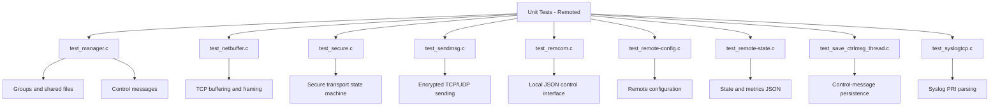
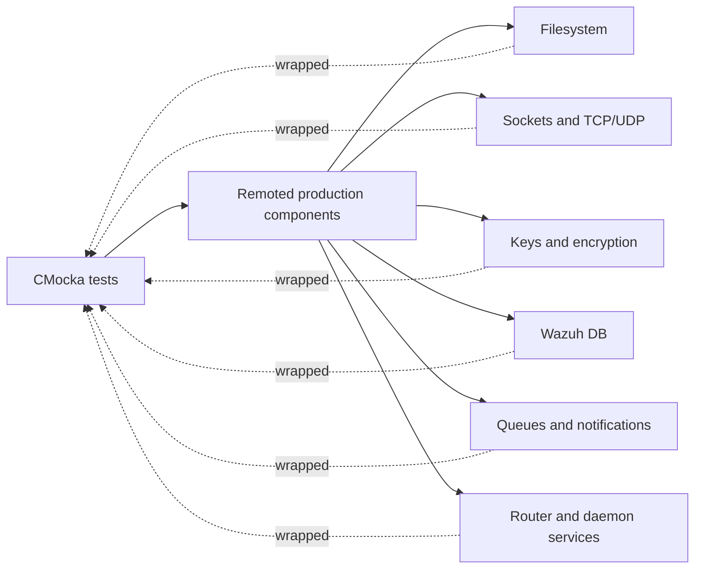
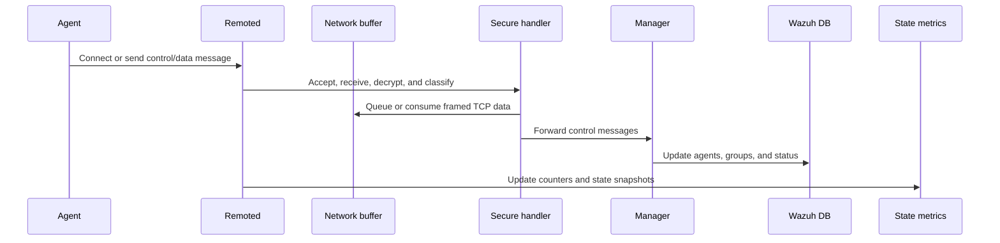

# Unit Tests – Remoted

## Purpose

`Unit_Tests_-_Remoted` is the CMocka-based test suite for Wazuh’s native `remoted` daemon. It validates configuration parsing, manager/group processing, secure agent communication, TCP buffering, outbound messaging, local control requests, state metrics, control-message persistence, and syslog PRI parsing.

The tests are isolated from live sockets, agents, databases, cryptographic stores, and daemon processes through wrappers and deterministic fixtures. Several tests include production `.c` files directly to exercise private functions and global state.

## Architecture

### Functional flow

## Test components

| Component | Main coverage |
|---|---|
| [`test_manager_remoted`](test_manager_remoted.md) | Shared files, groups, multigroups, control messages, and Wazuh DB updates |
| [`test_netbuffer_remoted`](test_netbuffer_remoted.md) | TCP queueing, sending, receiving, framing, retries, and partial messages |
| [`test_remcom_remoted`](test_remcom_remoted.md) | Local JSON commands, socket server behavior, validation, and responses |
| [`test_remote_config_remoted`](test_remote_config_remoted.md) | Protocol selection and agent-version configuration |
| [`test_remote_state_remoted`](test_remote_state_remoted.md) | Global/per-agent metrics JSON and stale-agent cleanup |
| [`test_save_ctrlmsg_thread_remoted`](test_save_ctrlmsg_thread_remoted.md) | Control-message queue consumption and persistence delegation |
| [`test_secure_remoted`](test_secure_remoted.md) | Secure connections, authentication, encryption, socket lifecycle, and dispatch |
| [`test_sendmsg_remoted`](test_sendmsg_remoted.md) | Encrypted outbound TCP/UDP messages and transport failures |
| [`test_syslogtcp_remoted`](test_syslogtcp_remoted.md) | Syslog PRI-header detection and boundary cases |

## Core component references

- [`remoted`](remoted.md) — daemon lifecycle and subsystem organization.
- [`remoted_lifecycle`](remoted_lifecycle.md) — startup, listeners, and secure-handler handoff.
- [`remoted_networking`](remoted_networking.md) — sockets, buffers, framing, and event-loop integration.
- [`remoted_secure_connection`](remoted_secure_connection.md) — secure transport state machine and message processing.
- [`remoted_group_management`](remoted_group_management.md) — groups, multigroups, and shared-file handling.
- [`remoted_request_protocol`](remoted_request_protocol.md) — local control commands and response protocol.
- [`remoted_state_metrics`](remoted_state_metrics.md) — state structures, counters, JSON snapshots, and cleanup.
- [`remoted_syslog_listener`](remoted_syslog_listener.md) — syslog listener and PRI parsing context.
- [`Remote_Config`](Remote_Config.md) — remoted configuration structures and consumers.
- [`os_crypto`](os_crypto.md) — key management and encrypted-message helpers.
- [`test_infrastructure`](test_infrastructure.md) — shared CMocka fixtures, wrappers, and conventions.