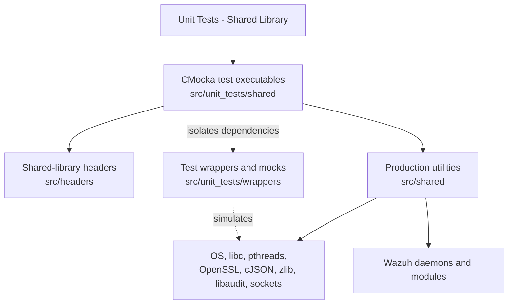
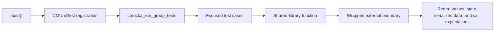
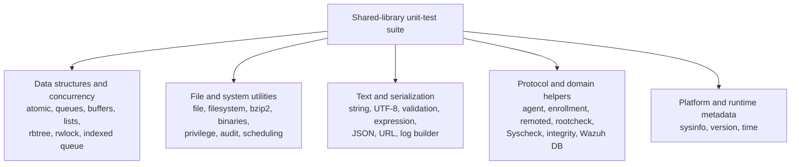

# Unit Tests – Shared Library

## Purpose

`Unit_Tests_-_Shared_Library` contains CMocka-based unit tests for Wazuh’s reusable native C shared-library utilities under `src/shared`. The suite validates low-level contracts independently from daemons, sockets, databases, operating-system services, and external libraries.

The tests cover:

- Data structures and concurrency primitives.
- File, filesystem, compression, and privilege helpers.
- JSON, string, UTF-8, URL, validation, and expression utilities.
- Queues, buffers, trees, logging, and message construction.
- Agent, enrollment, rootcheck, Syscheck/FIM, remoted, and Wazuh DB helpers.
- Scheduling, system information, OS/version detection, and audit integration.

External dependencies are generally isolated through CMocka wrappers and mocks, providing deterministic tests without requiring live services or platform-specific state.

## Architecture



Each test executable follows the same general structure:



The module is organized as a set of independent leaf tests rather than a runtime library or service. Most tests validate one production API, while a smaller number—such as agent operations, enrollment, Syscheck, rootcheck, remoted, and Wazuh DB tests—validate interactions between shared helpers and mocked protocol or daemon boundaries.

## Repository structure

```text
src/unit_tests/shared/
├── test_agent_op.c
├── test_atomic.c
├── test_audit_op.c
├── test_binaries_op.c
├── test_bqueue.c
├── test_buffer_op.c
├── test_bzip2_op.c
├── test_custom_output_search_replace.c
├── test_enrollment_op.c
├── test_expression.c
├── test_file_op.c
├── test_fs_op.c
├── test_indexed_queue_op.c
├── test_integrity_op.c
├── test_json-queue.c
├── test_json_op.c
├── test_list_op.c
├── test_log_builder.c
├── test_mq_op.c
├── test_privsep_op.c
├── test_queue_linked_op.c
├── test_queue_op.c
├── test_rbtree_op.c
├── test_remoted_op.c
├── test_rootcheck_op.c
├── test_rwlock_op.c
├── test_schedule_scan.c
├── test_string_op.c
├── test_syscheck_op.c
├── test_sysinfo_utils.c
├── test_time_op.c
├── test_url.c
├── test_utf8_op.c
├── test_validate_op.c
├── test_version_op.c
└── test_wazuhdb_op.c
```

## Test-area relationships



## Core component references

- [Shared library overview](shared_lib.md)
- [Shared data structures](shared_lib_data_structures.md)
- [Shared file I/O](shared_lib_file_io.md)
- [Shared string validation](shared_lib_string_validation.md)
- [Shared networking](shared_lib_networking.md)
- [Shared logging](shared_lib_logging.md)
- [Concurrency primitives](headers_concurrency.md)
- [Shared scheduling utilities](shared_lib_system_utils_config_scheduling.md)
- [Shared audit utilities](shared_lib_system_utils_audit.md)
- [SysInfo provider](data_provider_sysinfo_core.md)
- [Wazuh DB command parser](wazuh_db_command_parser.md)
- [Wazuh DB integrity](wazuh_db_integrity.md)
- [Remoted networking](remoted_networking.md)
- [Syscheck scan engine](syscheckd_core_scan_engine.md)
- [OS authentication and enrollment](os_auth_enrollment_core.md)
- [Agent module](agent_module.md)
- [Rootcheck module](rootcheck_module.md)

Detailed behavior and test contracts are documented in the individual child pages, including `test_queue_op`, `test_json_op`, `test_syscheck_op`, `test_enrollment_op`, `test_wazuhdb_op`, and the other test documents associated with this module.