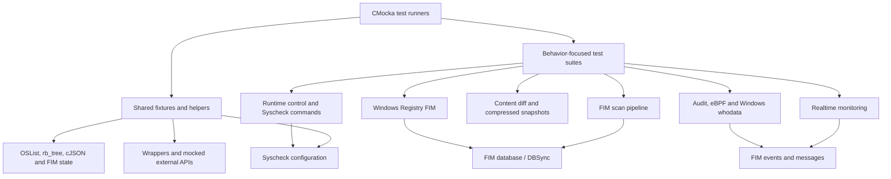
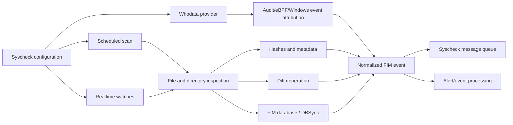
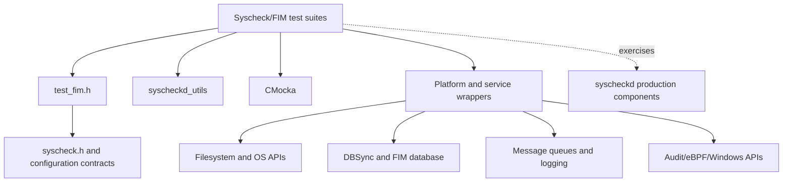

# Unit Tests – Syscheck/FIM

## Purpose

`Unit_Tests_-_Syscheck_FIM` is the CMocka-based unit-test module for Wazuh’s Syscheck/File Integrity Monitoring subsystem. It validates configuration, scheduled and realtime scanning, file and registry monitoring, content-diff handling, database transactions, whodata providers, event generation, runtime control, and platform-specific behavior.

The tests isolate production code with filesystem, database, logging, queue, Audit, eBPF, Windows API, and synchronization wrappers. They verify return values, state transitions, generated JSON, emitted events, and expected external interactions without requiring a running Syscheck daemon or platform monitoring service.

## Architecture



### Runtime behavior represented by the tests



### Test-support dependency model



## Repository structure

```text
src/unit_tests/syscheckd/
├── expect_fim_diff_changes.c       # Diff-cleanup expectations
├── expect_run_check.c              # Syscheck message expectations
├── test_config.c                   # Configuration and directory helpers
├── test_fim.h                      # Shared FIM test declarations
├── test_fim_diff_changes.c         # Diff creation, comparison, quota and cleanup
├── test_fim_scan.c                 # Scheduled/realtime FIM scan pipeline
├── test_run_check.c                # Runtime control, limits and whodata startup
├── test_run_realtime.c             # Realtime watch lifecycle and event handling
├── test_syscheck.c                 # Syscheck initialization and startup
├── test_syscom.c                   # Local Syscheck command interface
├── utils.c                         # Shared list/tree/permission fixtures
├── registry/
│   ├── test_registry.c             # Windows Registry FIM
│   └── test_events.c               # Registry event JSON and DBSync differences
└── whodata/
    ├── test_audit_healthcheck.c    # Linux Audit health checks
    ├── test_audit_parse.c         # Audit event parsing
    ├── test_audit_rule_handling.c # Audit rule lifecycle and reloads
    ├── test_syscheck_audit.c      # Audit backend and realtime fallback
    ├── test_syscheck_ebpf.c       # eBPF health and Audit fallback
    └── test_win_whodata.c         # Windows SACL, policy and event handling
```

`test_fim_scan.c` additionally organizes coverage around database state, validation, directories, files, checksums, missing entries, realtime/whodata processing, transactions, DBSync attributes, wildcards, configuration directories, and diff initialization.

## Core component references

- [Syscheck/FIM daemon core](syscheckd_core.md) — lifecycle and central orchestration.
- [FIM scan engine](syscheckd_core_scan_engine.md) — scheduled scans, change detection, and scan state.
- [Realtime monitoring](syscheckd_core_realtime.md) — filesystem watches and realtime event processing.
- [FIM database](syscheckd_db.md) — persistence, DBSync transactions, and monitored state.
- [File FIM implementation](syscheckd_file.md) — file metadata, hashing, and content changes.
- [Registry FIM implementation](syscheckd_registry.md) — Windows Registry monitoring and event handling.
- [Whodata architecture](syscheckd_whodata.md) — provider-independent attribution flow.
- [eBPF whodata implementation](syscheckd_ebpf.md) — Linux eBPF provider and health checks.
- [DBSync infrastructure](dbsync.md) — shared database synchronization services.
- [Shared library infrastructure](shared_lib.md) — wrappers, queues, logging, and operating-system helpers.
- [Compression/archive utilities](compression_archive.md) — compressed FIM diff storage and cleanup.