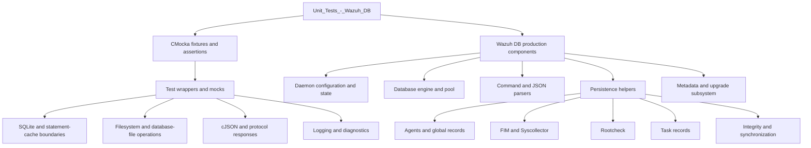
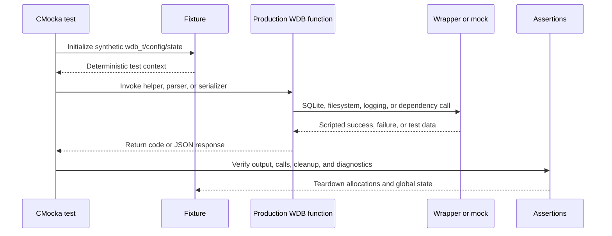

# Unit Tests – Wazuh DB

## Purpose

`Unit_Tests_-_Wazuh_DB` is the CMocka-based native test suite for the Wazuh DB subsystem under `src/unit_tests/wazuh_db`. It validates database lifecycle, configuration, command parsing, agent and inventory persistence, integrity management, task handling, pooling, metadata upgrades, state serialization, and error propagation.

The suite isolates production code with mocked SQLite, filesystem, socket, logging, cJSON, and Wazuh DB wrappers. Tests therefore focus on control flow, input validation, resource cleanup, return codes, serialized responses, and dependency interaction without requiring a running `wazuh-db` daemon or live databases.

## Architecture



The typical test execution path is:



## Test areas

| Area | Covered modules |
|---|---|
| Database engine and lifecycle | [`test_wdb`](test_wdb.md), [`test_wdb_pool`](test_wdb_pool.md), [`test_create_agent_db`](test_create_agent_db.md) |
| Configuration and daemon state | [`test_wazuh_db_config`](test_wazuh_db_config.md), [`test_wazuh_db_state`](test_wazuh_db_state.md), [`test_wdb_com`](test_wdb_com.md) |
| Command parsing and protocol | [`test_wdb_parser`](test_wdb_parser.md), [`test_wdb_task_parser`](test_wdb_task_parser.md) |
| Agent and global database operations | [`test_wdb_agents`](test_wdb_agents.md), [`test_wdb_agents_helpers`](test_wdb_agents_helpers.md), [`test_wdb_global`](test_wdb_global.md), [`test_wdb_global_helpers`](test_wdb_global_helpers.md), [`test_wdb_global_parser`](src/unit_tests/wazuh_db/test_wdb_global_parser.c) |
| Inventory and event persistence | [`test_wdb_fim`](test_wdb_fim.md), [`test_wdb_syscollector`](test_wdb_syscollector.md), [`test_wdb_delta_event`](test_wdb_delta_event.md), [`test_wdb_rootcheck`](test_wdb_rootcheck.md) |
| Integrity and metadata | [`test_wdb_integrity`](test_wdb_integrity.md), [`test_wdb_metadata`](test_wdb_metadata.md) |
| Tasks and upgrades | [`test_wdb_task`](test_wdb_task.md), [`test_wdb_upgrade`](test_wdb_upgrade.md) |

## Repository structure

```text
src/unit_tests/wazuh_db/
├── test_create_agent_db.c
├── test_wazuh_db-config.c
├── test_wazuh_db_state.c
├── test_wdb.c
├── test_wdb_agents.c
├── test_wdb_agents_helpers.c
├── test_wdb_com.c
├── test_wdb_delta_event.c
├── test_wdb_fim.c
├── test_wdb_global.c
├── test_wdb_global_helpers.c
├── test_wdb_global_parser.c
├── test_wdb_integrity.c
├── test_wdb_metadata.c
├── test_wdb_parser.c
├── test_wdb_pool.c
├── test_wdb_rootcheck.c
├── test_wdb_syscollector.c
├── test_wdb_task.c
├── test_wdb_task_parser.c
└── test_wdb_upgrade.c
```

The detailed documentation for `test_wdb_global_parser` is not available because its `docs_path` is null.

## Core component documentation

The tests correspond to the following production documentation:

- [Wazuh DB daemon core](wazuh_db_daemon_core.md) — daemon lifecycle, communication, and runtime context.
- [Wazuh DB engine](wazuh_db_engine.md) — SQLite handles, queries, transactions, statement caching, and pooling.
- [Wazuh DB command parser](wazuh_db_command_parser.md) — textual command validation and dispatch.
- [Wazuh DB configuration](Wazuh_DB_Config.md) — XML configuration and backup settings.
- [Wazuh DB global operations](wazuh_db_global.md) — agents, groups, labels, global database operations, and backups.
- [Wazuh DB FIM/Syscollector](wazuh_db_fim_syscollector.md) — inventory and file-integrity persistence.
- [Wazuh DB integrity](wazuh_db_integrity.md) — checksums, synchronization, and integrity events.
- [Wazuh DB metadata and upgrades](wazuh_db_metadata_upgrade.md) — schema metadata, migrations, backup, and recovery.
- [Wazuh DB state](wazuh_db_state.md) — runtime counters and JSON state serialization.
- [DBSync](dbsync.md) — database synchronization primitives used by delta and inventory tests.