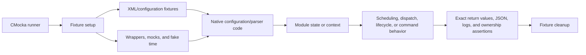
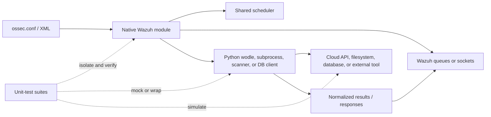

# Unit Tests — Wazuh Modules (Cloud & Misc)

## Purpose

`Unit_Tests_-_Wazuh_Modules_(Cloud_Misc)` is a CMocka-based test collection for Wazuh modules covering cloud integrations, compliance scanners, system-management modules, task management, vulnerability-detection configuration, scheduling, and shared module dispatch.

The suites validate module-level contracts such as:

- XML configuration parsing and validation.
- Scheduling normalization and next-run calculations.
- Module lifecycle, initialization, cleanup, and state handling.
- Cloud-provider configuration and helper integration boundaries.
- Queue, socket, subprocess, and database interaction contracts.
- Task-manager command routing and response construction.
- Shared module lookup and query dispatch.

These tests generally isolate native module behavior with fixtures, wrappers, mocks, and simulated time. They do not replace end-to-end tests for live cloud APIs, real daemons, external scanners, or production databases.

## Architecture

The test module is organized by functional area:

```mermaid
flowchart TB
    Suite["Unit_Tests_-_Wazuh_Modules_(Cloud_Misc)"]

    Suite --> Cloud["Cloud integrations"]
    Suite --> Compliance["Compliance and security"]
    Suite --> System["System-management modules"]
    Suite --> Tasks["Task management"]
    Suite --> Common["Shared module infrastructure"]

    Cloud --> AWS["AWS"]
    Cloud --> Azure["Azure"]
    Cloud --> GCP["GCP"]
    Cloud --> GitHub["GitHub"]
    Cloud --> Graph["Microsoft Graph"]
    Cloud --> Office["Office 365"]

    Compliance --> CIS["CIS-CAT"]
    Compliance --> OSCAP["OpenSCAP"]
    Compliance --> SCA["SCA"]
    Compliance --> Vuln["Vulnerability detection"]

    System --> Command["Command"]
    System --> Control["Control"]
    System --> Database["Database"]
    System --> Docker["Docker"]
    System --> Exec["Exec"]
    System --> Osquery["OSQuery"]

    Tasks --> TaskCore["Task Manager"]
    Tasks --> TaskCommands["Task Manager commands"]
    Tasks --> TaskParsing["Task Manager parsing"]

    Common --> Scheduling["Scheduling"]
    Common --> Wmodules["Wmodules dispatch"]
    Common --> GCPConfig["GCP configuration"]
```

Most suites follow a common test-harness architecture:

### Runtime boundary represented by the tests

## Repository structure

| Test module | Source under test |
|---|---|
| `aws` | `src/unit_tests/wazuh_modules/aws/test_wm_aws.c` |
| `azure` | `src/unit_tests/wazuh_modules/azure/test_wm_azure.c` |
| `ciscat` | `src/unit_tests/wazuh_modules/ciscat/test_wm_ciscat.c` |
| `command` | `src/unit_tests/wazuh_modules/command/test_wm_command.c` |
| `control` | `src/unit_tests/wazuh_modules/control/test_wm_control.c` |
| `database` | `src/unit_tests/wazuh_modules/database/test_wm_database.c` |
| `docker` | `src/unit_tests/wazuh_modules/docker/test_wm_docker.c` |
| `exec` | `src/unit_tests/wazuh_modules/exec/test_wm_exec.c` |
| `gcp` | `src/unit_tests/wazuh_modules/gcp/test_wm_gcp.c` |
| `gcp_wmodules` | `src/unit_tests/wazuh_modules/gcp/test_wmodules_gcp.c` |
| `github` | `src/unit_tests/wazuh_modules/github/test_wm_github.c` |
| `wm_ms_graph_tests` | `src/unit_tests/wazuh_modules/ms_graph/test_wm_ms_graph.c` |
| `wm_office365_tests` | `src/unit_tests/wazuh_modules/office365/test_wm_office365.c` |
| `wm_oscap_tests` | `src/unit_tests/wazuh_modules/oscap/test_wm_oscap.c` |
| `wm_osquery_tests` | `src/unit_tests/wazuh_modules/osquery/test_wm_osquery_already_running.c` |
| `wm_sca_tests` | `src/unit_tests/wazuh_modules/sca/test_wm_sca.c` |
| `wm_scheduling_tests` | `src/unit_tests/wazuh_modules/scheduling` |
| `wm_task_manager_tests` | `src/unit_tests/wazuh_modules/task_manager/test_wm_task_manager.c` |
| `wm_task_manager_commands_tests` | `src/unit_tests/wazuh_modules/task_manager/test_wm_task_manager_commands.c` |
| `wm_task_manager_parsing_tests` | `src/unit_tests/wazuh_modules/task_manager/test_wm_task_manager_parsing.c` |
| `wm_vulnerability_detection_tests` | `src/unit_tests/wazuh_modules/vulnerability_detection/test_wm_vulnerability_detection.c` |
| `wmodules_tests` | `src/unit_tests/wazuh_modules/wmodules/test_wmodules.c` |

The Microsoft Graph suite is further divided into test infrastructure, configuration parsing, dump behavior, token management, and relationship scanning.

## Core component references

### Module daemon and lifecycle

- [Wazuh modules core](wazuh_modules_core.md)
- [Wazuh modules lifecycle](wazuh_modules_core_lifecycle.md)
- [Wazuh modules native bridges](wazuh_modules_core_native_bridges.md)
- [Wazuh modules system-management integrations](wazuh_modules_core_system_management_process_integrations.md)
- [Wazuh modules socket services](wazuh_modules_core_system_management_socket_services.md)

### Cloud integrations

- [AWS integration](aws.md)
- [Azure integration](azure.md)
- [GCP integration](gcp.md)
- [GitHub integration](github.md)
- [Microsoft Graph integration](wazuh_modules_core_cloud_integrations_ms_graph.md)
- [Office 365 integration](wazuh_modules_core_cloud_integrations_office365.md)
- [GCP module configuration](Wmodules_Config_gcp.md)

### Compliance and vulnerability modules

- [CIS-CAT module](ciscat.md)
- [CIS-CAT native scanner](wazuh_modules_core_compliance_scanners_ciscat.md)
- [SCA scanner](wazuh_modules_core_compliance_scanners_sca.md)
- [OpenSCAP scanner](wazuh_modules_core_compliance_scanners_oscap.md)
- [Vulnerability scanner facade](vulnerability_scanner_facade.md)
- [Vulnerability feed manager](database_feed_manager.md)
- [Version matcher](version_matcher.md)

### Shared infrastructure

- [Shared scheduling utilities](shared_lib_system_utils_config_scheduling.md)
- [Shared library](shared_lib.md)
- [Wazuh DB](wazuh_db.md)
- [Data-provider SysInfo API](data_provider_sysinfo_core_capi.md)
- [Task Manager module](task_manager_module.md)
- [Cluster module](cluster_module.md)