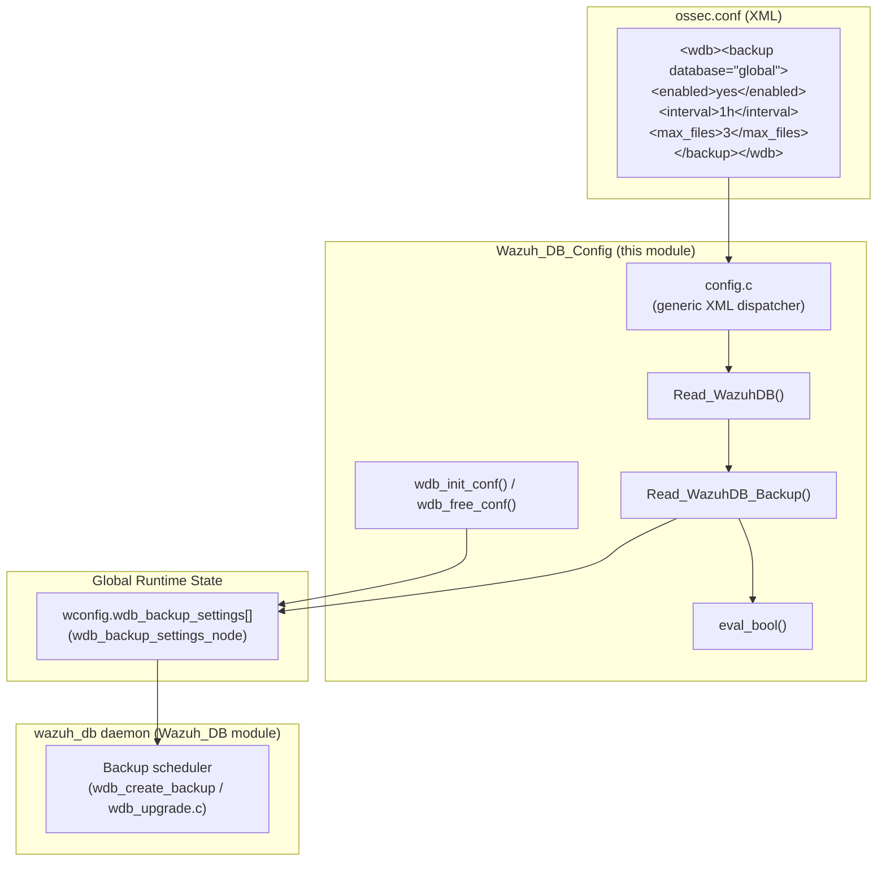
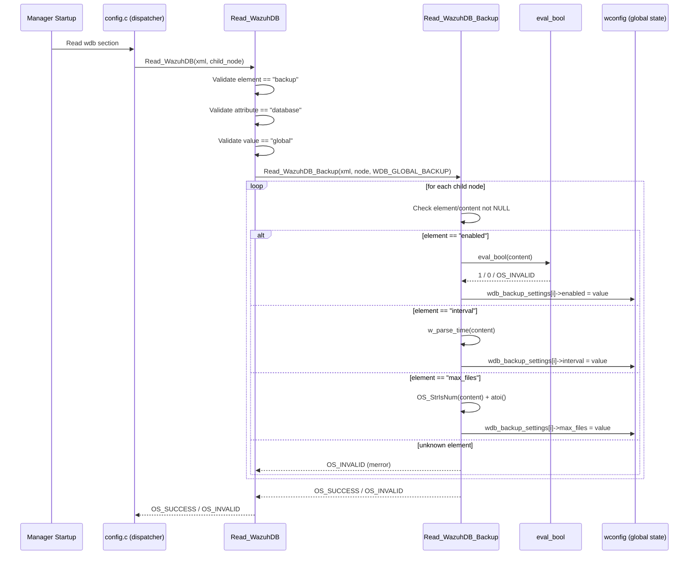
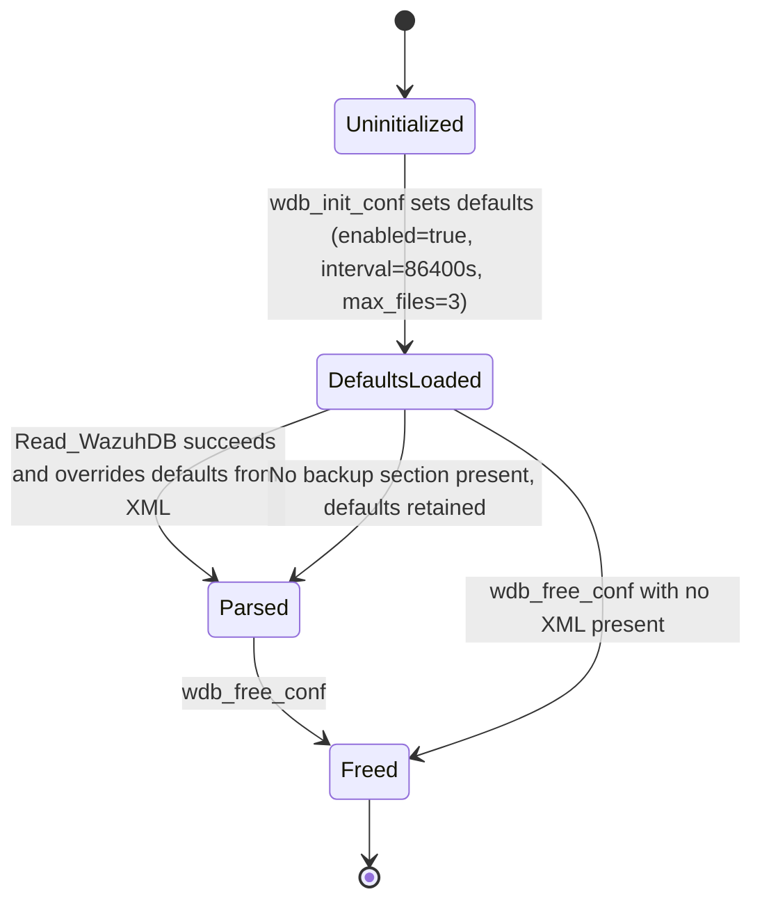
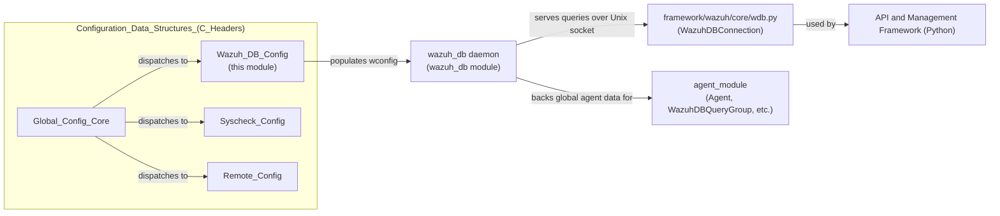

# Wazuh DB Config

## Introduction

The **Wazuh DB Config** module is a small, focused configuration parser within the Wazuh manager's C configuration subsystem. Its sole responsibility is to read the `<wdb>` / `<database_backup>` XML block from `ossec.conf` and populate the global `wconfig.wdb_backup_settings` structure that governs **automatic backups of the `global.db`** database managed by the `wazuh_db` daemon.

Despite its small size (a single source file, `src/config/wazuh_db-config.c`), this module is a critical link between the declarative XML configuration read by the manager at startup and the runtime behavior of the Wazuh DB daemon, which performs periodic backups of the global agent database to protect against corruption or data loss.

This document describes:
1. The module's purpose and core functionality
2. Its internal architecture and parsing logic
3. How it integrates with the broader Configuration and Wazuh DB subsystems

---

## Module Purpose

The Wazuh DB daemon (`wazuh-db`) maintains the `global.db` SQLite database, which stores critical agent metadata (agent keys, groups, connection status, etc.). To protect this data, Wazuh supports automatic, scheduled backups of `global.db`. The **Wazuh_DB_Config** module is responsible for:

- Validating the `<backup database="global">` XML element and its children (`enabled`, `interval`, `max_files`).
- Converting string-based XML values into strongly-typed configuration fields (`bool`, `time_t`, `int`).
- Populating the shared `wconfig.wdb_backup_settings[]` array (indexed by backup type, e.g. `WDB_GLOBAL_BACKUP`) that is later consumed by the `wazuh_db` daemon at runtime.
- Providing safe default values via `wdb_init_conf()` and proper cleanup via `wdb_free_conf()`.

---

## Core Components

| Component | Type | Description |
|---|---|---|
| `eval_bool` | `static short` function | Converts the strings `"yes"`/`"no"` into boolean-like short values (`1`/`0`), returning `OS_INVALID` (`-1`) for any other value or `NULL` input. Used to safely parse the `enabled` XML tag. |
| `Read_WazuhDB` | `int` function | Entry point invoked by the generic configuration reader (`config.c`). Validates that the top-level element is `<backup database="global">` and dispatches to `Read_WazuhDB_Backup`. |
| `Read_WazuhDB_Backup` | `int` function | Iterates over the child XML nodes (`enabled`, `interval`, `max_files`) of the backup block, validates and parses each value, and stores results into `wconfig.wdb_backup_settings[BACKUP_NODE]`. |
| `wdb_init_conf` | `void` function | Allocates and initializes the `wdb_backup_settings` array with safe defaults (`enabled=true`, `interval=86400s`, `max_files=3`) before XML parsing occurs. |
| `wdb_free_conf` | `void` function | Frees all memory allocated for `wdb_backup_settings`. |

### Supporting Data Structures (defined in `src/wazuh_db/wdb.h`)

- **`wdb_backup_settings_node`**: Holds a single backup policy:
  ```c
  typedef struct wdb_backup_settings_node {
      bool enabled;
      time_t interval;
      int max_files;
  } wdb_backup_settings_node;
  ```
- **`wdb_config`**: The broader Wazuh DB daemon configuration structure, which embeds `wdb_backup_settings_node** wdb_backup_settings` alongside other tuning parameters (pool size, commit timing, fragmentation thresholds, etc.) that are configured via `internal_options.conf` rather than this XML parser:
  ```c
  typedef struct wdb_config {
      int worker_pool_size;
      int commit_time_min;
      int commit_time_max;
      int open_db_limit;
      int fragmentation_threshold;
      int fragmentation_delta;
      int free_pages_percentage;
      int max_fragmentation;
      int check_fragmentation_interval;
      wdb_backup_settings_node** wdb_backup_settings;
      bool is_worker_node;
  } wdb_config;
  ```

These structures are the contract between this configuration parser and the `wazuh_db` daemon, which reads `wconfig.wdb_backup_settings` to decide when and how to invoke functions such as `wdb_create_global()` (database (re)creation) and the backup-rotation logic in `wdb_upgrade.c`.

---

## Architecture



---

## Parsing Flow (Sequence Diagram)



---

## Validation Rules

The parser enforces strict validation at every level, returning `OS_INVALID` and logging via `merror()` on any failure:

1. **Top-level element** must be exactly `backup`.
2. **Attribute** must be `database`.
3. **Attribute value** must be `global` (only the global database backup is currently supported — see `WDB_GLOBAL_BACKUP` in `wdb.h`).
4. Each child element must have non-NULL `element` and `content`.
5. `enabled` must be `yes` or `no` (via `eval_bool`).
6. `interval` must be a valid time expression parsed by `w_parse_time` (e.g., `1h`, `86400`), and must be `> 0`.
7. `max_files` must be a positive numeric string (validated with `OS_StrIsNum` then `atoi`).
8. Any unrecognized child element triggers an `XML_INVELEM` error.

On any error, `OS_ClearNode(chld_node)` is called to free XML parsing memory before returning `OS_INVALID`, preventing memory leaks.

---

## Default Configuration Lifecycle



`wdb_init_conf()` is called once at manager startup to allocate `WDB_LAST_BACKUP` entries (currently only `WDB_GLOBAL_BACKUP`) with safe defaults, ensuring the system behaves correctly even if the administrator omits the `<backup>` block entirely. `wdb_free_conf()` is called during manager shutdown/reload to release the allocated array.

---

## Integration with the Wider System

### Relationship to the `wazuh_db` Daemon

The values parsed by this module (`enabled`, `interval`, `max_files`) are consumed by the **wazuh_db** daemon's backup subsystem, which:
- Periodically creates a snapshot of `global.db` (see `wdb_upgrade.c::wdb_create_backup` and `wdb.c::wdb_create_global`, which initializes a fresh global database from `schema_global_sql` when needed).
- Prunes old backup files once `max_files` is exceeded.
- Can be toggled on/off entirely via `enabled`.

The `wdb_config` structure that embeds `wdb_backup_settings` also carries other tuning parameters (pool size, commit thresholds, fragmentation limits) that are configured separately through `internal_options.conf` rather than this XML-based module — see the **wazuh_db** module (`src/wazuh_db/`) for those runtime mechanics, including:
- `wdb.c` — core database lifecycle (open, commit, rollback, fragmentation checks).
- `wdb_upgrade.c` — schema upgrade/backup/restore logic that directly reads `wdb_backup_settings`.
- `wdb_global.c` / `wdb_global_helpers.c` — global database query handlers exposed over the `wazuh-db` socket.

### Relationship to Other Configuration Modules

Wazuh_DB_Config is one of several sibling parsers under the **Configuration Data Structures (C Headers)** module family, all invoked by the shared XML dispatcher in `src/config/config.c`:

- **Global_Config_Core** — parses the top-level `<ossec_config>` structure and dispatches to section-specific parsers like this one.
- **Syscheck_Config** — analogous parser for FIM (`<syscheck>`) settings.
- **Remote_Config** — analogous parser for `<remote>` settings.
- **Authd_Config** — analogous parser for authentication daemon settings, also using an `eval_bool`-style helper.
- **Wmodules_Config** — analogous parsers for wodules (SCA, GCP, osquery, agent-upgrade), several of which also implement their own local `eval_bool` for `yes`/`no` XML values, following the same pattern established here.

All these modules follow the same architectural pattern: validate the XML node hierarchy, convert string values into typed configuration fields, and populate a shared global configuration structure that is later consumed by the corresponding daemon.

### Position in the Overall System



For details on how the `wazuh_db` daemon uses these settings at runtime (backup creation, upgrade paths, fragmentation checks), see the **wazuh_db** module source under `src/wazuh_db/`. For details on how the Python framework communicates with `wazuh_db` over its socket protocol, see `framework_core_communication_wdb` (part of the **API & Management Framework (Python)** module family), which implements `WazuhDBConnection`/`AsyncWazuhDBConnection` used throughout the manager API (e.g., `agent_module`, `stats_module`, `task_module`).

---

## Key Design Notes

- **Single database type today**: Although the code is structured to support multiple backup targets (`wdb_backup_settings` is an array indexed by `BACKUP_NODE`, and `WDB_LAST_BACKUP` defines the array size), only `WDB_GLOBAL_BACKUP` is currently wired up via `Read_WazuhDB`. This design allows future extension (e.g., a per-agent database backup) without restructuring the parser.
- **Fail-fast validation**: Every parsing step immediately returns `OS_INVALID` on the first malformed value, rather than accumulating errors — consistent with the rest of the Wazuh C configuration parsers (see sibling modules such as `Rootcheck_Config` and `Authd_Config`, which use the same `eval_bool` pattern).
- **Defensive memory handling**: All error paths call `OS_ClearNode()` before returning, avoiding leaks of the XML node tree parsed by `OS_XML`.
- **Defaults as a safety net**: `wdb_init_conf()` guarantees a functioning backup policy exists even without explicit configuration, reflecting Wazuh's general "secure by default" configuration philosophy.

---

## Testing

This module's behavior is covered by the dedicated unit test suite `test_wazuh_db_config` (see the `Unit_Tests_-_Wazuh_DB` module family), which validates:
- Rejection of `NULL` content/element nodes (`test_Read_WazuhDB_content_NULL`, `test_Read_WazuhDB_element_NULL`).
- Rejection of missing/invalid attributes (`test_Read_WazuhDB_attribute_NULL`).
- Successful parsing of a valid `<backup database="global">` block (`test_Read_WazuhDB_valid_config`, `test_Read_WazuhDB_Backup_valid_config`, `test_Read_WazuhDB_Backup_valid_config2`).
- Rejection of empty `enabled` values (`test_Read_WazuhDB_Backup_enabled_empty_value`).
- Rejection of `NULL` backup content/element (`test_Read_WazuhDB_Backup_content_NULL`, `test_Read_WazuhDB_Backup_element_NULL`).

These tests exercise `Read_WazuhDB` and `Read_WazuhDB_Backup` directly against mocked XML trees, ensuring the parser's validation rules remain stable across changes.
