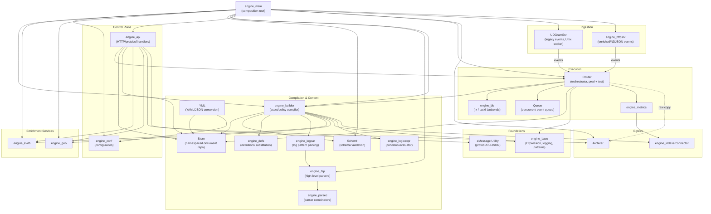
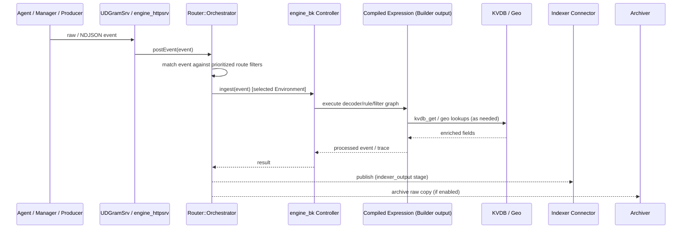
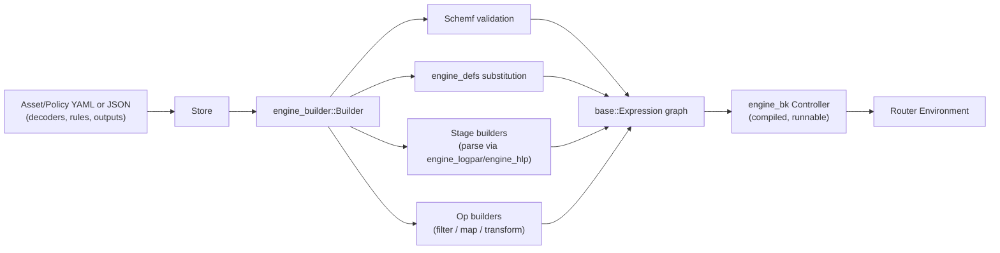
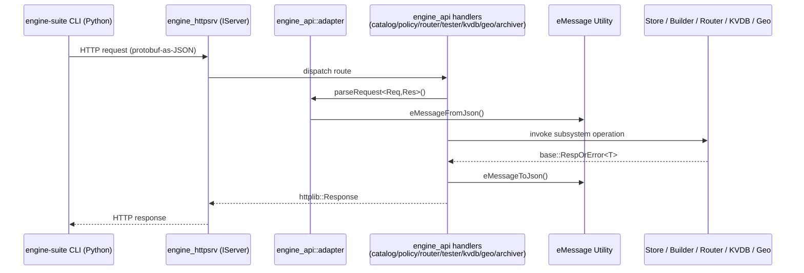

# Wazuh Engine Core (C++)

## 1. Purpose

The **Wazuh Engine Core** (`src/engine`) is the modern, high-performance C++ event-processing core of Wazuh. It is the successor/complement to the legacy `analysisd` pipeline, responsible for **decoding, enriching, filtering, and routing** security events (logs, telemetry, alerts) according to user-defined **policies** composed of **decoders, rules, filters, and outputs**.

At a high level, the Engine:

- **Ingests** raw events from agents/managers (via a local Unix datagram socket) and from external producers (via an HTTP/NDJSON endpoint).
- **Compiles** declarative asset/policy definitions (stored in a namespaced document [Store](Store.md)) into executable **expression graphs** ([engine_base](engine_base.md) `Expression`), using the [engine_builder](engine_builder.md) module and a rich catalog of helper operators (filters, maps, transforms, HLP-based parsers).
- **Executes** those compiled pipelines against every incoming event using pluggable backend controllers ([engine_bk](engine_bk.md), based on RxCpp or Taskflow).
- **Routes** events to the correct policy/environment based on configurable, prioritized filters ([Router](Router.md)), with built-in rate limiting (EPS) and an on-demand testing/tracing surface.
- **Enriches** events using auxiliary services: Key-Value DB lookups ([engine_kvdb](engine_kvdb.md)), GeoIP/ASN resolution ([engine_geo](engine_geo.md)), and schema-aware type validation ([Schemf_(Schema_Validation)](Schemf_(Schema_Validation).md)).
- **Exposes** all of this functionality through an HTTP/protobuf administrative API ([engine_api](engine_api.md)), consumed by the Python [Engine Administration CLI Tools](Engine_Administration_CLI_Tools_(Python).md) (`engine-catalog`, `engine-policy`, `engine-router`, `engine-test`, `engine-kvdb`, `engine-geo`, etc.).
- **Persists/forwards** processed data to the Wazuh Indexer via an internal Indexer Connector ([engine_indexerconnector](engine_indexerconnector.md)) and archives raw events when configured.

The module is a self-contained C++ codebase with its own build tree, low-level utility libraries (base primitives, parser combinators, logical-expression evaluator, log-pattern parser, YAML↔JSON conversion), and a single composition-root entry point ([engine_main](engine_main.md)) that wires every subsystem together into the `wazuh-engine` daemon.

## 2. Architecture

### 2.1 High-Level Component Map

### 2.2 Runtime Data Flow (Event Lifecycle)

### 2.3 Build/Compile Pipeline (Design-Time)

### 2.4 Administrative API Flow

## 3. Core Components & Documentation References

| Sub-module | Responsibility |
|---|---|
| [engine_api](engine_api.md) | HTTP/protobuf control plane exposing Catalog, Policy, Router, Tester, KVDB, Geo, and Archiver operations. |
| [engine_base](engine_base.md) | Foundational primitives: `Expression` graph, logging facade, design patterns (Builder, Singleton, Observer, Chain of Responsibility), core value types, OS/crypto wrappers. |
| [engine_bk](engine_bk.md) | Backend execution controllers that turn a compiled `Expression` into a runnable pipeline (RxCpp and Taskflow implementations). |
| [engine_builder](engine_builder.md) | Compiles decoder/rule/output/policy definitions into executable expressions; hosts the operator catalog (filters, maps, transforms) and policy assembly logic. |
| [engine_conf](engine_conf.md) | Centralized configuration loading with env-var → file → default precedence. |
| [engine_defs](engine_defs.md) | Implements the `definitions` substitution mechanism used inside assets. |
| [engine_geo](engine_geo.md) | GeoIP/ASN database lifecycle management and runtime IP lookups (MaxMind DB). |
| [engine_hlp](engine_hlp.md) | High-Level Parsers: composable parsers for dates, IPs, JSON/XML, CSV, key-value, URIs, etc. |
| [engine_httpsrv](engine_httpsrv.md) | Abstract HTTP transport contract (`IServer`) used by the administrative API and enriched-events ingestion. |
| [engine_indexerconnector](engine_indexerconnector.md) | Asynchronous, resilient client publishing processed events/metrics to the Wazuh Indexer. |
| [engine_kvdb](engine_kvdb.md) | RocksDB-backed Key-Value Database subsystem used for event enrichment/filtering. |
| [engine_logicexpr](engine_logicexpr.md) | Generic boolean-expression tokenizer/parser/evaluator (AND/OR/NOT) used for conditions. |
| [engine_logpar](engine_logpar.md) | Compiles `<field>`-style log patterns into executable field-extraction pipelines built on `engine_hlp`. |
| [engine_main](engine_main.md) | Process entry point; bootstraps and wires together every Engine subsystem (composition root). |
| [engine_metrics](engine_metrics.md) | OpenTelemetry-based metrics manager with export to the Indexer. |
| [engine_parsec](engine_parsec.md) | Header-only, generic parser-combinator library underpinning `engine_hlp` and `engine_logicexpr`. |
| [eMessage_Utility](eMessage_Utility.md) | Protobuf ⇄ JSON conversion utility used pervasively by the API layer. |
| [Queue](Queue.md) | Thread-safe, bounded concurrent queue with overflow-to-disk ("flooding") support, used between ingestion and the Router. |
| [Router](Router.md) | Production route management, EPS rate limiting, and the on-demand Tester/tracing subsystem. |
| [Schemf_(Schema_Validation)](Schemf_(Schema_Validation).md) | Event schema model and type-compatibility validation engine. |
| [Store](Store.md) | Namespace-aware, cached document repository backing all Engine assets/policies (filesystem driver). |
| [UDGramSrv](UDGramSrv.md) | Thread-pooled Unix Domain Datagram Socket server used to ingest legacy-format events. |
| [YML](YML.md) | YAML ⇄ JSON conversion utility used by the Store, configuration loader, and Catalog API. |

## 4. Relationship to the Rest of the System

- **Upstream producers**: Legacy `wazuh-analysisd`/`remoted` pipeline ([Agent_&_Manager_Native_Daemons_(C)](Agent_&_Manager_Native_Daemons_(C).md)) and external clients send events to the Engine via [UDGramSrv](UDGramSrv.md) and [engine_httpsrv](engine_httpsrv.md).
- **Administration**: The [Engine Administration CLI Tools (Python)](Engine_Administration_CLI_Tools_(Python).md) (`engine-suite`) manage catalog content, policies, routes, KVDBs, and GeoIP databases entirely through [engine_api](engine_api.md).
- **Downstream consumers**: Processed/enriched events and metrics flow to the Wazuh Indexer via [engine_indexerconnector](engine_indexerconnector.md); raw events may be archived to disk.
- **Sibling infrastructure**: Shares generic design patterns with [Shared_Modules_Infrastructure_(C++)](Shared_Modules_Infrastructure_(C++).md) (e.g., analogous `indexer_connector`, round-robin selectors, singleton utilities), though the two trees are compiled and deployed independently.