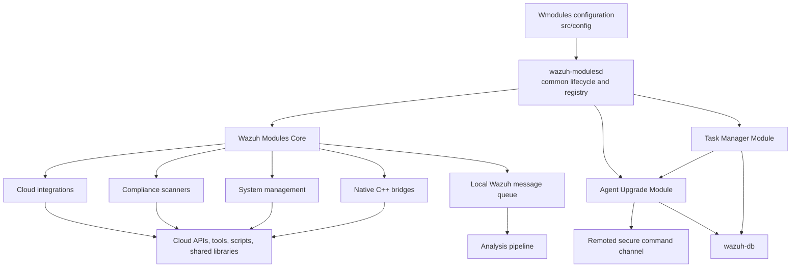
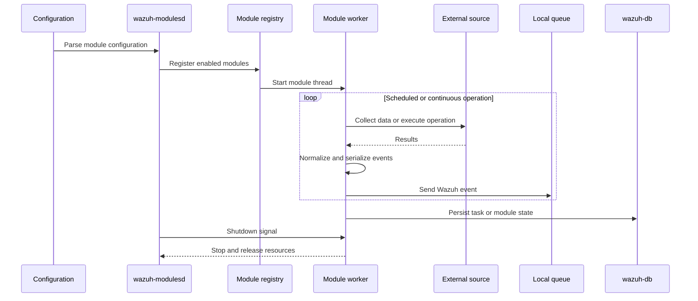

# Wazuh Modules Daemon (C)

## Purpose

`Wazuh_Modules_Daemon_(C)` contains the native C implementation of `wazuh-modulesd`, a host process for configurable background modules (“wodles”). It provides common lifecycle, configuration, scheduling, threading, process execution, IPC, and shutdown facilities for modules that collect cloud, compliance, system, and inventory data.

The module includes:

- **Wazuh Modules Core** — daemon lifecycle, module registry, cloud integrations, compliance scanners, system-management wodles, and native bridges.
- **Agent Upgrade Module** — manager- and agent-side WPK upgrade orchestration.
- **Task Manager Module** — task request handling, upgrade-task coordination, persistence, timeout handling, and cleanup.

## Architecture

Each module is registered through a common context interface containing lifecycle hooks such as `start`, `stop`, `destroy`, configuration dumping, synchronization, and querying. The daemon starts modules in managed threads and coordinates graceful shutdown.

## Main components

| Component | Responsibility |
|---|---|
| `wazuh_modules_core` | Daemon bootstrap, module registry, scheduling, process execution, cloud integrations, compliance scanning, system management, and dynamic native-library bridges. |
| `agent_upgrade_module` | Validates, transfers, verifies, and installs Wazuh agent packages; coordinates manager- and agent-side upgrade state. |
| `task_manager_module` | Receives task requests, dispatches upgrade-related operations, communicates with `wazuh-db`, and cleans up stale tasks. |

## Core documentation references

- [Wazuh Modules Core](wazuh_modules_core.md)
- [Wazuh Modules Core Lifecycle](wazuh_modules_core_lifecycle.md)
- [Wazuh Modules Core Cloud Integrations](wazuh_modules_core_cloud_integrations.md)
- [Wazuh Modules Core Compliance Scanners](wazuh_modules_core_compliance_scanners.md)
- [Wazuh Modules Core System Management](wazuh_modules_core_system_management.md)
- [Wazuh Modules Core Native Bridges](wazuh_modules_core_native_bridges.md)
- [Agent Upgrade Module](agent_upgrade_module.md)
- [Task Manager Module](task_manager_module.md)
- [Wazuh DB Command Parser](wazuh_db_command_parser.md)
- [Wazuh DB State](wazuh_db_state.md)
- [Framework Core Communication](framework_core_communication.md)
- [Shared Library Networking](shared_lib_networking.md)
- [OS Crypto](os_crypto.md)