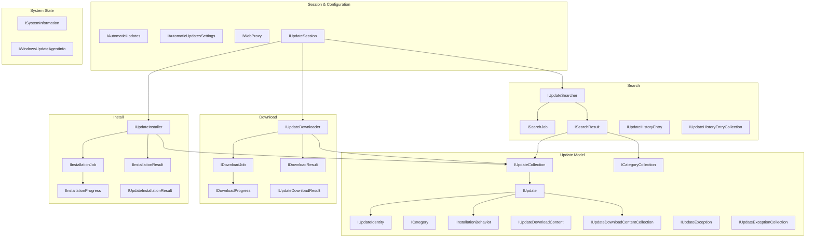
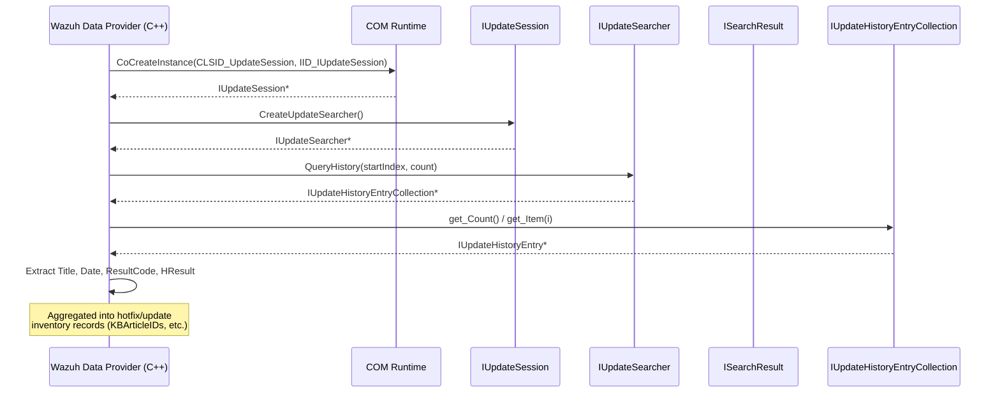

# Windows Update Agent API

## Introduction

The **Windows Update Agent API** module (`src/data_provider/include/wuapi.h`) is an autogenerated (WIDL-generated) C/C++ header that provides COM interface bindings to Microsoft's native **Windows Update Agent (WUA) API** (`wuapi.dll`). It is a **Windows-only** interoperability layer that exposes the COM object model Windows itself uses to search, download, and install operating-system updates.

This header does not contain executable business logic — it contains **interface (vtable) declarations, GUIDs, and enums** that allow Wazuh's C++ data-provider code to instantiate and drive the operating system's own Windows Update client through COM. It is a foundational, low-level dependency used by higher-level inventory/hotfix collection code (see [SysInfo_Provider.md](SysInfo_Provider.md) and [data_provider_sysinfo_core.md](data_provider_sysinfo_core.md)) to enumerate installed hotfixes/updates on Windows endpoints, and potentially by agent-upgrade tooling that needs to interrogate the OS update state.

Because it is purely a set of COM interface definitions, this module has **no runtime state and no independent process**; it is compiled directly into consumers on Windows builds and is inert (behind `#ifdef _WIN32` / `ifdef` guards for `windows.h`/`ole2.h`) on non-Windows platforms.

---

## 1. Purpose & Scope

| Aspect | Description |
|---|---|
| **File** | `src/data_provider/include/wuapi.h` |
| **Origin** | Autogenerated by WIDL (Wine IDL compiler) v9.20 from `wuapi.idl` |
| **Platform** | Windows only (guards on `#ifdef _WIN32`, requires `windows.h`, `ole2.h`, `oaidl.h`) |
| **Nature** | Header-only COM interface/vtable declarations — no `.c`/`.cpp` implementation in this file |
| **Consumers** | Wazuh Windows data-provider code that needs to query Windows Update history, install status, or available updates (e.g., hotfix enumeration in `sysInfo.cpp`) |
| **Library GUID** | `WUApiLib` (`LIBID_WUApiLib`) |

The header mirrors the public COM contract exposed by the OS component `wuapi.dll`, allowing native C/C++ code to:

- Create update sessions (`IUpdateSession`)
- Search for applicable/installed updates (`IUpdateSearcher`, `ISearchResult`)
- Enumerate update history (`IUpdateHistoryEntry`, `IUpdateHistoryEntryCollection`)
- Download updates (`IUpdateDownloader`, `IDownloadResult`)
- Install/uninstall updates (`IUpdateInstaller`, `IInstallationResult`)
- Query system-level update state such as pending reboot (`ISystemInformation`)
- Configure automatic update behavior (`IAutomaticUpdates`, `IAutomaticUpdatesSettings`)

---

## 2. Architectural Overview

### 2.1 COM Interface Hierarchy

All interfaces in this header derive from `IDispatch` (which itself derives from `IUnknown`), following the standard OLE Automation (`IDispatch`) pattern used by scriptable COM objects such as Windows Update.

```mermaid
classDiagram
    class IUnknown {
        +QueryInterface()
        +AddRef()
        +Release()
    }
    class IDispatch {
        +GetTypeInfoCount()
        +GetTypeInfo()
        +GetIDsOfNames()
        +Invoke()
    }
    IUnknown <|-- IDispatch

    IDispatch <|-- IAutomaticUpdates
    IDispatch <|-- IAutomaticUpdatesSettings
    IDispatch <|-- IWebProxy
    IDispatch <|-- IUpdateSession
    IDispatch <|-- IUpdateSearcher
    IDispatch <|-- ISearchJob
    IDispatch <|-- ISearchResult
    IDispatch <|-- IUpdate
    IDispatch <|-- IUpdateCollection
    IDispatch <|-- IUpdateIdentity
    IDispatch <|-- IUpdateException
    IDispatch <|-- IUpdateExceptionCollection
    IDispatch <|-- IUpdateHistoryEntry
    IDispatch <|-- IUpdateHistoryEntryCollection
    IDispatch <|-- IUpdateDownloader
    IDispatch <|-- IUpdateDownloadResult
    IDispatch <|-- IDownloadJob
    IDispatch <|-- IDownloadProgress
    IDispatch <|-- IDownloadResult
    IDispatch <|-- IUpdateInstaller
    IDispatch <|-- IInstallationJob
    IDispatch <|-- IInstallationProgress
    IDispatch <|-- IInstallationResult
    IDispatch <|-- IUpdateInstallationResult
    IDispatch <|-- ISystemInformation
    IDispatch <|-- IWindowsUpdateAgentInfo
    IDispatch <|-- ICategory
    IDispatch <|-- ICategoryCollection
    IDispatch <|-- IImageInformation
    IDispatch <|-- IInstallationBehavior
    IDispatch <|-- IStringCollection
    IDispatch <|-- IUpdateDownloadContent
    IDispatch <|-- IUpdateDownloadContentCollection
```

Each interface is expressed twice in the header:

1. A **C++ abstract class** form (`#if defined(__cplusplus) && !defined(CINTERFACE)`) with pure-virtual methods, used when compiled as C++.
2. A **C-style vtable struct** (`I<Name>Vtbl`) plus `COBJMACROS` helper macros/inline wrappers, used when compiled as plain C.

This dual representation is standard WIDL/MIDL output and allows the same header to serve both C and C++ translation units.

### 2.2 Component (CoClass) Definitions

Four instantiable COM coclasses are declared with their CLSIDs, which are the actual objects created via `CoCreateInstance`:

| CoClass | CLSID | Primary Interface | Purpose |
|---|---|---|---|
| `AutomaticUpdates` | `{bfe18e9c-...}` | `IAutomaticUpdates` | Query/control the Windows Automatic Updates service |
| `UpdateSession` | `{4cb43d7f-...}` | `IUpdateSession` | Entry point — creates searchers, downloaders, installers |
| `UpdateInstaller` | `{d2e0fe7f-...}` | `IUpdateInstaller` | Standalone installer object |
| `SystemInformation` | `{c01b9ba0-...}` | `ISystemInformation` | Reboot-required / hardware support link |
| `WindowsUpdateAgentInfo` | `{c2e88c2f-...}` | `IWindowsUpdateAgentInfo` | Generic WUA info/version queries |

### 2.3 Functional Groupings

---

## 3. Typical Usage / Data Flow

Although this header contains no logic, it defines the *shape* of the interaction that a consuming C++ component (e.g., a hotfix-collection routine in the [SysInfo_Provider](SysInfo_Provider.md) / [data_provider_sysinfo_core](data_provider_sysinfo_core.md) modules) would follow when talking to the native Windows Update Agent:

This flow underlies use cases such as:
- **Hotfix/KB enumeration** for Windows inventory (`sysinfo_hotfixes` in `sysInfo.cpp`, part of [data_provider_sysinfo_core](data_provider_sysinfo_core.md)).
- **Update-installation-status checks** possibly consulted by agent-upgrade workflows (see [Wazuh_Modules_Daemon_(C).md](Wazuh_Modules_Daemon_(C).md) → `agent_upgrade_module`) to determine reboot requirements (`ISystemInformation::get_RebootRequired`) after applying a WPK-based upgrade package.

---

## 4. Interface Reference Summary

### 4.1 Session, Settings & Proxy

| Interface | Key Members | Description |
|---|---|---|
| `IUpdateSession` | `CreateUpdateSearcher`, `CreateUpdateDownloader`, `CreateUpdateInstaller`, `ClientApplicationID`, `WebProxy` | Root factory object for all update operations |
| `IAutomaticUpdates` | `DetectNow`, `Pause`, `Resume`, `ShowSettingsDialog`, `Settings`, `ServiceEnabled`, `EnableService` | Control the OS Automatic Updates service |
| `IAutomaticUpdatesSettings` | `NotificationLevel`, `ScheduledInstallationDay/Time`, `Refresh`, `Save` | Configure AU notification/scheduling policy |
| `IWebProxy` | `Address`, `BypassList`, `UserName`, `SetPassword`, `AutoDetect` | Proxy configuration used by search/download operations |

### 4.2 Search

| Interface | Key Members | Description |
|---|---|---|
| `IUpdateSearcher` | `Search`, `BeginSearch`/`EndSearch`, `QueryHistory`, `GetTotalHistoryCount`, `ServerSelection`, `Online` | Executes synchronous/async searches for applicable updates and queries install history |
| `ISearchJob` | `AsyncState`, `IsCompleted`, `RequestAbort`, `CleanUp` | Handle to an in-flight asynchronous search |
| `ISearchResult` | `ResultCode`, `RootCategories`, `Updates`, `Warnings` | Result set returned by a search |
| `IUpdateHistoryEntry` | `Operation`, `ResultCode`, `HResult`, `Date`, `UpdateIdentity`, `Title`, `Description` | A single historical install/uninstall record |
| `IUpdateHistoryEntryCollection` | `Item`, `Count` | Collection of `IUpdateHistoryEntry` |

### 4.3 Update Object Model

| Interface | Key Members | Description |
|---|---|---|
| `IUpdate` | `Title`, `Identity`, `IsInstalled`, `IsDownloaded`, `IsHidden`, `KBArticleIDs`, `SecurityBulletinIDs`, `MsrcSeverity`, `InstallationBehavior`, `DownloadContents`, `AcceptEula` | Central object representing a single Windows Update |
| `IUpdateCollection` | `Item`, `Add`, `Insert`, `RemoveAt`, `Clear`, `Copy` | Ordered collection of `IUpdate` |
| `IUpdateIdentity` | `RevisionNumber`, `UpdateID` | Unique identity/version of an update |
| `ICategory` / `ICategoryCollection` | `Name`, `CategoryID`, `Children`, `Parent`, `Updates` | Update classification taxonomy (e.g., "Critical Updates") |
| `IInstallationBehavior` | `CanRequestUserInput`, `Impact`, `RebootBehavior`, `RequiresNetworkConnectivity` | Metadata describing how an update installs |
| `IUpdateException` / `IUpdateExceptionCollection` | `Message`, `HResult`, `Context` | Non-fatal warnings collected during search |
| `IUpdateDownloadContent` / `Collection` | `DownloadUrl` | Underlying CAB/MSU payload URL(s) for an update |

### 4.4 Download Pipeline

| Interface | Key Members | Description |
|---|---|---|
| `IUpdateDownloader` | `Updates`, `Download`, `BeginDownload`/`EndDownload`, `Priority`, `IsForced` | Orchestrates downloading a set of `IUpdate` objects |
| `IDownloadJob` | `Updates`, `GetProgress`, `RequestAbort`, `IsCompleted` | Handle to an async download operation |
| `IDownloadProgress` | `PercentComplete`, `CurrentUpdateDownloadPhase`, `TotalBytesDownloaded/ToDownload` | Real-time download progress |
| `IDownloadResult` / `IUpdateDownloadResult` | `ResultCode`, `HResult`, `GetUpdateResult` | Outcome of a download, per-update and aggregate |

### 4.5 Install Pipeline

| Interface | Key Members | Description |
|---|---|---|
| `IUpdateInstaller` | `Updates`, `Install`, `Uninstall`, `BeginInstall`/`EndInstall`, `RunWizard`, `IsForced`, `IsBusy` | Orchestrates installing/uninstalling `IUpdate` objects |
| `IInstallationJob` | `Updates`, `GetProgress`, `RequestAbort` | Handle to an async install operation |
| `IInstallationProgress` | `PercentComplete`, `CurrentUpdateIndex`, `GetUpdateResult` | Real-time installation progress |
| `IInstallationResult` / `IUpdateInstallationResult` | `ResultCode`, `HResult`, `RebootRequired`, `GetUpdateResult` | Outcome of an installation, per-update and aggregate |

### 4.6 System State

| Interface | Key Members | Description |
|---|---|---|
| `ISystemInformation` | `RebootRequired`, `OemHardwareSupportLink` | Whether a pending reboot is required after updates |
| `IWindowsUpdateAgentInfo` | `GetInfo(varInfoIdentifier)` | Generic property/version lookup on the WUA client itself |

### 4.7 Supporting Enumerations

| Enum | Values (abridged) | Meaning |
|---|---|---|
| `OperationResultCode` | `orcNotStarted`, `orcInProgress`, `orcSucceeded`, `orcSucceededWithErrors`, `orcFailed`, `orcAborted` | Generic outcome status for search/download/install |
| `UpdateOperation` | `uoInstallation`, `uoUninstallation` | Direction of a historical operation |
| `DeploymentAction` | `daNone`, `daInstallation`, `daUninstallation`, `daDetection` | Action WU intends to perform |
| `DownloadPriority` | `dpLow`, `dpNormal`, `dpHigh` | Download queue priority |
| `ServerSelection` | `ssDefault`, `ssManagedServer`, `ssWindowsUpdate`, `ssOthers` | Which update source/server to query |
| `InstallationImpact` / `InstallationRebootBehavior` | — | Describes disruption/reboot characteristics of an update |
| `AutomaticUpdatesNotificationLevel` / `...ScheduledInstallationDay` | — | Automatic Updates policy configuration |

---

## 5. Interop Conventions

- **Marshalling helpers**: The header declares standard OLE Automation user-marshalling prototypes (`BSTR_UserSize/Marshal/Unmarshal/Free`, `HWND_User*`, `VARIANT_User*`) required for out-of-process/RPC marshalling of `BSTR`, `HWND`, and `VARIANT` types used throughout the interfaces.
- **Dual C/C++ API surface**: Every interface provides:
  - C++ virtual methods (`This->Method(args)`), used when `__cplusplus` and not `CINTERFACE`.
  - C vtable macros (`IInterface_Method(This, args)`) and inline wrapper functions when `COBJMACROS` is defined, enabling the same header to be consumed from C.
- **GUID definitions**: Every interface and coclass has a `DEFINE_GUID` (IID/CLSID) entry, plus optional `__CRT_UUID_DECL` bindings for compilers supporting `__uuidof`.
- **Windows-only guarding**: The whole file only compiles meaningfully under `_WIN32` since it depends on `windows.h`, `ole2.h`, `rpc.h`, `rpcndr.h`, and `oaidl.h`.

---

## 6. Relationship to the Rest of the System

```mermaid
graph LR
    WUAPI["Windows_Update_Agent_API<br/>(wuapi.h)"] -->|COM interfaces consumed by| SYSCORE["data_provider_sysinfo_core<br/>(sysInfo.cpp - sysinfo_hotfixes)"]
    SYSCORE -->|feeds| SYSINFO["SysInfo_Provider<br/>(sysInfo.hpp)"]
    SYSINFO -->|reported via| SYSCOLLECTOR["Wazuh_Modules_Daemon_(C)<br/>wm_syscollector.c"]
    SYSCOLLECTOR -->|hotfix/update inventory| WDB["wazuh_db<br/>(wdb_syscollector.c)"]
    AGENTUPGRADE["agent_upgrade_module<br/>(Wazuh_Modules_Daemon)"] -.->|may query reboot state via| WUAPI
```

- **[SysInfo_Provider.md](SysInfo_Provider.md)**: Defines the cross-platform `SysInfo` interface; on Windows, hotfix/update collection routines rely on the COM contracts declared here.
- **[data_provider_sysinfo_core.md](data_provider_sysinfo_core.md)**: Houses the actual `sysInfo.cpp`/`sysInfoWin.cpp` implementations that would `CoCreateInstance` the coclasses defined in this header (e.g., to populate `sysinfo_hotfixes`).
- **[Wazuh_Modules_Daemon_(C).md](Wazuh_Modules_Daemon_(C).md)** → `agent_upgrade_module`: The Windows agent-upgrade path (WPK install flow) may need to check for OS-level pending reboots or update conflicts, for which `ISystemInformation`/`IUpdateSession` are the relevant native contracts.
- **[Wazuh_Modules_Daemon_(C).md](Wazuh_Modules_Daemon_(C).md)** → `wazuh_modules_core` (`wm_syscollector.c`): Consumes hotfix data ultimately sourced (on Windows) through this COM layer, publishing it to `wazuh_db` (`wdb_syscollector.c`) for inventory storage and later exposure through the [Syscollector API module](API_&_Management_Framework_(Python).md).

---

## 7. Notes for Maintainers

- **Do not hand-edit this file.** It is autogenerated by WIDL from `wuapi.idl`; any behavioral changes should be made to the IDL source and regenerated, or isolated in a separate wrapper/adapter translation unit.
- **No dynamic behavior lives here.** All object lifecycle (`CoInitialize`, `CoCreateInstance`, `Release`), error handling (`HRESULT` checks), and business logic for interpreting update/hotfix data belongs in the consuming `.cpp` files (see [data_provider_sysinfo_core](data_provider_sysinfo_core.md)).
- **Platform gating**: Any new consumer code must guard usage behind Windows-only compilation paths, mirroring the pattern used elsewhere in the data-provider tree (e.g., `sysInfoWin.cpp` vs. `sysInfoLinux.cpp`/`sysInfoMac.cpp`).
- **COM threading model**: Consumers must ensure proper COM apartment initialization (`CoInitializeEx`) before invoking any interface obtained through `CLSID_UpdateSession` et al.; this header does not perform that initialization.
