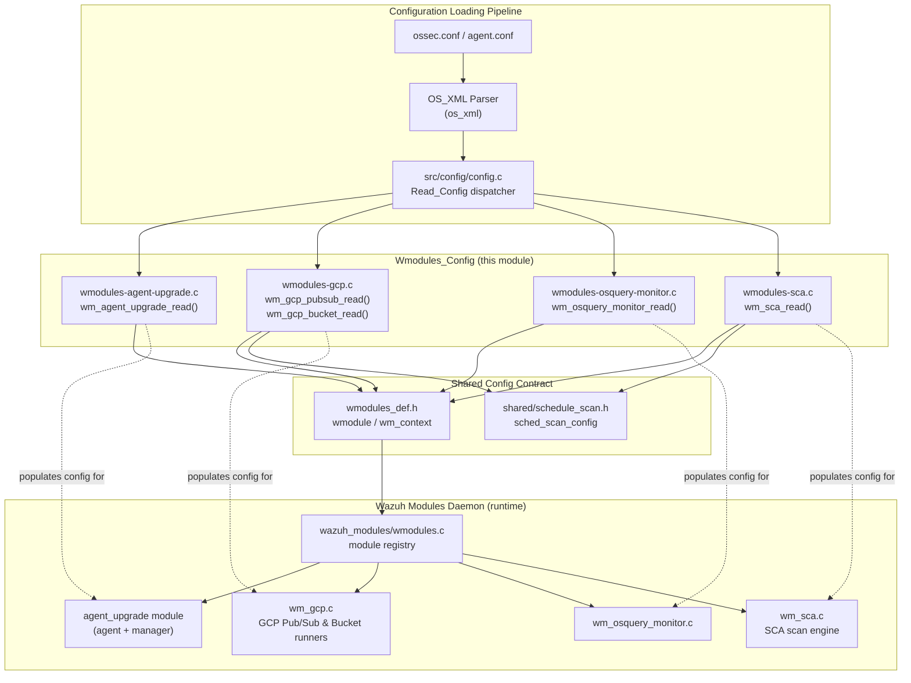

# Wmodules_Config

## Introduction

`Wmodules_Config` is the collection of **XML configuration readers** for a subset of Wazuh's optional runtime modules (the "wodules" subsystem, `wmodules_def.h::wmodule`). Each file in this module implements a `wm_<name>_read()` function that is invoked by the generic configuration loader (`src/config/config.c`) while parsing `ossec.conf` / `agent.conf`. The parser populates a module-specific configuration structure (e.g. `wm_sca_t`, `wm_gcp_pubsub`, `wm_agent_upgrade`) that is later consumed by the corresponding runtime module implementation living in the **Wazuh_Modules_Daemon_(C)** area of the codebase (`src/wazuh_modules/*`).

This module is a sibling of the other `src/config/*` parsers (Active Response, Authd, Client, Global, Localfile, Remote, Rootcheck, Syscheck, Wazuh DB configs) that together make up the broader **Configuration_Data_Structures_(C_Headers)** module family. `Wmodules_Config` specifically covers:

| File | Purpose |
|------|---------|
| `wmodules-agent-upgrade.c` | Reads `<agent-upgrade>` block — controls both the agent-side upgrade-notification wait/CA settings and the manager-side WPK repository/thread-pool settings. |
| `wmodules-gcp.c` | Reads `<gcp-pubsub>` and `<gcp-bucket>` blocks — Google Cloud Pub/Sub subscriber and GCS bucket log-collection settings. |
| `wmodules-osquery-monitor.c` | Reads `<osquery>` block — paths, packs and daemon-management options for the osquery integration. |
| `wmodules-sca.c` | Reads `<sca>` block — Security Configuration Assessment policy list, scheduling and scan behavior. |

Because these are pure "parse XML → populate struct" translation units, they share a common set of conventions (described below) and a common set of dependencies on the shared XML/config infrastructure and on the `wmodule` runtime contract, but each is functionally independent — a change to the GCP parser has no effect on the SCA parser.

## Architecture Overview

### Where this module fits in the system



### Common parsing pattern

All four parsers follow the same idiom used throughout `src/config`:

```mermaid
flowchart LR
    A[module->data == NULL?] -->|yes| B[Allocate config struct<br/>and set defaults]
    A -->|no| C[Reuse existing module->data<br/>(multiple config blocks)]
    B --> D
    C --> D[Iterate xml_node** nodes]
    D --> E{Match nodes[i]->element}
    E -->|known tag| F[Validate content<br/>eval_bool / OS_StrIsNum / path checks]
    F -->|invalid| G[merror + return OS_INVALID]
    F -->|valid| H[Assign into config struct]
    E -->|scheduling tag| I[Deferred to sched_scan_read]
    E -->|unknown tag| J[mwarn or merror depending on module]
    H --> D
    D -->|done| I
    I --> K[Return 0 / OS_INVALID]
```

Key shared conventions:
- **Idempotent initialization**: `module->data` is only allocated once; subsequent `<...>` blocks for the same module tag reuse and extend it (important for SCA policies and GCP buckets, which can appear in multiple blocks).
- **Boolean parsing**: `eval_bool()` (locally defined in `wmodules-gcp.c`, `wmodules-osquery-monitor.c`, `wmodules-sca.c`) converts `"yes"/"no"` strings to `1/0/OS_INVALID`.
- **Scheduling delegation**: GCP and SCA delegate interval/day/time parsing to the shared `sched_scan_read()` helper (see `framework`/`shared` scheduling utilities), rather than re-implementing cron-like logic.
- **Path safety**: File/credential paths are resolved with `realpath()`/`GetFullPathName()` and validated with `IsFile()` before being accepted, to avoid pointing at non-existent or unsafe locations.
- **Fail-fast validation**: Any malformed tag content causes an immediate `merror()` + `OS_INVALID` return, aborting the daemon startup with a clear configuration error rather than silently applying defaults.

## Sub-modules

| Sub-module | Documentation | Core Component(s) |
|---|---|---|
| Agent Upgrade Module Configuration | [Wmodules_Config_agent_upgrade.md](Wmodules_Config_agent_upgrade.md) | `wmodules-agent-upgrade.c::wm_agent_upgrade_read` and its CA-verification helpers |
| GCP Integration Configuration | [Wmodules_Config_gcp.md](Wmodules_Config_gcp.md) | `wmodules-gcp.c::wm_gcp_pubsub_read`, `wm_gcp_bucket_read`, `eval_bool` |
| Osquery Monitor Configuration | [Wmodules_Config_osquery_monitor.md](Wmodules_Config_osquery_monitor.md) | `wmodules-osquery-monitor.c::wm_osquery_monitor_read`, `eval_bool` |
| SCA (Security Configuration Assessment) Configuration | [Wmodules_Config_sca.md](Wmodules_Config_sca.md) | `wmodules-sca.c::wm_sca_read`, `eval_bool`, policy-discovery logic |

Each sub-module page documents:
- The configuration structure it populates and the defaults it applies.
- The full set of supported XML tags, their validation rules, and failure modes.
- A flow diagram specific to that parser's more complex logic (e.g. SCA's automatic ruleset-directory discovery, GCP's bucket-list construction).

## Related Modules

- **Configuration_Data_Structures_(C_Headers)** siblings — parsers for other daemons' configuration blocks (Active Response, Authd, Client, Global, Localfile, Remote, Rootcheck, Syscheck, Wazuh DB). These share the same `OS_XML` / `xml_node` parsing infrastructure but are documented separately per top-level module.
- **Wazuh_Modules_Daemon_(C)** — the runtime module registry (`wazuh_modules/wmodules.c`, `wmodules_def.h`) and the actual module implementations (`wm_sca.c`, `wm_gcp.c` runtime logic, `wm_osquery_monitor.c` runtime logic, `agent_upgrade/` manager and agent code) that consume the configuration structures built by this module.
- **Agent_&_Manager_Native_Daemons_(C)** — `shared/schedule_scan.c` provides the `sched_scan_read()` scheduling parser reused by the GCP and SCA readers.
