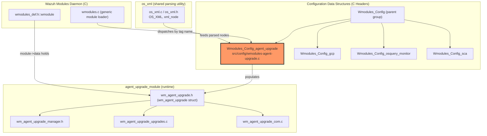
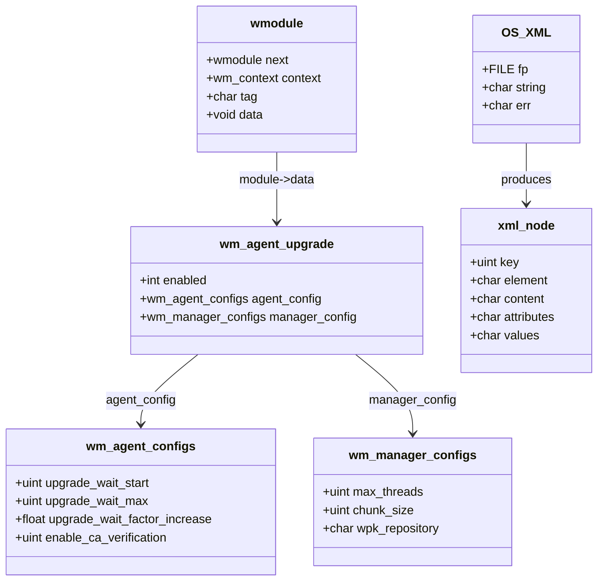
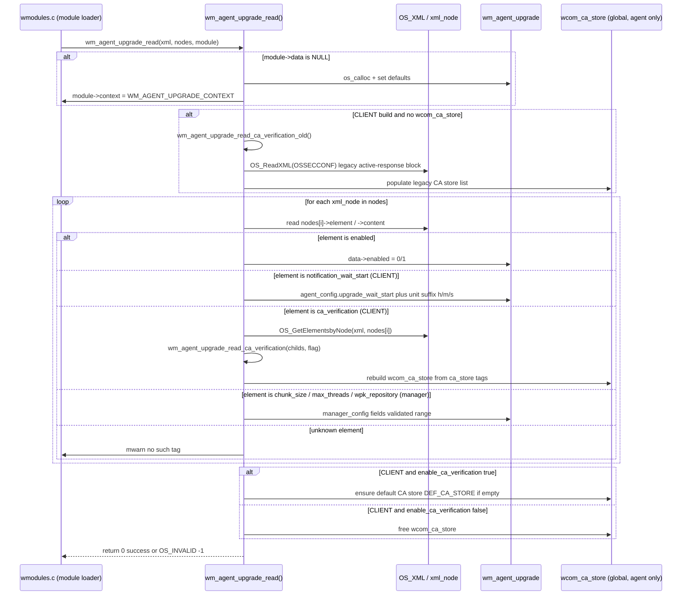
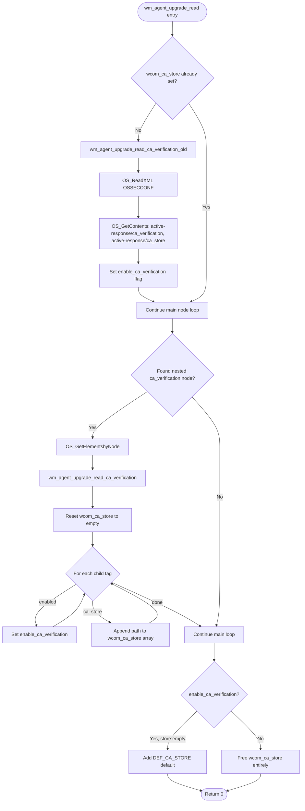
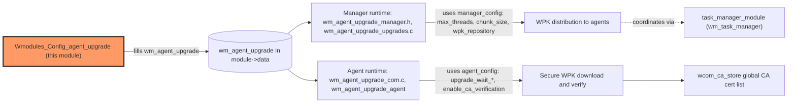

# Wmodules_Config_agent_upgrade

## Introduction

The **Wmodules_Config_agent_upgrade** module is a focused configuration-parsing unit within the Wazuh C codebase. It is responsible for reading the `<agent-upgrade>` XML block from `ossec.conf` (agent-side) or `wazuh_manager.conf`/`ossec.conf` (manager-side) and populating the in-memory `wm_agent_upgrade` configuration structure that drives the **Agent Upgrade Module** (`wm_agent_upgrade`), one of the Wazuh Modules Daemon (`wazuh-modulesd`) sub-modules.

This module is a single translation unit — `src/config/wmodules-agent-upgrade.c` — compiled twice with different preprocessor contexts:
* **`CLIENT`** build (agent side): parses agent-specific settings that control how an agent processes upgrade notifications (timing/backoff, CA verification).
* **Manager build** (default, no `CLIENT` macro): parses manager-specific settings that control how the manager orchestrates and distributes WPK (Wazuh Package) upgrades to agents (thread pool size, chunk size, WPK repository URL).

It is one of the four children of [Wmodules_Config](Wmodules_Config.md) (the parent group covering all `src/config/wmodules-*.c` parsers), and sits at the boundary between the generic **Configuration_Data_Structures_(C_Headers)** module family and the **Wazuh_Modules_Daemon_(C)** family, specifically its `agent_upgrade_module` child, feeding the parsed configuration into the runtime behavior implemented in `src/wazuh_modules/agent_upgrade/`.

---

## 1. Purpose and Core Functionality

The core entry point is:

```c
int wm_agent_upgrade_read(const OS_XML *xml, xml_node **nodes, wmodule *module);
```

This function is invoked by the generic Wazuh module configuration loader (`wmodules.c` / `config.c`, part of `Wazuh_Modules_Daemon_(C)` and `Configuration_Data_Structures_(C_Headers)` respectively) whenever a `<wodle name="agent-upgrade">` (or equivalent `<agent-upgrade>`) block is encountered while parsing the configuration file. Its responsibilities are:

1. **Lazy initialization** — If `module->data` is `NULL`, it allocates a new `wm_agent_upgrade` struct, sets the module context (`WM_AGENT_UPGRADE_CONTEXT`) and tag, and applies compiled-in defaults (different for `CLIENT` vs manager builds).
2. **XML node iteration** — Walks the array of sibling `xml_node` pointers extracted by the generic `OS_XML` parser (`src/os_xml/os_xml.c`), matching each `element` name against the known tags for the current build target.
3. **Validation & type conversion** — Converts string XML content into typed values (integers, floats, booleans, time durations with `s`/`m`/`h` suffixes), enforcing valid ranges (e.g., `chunk_size`, `max_threads` bounds) and returning `OS_INVALID` on malformed input.
4. **CA verification bootstrapping** (agent-only) — Manages the deprecated/legacy `<active-response><ca_verification>` settings and the new `<ca_verification>` sub-block, populating the shared `wcom_ca_store` array used elsewhere by the agent's secure WPK download/verification logic.
5. **Unknown tag tolerance** — Logs a warning (`mwarn`) rather than failing for unrecognized tags, consistent with Wazuh's general configuration parsing philosophy.

### Key Behavioral Differences by Build Target

| Build | Tags Parsed | Defaults Applied | Data structure filled |
|---|---|---|---|
| `CLIENT` (agent) | `enabled`, `notification_wait_start`, `notification_wait_max`, `notification_wait_factor`, `ca_verification` (+ nested `enabled`/`ca_store`) | `WM_UPGRADE_WAIT_START`, `WM_UPGRADE_WAIT_MAX`, `WM_UPGRADE_WAIT_FACTOR_INCREASE`, CA verification enabled | `wm_agent_configs` (within `wm_agent_upgrade.agent_config`) |
| Manager | `wpk_repository`, `chunk_size`, `max_threads` | `WM_UPGRADE_MAX_THREADS`, `WM_UPGRADE_CHUNK_SIZE`, `wpk_repository = NULL` | `wm_manager_configs` (within `wm_agent_upgrade.manager_config`) |

---

## 2. Architecture and Component Relationships

### 2.1 Position in the System



### 2.2 Data Structures



---

## 3. Configuration Parsing Flow

### 3.1 Overall Sequence



### 3.2 CA Verification Sub-Flow (Agent Only)

The agent build has an additional layer of complexity for CA (Certificate Authority) verification, supporting both a **legacy** location (`<active-response><ca_verification>` / `<ca_store>` in the main `ossec.conf`) and the **current** nested `<ca_verification>` block inside `<agent-upgrade>`.



---

## 4. Component Interaction with the Agent Upgrade Runtime

The parsed `wm_agent_upgrade` struct becomes the shared configuration consumed by the runtime logic implemented in the sibling module **`agent_upgrade_module`** (part of `Wazuh_Modules_Daemon_(C)`). See [Wazuh_Modules_Daemon_(C).md](Wazuh_Modules_Daemon_(C).md) for full details of that runtime.



- **Manager config** (`chunk_size`, `max_threads`, `wpk_repository`) directly parameterizes the upgrade dispatch logic in `wm_agent_upgrade_upgrades.c`, which sends WPK packages to agents in configurable chunks using a thread pool.
- **Agent config** (`upgrade_wait_start`, `upgrade_wait_max`, `upgrade_wait_factor_increase`, `enable_ca_verification`) controls the exponential backoff strategy an agent uses when waiting for/retrying upgrade notifications, and whether/how it validates the WPK package's signing certificate via `wcom_ca_store`.
- Both sides communicate through the higher-level **Task Manager Module** (`wm_task_manager`, see [task_manager_module](Wazuh_Modules_Daemon_(C).md)) and the **wazuh-db** upgrade task tables (see [Wazuh_DB_Config](Wazuh_DB_Config.md) and `wazuh_db` daemon) for task status tracking — outside the scope of this configuration module but relevant for understanding the end-to-end feature.

---

## 5. Key Constants and Validation Rules

| Tag | Applies to | Validation | Notes |
|---|---|---|---|
| `enabled` | both (client parses generic `enabled`) | must be `yes`/`no` | toggles the whole module |
| `notification_wait_start` | agent | numeric, optional `h`/`m`/`s` suffix; must be > 0 and < `INT_MAX` | converted to seconds |
| `notification_wait_max` | agent | same as above | converted to seconds |
| `notification_wait_factor` | agent | float > 1.0 | backoff multiplier |
| `ca_verification` (nested `enabled`) | agent | `yes`/`no` | toggles CA cert validation |
| `ca_verification` (nested `ca_store`) | agent | any file path string | appended to `wcom_ca_store[]` |
| `chunk_size` | manager | numeric string; `WM_UPGRADE_CHUNK_SIZE_MIN` ≤ value ≤ `WM_UPGRADE_CHUNK_SIZE_MAX` | agents-per-batch during mass upgrade |
| `max_threads` | manager | numeric string; `0` → `get_nproc()`, else ≤ 256 | worker thread pool size |
| `wpk_repository` | manager | any string (URL/path) | overrides default WPK repository |

Any parsing failure returns `OS_INVALID` (`-1`), which propagates up through the config loader and typically aborts configuration loading with an error logged via `merror`.

---

## 6. Dependencies

| Dependency | Relationship |
|---|---|
| `src/os_xml/os_xml.h`, `os_xml.c` (shared utility) | Supplies `OS_XML`, `xml_node`, `OS_GetElementsbyNode`, `OS_GetContents`, `OS_ReadXML`, `OS_ClearXML`, `OS_ClearNode` used to walk/parse the configuration tree. |
| `src/wazuh_modules/wmodules_def.h::wmodule` | Generic module descriptor; this file fills `module->data`, `module->context`, `module->tag`. |
| `src/wazuh_modules/agent_upgrade/wm_agent_upgrade.h` | Declares `wm_agent_upgrade`, `wm_agent_configs`, `wm_manager_configs`, and constants like `WM_UPGRADE_WAIT_START`, `WM_UPGRADE_CHUNK_SIZE`, `WM_AGENT_UPGRADE_CONTEXT`. |
| `src/wazuh_modules/agent_upgrade/agent/wm_agent_upgrade_agent.h` (CLIENT only) | Provides agent-side runtime types referenced conditionally. |
| `wcom_ca_store` (global, defined elsewhere in the agent codebase) | Shared CA certificate store array consumed by WPK download/verification code — see `Agent_&_Manager_Native_Daemons_(C)` → `os_execd`. |
| `src/shared/debug_op.c` (`merror`, `mwarn`, `minfo`) | Logging primitives used throughout for diagnostics. |
| `OSSECCONF` (legacy config path macro) | Used only when reading deprecated `<active-response>` CA settings. |

For the broader configuration parsing family (other Wmodules), see:
- [Wmodules_Config.md](Wmodules_Config.md) (parent group overview)
- [Wmodules_Config_gcp.md](Wmodules_Config_gcp.md)
- [Wmodules_Config_osquery_monitor.md](Wmodules_Config_osquery_monitor.md)
- [Wmodules_Config_sca.md](Wmodules_Config_sca.md)

For the runtime module that consumes this configuration:
- [Wazuh_Modules_Daemon_(C).md](Wazuh_Modules_Daemon_(C).md) (see `agent_upgrade_module` and `task_manager_module` children)

For the Python-side high-level agent upgrade orchestration (framework/API layer), see:
- [agent_module_cli.md](agent_module_cli.md) — `framework/scripts/agent_upgrade.py`
- [agent_module_api_controllers.md](agent_module_api_controllers.md) — `PUT /agents/upgrade` and `PUT /agents/upgrade_custom` endpoints in `api/api/controllers/agent_controller.py`

---

## 7. Testing

Behavioral coverage related to this configuration parsing logic (compiled indirectly through the `wm_agent_upgrade` module tests) lives primarily in the **Unit_Tests_-_Agent_Upgrade_Module** test group:
- `agent_upgrade_validate`, `agent_upgrade_agent`, `agent_upgrade_manager`, `agent_upgrade_upgrades` test suites exercise the resulting configuration values (e.g., WPK version validation, upgrade dispatch behavior) rather than the XML parser directly, since `wm_agent_upgrade_read` itself has no dedicated unit test file in the provided tree.

---

## 8. Summary

`Wmodules_Config_agent_upgrade` is a small but critical glue component: it translates static XML configuration into the strongly-typed `wm_agent_upgrade` struct that both the agent-side and manager-side halves of the **Agent Upgrade Module** rely on for their entire operational behavior — from backoff timing and CA verification on agents, to thread-pool sizing and WPK repository selection on managers. Understanding this module is a prerequisite for understanding how `<agent-upgrade>` configuration in `ossec.conf`/`wazuh_manager.conf` maps to actual upgrade behavior across the Wazuh agent/manager fleet.
