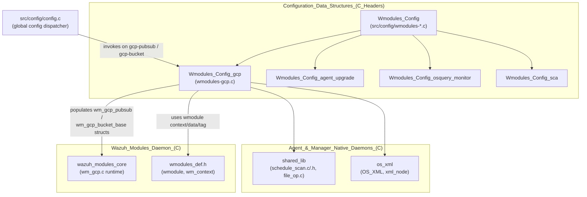
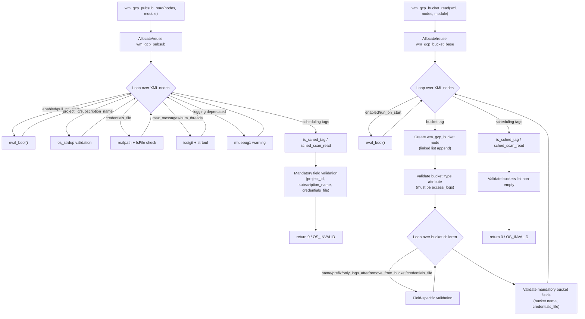

# Wmodules_Config_gcp

## Introduction

`Wmodules_Config_gcp` is the **configuration parser** for Wazuh's Google Cloud Platform (GCP) integrations. It is implemented entirely in a single translation unit, `src/config/wmodules-gcp.c`, and is responsible for translating the `<gcp-pubsub>` and `<gcp-bucket>` XML blocks found in `ossec.conf` into the in-memory C structures (`wm_gcp_pubsub` and `wm_gcp_bucket_base`/`wm_gcp_bucket`) that the GCP wodule runtime (`wm_gcp.c`, part of [Wazuh_Modules_Daemon_(C)](Wazuh_Modules_Daemon_(C).md)) consumes at scan time.

This module is one of several sibling **wmodules configuration parsers** (see [Wmodules_Config](Wmodules_Config.md)) that share a common pattern: read an `xml_node` tree, validate/convert each tag, populate a `wmodule`-specific data structure, and wire the result into the generic `wmodule` context so the daemon can later dispatch to the correct module implementation.

## Purpose & Core Functionality

The GCP configuration parser exposes two public entry points (declared in `wazuh_modules/wm_gcp.h` and invoked from the global configuration reader, `src/config/config.c`):

- **`wm_gcp_pubsub_read`** — Parses `<gcp-pubsub>` blocks that configure the **Pub/Sub subscriber** integration (pulling messages from a GCP Pub/Sub subscription).
- **`wm_gcp_bucket_read`** — Parses `<gcp-bucket>` blocks that configure one or more **Cloud Storage bucket** log collectors (currently limited to the `access_logs` bucket type).

Both functions share a private helper:

- **`eval_bool`** *(core component of this module)* — A tiny utility that converts the strings `"yes"`/`"no"` into `1`/`0`, returning `OS_INVALID` for anything else (including `NULL`). It centralizes boolean-tag validation logic used throughout the file (`enabled`, `run_on_start`, `pull_on_start`, `remove_from_bucket`).

```c
static short eval_bool(const char *str) {
    return !str ? OS_INVALID : !strcmp(str, "yes") ? 1 : !strcmp(str, "no") ? 0 : OS_INVALID;
}
```

Although `eval_bool` is the single explicitly tracked "core component," it is the linchpin of input validation for this configuration module — every yes/no tag in both the Pub/Sub and Bucket parsers routes through it, and a similarly-named/patterned helper appears in the other `wmodules-*` configuration files (`wmodules-agent-upgrade.c`, `wmodules-osquery-monitor.c`, `wmodules-sca.c`, `authd-key-request-config.c`, `rootcheck-config.c`, `wazuh_db-config.c`), all documented under [Wmodules_Config](Wmodules_Config.md) and [Configuration_Data_Structures_(C_Headers)](Configuration_Data_Structures_(C_Headers).md).

## Architecture and Component Relationships

### Position in the system



### Internal structure of `wmodules-gcp.c`



## Data Structures Produced

| Structure | Defined in | Populated by | Consumed by |
|---|---|---|---|
| `wm_gcp_pubsub` | `src/wazuh_modules/wm_gcp.h` | `wm_gcp_pubsub_read` | GCP Pub/Sub runtime (`wm_gcp.c`, `wazuh_modules_core`) |
| `wm_gcp_bucket_base` | `src/wazuh_modules/wm_gcp.h` | `wm_gcp_bucket_read` | GCP Bucket runtime (`wm_gcp.c`, `wazuh_modules_core`) |
| `wm_gcp_bucket` (linked list node) | `src/wazuh_modules/wm_gcp.h` | `wm_gcp_bucket_read` (loop appends nodes for each `<bucket>` tag) | Iterated by the runtime to scan each configured bucket |

Key fields populated:

- `wm_gcp_pubsub`: `enabled`, `pull_on_start`, `max_messages`, `num_threads`, `project_id`, `subscription_name`, `credentials_file`, `scan_config` (via `sched_scan_read`, shared with other scheduled modules — see `framework_core_utils` / `shared_lib`).
- `wm_gcp_bucket_base`: `enabled`, `run_on_start`, `scan_config`, `buckets` (linked list head).
- `wm_gcp_bucket`: `bucket` (name), `type` (currently only `access_logs`), `credentials_file`, `prefix`, `only_logs_after`, `remove_from_bucket`, `next`.

## Process Flow: Configuration Loading Sequence

```mermaid
sequenceDiagram
    participant Ossec as ossec.conf
    participant Cfg as config.c (dispatcher)
    participant Parser as wmodules-gcp.c
    participant XMLLib as os_xml (OS_XML/xml_node)
    participant Struct as wm_gcp_pubsub / wm_gcp_bucket_base
    participant Module as wmodule (wm_context)
    participant Runtime as wm_gcp.c (GCP wodule runtime)

    Ossec->>Cfg: gcp-pubsub or gcp-bucket block
    Cfg->>Parser: wm_gcp_pubsub_read(nodes, module) or wm_gcp_bucket_read(xml, nodes, module)
    Parser->>XMLLib: OS_GetElementsbyNode (bucket children)
    Parser->>Struct: os_calloc / os_strdup fields
    Parser->>Parser: eval_bool() for yes/no tags
    Parser->>Parser: realpath()/IsFile() for credentials_file
    Parser->>Parser: sched_scan_read() for scheduling tags
    Parser->>Module: module data = gcp; module context = WM_GCP_*_CONTEXT
    Parser-->>Cfg: return 0 (success) or OS_INVALID (error)
    Cfg->>Runtime: wmodule registered in module list
    Runtime->>Struct: reads wm_gcp_pubsub/wm_gcp_bucket_base at scan time
```

## Validation Rules Summary

### `wm_gcp_pubsub_read` (Pub/Sub)
| Tag | Required | Validation |
|---|---|---|
| `enabled` | No (default `yes`) | `eval_bool` |
| `project_id` | **Yes** | non-empty string |
| `subscription_name` | **Yes** | non-empty string |
| `credentials_file` | **Yes** | path length < `PATH_MAX`, resolved via `realpath`, must exist (`IsFile`) |
| `max_messages` | No (default 100) | numeric only, `strtoul` |
| `num_threads` | No (default 1) | numeric only, `strtoul` |
| `pull_on_start` | No (default `yes`) | `eval_bool` |
| `logging` | Deprecated | ignored, warning logged |
| Scheduling tags | No | delegated to `sched_scan_read` (shared scheduling engine) |

### `wm_gcp_bucket_read` (Bucket)
| Tag | Required | Validation |
|---|---|---|
| `enabled` | No (default `yes`) | `eval_bool` |
| `run_on_start` | No (default `yes`) | `eval_bool` |
| `bucket` (with `type` attribute) | **Yes, at least one** | `type` attribute must equal `access_logs` |
| `bucket > name` | **Yes** | non-empty |
| `bucket > credentials_file` | **Yes** | same rules as Pub/Sub credentials file |
| `bucket > path` (prefix) | No | non-empty if present |
| `bucket > only_logs_after` | No | non-empty if present |
| `bucket > remove_from_bucket` | No | `yes`/`no` literal check |
| `logging` | Deprecated | ignored, warning logged |
| Scheduling tags | No | delegated to `sched_scan_read` |

Both parsers return `OS_INVALID` (and log via `merror`) on any malformed or missing mandatory field, halting Wazuh manager/agent startup with a configuration error. On success, the parser returns `0` and leaves the populated struct attached to `module->data`.

## Error Handling & Memory Management

- All string fields are duplicated with `os_strdup`, ensuring the parser owns independent copies decoupled from the XML tree.
- `OS_ClearNode(children)` is called before every `return OS_INVALID` inside the bucket-children loop to avoid leaking the expanded child-node array.
- `clean_bucket()` is a local helper that frees a partially-built `wm_gcp_bucket` node (and, in a limited way, walks the `next` pointer) when validation fails after a bucket node has already been allocated — preventing leaks when a `<bucket>` entry is missing `name` or `credentials_file`.
- The module supports **incremental/idempotent re-invocation**: if `module->data` is already set (i.e., a previous `<gcp-pubsub>` or `<gcp-bucket>` block was already parsed), the existing struct is reused and extended, allowing multiple XML blocks to contribute additional buckets.

## Dependencies

- **`os_xml`** ([Agent_&_Manager_Native_Daemons_(C)](Agent_&_Manager_Native_Daemons_(C).md)) — supplies `OS_XML`, `xml_node`, `OS_GetElementsbyNode`, `OS_ClearNode` used to walk the configuration tree.
- **`shared_lib`** ([Agent_&_Manager_Native_Daemons_(C)](Agent_&_Manager_Native_Daemons_(C).md)) — `schedule_scan.c`/`schedule_scan.h` provide `sched_scan_init`, `sched_scan_read`, `is_sched_tag`, and the shared `sched_scan_config` structure embedded in both GCP structs; `file_op.c` provides `IsFile`.
- **`Global_Config_Core`** ([Configuration_Data_Structures_(C_Headers)](Configuration_Data_Structures_(C_Headers).md)) — `src/config/config.c` is the entry point that dispatches XML blocks to this parser based on the root tag name.
- **`wazuh_modules_core`** ([Wazuh_Modules_Daemon_(C)](Wazuh_Modules_Daemon_(C).md)) — the runtime counterpart (`wm_gcp.c`, `wm_gcp.h`) that consumes the structures this module builds, and defines `WM_GCP_PUBSUB_CONTEXT` / `WM_GCP_BUCKET_CONTEXT` (`wm_context` from `wmodules_def.h`).
- **Sibling configuration parsers** — [Wmodules_Config_agent_upgrade](Wmodules_Config_agent_upgrade.md), [Wmodules_Config_osquery_monitor](Wmodules_Config_osquery_monitor.md), [Wmodules_Config_sca](Wmodules_Config_sca.md) share the same architectural pattern (XML → struct → `wmodule->data`) and the `eval_bool`-style boolean parsing idiom.

## Testing

Corresponding unit tests live in [Unit_Tests_-_Wazuh_Modules_(Cloud_Misc)](Unit_Tests_-_Wazuh_Modules_(Cloud_Misc).md), specifically:
- `src/unit_tests/wazuh_modules/gcp/test_wmodules_gcp.c` — exercises `wm_gcp_bucket_read` and `wm_gcp_pubsub_read` against various XML fixtures (missing tags, invalid credentials paths, full valid configurations, etc.).
- `src/unit_tests/wazuh_modules/gcp/test_wm_gcp.c` — exercises the runtime behavior (`wm_gcp_bucket_run`, `wm_gcp_pubsub_run`, dump/destroy) that consumes the structures produced by this configuration module.

## Summary

`Wmodules_Config_gcp` is a small but critical XML-to-struct translation layer that:
1. Validates and converts all GCP Pub/Sub and Cloud Storage Bucket configuration tags.
2. Guards against malformed credentials paths, missing mandatory fields, and invalid boolean/numeric values.
3. Delegates scheduling-tag parsing to the shared scheduling subsystem to stay consistent with other scheduled wodules.
4. Hands off a fully-populated, ready-to-use configuration structure to the GCP wodule runtime via the generic `wmodule` interface.
