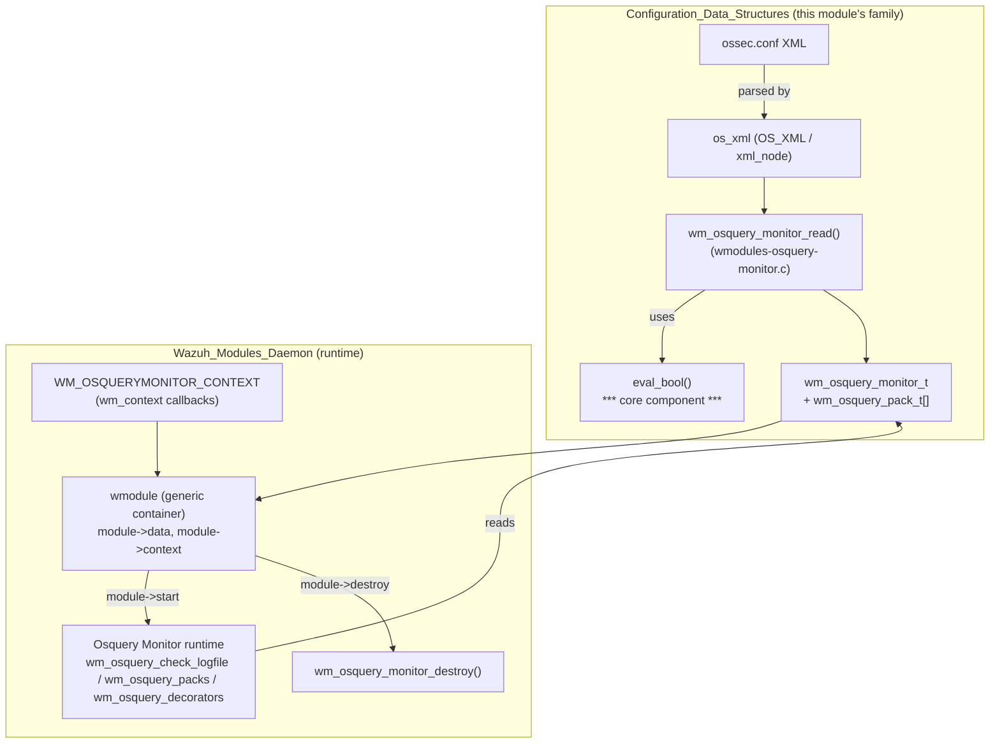
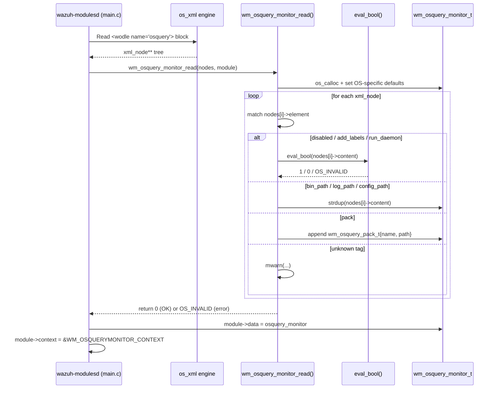
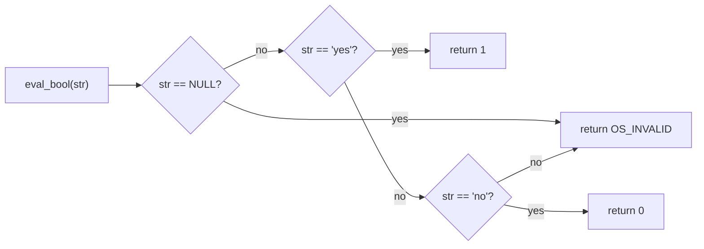

# Wmodules_Config_osquery_monitor

## Introduction

The **Wmodules_Config_osquery_monitor** module implements the XML-configuration parser for the **Osquery Monitor** wodle (`osquery` module) of the Wazuh agent/manager. It is a small, focused C translation unit — `src/config/wmodules-osquery-monitor.c` — responsible for reading the `<wodle name="osquery">` block from `ossec.conf`, validating its tags, and populating the in-memory `wm_osquery_monitor_t` configuration structure that the Osquery Monitor runtime module (`wm_osquery_monitor.c`, part of `wazuh_modules_core`) uses to detect, launch, and consume events from an external `osqueryd` process.

This module is one of several sibling parsers under the **Wmodules_Config** family (`Wmodules_Config_agent_upgrade`, `Wmodules_Config_gcp`, `Wmodules_Config_sca`), all of which follow the same architectural pattern: parse XML nodes into module-specific configuration structs that are attached to a generic `wmodule` runtime container.

## Purpose and Core Functionality

The sole core component of this module is:

- **`eval_bool(const char *str)`** — a small helper that converts a "yes"/"no" XML tag string into a tri-state value (`1`, `0`, or `OS_INVALID`). It is used pervasively throughout the parsing logic to validate boolean configuration tags.

The file also defines (though not listed as a "core component" per se) the primary entry point `wm_osquery_monitor_read()`, which:

1. Allocates and zero-initializes a `wm_osquery_monitor_t` structure.
2. Sets OS-specific default paths for the osquery binary, results log, and configuration file (Windows vs. Unix-like paths differ).
3. Iterates over the XML nodes (`xml_node **nodes`) supplied by the generic XML reader (`os_xml`), matching each node's `element` name against known tags:
   - `disabled` — enable/disable the module (`eval_bool`)
   - `bin_path` — path to the `osqueryd` binary
   - `log_path` — path to the results log that Wazuh tails
   - `config_path` — path to the osquery configuration file
   - `pack` — repeated tag defining named osquery query packs (validates the `name` attribute)
   - `add_labels` — whether to inject Wazuh agent labels into pack results (`eval_bool`)
   - `run_daemon` — whether Wazuh should spawn/manage the `osqueryd` process itself (`eval_bool`)
4. Rejects unknown tags with a warning, and returns `OS_INVALID` on malformed input (missing element name, invalid boolean, malformed `pack` attribute).
5. Attaches the parsed configuration to the generic `wmodule` container via `module->data`, and binds the module's `context` to `WM_OSQUERYMONITOR_CONTEXT` (the callback table used by the wazuh-modulesd runtime dispatcher).

## Architecture and Component Relationships

The osquery-monitor configuration parser sits between two layers:

- **Upstream**: the generic XML parsing infrastructure (`os_xml`) that turns raw `ossec.conf` text into a tree of `xml_node` structures, and the `wmodules.c` dispatcher (part of `wazuh_modules_core`) that calls `wm_osquery_monitor_read()` when it encounters a `<wodle name="osquery">` block.
- **Downstream**: the `wm_osquery_monitor_t` struct and `wm_osquery_pack_t` array it produces, which are consumed by the Osquery Monitor runtime logic (`wm_osquery_check_logfile`, `wm_osquery_decorators`, `wm_osquery_packs`, and `wm_osquery_monitor_destroy` in `src/wazuh_modules/wm_osquery_monitor.c`) once wazuh-modulesd starts the module thread.



### Key Data Structures

| Structure | Defined in | Role |
|---|---|---|
| `wm_osquery_monitor_t` | `wm_osquery_monitor.h` | Holds `bin_path`, `log_path`, `config_path`, `disable`, `msg_delay`, `queue_fd`, `add_labels`, `run_daemon`, and the `packs` array. This is the parsed configuration consumed at runtime. |
| `wm_osquery_pack_t` | `wm_osquery_monitor.h` | A single `{name, path}` pair describing one osquery query pack declared via `<pack name="...">path</pack>`. |
| `xml_node` | `os_xml.h` | Generic XML element representation (`element`, `content`, `attributes`, `values`) fed into the parser by the shared `os_xml` engine. |
| `wmodule` / `wm_context` | `wmodules_def.h` | Generic wodle container and its function-pointer table (`start`, `destroy`, `dump`, `sync`, `stop`, `query`) — the parser wires `module->data` and `module->context` so the wazuh-modulesd daemon can drive the osquery monitor generically alongside all other wodles. |

## Data Flow / Parsing Process



## `eval_bool` Logic



This exact tri-state pattern (`eval_bool`) is duplicated with the same semantics across the other `Wmodules_Config` sibling files (`wmodules-gcp.c`, `wmodules-sca.c`, `authd-key-request-config.c`, `rootcheck-config.c`, `wazuh_db-config.c`), reflecting a common, lightweight convention for boolean XML tags used throughout the Wazuh configuration codebase rather than a single shared utility function.

## Integration with the Wider System

- **Parent context**: This file belongs to the `Wmodules_Config` group inside the broader **Configuration_Data_Structures_(C_Headers)** module, alongside parsers for other wodles (`wmodules-agent-upgrade.c`, `wmodules-gcp.c`, `wmodules-sca.c`).
- **Runtime consumer**: The parsed `wm_osquery_monitor_t` is used by the Osquery Monitor implementation in **Wazuh_Modules_Daemon_(C)** (`wazuh_modules_core` sub-module), specifically `wm_osquery_check_logfile`, `wm_osquery_decorators`, `wm_osquery_packs`, and cleaned up via `wm_osquery_monitor_destroy`.
- **Generic module dispatch**: Like all wodles, the osquery monitor is registered and driven through the generic `wmodule`/`wm_context` abstraction defined in `wmodules_def.h` and orchestrated by `src/wazuh_modules/main.c` (`wm_cleanup`, `wm_handler`).
- **Shared XML infrastructure**: Parsing depends on the `os_xml` engine (`OS_XML`, `xml_node`) documented as part of the native daemon shared code (see `Agent_&_Manager_Native_Daemons_(C)` → `os_xml`).
- **Related sibling docs**: For comparable configuration parsers, see documentation for `Wmodules_Config_agent_upgrade`, `Wmodules_Config_gcp`, and `Wmodules_Config_sca`. For the runtime behavior of osquery monitoring (log tailing, decorators, pack execution), refer to the `Wazuh_Modules_Daemon_(C)` module documentation.

## Configuration Reference

Example `ossec.conf` block this parser handles:

```xml
<wodle name="osquery">
  <disabled>no</disabled>
  <run_daemon>yes</run_daemon>
  <bin_path>/usr/bin/osqueryd</bin_path>
  <log_path>/var/log/osquery/osqueryd.results.log</log_path>
  <config_path>/etc/osquery/osquery.conf</config_path>
  <add_labels>yes</add_labels>
  <pack name="incident-response">/usr/share/osquery/packs/incident-response.conf</pack>
</wodle>
```

| Tag | Meaning | Validation |
|---|---|---|
| `disabled` | Enable/disable the module | Must be `yes`/`no` via `eval_bool`; invalid value aborts parsing |
| `bin_path` | Path to `osqueryd` executable | Free-text path; on Windows rejects UNC/network paths |
| `log_path` | Path to osquery results log to monitor | Free-text path; on Windows rejects UNC/network paths |
| `config_path` | Path to osquery's own config file | Free-text path; on Windows rejects UNC/network paths |
| `pack` (repeatable) | Named osquery query pack | Requires a `name` XML attribute; content is the pack file path |
| `add_labels` | Inject Wazuh labels into pack output | Must be `yes`/`no` |
| `run_daemon` | Whether Wazuh manages the `osqueryd` process lifecycle | Must be `yes`/`no` |

## Error Handling

- A `NULL` `nodes[i]->element` immediately fails parsing (`OS_INVALID`) via `merror(XML_ELEMNULL)`.
- Invalid boolean content for `disabled`, `add_labels`, or `run_daemon` logs a `merror` and aborts (`OS_INVALID`).
- A `pack` tag without attributes, or with an attribute name other than `name`, aborts parsing.
- Unknown/unsupported tags produce a non-fatal `mwarn` and parsing continues.
- On Windows, paths pointing to network locations (UNC paths) trigger a `mwarn(NETWORK_PATH_CONFIGURED, ...)` and the tag is skipped (existing value retained).

## Summary

`Wmodules_Config_osquery_monitor` is a narrowly-scoped but structurally representative example of Wazuh's wodle configuration pattern: it bridges generic XML parsing (`os_xml`) into a strongly-typed configuration object (`wm_osquery_monitor_t`) consumed by the corresponding runtime module in the `wazuh_modules_core` group. Its `eval_bool` helper embodies the recurring lightweight tri-state boolean parsing convention shared — by duplication, not by common linkage — across all `Wmodules_Config` parsers.
