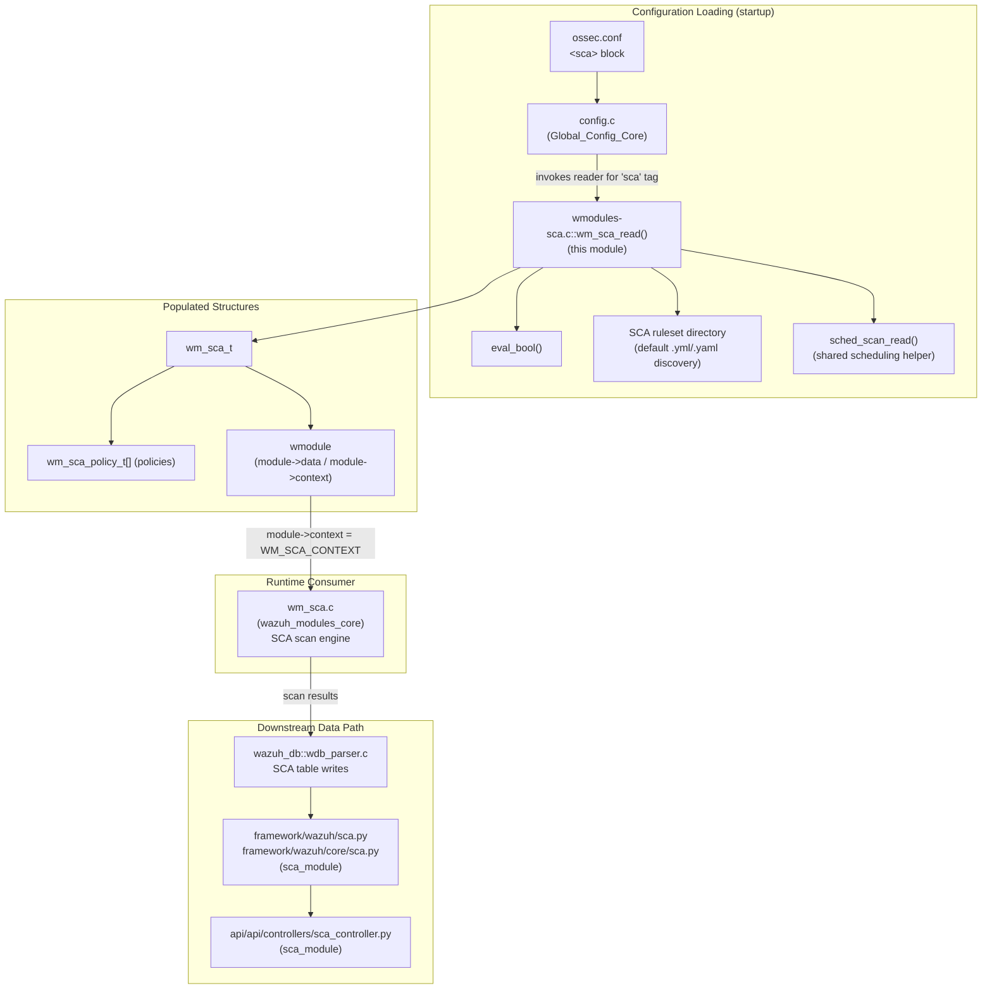
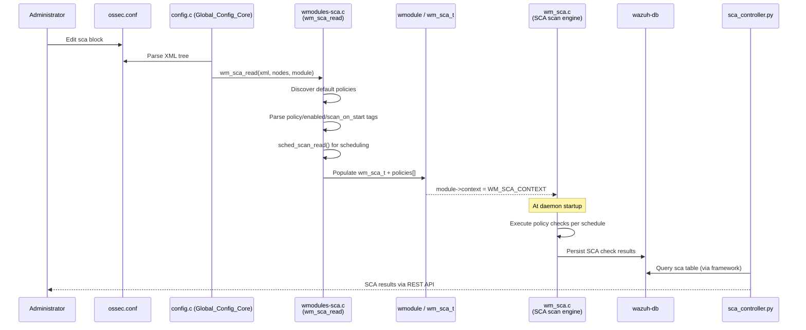
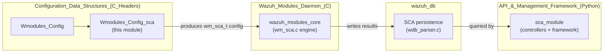

# Wmodules_Config_sca

## Introduction

`Wmodules_Config_sca` is the **configuration parser** for the Security Configuration Assessment (SCA) module of the Wazuh agent/manager. It is implemented entirely in `src/config/wmodules-sca.c` and is responsible for reading the `<sca>` block of `ossec.conf`, discovering SCA policy files (both the default ruleset shipped with Wazuh and any manager-pushed / user-defined policies), and populating the in-memory configuration structures (`wm_sca_t` and `wm_sca_policy_t`) that are later consumed by the SCA runtime module (`wm_sca.c`).

This module is a leaf node in the broader **Configuration Data Structures (C Headers)** module tree, specifically a child of `Wmodules_Config`, sitting alongside sibling configuration parsers such as `Wmodules_Config_agent_upgrade`, `Wmodules_Config_gcp`, and `Wmodules_Config_osquery_monitor`. It has no children of its own.

Because this module only *parses configuration*, it has no independent runtime behavior — its output (a populated `wm_sca_t` structure attached to a `wmodule`) is what drives the actual SCA scanning behavior implemented elsewhere. Understanding this module therefore requires understanding both "upstream" (the generic module/XML parsing infrastructure) and "downstream" (the SCA runtime and its wazuh-db/API surface) consumers, which are documented in sibling files referenced throughout this document.

## Purpose and Responsibilities

The single translation unit `wmodules-sca.c` exposes one primary entry point:

- **`wm_sca_read(const OS_XML *xml, xml_node **nodes, wmodule *module)`** — the XML configuration reader registered for the `sca` wodle. It is invoked by the generic Wazuh configuration loader (`src/config/config.c`) whenever an `<sca>` block is encountered in `ossec.conf`.

Its responsibilities are:

1. **Lazy initialization** of the `wm_sca_t` structure on first invocation, setting sane defaults (`enabled = 1`, `scan_on_start = 1`, `skip_nfs = 1`, empty policy list, scheduling defaults via `sched_scan_init`).
2. **Default policy discovery** — scanning the well-known SCA ruleset directory (`SECURITY_CONFIGURATION_ASSESSMENT_DIR` / `..._DIR_WIN`) for `.yml`/`.yaml` files and auto-registering them as enabled policies, while avoiding duplicate registration across multiple configuration blocks.
3. **Legacy filename filtering** — silently ignoring any policy file names that match a hard-coded list of 24 deprecated/renamed CIS/ACSC/system-audit policy files (`old_policies_filenames`), preventing errors from stale configuration referencing files that no longer ship with the product.
4. **XML tag parsing** for:
   - `enabled` / `scan_on_start` / `skip_nfs` — boolean flags parsed via the local `eval_bool()` helper.
   - `policies` / `policy` — explicit policy entries, each optionally carrying an `enabled="no"` attribute, resolved to an absolute path (`realpath` / `GetFullPathName`), and merged into the existing policy array (updating `enabled` state if the same absolute path was already registered by default-discovery).
   - Scheduling tags (day/time/interval) — delegated to the shared `sched_scan_read()` helper (see `framework`/native scheduling utilities also used by other wodles).
5. **Error handling** — returns `OS_INVALID` for malformed XML (`NULL` elements, empty/too-long policy paths, unrecognized tags), causing the manager/agent to fail configuration validation (`-t` test mode) or abort startup.

## Core Data Structures

The parser populates two structures declared in `src/wazuh_modules/wm_sca.h` (part of the **Wazuh_Modules_Daemon_(C)** module — see [Wazuh_Modules_Daemon_(C).md](Wazuh_Modules_Daemon_(C).md)):

```c
typedef struct wm_sca_policy_t {
    unsigned int enabled:1;
    unsigned int remote:1;
    char *policy_path;
    char *policy_id;
    char *policy_regex_type;
} wm_sca_policy_t;

typedef struct wm_sca_t {
    int enabled;
    int scan_on_start;
    int skip_nfs;
    int msg_delay;
    unsigned int summary_delay;
    unsigned int request_db_interval;
    char* scan_time;
    wm_sca_policy_t** policies;   // NULL-terminated array
    char **alert_msg;             // pre-allocated 256-slot alert buffer
    int queue;
    int remote_commands:1;
    int commands_timeout;
    sched_scan_config scan_config;
} wm_sca_t;
```

`wm_sca_t` is attached to the generic `wmodule` struct (`module->data`) and `module->context` is set to `&WM_SCA_CONTEXT`, the dispatch table that tells the generic Wazuh Modules Daemon how to start/stop/dump this specific module (see `wmodules_def.h::wmodule` in [Wazuh_Modules_Daemon_(C).md](Wazuh_Modules_Daemon_(C).md)).

## Architecture and Module Relationships



### Relationship to Sibling Configuration Parsers

`Wmodules_Config_sca` follows the same pattern as its siblings under `Wmodules_Config`:

| Sibling module | File | Purpose |
|---|---|---|
| `Wmodules_Config_agent_upgrade` | `wmodules-agent-upgrade.c` | Parses `<agent-upgrade>` block |
| `Wmodules_Config_gcp` | `wmodules-gcp.c` | Parses `<gcp-bucket>` / `<gcp-pubsub>` blocks |
| `Wmodules_Config_osquery_monitor` | `wmodules-osquery-monitor.c` | Parses `<osquery>` block |
| **`Wmodules_Config_sca`** | `wmodules-sca.c` | Parses `<sca>` block (this module) |

Each of these is registered independently with the central configuration dispatcher in `Global_Config_Core` (`src/config/config.c`), documented in the parent [Configuration_Data_Structures_(C_Headers).md](Configuration_Data_Structures_(C_Headers).md) area.

## Parsing Flow

```mermaid
flowchart TD
    START(["wm_sca_read() called"]) --> INIT{module->data<br/>already set?}
    INIT -- No --> ALLOC["Allocate wm_sca_t<br/>Set defaults:<br/>enabled=1, scan_on_start=1,<br/>skip_nfs=1, sched_scan_init()"]
    INIT -- Yes --> SCANDIR
    ALLOC --> SCANDIR["Open default SCA ruleset directory"]
    SCANDIR --> LOOP{More files<br/>in directory?}
    LOOP -- Yes --> EXTCHK{.yml or .yaml<br/>extension?}
    EXTCHK -- No --> LOOP
    EXTCHK -- Yes --> RESOLVE["Resolve absolute path<br/>(realpath / GetFullPathName)"]
    RESOLVE --> DUPCHK{Already registered<br/>in sca->policies?}
    DUPCHK -- Yes --> LOOP
    DUPCHK -- No --> ADDPOLICY["Append new wm_sca_policy_t<br/>enabled=1, remote=0"]
    ADDPOLICY --> LOOP
    LOOP -- No --> ALERTBUF["Allocate alert_msg buffer<br/>(256 slots) if not set"]
    ALERTBUF --> NODESCHK{nodes == NULL?}
    NODESCHK -- Yes --> RETURN0(["return 0"])
    NODESCHK -- No --> FORLOOP{For each XML node}
    FORLOOP --> TAGSWITCH{element tag?}
    TAGSWITCH -- "enabled" --> EB1["eval_bool() -> sca->enabled"]
    TAGSWITCH -- "scan_on_start" --> EB2["eval_bool() -> sca->scan_on_start"]
    TAGSWITCH -- "skip_nfs" --> EB3["eval_bool() -> sca->skip_nfs"]
    TAGSWITCH -- "policies" --> POLICYBLOCK["Iterate &lt;policy&gt; children"]
    POLICYBLOCK --> LEGACYCHK{Filename matches<br/>old_policies_filenames?}
    LEGACYCHK -- Yes --> SKIP["Silently skip"]
    LEGACYCHK -- No --> PATHRESOLVE["Resolve absolute path"]
    PATHRESOLVE --> EXISTCHK{Path already<br/>in sca->policies?}
    EXISTCHK -- Yes --> UPDATEENABLED["Update enabled flag"]
    EXISTCHK -- No --> FILECHK{File exists?<br/>(IsFile)}
    FILECHK -- No --> WARN["Warn & skip"]
    FILECHK -- Yes --> APPENDPOLICY["Append new wm_sca_policy_t<br/>(sets 'remote' if under shared/ dir)"]
    TAGSWITCH -- "sched tags" --> SCHEDNOOP["No-op here<br/>(handled by sched_scan_read)"]
    TAGSWITCH -- unknown --> ERR["merror + return OS_INVALID"]
    EB1 --> FORLOOP
    EB2 --> FORLOOP
    EB3 --> FORLOOP
    UPDATEENABLED --> FORLOOP
    APPENDPOLICY --> FORLOOP
    WARN --> FORLOOP
    SKIP --> FORLOOP
    SCHEDNOOP --> FORLOOP
    FORLOOP -- done --> SCHEDCALL["sched_scan_read(&sca->scan_config, ...)"]
    SCHEDCALL --> RETURNVAL(["return sched_read result"])
```

## Component Details

### `eval_bool(const char *str)`
A small local helper that maps the XML boolean vocabulary (`"yes"` / `"no"`) to `1` / `0`, returning `OS_INVALID` for `NULL` or unrecognized strings. This same pattern (`eval_bool`) is duplicated independently in several sibling configuration files (`wmodules-gcp.c`, `wmodules-osquery-monitor.c`, `authd-key-request-config.c`, `rootcheck-config.c`, `wazuh_db-config.c`) — each is a local static function, not shared code, which is why each appears as its own core component across the various `Configuration_Data_Structures_(C_Headers)` child modules.

### `dirent` (directory-entry parsing)
The `dirent` struct (from the POSIX `<dirent.h>` / Wazuh's `wopendir`/`readdir` wrapper) is used to enumerate the default SCA ruleset directory. This is the same general-purpose directory-iteration pattern used throughout the C codebase (e.g., `src/logcollector/logcollector.c`, `src/remoted/manager.c`, `src/shared/file_op.c`) — see [Agent_&_Manager_Native_Daemons_(C).md](Agent_&_Manager_Native_Daemons_(C).md) for other directory-scanning consumers.

### `is_policy_old()` / `old_policies_filenames[]`
A static lookup table of 24 deprecated policy filenames (old CIS benchmarks, ACSC Office 2016, system audit files, etc.). Any configured or discovered file matching one of these names is silently skipped, allowing seamless upgrades from older Wazuh versions without configuration errors.

## Data Flow Into the Runtime System

This configuration module does not execute scans itself. Once `wm_sca_read()` returns successfully, the populated `wm_sca_t`/`wm_sca_policy_t` structures are handed off to the SCA module lifecycle functions in `wm_sca.c` (`wm_sca_start`, referenced indirectly via `WM_SCA_CONTEXT` in `wazuh_modules_core`, part of [Wazuh_Modules_Daemon_(C).md](Wazuh_Modules_Daemon_(C).md)). That runtime code:

1. Reads each YAML policy file referenced by `policy_path`.
2. Evaluates policy checks against the host.
3. Persists results through `wazuh-db` (`wdb_parser.c` SCA handlers, see [wazuh_db.md](wazuh_db.md)).
4. Exposes results through the framework/API layer:
   - `framework/wazuh/core/sca.py` (`WazuhDBQuerySCACheck` and related queries)
   - `framework/wazuh/sca.py` (`get_sca_checks`, `get_sca_list`)
   - `api/api/controllers/sca_controller.py` (`get_sca_agent`, `get_sca_checks`)

These are documented in detail in **[sca_module.md](sca_module.md)** (part of the API & Management Framework), which should be consulted for how the data produced as a consequence of this configuration ultimately becomes queryable via the Wazuh REST API.



## Dependencies

| Dependency | Location | Role |
|---|---|---|
| `wazuh_modules/wmodules.h`, `wazuh_modules/wm_sca.h` | [Wazuh_Modules_Daemon_(C).md](Wazuh_Modules_Daemon_(C).md) | Defines `wmodule`, `wm_sca_t`, `wm_sca_policy_t`, `WM_SCA_CONTEXT` |
| `sched_scan_config` / `sched_scan_read()` / `sched_scan_init()` | `src/headers/schedule_scan.h`, `src/shared/schedule_scan.c` ([Agent_&_Manager_Native_Daemons_(C).md](Agent_&_Manager_Native_Daemons_(C).md)) | Shared scan-scheduling parser reused by nearly all wodle configuration readers |
| `OS_XML`, `xml_node`, `OS_GetElementsbyNode`, `OS_ClearNode` | `src/os_xml/os_xml.c/.h` ([Agent_&_Manager_Native_Daemons_(C).md](Agent_&_Manager_Native_Daemons_(C).md)) | Generic XML tree parsing infrastructure used by *every* configuration reader in the codebase |
| `IsFile`, `wopendir` | `src/shared/file_op.c` | File-system existence checks and directory opening wrappers |
| `find_string_in_array` | shared string utilities | Used by `is_policy_old()` for legacy filename matching |

## How This Fits Into the Larger System



For the runtime scanning engine that consumes this configuration, see **[Wazuh_Modules_Daemon_(C).md](Wazuh_Modules_Daemon_(C).md)**.
For the API/query layer that ultimately surfaces SCA results derived from this configuration, see **[sca_module.md](sca_module.md)**.
For the shared XML/scheduling parsing infrastructure reused by this and all other wodle configuration readers, see **[Agent_&_Manager_Native_Daemons_(C).md](Agent_&_Manager_Native_Daemons_(C).md)**.
For sibling configuration parsers within the same C header/config area, see **[Configuration_Data_Structures_(C_Headers).md](Configuration_Data_Structures_(C_Headers).md)**.

## Summary

`Wmodules_Config_sca` is a narrowly-scoped but important piece of the Wazuh configuration subsystem: it is the sole translator between the human-authored XML in `ossec.conf` and the strongly-typed `wm_sca_t`/`wm_sca_policy_t` structures that drive Security Configuration Assessment scanning. Its key responsibilities — default-policy auto-discovery, legacy-filename filtering, boolean/attribute parsing, and delegation to shared scheduling logic — make SCA configuration robust across upgrades while keeping the parsing logic itself simple, single-file, and dependency-light (relying only on the shared XML, file-system, and scheduling utilities common to all Wazuh wodle configuration readers).
