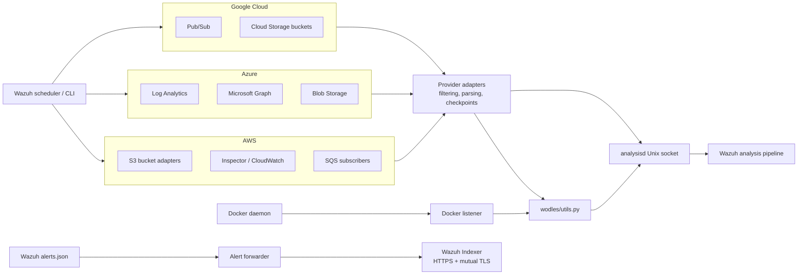
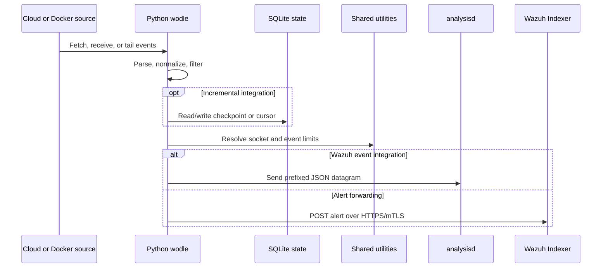

# Wodles – Cloud Integration Services (Python)

## Purpose

This module contains Python-based integrations that collect events from AWS, Azure, Google Cloud, Docker, and local Wazuh alert files. It normalizes provider data, maintains incremental-processing state where required, and forwards events either to Wazuh `analysisd` through Unix datagram sockets or to the Wazuh Indexer over HTTPS.

Shared runtime behavior is provided by `wodles/utils.py`, including Wazuh installation discovery, metadata lookup, the `analysisd` socket path, and event-size limits.

## Architecture

### Provider processing flow

## Core components

- **AWS core** – Dispatches S3, service, and SQS modes; handles credentials, retries, filtering, SQLite state, and Wazuh event delivery.
- **AWS S3 buckets** – Traverses buckets and parses CloudTrail, Config, GuardDuty, network, access, WAF, and Cisco Umbrella logs.
- **AWS services** – Collects events from AWS Inspector and CloudWatch Logs.
- **AWS subscribers** – Processes S3 notifications from SQS, including Security Hub and Security Lake events.
- **Azure services** – Integrates Log Analytics, Microsoft Graph, and Azure Blob Storage.
- **Azure utilities and database** – Provide argument parsing, OAuth authentication, event delivery, time-window handling, and persistent processing cursors.
- **Google Cloud core** – Dispatches Pub/Sub and Cloud Storage access-log modes, validates permissions, and manages bounded processing.
- **Google Cloud buckets** – Parses Cloud Storage access logs with checkpointing and optional object deletion.
- **Docker listener** – Watches Docker daemon events, reconnects when required, formats events, and sends them to Wazuh.
- **Alert forwarder** – Tails the local JSON-lines alert file and indexes new alerts in the Wazuh Indexer.
- **Wodles utilities** – Supplies installation metadata, `analysisd` socket location, and the shared `MAX_EVENT_SIZE` limit.

## Core component documentation

- [Alert Forwarder](alert_forwarder.md)
- [AWS core](aws_core.md)
- [AWS S3 bucket ingestion](aws_buckets_s3.md)
- [AWS services](aws_services.md)
- [AWS subscribers](aws_subscribers.md)
- [Azure services](azure_services.md)
- [Azure utilities](azure_utils.md)
- [Azure database](azure_db.md)
- [Docker listener](docker_listener.md)
- [Google Cloud buckets](gcloud_buckets.md)
- [Google Cloud core](gcloud_core.md)
- [Wodles utilities](wodles_utils.md)