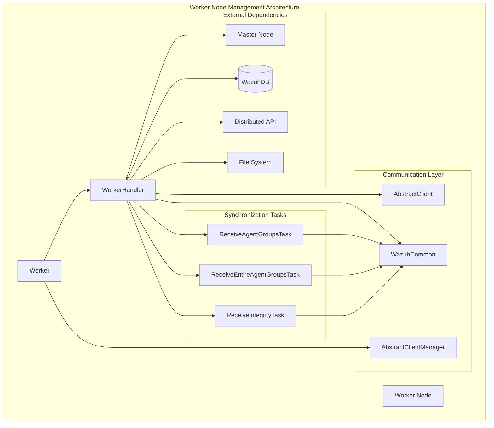
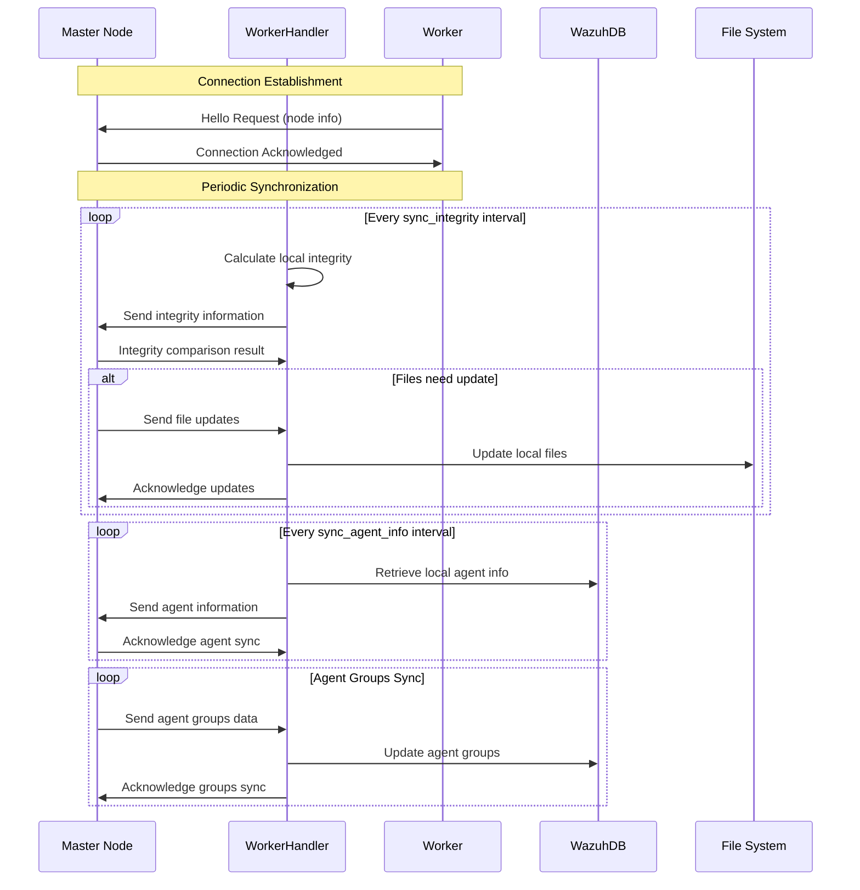
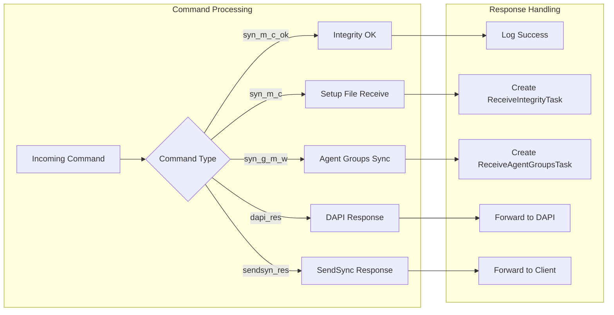

# Worker Node Management

## Overview

The Worker Node Management module is a critical component of Wazuh's distributed cluster architecture that handles the worker node's role in a multi-node cluster environment. This module manages synchronization processes, communication with the master node, and maintains data consistency across the cluster infrastructure.

Worker nodes serve as secondary nodes in the cluster that receive configuration updates, integrity checks, and agent information from the master node while providing distributed processing capabilities and high availability for the Wazuh security platform.

## Architecture

The Worker Node Management module follows a client-server architecture pattern where worker nodes act as clients connecting to a master node server. The module implements asynchronous communication protocols and task-based synchronization mechanisms.



## Core Components

### Worker
**Location**: `framework.wazuh.core.cluster.worker.Worker`

The main worker node manager that initializes worker variables, establishes connection to the master node, and manages the distributed API request queue.

**Key Responsibilities**:
- Initialize worker node configuration and metadata
- Manage connection lifecycle with master node
- Coordinate synchronization tasks
- Handle distributed API requests
- Maintain integrity control information

**Key Methods**:
- `add_tasks()`: Defines infinite loop tasks for integrity sync, agent info sync, and DAPI processing
- `get_node()`: Returns basic worker node information for API calls

### WorkerHandler
**Location**: `framework.wazuh.core.cluster.worker.WorkerHandler`

Handles the communication protocol and message processing between worker and master nodes. Extends both `AbstractClient` and `WazuhCommon` to provide cluster-specific functionality.

**Key Responsibilities**:
- Process commands from master node
- Manage synchronization task lifecycle
- Handle integrity checks and file synchronization
- Process agent information updates
- Forward distributed API requests and responses

**Key Methods**:
- `process_request()`: Processes incoming commands from master
- `sync_integrity()`: Performs periodic integrity synchronization
- `sync_agent_info()`: Synchronizes agent information with master
- `process_files_from_master()`: Handles file updates from master

### ReceiveAgentGroupsTask
**Location**: `framework.wazuh.core.cluster.worker.ReceiveAgentGroupsTask`

Handles periodic agent groups synchronization from the master node. This task processes incremental updates to agent group configurations.

**Key Responsibilities**:
- Receive agent groups chunks from master
- Process periodic agent group updates
- Maintain synchronization locks
- Update local agent group information

### ReceiveEntireAgentGroupsTask
**Location**: `framework.wazuh.core.cluster.worker.ReceiveEntireAgentGroupsTask`

Manages complete agent groups synchronization when full refresh is required. This task handles bulk agent group data transfers.

**Key Responsibilities**:
- Receive complete agent groups data from master
- Process full agent group synchronization
- Recalculate group hashes after synchronization
- Handle bulk data updates

### ReceiveIntegrityTask
**Location**: `framework.wazuh.core.cluster.worker.ReceiveIntegrityTask`

Processes integrity information received from the master node to maintain file system consistency across cluster nodes.

**Key Responsibilities**:
- Receive integrity files from master
- Process file synchronization requirements
- Update local files based on integrity checks
- Handle file creation, updates, and deletions

## Data Flow



## Synchronization Processes

### Integrity Synchronization
The worker node periodically calculates and sends file integrity information to the master node:

1. **File Status Calculation**: Worker calculates BLAKE2b hashes for monitored files
2. **Integrity Comparison**: Master compares worker's integrity with its own
3. **File Synchronization**: If differences exist, master sends updated files
4. **Local Updates**: Worker updates local files and maintains permissions

### Agent Information Synchronization
Worker nodes synchronize agent data with the master:

1. **Agent Data Retrieval**: Worker queries local WazuhDB for agent information
2. **Data Transmission**: Agent data is sent to master's WazuhDB
3. **Synchronization Tracking**: Process tracks sync requirements and status

### Agent Groups Synchronization
Two types of agent groups synchronization:

1. **Periodic Sync**: Incremental updates for agent group changes
2. **Complete Sync**: Full agent groups data refresh when checksums mismatch

## Communication Protocol



## Error Handling and Recovery

### Connection Management
- **Automatic Reconnection**: Worker automatically reconnects to master if connection is lost
- **Keep-Alive Mechanism**: Regular heartbeat messages maintain connection health
- **Graceful Degradation**: Worker continues local operations during master unavailability

### Synchronization Error Recovery
- **Task Cleanup**: Failed synchronization tasks are properly cleaned up
- **File Rollback**: Incomplete file updates are rolled back to maintain consistency
- **Retry Logic**: Failed operations are retried with exponential backoff

### Checksum Validation
- **Mismatch Detection**: Worker detects agent groups checksum mismatches
- **Automatic Recovery**: Requests complete resynchronization when mismatch limit exceeded
- **Counter Reset**: Successful validations reset mismatch counters

## Integration Points

### Database Connectivity
- **WazuhDB Integration**: Uses [Database Connectivity](Database%20Connectivity.md) for local database operations
- **Async Operations**: Leverages `AsyncWazuhDBConnection` for non-blocking database access

### Distributed API
- **DAPI Integration**: Integrates with [Distributed API](Distributed%20API.md) for request forwarding
- **Request Queue**: Manages API request queues for distributed processing

### Common Communication Framework
- **Shared Components**: Utilizes [Common Communication Framework](Common%20Communication%20Framework.md) for base communication protocols
- **Task Management**: Extends common task classes for worker-specific functionality

### Master Node Coordination
- **Master Integration**: Coordinates with [Master Node Management](Master%20Node%20Management.md) for cluster operations
- **Bidirectional Communication**: Maintains two-way communication for synchronization and control

## Configuration

### Worker Configuration Parameters
```python
{
    "intervals": {
        "worker": {
            "sync_integrity": 300,        # Integrity sync interval (seconds)
            "sync_agent_info": 60,        # Agent info sync interval (seconds)
            "timeout_agent_groups": 30,   # Agent groups timeout (seconds)
            "keep_alive": 60,             # Keep-alive interval (seconds)
            "connection_retry": 10,       # Connection retry interval (seconds)
            "max_failed_keepalive_attempts": 3,  # Max failed keep-alive attempts
            "agent_groups_mismatch_limit": 3     # Agent groups mismatch limit
        }
    }
}
```

### Task Loggers
The worker maintains separate loggers for different synchronization processes:
- **Agent-info sync**: Logs agent information synchronization
- **Agent-groups recv**: Logs periodic agent groups reception
- **Agent-groups recv full**: Logs complete agent groups reception
- **Integrity check**: Logs integrity verification processes
- **Integrity sync**: Logs file synchronization operations

## Performance Considerations

### Asynchronous Operations
- **Non-blocking I/O**: All network and database operations use async/await patterns
- **Concurrent Tasks**: Multiple synchronization tasks run concurrently
- **Task Pooling**: CPU-intensive operations use thread pools

### Resource Management
- **Memory Optimization**: Large data transfers use chunked processing
- **File Handling**: Temporary files are properly cleaned up
- **Connection Pooling**: Database connections are efficiently managed

### Scalability Features
- **Configurable Intervals**: Synchronization frequencies can be tuned for performance
- **Batch Processing**: Agent data is processed in batches for efficiency
- **Compression**: File transfers use compression to reduce network overhead

## Security Considerations

### Encrypted Communication
- **Fernet Encryption**: All cluster communication uses Fernet symmetric encryption
- **SSL/TLS Support**: Optional SSL/TLS encryption for transport security
- **Key Management**: Secure key distribution and rotation

### Access Control
- **Node Authentication**: Worker nodes authenticate with master using cluster keys
- **Command Validation**: All incoming commands are validated before processing
- **File Permissions**: Synchronized files maintain proper ownership and permissions

### Data Integrity
- **Checksum Verification**: File integrity verified using BLAKE2b hashes
- **Atomic Operations**: File updates are performed atomically
- **Rollback Capability**: Failed updates can be rolled back to maintain consistency

## Monitoring and Observability

### Logging Framework
- **Structured Logging**: Uses [Logging System](Logging%20System.md) for comprehensive logging
- **Task-specific Loggers**: Separate loggers for different synchronization processes
- **Performance Metrics**: Logs timing information for synchronization operations

### Health Monitoring
- **Connection Status**: Monitors connection health with master node
- **Synchronization Status**: Tracks success/failure of sync operations
- **Resource Usage**: Monitors memory and CPU usage during operations

### Debugging Support
- **Detailed Error Messages**: Comprehensive error reporting with context
- **Task Tracking**: Unique task IDs for tracking synchronization processes
- **State Information**: Maintains detailed state information for troubleshooting

## Troubleshooting

### Common Issues

1. **Connection Failures**
   - Check network connectivity to master node
   - Verify cluster configuration and keys
   - Review firewall and port settings

2. **Synchronization Delays**
   - Monitor network bandwidth and latency
   - Check database performance
   - Review synchronization interval settings

3. **File Synchronization Errors**
   - Verify file system permissions
   - Check available disk space
   - Review integrity check logs

4. **Agent Groups Mismatch**
   - Monitor checksum validation logs
   - Check database consistency
   - Review agent groups configuration

### Diagnostic Commands
- Monitor worker status through cluster API endpoints
- Review synchronization logs for error patterns
- Check database connectivity and performance
- Verify file system integrity and permissions

## Future Enhancements

### Planned Improvements
- **Enhanced Compression**: Improved compression algorithms for file transfers
- **Parallel Synchronization**: Concurrent synchronization of different data types
- **Smart Retry Logic**: Adaptive retry mechanisms based on error types
- **Performance Optimization**: Further optimization of synchronization algorithms

### Extensibility
- **Plugin Architecture**: Support for custom synchronization plugins
- **Custom Handlers**: Ability to add custom command handlers
- **Monitoring Integration**: Enhanced integration with monitoring systems
- **Configuration Management**: Dynamic configuration updates without restart