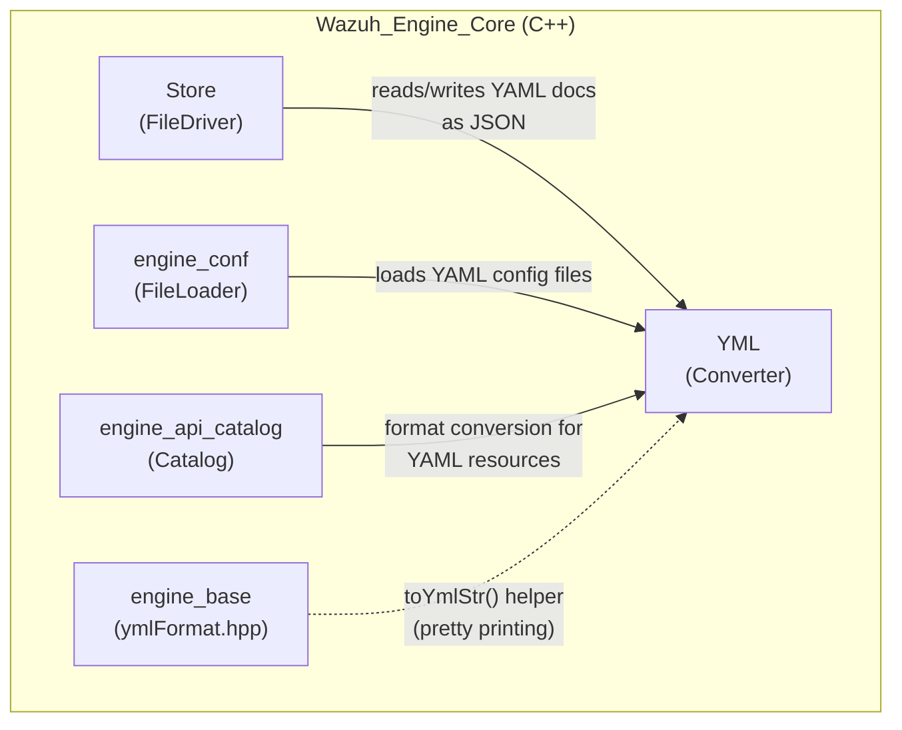
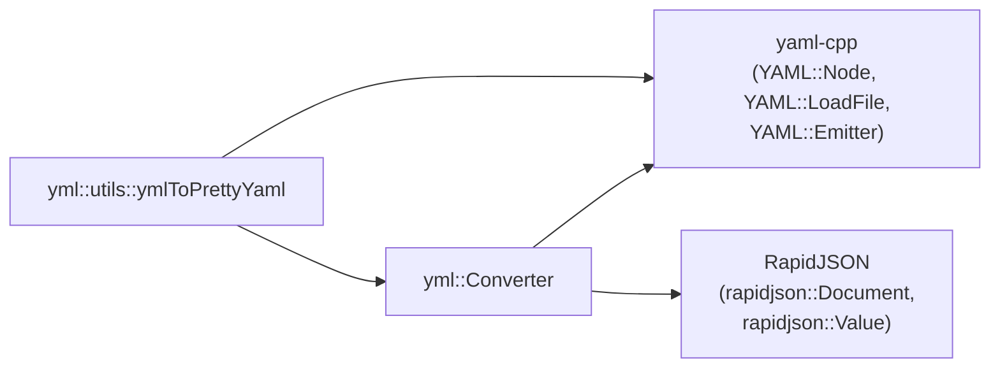
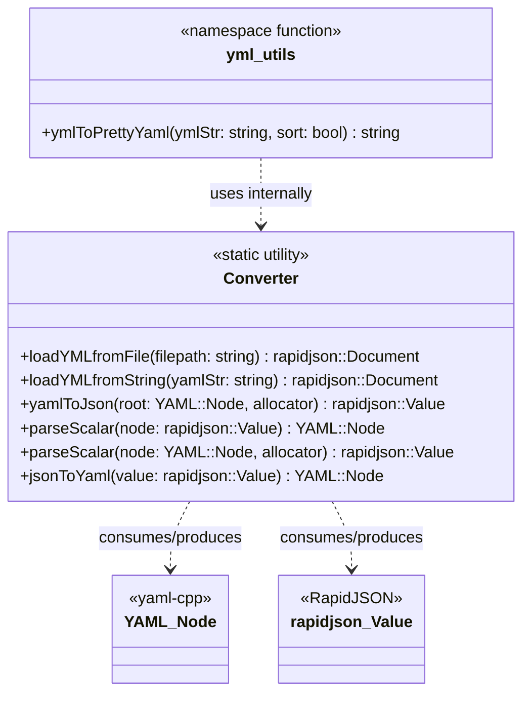
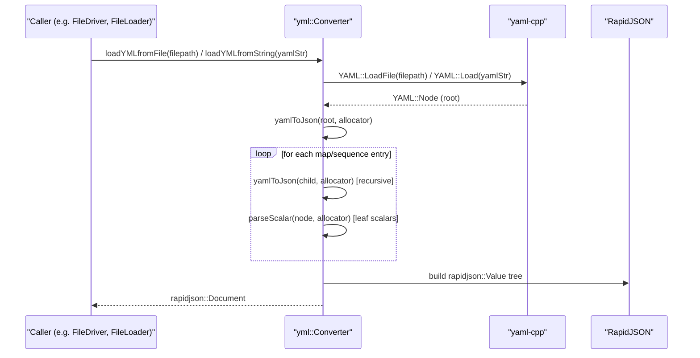
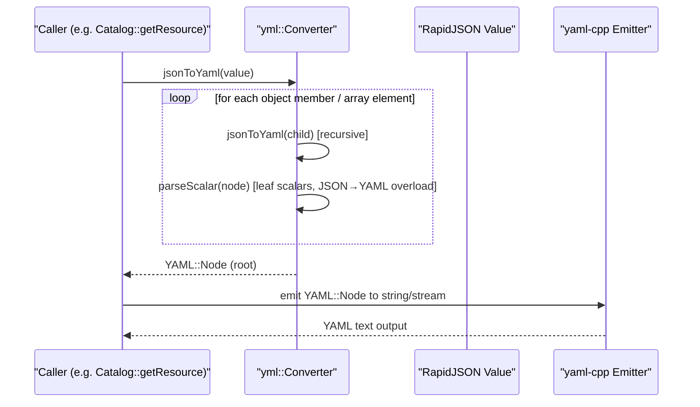
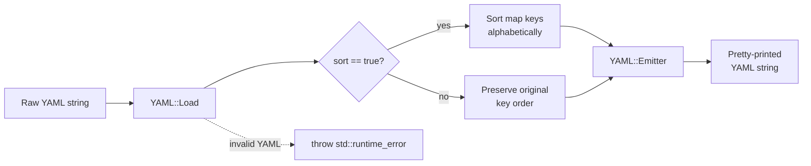
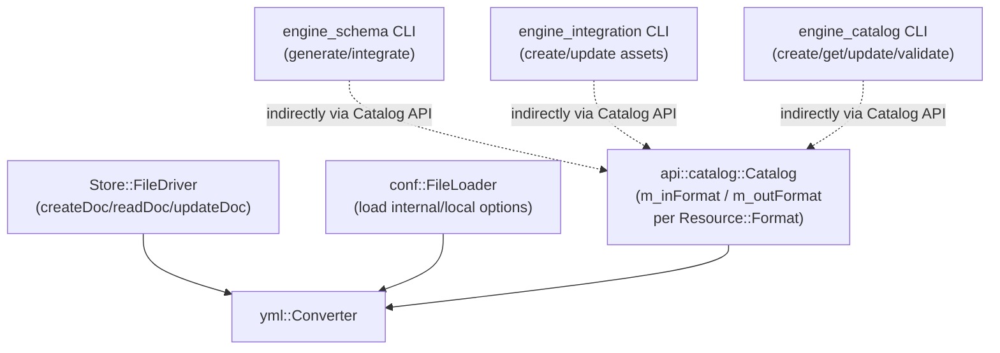
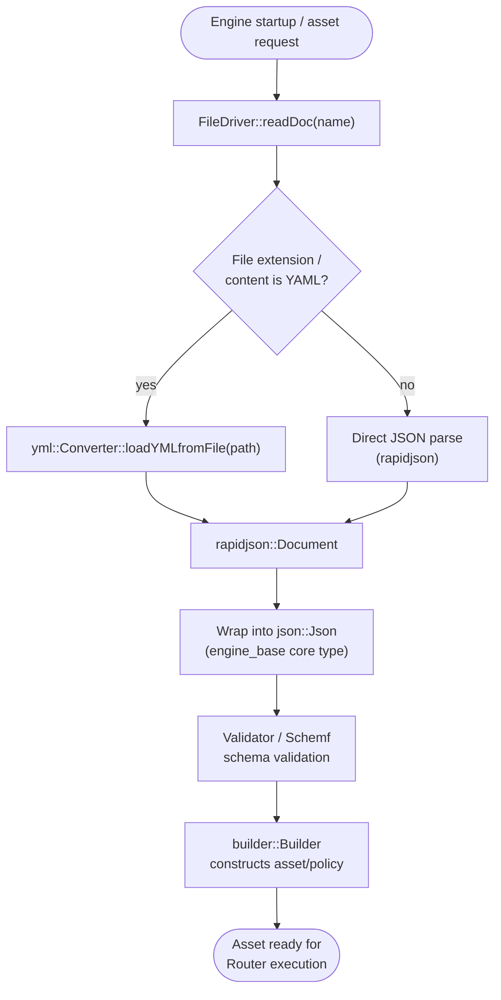

# YML — YAML/JSON Conversion Utility

## Introduction

The **YML** module is a lightweight, header-only-style C++ utility library that lives inside the
[Wazuh Engine Core](Wazuh_Engine_Core_(C++).md) source tree
(`src/engine/source/yml`). Its single responsibility is to provide **bidirectional conversion
between YAML and JSON representations**, bridging the gap between human-friendly YAML
configuration/asset files and the RapidJSON-based (`rapidjson::Document`/`Value`) in-memory model
that the rest of the Engine uses internally (via the engine's own `json::Json` wrapper and
`rapidjson`).

Although small in surface area, this module is a **foundational cross-cutting utility**: almost
every subsystem that needs to read a YAML file from disk (decoders, rules, policies, schemas,
configuration files) or needs to present internal JSON data back to a user/CLI as YAML depends,
directly or indirectly, on the `yml::Converter` class documented here.

## Purpose and Core Functionality

The module exposes a single static-method class, `yml::Converter`, plus a small `yml::utils`
namespace with a convenience formatting helper:

| Component | Responsibility |
|---|---|
| `Converter::loadYMLfromFile` | Parses a YAML file from disk (via `YAML::LoadFile`) and converts the resulting `YAML::Node` tree into a `rapidjson::Document`. |
| `Converter::loadYMLfromString` | Same as above, but the source is an in-memory YAML string instead of a file path. |
| `Converter::yamlToJson` | Recursively walks a `YAML::Node` (map, sequence, or scalar) and builds an equivalent `rapidjson::Value` using the caller-supplied allocator. |
| `Converter::parseScalar` (YAML → JSON overload) | Converts a single YAML scalar node into a `rapidjson::Value`, inferring type (bool, int, double, string) from the scalar tag/content. |
| `Converter::parseScalar` (JSON → YAML overload) | Converts a single RapidJSON scalar `Value` into a `YAML::Node`, preserving type information using the `!` (`QUOTED_TAG`) tag where needed to force string quoting. |
| `Converter::jsonToYaml` | Recursively walks a `rapidjson::Value` (object, array, or scalar) and builds an equivalent `YAML::Node` tree. |
| `yml::utils::ymlToPrettyYaml` | Convenience function that parses a raw YAML string and re-emits it as a normalized, "pretty-printed" YAML string, optionally sorting map keys alphabetically. Throws `std::runtime_error` on invalid input. |

Internally the module relies on two well-known third-party libraries:

* **`yaml-cpp`** — for parsing/emitting YAML (`YAML::Node`, `YAML::LoadFile`, `YAML::Emitter`).
* **RapidJSON** — for the JSON side of the conversion (`rapidjson::Document`, `rapidjson::Value`,
  `rapidjson::StringBuffer`, `rapidjson::Writer`).

This makes `yml::Converter` effectively an **adapter/bridge** between two independent data-model
libraries, isolating the rest of the Engine codebase from having to know about `yaml-cpp` at all
(most consumers only interact with the resulting `rapidjson`/`json::Json` structures).

## Architecture

### Position within the Wazuh Engine Core

### External Dependencies

## Class Diagram

## Data Flow

### YAML File/String → JSON (ingestion path)

This is the most common flow, used whenever the Engine needs to load a YAML asset (decoder,
rule, policy, schema, or configuration file) into its internal JSON-based document model.

### JSON → YAML (presentation / export path)

Used when internal JSON content must be surfaced back to a human or a file as YAML — for example
when the [`engine_api_catalog`](Wazuh_Engine_Core_(C++).md) exposes a
stored asset in YAML format, or when CLI tools such as
[`engine_catalog`](Engine_Administration_CLI_Tools_(Python).md) request
a resource dump.

### Pretty-print / normalization flow (`ymlToPrettyYaml`)

## Component Interaction — Where YML Is Consumed

The `yml::Converter` class is a low-level utility with no state and no dependencies on other
Engine subsystems, which makes it easy to reuse across many higher-level components:

Key consumers, with links to their own documentation:

* **[Store (`FileDriver`)](Wazuh_Engine_Core_(C++).md)** — the on-disk
  document store driver reads and writes catalog assets (decoders, rules, outputs, policies)
  which may be authored in YAML; `FileDriver` uses `Converter::loadYMLfromFile` /
  `Converter::jsonToYaml` (or the JSON path directly) depending on the on-disk format.
* **[engine_conf (`FileLoader`)](Wazuh_Engine_Core_(C++).md)** — loads
  internal/local engine configuration option files, which are commonly expressed in YAML syntax
  and need to be parsed into the engine's option map.
* **[engine_api_catalog (`Catalog`)](Wazuh_Engine_Core_(C++).md)** — the
  Catalog API keeps a table of format converters (`m_inFormat`/`m_outFormat`) keyed by
  `Resource::Format`; the YAML entries in that table are implemented on top of
  `yml::Converter`, allowing catalog resources to be posted/read/updated in either JSON or YAML.
* **[Engine Administration CLI Tools](Engine_Administration_CLI_Tools_(Python).md)**
  (`engine_catalog`, `engine_schema`, `engine_integration`, `engine_policy`) — these Python
  command-line tools talk to the Catalog HTTP API and commonly request/submit resources in YAML
  format for human readability; the YAML↔JSON translation on the server side is performed by this
  module.
* **[engine_base (`ymlFormat.hpp`)](Wazuh_Engine_Core_(C++).md)** —
  provides a `toYmlStr` helper used for logging/tracing structures in a YAML-like format; it is
  conceptually related to (though independently implemented from) the pretty-print utility
  offered here.

## Process Flow: Typical Asset Load

A concrete, end-to-end example of how the module is used when the Engine starts up and loads a
YAML-based decoder/rule asset from the file-based store:

## Error Handling

* `loadYMLfromFile` / `loadYMLfromString` propagate `YAML::ParserException` (and related
  `yaml-cpp` exceptions) if the source content is not well-formed YAML.
* `yml::utils::ymlToPrettyYaml` explicitly wraps parsing failures and re-throws as
  `std::runtime_error`, providing a uniform error type for callers (such as CLI tools) that do not
  want to depend on `yaml-cpp` exception types directly.
* Type inference in `parseScalar` follows YAML's implicit typing rules (booleans, integers,
  floats, null, and strings) and defaults to string when no other type can be safely inferred.

## Design Notes

* The `Converter` class has **no instance state** — all methods are `static`, making the class a
  pure functional utility/namespace-like construct. There is no need to construct a `Converter`
  object.
* The module deliberately keeps the YAML tagging convention (`QUOTED_TAG = "!"`) to force
  round-trip fidelity for strings that could otherwise be misinterpreted as another scalar type
  when re-serialized from JSON back to YAML (e.g., a numeric-looking string).
* Some method declarations are marked `TODO: Delete this, should not use rapidjson` in the header,
  indicating an ongoing internal migration away from RapidJSON toward the Engine's own
  `json::Json` abstraction (see
  [engine_base — core types](Wazuh_Engine_Core_(C++).md)). Future
  refactors of this module should be expected to change the RapidJSON-facing signatures while
  preserving the YAML-facing ones.

## Related Documentation

* [Wazuh_Engine_Core_(C++)](Wazuh_Engine_Core_(C++).md) — parent module; covers
  `Store`, `engine_conf`, `engine_api` (Catalog), `engine_base`, `Schemf`, `Router`, and other
  sibling components that depend on this conversion utility.
* [Engine_Administration_CLI_Tools_(Python)](Engine_Administration_CLI_Tools_(Python).md) —
  Python CLI suite (`engine_catalog`, `engine_schema`, `engine_integration`, `engine_policy`,
  `engine_test`, etc.) that interacts with YAML-formatted resources through the Catalog API which
  is backed by this module.
