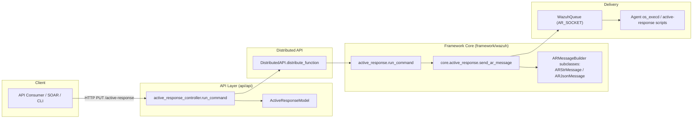
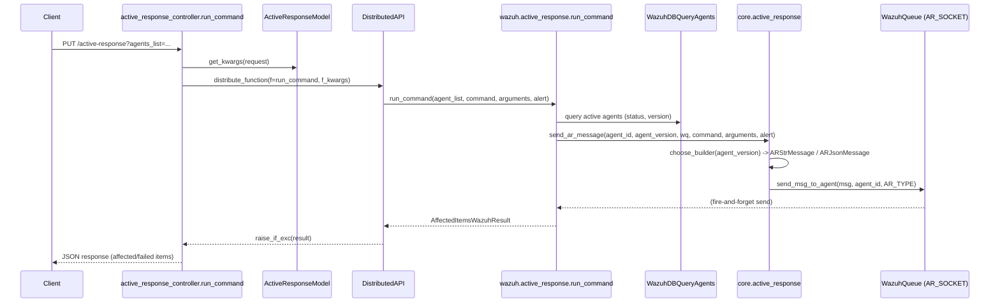
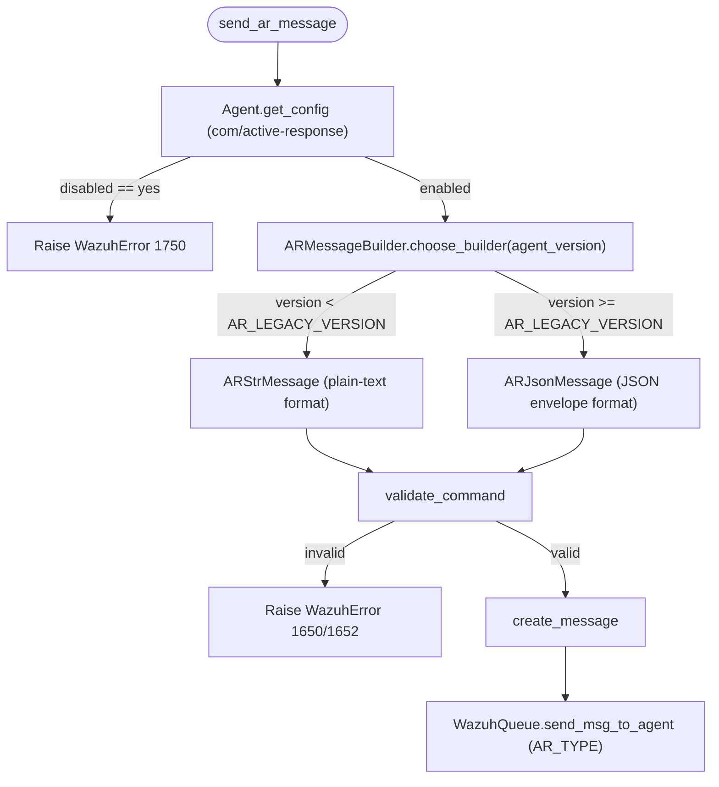

# Active Response Module

## 1. Introduction & Purpose

The **Active Response Module** implements the API-to-agent pipeline that lets a Wazuh Manager administrator (or an
automated integration) **trigger an Active Response (AR) command on one or more agents** through the REST API. Active
Response is the Wazuh mechanism used to automatically or manually react to security events (e.g., blocking an IP,
disabling an account, killing a process) by executing a predefined or custom command on the endpoint.

This module is intentionally small and focused: it bridges the **API layer** (HTTP request handling, input
validation, RBAC-based authorization) with the **framework core** (command construction, agent version compatibility,
delivery to the agent via the local Wazuh queue socket). It does **not** implement the actual command execution logic
on the agent side — that responsibility belongs to the native C daemon `src/active-response/*` and `src/os_execd`
(see [Agent_&_Manager_Native_Daemons_(C)](Agent_&_Manager_Native_Daemons_(C).md) for those components).

Typical use case: an operator (or a SOAR/orchestration tool) calls
`PUT /active-response?agents_list=001,002` with a JSON body specifying the `command`, optional `arguments`, and an
optional `alert` payload; the module validates the request, resolves the target agents, builds a version-appropriate
AR message and pushes it into the manager's AR queue socket, which `os_execd`/`ar` components on the agent side
eventually execute.

## 2. Architecture Overview

The module is organized into two cooperating layers that mirror the general Wazuh API/Framework split used across the
whole project (see [API_&_Management_Framework_(Python)](API_&_Management_Framework_(Python).md) for the umbrella
module):

- **API layer** — HTTP controller and request/response model. Handles content-type/body validation, RBAC context
  propagation, and delegates the actual work to the framework function through the Distributed API (DAPI), which is
  responsible for local/cluster execution routing.
- **Framework core layer** — Business logic that filters/validates target agents, builds an agent-version-aware AR
  message (plain string for legacy agents, JSON envelope for modern agents), and writes it to the manager's AR UNIX
  socket so it can be forwarded to the target agent(s).

### Request flow (sequence)

## 3. Core Components

Since this module is small and self-contained (4 files, 2 layers), it is documented as a single, cohesive unit rather
than split into separate sub-module pages.

### 3.1 API Layer

| Component | File | Responsibility |
|---|---|---|
| `run_command` | `api/api/controllers/active_response_controller.py` | Async Connexion controller for `PUT /active-response`. Validates the request content type, builds function kwargs from the request body plus the `agents_list` path/query parameter, and delegates execution to `wazuh.active_response.run_command` through `DistributedAPI` (broadcasting to all agents when `agents_list == '*'`). |
| `ActiveResponseModel` | `api/api/models/active_response_model.py` | Request body model (extends the shared `Body` base model — see [api_core_infrastructure_models.md](api_core_infrastructure_models.md)) describing the `command`, `arguments`, and `alert` fields accepted in the JSON payload. |

Key behaviors:
- `Body.validate_content_type` enforces `application/json` bodies.
- RBAC policies are read from `request.context['token_info']['rbac_policies']` and passed to `DistributedAPI`,
  which enforces the `active-response:command` action and `agent:id:{agent_list}` resource permissions (declared via
  the `@expose_resources` decorator on the framework function — see
  [security_rbac_module.md](security_rbac_module.md)).
- The call is routed as `request_type='distributed_master'`, meaning execution always happens on the master node,
  regardless of which node the API request was received on (cluster routing handled by
  [cluster_dapi.md](cluster_dapi.md)).

### 3.2 Framework Core Layer

| Component | File | Responsibility |
|---|---|---|
| `run_command` | `framework/wazuh/active_response.py` | Orchestrates the AR dispatch: resolves the requested agent IDs against RBAC-permitted/system agents, queries `WazuhDBQueryAgents` for `id`, `status`, and `version` of non-manager agents (`id!=000`), rejects agents that are not `active`, and calls `core.active_response.send_ar_message` for each valid agent, accumulating results into an `AffectedItemsWazuhResult` (see [framework_core_utils.md](framework_core_utils.md)). |
| `ARMessageBuilder` (abstract) | `framework/wazuh/core/active_response.py` | Strategy-pattern base class that selects a concrete message-format implementation based on the target agent's version (`choose_builder`), and centralizes command validation (`validate_command`) — rejecting empty commands or non-custom commands not present in `ossec.conf`'s AR command list (`get_commands`). |
| `ARStrMessage` | `framework/wazuh/core/active_response.py` | Builds the **legacy plain-text** AR message format (`command arg1 arg2 ...` or `command - -`) used by agents older than `common.AR_LEGACY_VERSION`. Applies `shell_escape` to each argument to neutralize shell metacharacters. |
| `ARJsonMessage` | `framework/wazuh/core/active_response.py` | Builds the **modern JSON** AR message format (used by agents `>= common.AR_LEGACY_VERSION`), wrapping the command, extra arguments, and alert data inside a standard Wazuh socket message envelope (`create_wazuh_socket_message`), including cluster node/module origin metadata (via [cluster_high_level_api.md](cluster_high_level_api.md) / [cluster_utils.md](cluster_utils.md)). |
| `send_ar_message` | `framework/wazuh/core/active_response.py` | Per-agent entry point: fetches the agent's `active-response` configuration block (`Agent.get_config`, see [agent_module.md](agent_module.md)) to check it isn't disabled, picks the correct message builder via `ARMessageBuilder.choose_builder`, and writes the resulting message to the AR socket through `WazuhQueue.send_msg_to_agent` (see [framework_core_communication.md](framework_core_communication.md)). |
| `get_commands` / `shell_escape` | `framework/wazuh/core/active_response.py` | Helper utilities: `get_commands` parses `common.AR_CONF` (the `ar.conf` file) to list valid, non-custom AR command names; `shell_escape` escapes shell-sensitive characters in command arguments before transmission. |

### 3.3 Message Format Selection

## 4. Error Handling

The module raises typed `WazuhException`/`WazuhError` instances that are aggregated per-agent into the
`AffectedItemsWazuhResult` returned to the API caller, so a partial failure (e.g., one disconnected agent) does not
abort the whole request:

- `WazuhResourceNotFound(1701)` — requested agent ID does not exist in the system.
- `WazuhError(1707)` — agent is not in `active` connection status.
- `WazuhError(1750)` — Active Response is disabled on the target agent's configuration.
- `WazuhError(1650)` — no command specified.
- `WazuhError(1652)` — command is not a custom script (`!`-prefixed) and is not listed in `ar.conf`.
- `WazuhError(1000)` — no `ARMessageBuilder` subclass can handle the agent's version (should not normally occur since
  `ARStrMessage` and `ARJsonMessage` together cover all versions).

## 5. Relationship to Other Modules

| Related Module | Relationship |
|---|---|
| [API_&_Management_Framework_(Python).md](API_&_Management_Framework_(Python).md) | Parent umbrella module; Active Response is one of its many API sub-modules following the same controller → framework → core pattern. |
| [api_core_infrastructure_models.md](api_core_infrastructure_models.md) | Provides the `Body` base class extended by `ActiveResponseModel`, plus JSON encoding/response helpers used by the controller. |
| [agent_module.md](agent_module.md) | Supplies `Agent`, `get_agents_info`, `get_rbac_filters`, and `WazuhDBQueryAgents` used to resolve and validate target agents. |
| [security_rbac_module.md](security_rbac_module.md) | Enforces the `active-response:command` RBAC action via the `@expose_resources` decorator wrapping `active_response.run_command`. |
| [cluster_dapi.md](cluster_dapi.md) | `DistributedAPI` routes the API request to the master node and executes the framework function, handling distributed/cluster concerns. |
| [cluster_high_level_api.md](cluster_high_level_api.md) / [cluster_utils.md](cluster_utils.md) | Used by `ARJsonMessage` to read cluster configuration and resolve the current node name embedded in the JSON AR message origin. |
| [framework_core_communication.md](framework_core_communication.md) | Provides `WazuhQueue`, used to physically deliver the AR message to the manager's local AR socket for forwarding to the agent. |
| [framework_core_utils.md](framework_core_utils.md) | Supplies `AffectedItemsWazuhResult` (aggregated response format) and `WazuhVersion` (used to compare agent versions when choosing a message builder). |
| [Agent_&_Manager_Native_Daemons_(C)](Agent_&_Manager_Native_Daemons_(C).md) | Contains the native C-side consumers of the AR message: `src/os_execd` (execution daemon) and `src/active-response/*` (the actual response scripts run on the agent). |

## 6. Summary

The Active Response module is a thin, well-defined vertical slice: an HTTP endpoint, a request body model, a
framework orchestration function, and a small strategy-pattern message-building core. Its main design highlights are:

1. **Backward compatibility** via the `ARMessageBuilder` strategy pattern, transparently choosing between legacy
   plain-text and modern JSON message formats based on the target agent's version.
2. **Fine-grained partial success reporting** using `AffectedItemsWazuhResult`, so a bulk request against many agents
   reports success/failure per agent rather than failing atomically.
3. **Delegation of transport concerns** entirely to `WazuhQueue`/AR socket, keeping this module free of any low-level
   socket or process-management code (which lives in the C daemons).
