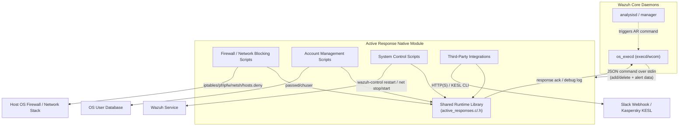
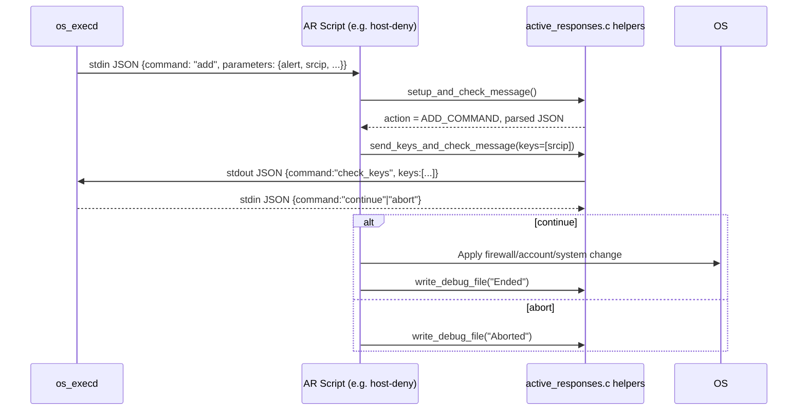

# Active Response Native Module

## Introduction

The **Active Response Native** module contains the collection of standalone, natively-compiled executables (mostly C, with one Python helper) that Wazuh agents and managers invoke to automatically react to security events. When the analysis engine or manager decides that an alert warrants an automated countermeasure (blocking an IP, disabling a user account, restarting the agent, notifying a third‑party service, etc.), the `execd`/`wcom` daemon spawns one of these binaries with a JSON payload describing the requested action. This module is the practical, OS-level "muscle" of the Active Response feature: it implements the actual system commands (firewall rules, `/etc/hosts.deny` edits, `passwd -l`, `netsh`, `ipfw`, `pf`, HTTP webhooks, etc.) needed to enforce a decision made elsewhere in the Wazuh stack.

All executables in this module share a small, common runtime library (`active_responses.c`/`active_responses.h`) that standardizes:

- Reading and validating the JSON command sent over `stdin` by `execd`.
- A two-phase **add/confirm** protocol used to avoid duplicate/racing responses (`add` → send keys → wait for `continue`/`abort` → apply the change).
- Debug logging to `logs/active-responses.log`.
- Cross-platform helpers for locating binaries, locking shared resources, and running external commands safely (`wpopenv`/`wpclose`).

## Architecture Overview

### Execution Flow (add/confirm protocol)

## Sub-Modules

This module is organized into five functional sub-modules, all built on top of the same shared runtime helpers:

| Sub-module | Purpose | Documentation |
|---|---|---|
| **Core Runtime Library** | Shared JSON parsing, add/confirm protocol, locking, debug logging, and process-execution helpers used by every script in this module. | [active_response_native_core.md](active_response_native_core.md) |
| **Firewall & Network Blocking Scripts** | Platform-specific implementations that block/unblock a source IP using `iptables`, `pf`, `ipfw`, `npf`, `firewalld`, Windows `netsh`/IPsec, or `/etc/hosts.deny`. | [active_response_native_firewall.md](active_response_native_firewall.md) |
| **Account Management Scripts** | Disables/re-enables OS user accounts (`passwd -l/-u`, AIX `chuser`) in response to suspicious authentication activity. | [active_response_native_account.md](active_response_native_account.md) |
| **System Control Scripts** | Restarts the local Wazuh installation as a corrective/recovery action. | [active_response_native_system.md](active_response_native_system.md) |
| **Third-Party Integrations** | Forwards alerts to external systems (Slack webhook) or drives third-party endpoint security tools (Kaspersky KESL) as a response action. | [active_response_native_integrations.md](active_response_native_integrations.md) |

## How This Module Fits Into the Overall System

- **Trigger path**: Active response commands are decided by the analysis engine and dispatched to agents/managers through `os_execd` (see `Agent_&_Manager_Native_Daemons_(C)` module, particularly `src/os_execd/*`), which invokes the binaries documented here as child processes and communicates with them via `stdin`/`stdout` JSON messages.
- **Configuration**: Which command maps to which binary/arguments is defined in `ossec.conf` and modeled by the `Active_Response_Config` header (`src/config/active-response.h`), part of the `Configuration_Data_Structures_(C_Headers)` module.
- **API/Management exposure**: The Wazuh API also exposes an active-response endpoint (`api/api/controllers/active_response_controller.py` and `framework/wazuh/active_response.py`) allowing users/administrators to trigger these same commands programmatically; see the `active_response_module` documentation inside the API & Management Framework tree for that higher-level interface.
- **Shared C utilities**: Low-level primitives such as `wpopenv`/`wpclose`, `get_binary_path`, `mkdir_ex`/`rmdir_ex`, and `os_strdup` come from the shared C library (`src/shared/*`), documented under the `shared_lib` sub-module of `Agent_&_Manager_Native_Daemons_(C)`.

## Key Design Characteristics

- **Stateless, single-shot execution**: Each script is invoked once per action, reads exactly one JSON message from `stdin`, performs the action, and exits — there is no persistent daemon in this module.
- **Defensive OS detection**: Most scripts call `uname()` and branch behavior per operating system (Linux, FreeBSD, SunOS, AIX, Darwin, Windows) because the underlying firewall/account tooling differs widely across platforms.
- **Idempotency and locking**: File-based locks (`lock()`/`unlock()` in the core library) prevent concurrent invocations from corrupting shared resources like `/etc/hosts.deny` or firewall rule tables.
- **Uniform logging**: Every script writes human-readable trace lines to `logs/active-responses.log` via `write_debug_file()`, which is invaluable for troubleshooting why a given response did or did not take effect.
