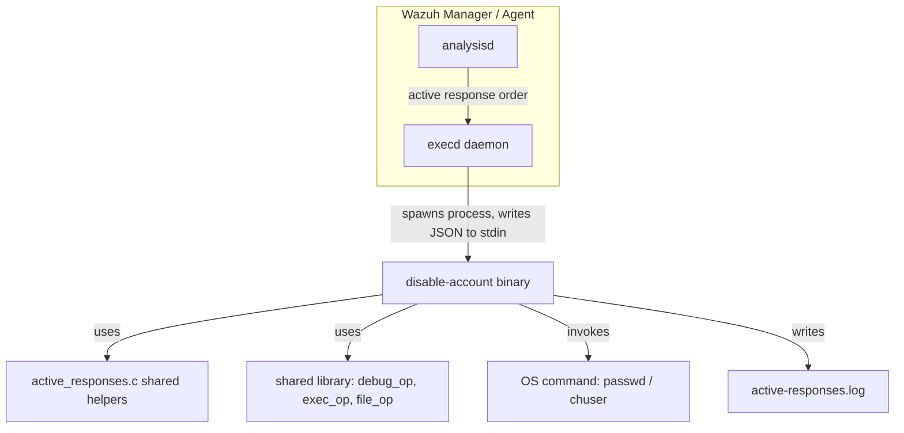
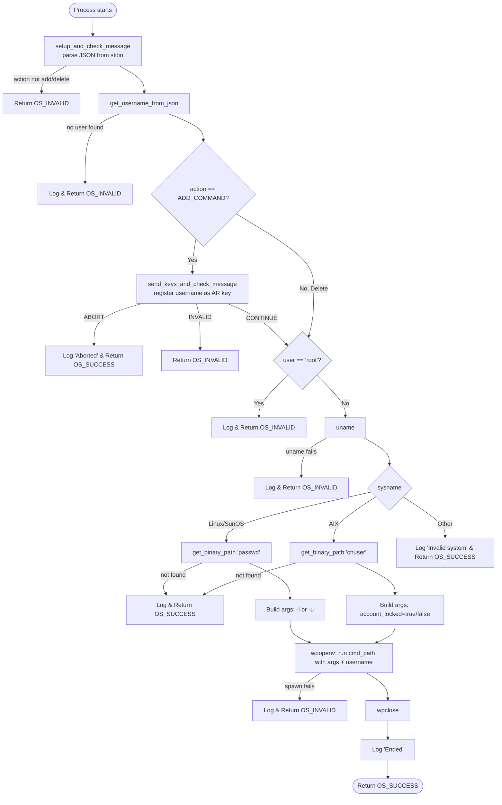
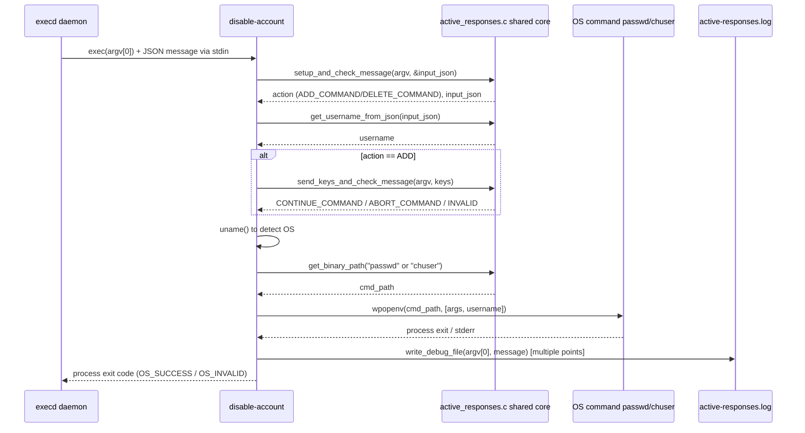

# Active Response Native Account Module

## Introduction

The **Active Response Native Account** module is a small, focused C program (`disable-account.c`) that implements the **account-lockout Active Response** capability of the Wazuh agent/manager. When Wazuh's analysis engine detects a suspicious event (for example, repeated failed authentication attempts) it can trigger an Active Response command that disables (locks) or re-enables (unlocks) the offending OS user account on the host where the response is executed.

This module is one of several native Active Response executables shipped with Wazuh, siblings of [active_response_native_firewall](active_response_native_firewall.md), [active_response_native_system](active_response_native_system.md), and [active_response_native_integrations](active_response_native_integrations.md) — all of which are documented together at the parent level in [active_response_native](active_response_native.md). It is compiled as a standalone binary that is invoked by the `execd` daemon (see `os_execd` in the [Agent_&_Manager_Native_Daemons_(C)](Agent_%26_Manager_Native_Daemons_%28C%29.md) module) whenever the manager or agent dispatches an active-response command over the internal socket.

## Purpose & Core Functionality

`disable-account.c` performs the following high-level actions:

1. **Parses and validates** the JSON active-response message received on `stdin` (via the shared helper `setup_and_check_message`), determining whether the requested action is to **add** (lock) or **delete** (unlock) the restriction.
2. **Extracts the target username** (`dstuser` field) from the JSON payload via `get_username_from_json`.
3. For **add** operations, it registers the affected user as a "key" with the active-response subsystem (`send_keys_and_check_message`) so that a subsequent **delete** command can automatically be scheduled/cancelled (idempotency / cleanup safety net), and aborts early if instructed to do so by the framework (e.g., action already applied).
4. **Rejects unsafe targets** — it refuses to operate on the `root` account.
5. **Detects the host operating system** using `uname()` and chooses the correct OS-native tool to lock/unlock the account:
   - **Linux / SunOS** → uses `passwd -l` (lock) / `passwd -u` (unlock).
   - **AIX** → uses `chuser account_locked=true` / `chuser account_locked=false`.
   - Any other OS is treated as unsupported and the script exits gracefully.
6. **Locates the OS binary** (`passwd` or `chuser`) using `get_binary_path`, and **executes it** through the `wpopenv`/`wpclose` process-execution wrapper, capturing stderr for diagnostics.
7. **Writes a debug/audit trail** at each significant step via `write_debug_file`, which is used by Wazuh support tooling to troubleshoot active-response executions.

The module deliberately contains **no daemon logic** — it is a short-lived process invoked once per active-response event: it reads its input, performs the OS action, and exits with a Wazuh-standard return code (`OS_SUCCESS` / `OS_INVALID`).

## Architecture & Component Relationships

### Position in the System

- **execd** (see `os_execd` in [Agent_&_Manager_Native_Daemons_(C)](Agent_%26_Manager_Native_Daemons_%28C%29.md)) is the parent process that launches this binary whenever it receives a matching active-response command from `remoted`/`analysisd`.
- **`active_responses.c`** ([active_response_native_core](active_response_native_core.md)) supplies the common helper routines used by *all* native active-response scripts: `setup_and_check_message`, `send_keys_and_check_message`, `get_username_from_json`, `write_debug_file`, and `get_binary_path`. This module depends heavily on that shared core rather than re-implementing parsing/logging logic — see that document for full protocol details (the JSON message schema, the add/confirm sequence, and the locking mechanism).
- **`shared_lib`** (part of [Agent_&_Manager_Native_Daemons_(C)](Agent_%26_Manager_Native_Daemons_%28C%29.md)) provides lower-level primitives such as process spawning (`wpopenv`/`wpclose` from `exec_op`) and generic OS abstractions.
- The binary produces no direct network output — its only external effects are (a) mutating local OS account state, and (b) appending audit lines to the active-response debug log.

### Internal Control Flow

## Data Flow

## Component Reference

| Component | Type | Description |
|---|---|---|
| `main` | function | Entry point; orchestrates message parsing, OS detection, command construction and execution described above. |
| `utsname uname_buffer` | local variable (`struct utsname`) | Holds the result of `uname()`, used to branch behavior per-OS (`Linux`, `SunOS`, `AIX`, other). |

### Key External Dependencies (from the Shared Active Response Core)

These are not defined in this file but are essential to its behavior; they live in [active_response_native_core](active_response_native_core.md) (`src/active-response/active_responses.c`):

| Function | Role in this module |
|---|---|
| `setup_and_check_message` | Reads and validates the incoming JSON AR message; determines `ADD_COMMAND`/`DELETE_COMMAND`. |
| `get_username_from_json` | Extracts the `dstuser` field from `parameters.alert.data`. |
| `send_keys_and_check_message` | Registers a "key" (the username) so the AR framework can track/expire the action; returns `CONTINUE_COMMAND`, `ABORT_COMMAND`, or an invalid status. |
| `write_debug_file` | Appends timestamped entries to the active-response debug log for observability. |
| `get_binary_path` | Resolves the absolute path to system utilities (`passwd`, `chuser`) in a safe manner (avoids trusting `$PATH`). |
| `wpopenv` / `wpclose` | Process spawning wrappers (from `shared_lib`) that execute the OS command with the constructed argument vector and capture stderr. |

## Process / Sequence of Execution

1. Wazuh detects a rule match configured with an `<active-response>` block referencing the `disable-account` command (declared via the `Active_Response_Config` structures — see `ar_command`/`active_response` in [Active_Response_Config](Active_Response_Config.md)).
2. `analysisd`/`remoted` sends the command through the internal active-response queue; `execd` (native daemon, see `os_execd`) receives it and forks/execs the `disable-account` binary, piping the JSON payload to its `stdin`.
3. The binary validates the message, extracts the user, and — for lock actions — registers itself with the AR key-tracking mechanism (enabling a later automatic unlock via a paired delete command, often driven by a `timeout` configured in `ossec.conf`).
4. Based on the detected OS, the appropriate lock/unlock command is executed against the local user database.
5. Results and any errors are logged to `active-responses.log`, and the process terminates with a status code that `execd` uses to determine success/failure.

## Related Modules

- [active_response_native](active_response_native.md) — parent module documenting the full family of native Active Response executables and how they share the common runtime.
- [active_response_native_core](active_response_native_core.md) — the shared core library (`active_responses.c`) providing the JSON protocol parsing, key-registration handshake, logging, and locking primitives this module relies on.
- [active_response_native_firewall](active_response_native_firewall.md) — sibling module implementing firewall-based active responses (`host-deny`, `firewalld-drop`, `ip-customblock`, etc.) using the same shared core.
- [active_response_native_system](active_response_native_system.md) — sibling module for system-level responses (e.g., `restart-wazuh`).
- [active_response_native_integrations](active_response_native_integrations.md) — sibling module for third-party integrations (Kaspersky, Slack) triggered as active responses.
- [active_response_module](active_response_module.md) — the higher-level API/framework component (`framework/wazuh/active_response.py`, `api/api/controllers/active_response_controller.py`) that allows administrators to *manually* trigger active-response commands (including account-disable) via the Wazuh REST API; this is the manager-side origin of the JSON messages that ultimately reach this binary.
- [Active_Response_Config](Active_Response_Config.md) — defines the configuration structures (`ar_command`, `active_response`) that describe how commands like `disable-account` are declared and mapped to rules in `ossec.conf`.
- [Agent_&_Manager_Native_Daemons_(C)](Agent_%26_Manager_Native_Daemons_%28C%29.md) — parent module tree containing `os_execd` (the daemon that invokes this binary) and `shared_lib` (the utilities such as `debug_op`, `exec_op`, `file_op` it relies on).

## Notes for Maintainers

- The module hardcodes protection against locking the `root` account; any change to this safeguard should be carefully reviewed for security implications.
- Supported operating systems are currently limited to Linux, SunOS, and AIX. Extending support (e.g., for macOS `pwpolicy` or BSD `pw`) would require adding a new branch in the OS-detection `if/else` chain and providing the corresponding command/argument mapping.
- All log output goes through `write_debug_file`, ensuring consistent formatting with other native active-response scripts — any new failure path should follow this same pattern for supportability.
- Because this is a short-lived, single-purpose executable, there is no persistent state; idempotency and cleanup (auto re-enable after timeout) are handled by the broader Active Response framework (`send_keys_and_check_message` + `execd`), not by this file itself.
