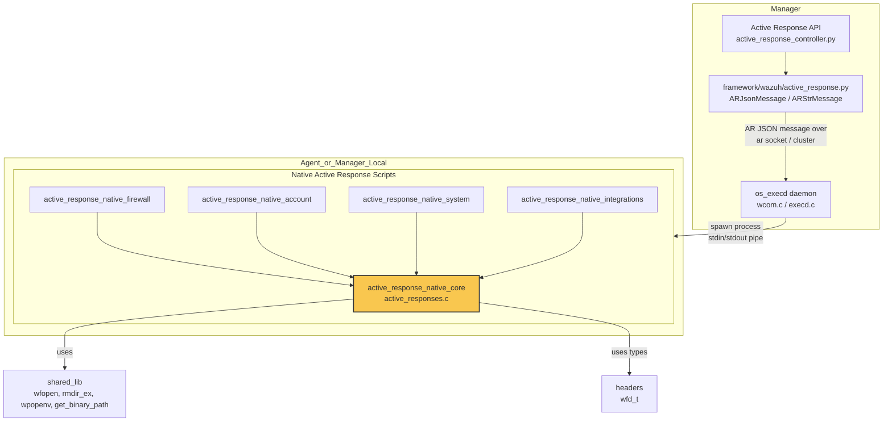
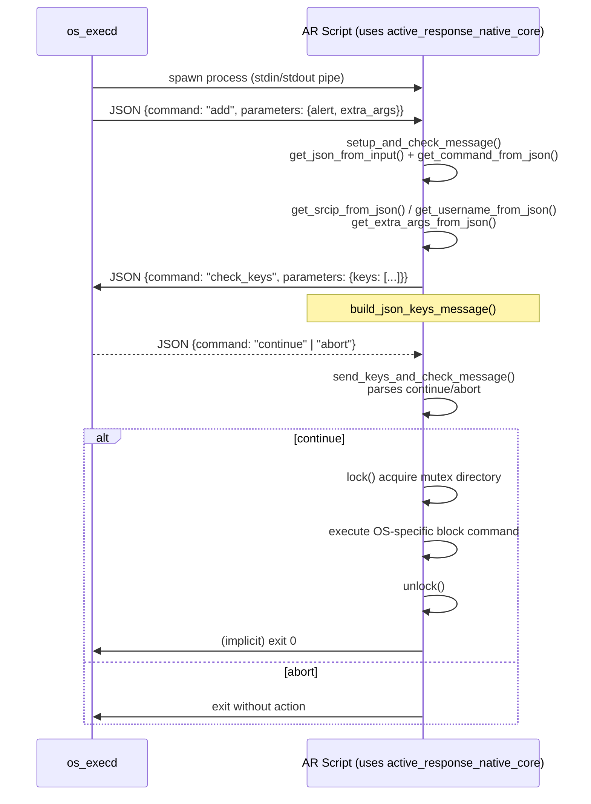
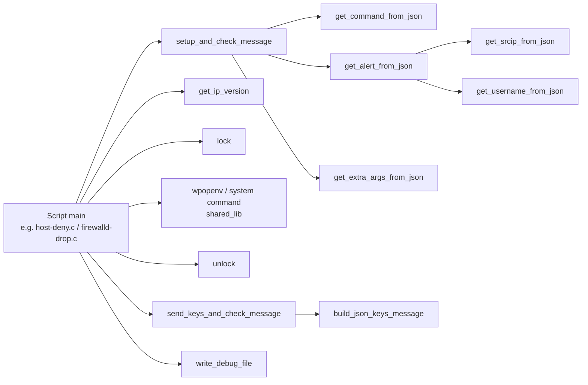
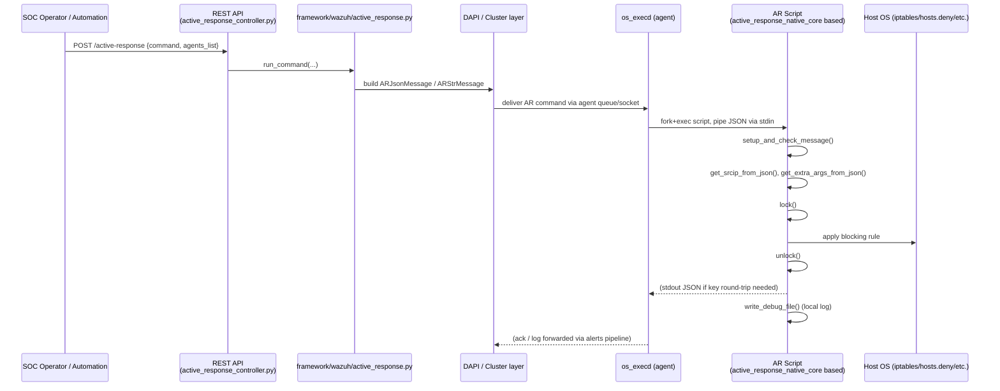

# Active Response Native Core

## Introduction

`active_response_native_core` is the foundational C library of the Wazuh **Active Response** subsystem. It is implemented in a single translation unit, `src/active-response/active_responses.c` (and its companion header `active_responses.h`), and provides the shared primitives that every native Active Response (AR) script — firewall blockers, account disablers, system restarters, and third‑party integrations — links against.

Rather than being an executable itself, this module is a **support library**: it implements the JSON‑based communication protocol between `wazuh-execd` (the daemon that launches AR scripts) and the AR scripts, plus common utilities for logging, mutual‑exclusion locking, and IP address handling. By centralizing this logic, all AR scripts behave consistently and avoid duplicating fragile protocol‑parsing code.

This module sits at the bottom of the Active Response script family within the [Agent & Manager Native Daemons (C)](Agent_%26_Manager_Native_Daemons_%28C%29.md) area of the codebase, and is consumed by:
- [active_response_native_firewall](active_response_native_firewall.md) — firewall/host-blocking scripts (`firewalld-drop`, `host-deny`, `ipfw`, `pf`, `npf`, `route-null`, `ip-customblock`, `netsh`, default firewall drop)
- [active_response_native_account](active_response_native_account.md) — account‑disabling response (`disable-account`)
- [active_response_native_system](active_response_native_system.md) — system‑level response (`restart-wazuh`)
- [active_response_native_integrations](active_response_native_integrations.md) — third‑party integrations (`kaspersky`, `wazuh-slack`)

It is invoked as a child process by [os_execd](Agent_%26_Manager_Native_Daemons_%28C%29.md) on the agent (or manager, in local mode), which itself receives Active Response commands originating from the manager-side API layer implemented in [active_response_module](active_response_module.md) (`framework/wazuh/active_response.py`, `framework/wazuh/core/active_response.py`, `api/api/controllers/active_response_controller.py`). It also depends on generic OS abstractions from [shared_lib](shared_lib.md) (file operations, process spawning, string helpers) and structures declared in [headers](headers.md) (e.g. `wfd_t` for process handles).

---

## Purpose and Core Functionality

The library provides five functional areas:

1. **AR Protocol Handling** – parses/validates the JSON messages sent by `execd` and formats the JSON responses sent back by the script (`setup_and_check_message`, `send_keys_and_check_message`, `get_json_from_input`).
2. **JSON Field Extraction Helpers** – convenience accessors that pull specific fields (command, alert, srcip, username, extra_args, keys) out of the parsed input JSON so that individual scripts don't need to know the full message schema.
3. **Concurrency Control** – a directory-based mutual-exclusion lock (`lock`/`unlock`) that prevents concurrent AR script instances from corrupting shared state (e.g., firewall rule files), including stale-lock detection/recovery by inspecting and killing the PID holding the lock.
4. **Debug Logging** – `write_debug_file`, a timestamped append-only logger used by every AR script to record activity into `active-responses.log`.
5. **Networking Utility** – `get_ip_version`, a thin wrapper over `getaddrinfo` used to decide whether an attacker IP is IPv4 or IPv6 before invoking OS-specific blocking commands.

---

## Architecture Overview



**Key architectural points:**

- `active_response_native_core` has **no `main()`**; it is compiled into each AR script binary (or included/linked as an object) so every script shares identical protocol-handling behavior.
- Communication with `execd` is **stdin/stdout based**, using single-line JSON messages terminated by newline — this is symmetric to the JSON protocol implemented on the manager side by `ARJsonMessage`/`ARStrMessage` in [active_response_module](active_response_module.md).
- Locking is implemented via `mkdir()` as an atomic lock primitive (portable across POSIX systems) combined with a PID file for stale-lock detection.

---

## Active Response Protocol

Every AR script follows a strict two-phase request/response protocol with `execd`. `setup_and_check_message` implements phase 1 (initial command), and `send_keys_and_check_message` implements phase 2 (optional key‑validation round-trip used by scripts that persist blocking "keys", e.g., blocked IPs).

### Message Schema

```json
{
  "version": 1,
  "origin": { "name": "<script>", "module": "active-response" },
  "command": "add | delete | continue | abort | check_keys",
  "parameters": {
    "alert": { "...": "..." },
    "extra_args": ["..."],
    "keys": ["..."]
  }
}
```

`get_json_from_input` validates that `version`, `origin`, `command`, and `parameters` are present and well-typed before any script logic runs, rejecting malformed messages defensively.

### Sequence Diagram — "add" flow with key validation



### Function Responsibilities

| Function | Responsibility |
|---|---|
| `setup_and_check_message` | Changes working directory to Wazuh home, logs startup, reads first stdin line, parses/validates JSON, returns `ADD_COMMAND` / `DELETE_COMMAND` / `OS_INVALID` |
| `send_keys_and_check_message` | Serializes the script's tracked keys via `build_json_keys_message`, writes to stdout, reads `execd`'s reply, returns `CONTINUE_COMMAND` / `ABORT_COMMAND` / `OS_INVALID` |
| `get_json_from_input` | Parses raw JSON string and validates the mandatory top-level schema fields |
| `get_command_from_json` | Extracts the `command` string field |
| `get_alert_from_json` | Extracts the nested `parameters.alert` object |
| `get_srcip_from_json` | Extracts `parameters.alert.data.srcip`, with special-case handling for Windows Sysmon-style `win.eventdata.ipAddress` / `destinationIp` (via `get_srcip_from_win_eventdata`) |
| `get_username_from_json` | Extracts `parameters.alert.data.dstuser` |
| `get_extra_args_from_json` | Concatenates the `parameters.extra_args` string array into a single space-delimited buffer (bounded to `COMMANDSIZE_4096`) |
| `get_keys_from_json` | Concatenates `parameters.keys` into a `-`-prefixed buffer for command-line consumption |
| `build_json_keys_message` | Builds the outgoing `check_keys` JSON envelope containing the script's current key set |

---

## Concurrency Control (Locking)

Because several AR scripts mutate shared OS state (iptables rules, `/etc/hosts.deny`, netsh rules, etc.), concurrent invocations must serialize access. `lock`/`unlock` implement a simple, portable, self-healing lock:

```mermaid
flowchart TD
    Start([lock() called]) --> TryMkdir{mkdir(lock_path)<br/>succeeds?}
    TryMkdir -->|Yes| WritePID[Write own PID to lock_pid_path]
    WritePID --> Acquired([Lock acquired: OS_SUCCESS])

    TryMkdir -->|No, already locked| ReadPID[Read PID from lock_pid_path]
    ReadPID --> SameOwner{Same PID as<br/>previous iteration?}
    SameOwner -->|Yes| IncCounter[Increment stale counter]
    SameOwner -->|No| ResetCounter[Reset counter, track new PID]
    IncCounter --> SleepBackoff[sleep(i); i++]
    ResetCounter --> SleepBackoff
    SleepBackoff --> MaxIter{iterations >= 50?}
    MaxIter -->|No| TryMkdir
    MaxIter -->|Yes| PgrepCheck[pgrep -f proc_name<br/>find matching PID]
    PgrepCheck --> FoundStale{Stale process<br/>found?}
    FoundStale -->|Yes| KillStale[kill -9 pid; unlock(); reset counters]
    KillStale --> TryMkdir
    FoundStale -->|No| ForceUnlock[unlock(); retry mkdir once]
    ForceUnlock --> Final{mkdir succeeds?}
    Final -->|Yes| Acquired
    Final -->|No| Failed([OS_INVALID])
```

- Implemented only for POSIX platforms (`#ifndef WIN32`).
- Uses `get_binary_path` (from [shared_lib](shared_lib.md)) to safely locate `pgrep`/`kill` binaries rather than trusting `$PATH`.
- `unlock` simply calls `rmdir_ex` (from [shared_lib](shared_lib.md)) on the lock directory.

---

## Component Interaction Within an AR Script



Typical AR script `main()` flow (e.g. `host-deny.c`, `firewalld-drop.c`):
1. Call `setup_and_check_message` to determine whether this invocation is an `add` or `delete`.
2. Extract `srcip` / `username` / `extra_args` via the JSON helpers.
3. Optionally call `get_ip_version` to branch IPv4 vs IPv6 handling logic.
4. Call `lock` to guard the shared resource file (e.g., blocked-IP list).
5. Perform the OS-specific action (invoke `iptables`, `pf`, `netsh`, `usermod -L`, etc., generally via `wpopenv`/`wpclose` from [shared_lib](shared_lib.md)).
6. Call `unlock`.
7. Use `write_debug_file` throughout for traceability into `active-responses.log`.

---

## Data Flow: End-to-End Active Response Execution



This demonstrates how `active_response_native_core` is the final execution point of the Active Response feature, whose orchestration begins in [active_response_module](active_response_module.md) at the API/manager level.

---

## Public Function Reference

| Function | Signature (essentials) | Notes |
|---|---|---|
| `write_debug_file` | `void write_debug_file(const char *ar_name, const char *msg)` | Appends timestamped line to `LOG_FILE` |
| `setup_and_check_message` | `int setup_and_check_message(char **argv, cJSON **message)` | Returns `ADD_COMMAND`/`DELETE_COMMAND`/`OS_INVALID` |
| `send_keys_and_check_message` | `int send_keys_and_check_message(char **argv, char **keys)` | Returns `CONTINUE_COMMAND`/`ABORT_COMMAND`/`OS_INVALID` |
| `get_json_from_input` | `cJSON *get_json_from_input(const char *input)` | Validates schema, returns parsed `cJSON*` or `NULL` |
| `get_command_from_json` | `const char *get_command_from_json(const cJSON *input)` | |
| `get_alert_from_json` | `const cJSON *get_alert_from_json(const cJSON *input)` | |
| `get_srcip_from_json` | `const char *get_srcip_from_json(const cJSON *input)` | Handles Windows `win.eventdata` fallback |
| `get_username_from_json` | `const char *get_username_from_json(const cJSON *input)` | |
| `get_extra_args_from_json` | `char *get_extra_args_from_json(const cJSON *input)` | Caller must free |
| `get_keys_from_json` | `char *get_keys_from_json(const cJSON *input)` | Caller must free |
| `splitStrFromCharDelimiter` | `void splitStrFromCharDelimiter(...)` | Generic string split-on-char helper used by OS-specific parsers (e.g., parsing `iptables`/`pf` rule output) |
| `isEnabledFromPattern` | `int isEnabledFromPattern(...)` | Pattern-matches a substring plus optional following token, used to check OS feature/service state strings |
| `lock` / `unlock` | POSIX only | Directory + PID-file based mutual exclusion with stale-lock recovery |
| `get_ip_version` | `int get_ip_version(const char *ip)` | Returns `4`, `6`, or `OS_INVALID` via `getaddrinfo` |

---

## Dependencies

| Dependency | Used For | Documentation |
|---|---|---|
| `cJSON` (external) | All JSON parsing/serialization | — |
| `shared_lib` | `wfopen`, `rmdir_ex`, `get_binary_path`, `wpopenv`/`wpclose`, `w_homedir`, `w_strtok_r_str_delim`, `w_get_timestamp` | [shared_lib](shared_lib.md) |
| `headers` | `wfd_t` (process handle struct used with `wpopenv`) | [headers](headers.md) |
| `os_execd` | Parent process that spawns AR scripts and exchanges JSON over pipes | [os_execd](Agent_%26_Manager_Native_Daemons_%28C%29.md) |
| `active_response_module` | Manager/API-side counterpart that originates AR commands (`ARJsonMessage`, `ARStrMessage`, `run_command`) | [active_response_module](active_response_module.md) |

## Consumers

| Module | How it uses this core |
|---|---|
| [active_response_native_firewall](active_response_native_firewall.md) | Uses protocol parsing + locking to safely add/remove firewall/host-blocking rules across platforms (`iptables`, `pf`, `ipfw`, `npf`, `netsh`, `hosts.deny`, null routes) |
| [active_response_native_account](active_response_native_account.md) | Uses protocol parsing + username extraction to lock/unlock OS user accounts |
| [active_response_native_system](active_response_native_system.md) | Uses protocol parsing to trigger a full Wazuh agent/manager restart |
| [active_response_native_integrations](active_response_native_integrations.md) | Uses protocol parsing + extra_args extraction to forward alerts to third-party systems (Kaspersky, Slack) |

---

## Design Notes

- **Fail-safe parsing**: every JSON accessor returns `NULL`/`OS_INVALID` rather than asserting, so malformed input from `execd` (or a corrupted pipe) cannot crash an AR script that may be running with elevated privileges.
- **Bounded buffers**: `get_extra_args_from_json` and `get_keys_from_json` build fixed-size buffers (`COMMANDSIZE_4096`) with explicit length checks to avoid overflow, since resulting values are frequently passed to `system()`/`wpopenv()`-style command execution.
- **Cross-platform guard**: locking and IP-version helpers are wrapped in `#ifndef WIN32` where the underlying primitives (`mkdir` semantics, `pgrep`/`kill`) are POSIX-specific; Windows AR scripts (e.g., `netsh.c`) rely on Win32-native equivalents instead.
