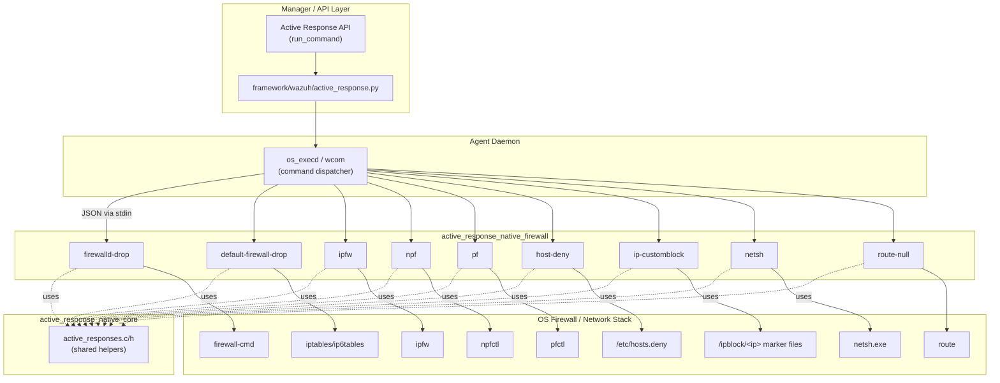
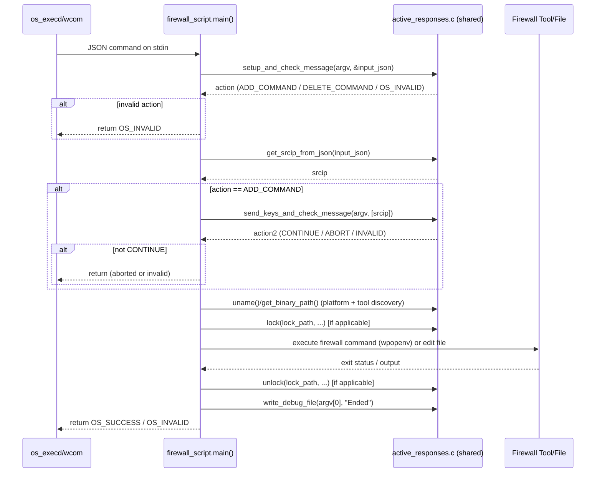
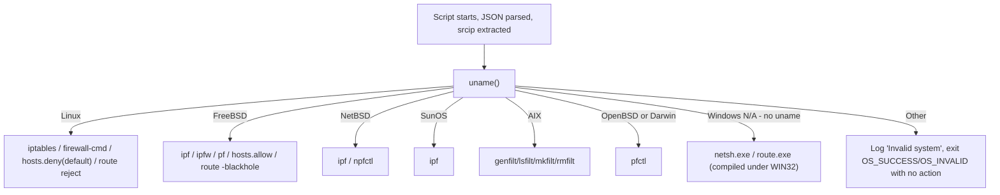

# Active Response Native Firewall Module

## 1. Purpose

The **Active Response Native Firewall** module is a collection of small, standalone C executables that run on a Wazuh **agent** (or manager acting as an agent) to dynamically block or unblock a source IP address at the operating-system firewall level. Each program in this module targets a specific firewall technology or OS platform, but all of them share the same invocation contract, input format, and general control flow, which is provided by the shared **`active_response_native_core`** module (see `active_responses.h` / `active_responses.c`).

These binaries are invoked by the `execd`/`wcom` (agent) or `os_execd` component whenever an Active Response rule fires (typically triggered by the Wazuh analysis engine after detecting suspicious activity, e.g. brute-force attempts). They read a JSON command from `stdin`, determine whether to **add** or **delete** a firewall rule for the offending IP, and shell out to the appropriate native firewall tool (`iptables`, `firewall-cmd`, `pf`, `ipfw`, `npfctl`, `netsh.exe`, `route`, or by editing `/etc/hosts.deny`).

Because Wazuh supports many operating systems, this module implements **one script per major firewall technology**, and several scripts additionally branch internally on `uname()` to support multiple related platforms (e.g., FreeBSD/NetBSD/AIX variants sharing a "default" drop strategy).

## 2. Scope — Files in This Module

| File | Firewall Backend | Target Platform(s) |
|---|---|---|
| `firewalld-drop.c` | `firewall-cmd` (firewalld) | Linux |
| `firewalls/default-firewall-drop.c` | `iptables`/`ip6tables`, `ipf`, `genfilt`/AIX filters | Linux, FreeBSD, SunOS, NetBSD, AIX |
| `firewalls/ipfw.c` | `ipfw` tables | FreeBSD |
| `firewalls/npf.c` | `npfctl` tables | NetBSD |
| `firewalls/pf.c` | `pfctl` tables | OpenBSD, FreeBSD, macOS (Darwin) |
| `host-deny.c` | TCP Wrappers (`/etc/hosts.deny`, `/etc/hosts.allow`) | Linux, FreeBSD |
| `ip-customblock.c` | Filesystem marker files (`/ipblock/<ip>`) | Any (custom/generic hook) |
| `netsh.c` | `netsh.exe` (Windows Firewall) / `ipsec` legacy filters | Windows |
| `route-null.c` | Null routing via `route` / `route.exe` | Linux, FreeBSD, Windows |

All of these are compiled as independent executables and dropped into the agent's `active-response/bin/` directory. The specific script(s) enabled on a given host depend on the `<active-response>` configuration block (see [Active_Response_Config](Active_Response_Config.md)) and the detected OS.

## 3. Relationship to Other Modules

This module depends heavily on shared code and sits within a larger hierarchy of Active Response functionality:

- **[active_response_native_core](active_response_native_core.md)** — provides `active_responses.h`/`active_responses.c`, the common helpers used by every script in this module: `setup_and_check_message()`, `get_srcip_from_json()`, `send_keys_and_check_message()`, `write_debug_file()`, `lock()`/`unlock()`, `get_ip_version()`, `wpopenv()`/`wpclose()`, `get_binary_path()`, and `isEnabledFromPattern()`.
- **[active_response_native_account](active_response_native_account.md)** — sibling module for account-disabling active responses (`disable-account.c`).
- **[active_response_native_system](active_response_native_system.md)** — sibling module for system-level responses (`restart-wazuh.c`).
- **[active_response_native_integrations](active_response_native_integrations.md)** — sibling module for third-party integrations (Kaspersky, Slack).
- **[Active_Response_Config](Active_Response_Config.md)** — defines the `active-response` configuration schema (`_ar`, `_ar_command`) that determines which of these scripts are enabled and how they're triggered by the manager/agent.
- **API/Framework layer** — the higher-level `active_response_module` (in the API & Management Framework) exposes `run_command` endpoints (`api/api/controllers/active_response_controller.py`, `framework/wazuh/active_response.py`) that construct and dispatch the JSON messages (`ARJsonMessage`/`ARStrMessage`) which are ultimately consumed by the scripts documented here, via `os_execd`/`wcom`.

## 4. Architecture Overview

### 4.1 Component Diagram

### 4.2 Common Execution Flow

Every script in this module follows the same skeleton, delegated largely to `active_responses.c` in the core module:

Key shared conventions used by all scripts:
- **Input contract**: a JSON payload is parsed by `setup_and_check_message`; it must contain a `parameters.alert.data.srcip` (or similar) field, extracted by `get_srcip_from_json`.
- **Add vs. Delete**: the `command` field of the JSON determines `ADD_COMMAND` or `DELETE_COMMAND`.
- **Duplicate/whitelist protection**: on `ADD_COMMAND`, scripts call `send_keys_and_check_message` to consult the agent's active-response key list before proceeding (supports abort semantics to avoid blocking whitelisted/duplicate IPs).
- **Locking**: several scripts (`firewalld-drop`, `default-firewall-drop`, `host-deny`) use file-based locks (`lock()`/`unlock()`) to serialize concurrent invocations that modify shared system state (firewall tables, `/etc/hosts.deny`).
- **Binary discovery**: `get_binary_path()` resolves the absolute path of the required CLI tool (`iptables`, `pfctl`, `ipfw`, `npfctl`, `firewall-cmd`, `netsh.exe`, `reg.exe`, `route`, etc.), falling back gracefully with a debug log if not found.
- **Process execution**: `wpopenv()`/`wpclose()` wrap `popen`-style execution with explicit argument vectors (avoiding shell injection) and configurable stdio binding (`W_BIND_STDOUT`, `W_BIND_STDERR`, `W_BIND_STDIN`).
- **Logging**: `write_debug_file(argv[0], msg)` writes structured status/error messages to the active-response log, and — in some scripts (`pf.c`, `netsh.c`) — emits a JSON status blob when the firewall is detected as disabled, so the manager/dashboard can flag that the response "may not have an effect."

## 5. Per-Script Details

### 5.1 `firewalld-drop.c` — firewalld (Linux)
- Detects IP version via `get_ip_version()` and builds a **rich rule**: `rule family=ipv4|ipv6 source address=<ip> drop`.
- Confirms the host is Linux via `uname()`; on any other OS it logs "Invalid system" and exits.
- Locates `firewall-cmd`, takes a file lock (`active-response/bin/fw-drop`), and retries the `firewall-cmd --add-rich-rule` / `--remove-rich-rule` command up to 5 times with increasing back-off (`sleep(count)`), to tolerate `firewalld`'s own internal locking.

### 5.2 `firewalls/default-firewall-drop.c` — Generic drop (multi-OS)
The most complex script; provides a fallback IP-drop mechanism across several UNIX variants:
- **Linux**: uses `iptables`/`ip6tables` (chosen by IP version) to `-I`/`-D` DROP rules on both `INPUT` and `FORWARD` chains, guarded by the same lock file convention as `firewalld-drop`.
- **FreeBSD / SunOS / NetBSD**: uses `ipf` (`ipfilter`) with `block in/out quick from/to <ip>` rules piped via stdin (`-f -` / `-rf -`).
- **AIX**: uses `genfilt`/`lsfilt`/`mkfilt`/`rmfilt` to add/list/remove filter rules and reload the AIX IP filter table (deactivate + reactivate).
- Any other OS results in "Invalid system" logging with no action taken.

### 5.3 `firewalls/ipfw.c` — FreeBSD `ipfw`
- Maintains a persistent **`table(00001)`** and ensures two catch-all `deny ip` rules referencing that table exist (`show` output is scanned for the table's presence before adding).
- Adds/removes the offending IP from `table 00001` using `ipfw -q table 00001 add|delete <ip>`.
- Only operates on FreeBSD; other OSes are rejected.

### 5.4 `firewalls/npf.c` — NetBSD `npf`
- Validates that filtering is `active` (parses `npfctl show` output for a `filtering: active` line) and that a `table <wazuh_blacklist>` exists before attempting to modify it.
- Adds/removes the IP from the `wazuh_blacklist` table via `npfctl table wazuh_blacklist add|del <ip>`.
- Aborts with diagnostic messages if the filter is inactive or the expected table is missing (it does not auto-create the table/config, unlike the other backends).

### 5.5 `firewalls/pf.c` — OpenBSD/FreeBSD/macOS `pf`
- Confirms `/etc/pf.conf` exists and `/dev/pf` is accessible (pf is loaded).
- If the `wazuh_fwtable` table is not yet referenced in `pf.conf`, it **appends** a table declaration and two `block` rules, then reloads the ruleset (`pfctl -f /etc/pf.conf`).
- Adds/removes the IP via `pfctl -t wazuh_fwtable -T add|delete <ip>`; on `ADD_COMMAND` it also runs `pfctl -k <ip>` to kill existing matching states.
- Before executing on `ADD_COMMAND`, checks `pfctl -s info` output for a `Status: Enabled` line and emits a JSON warning if pf is disabled ("Active response may not have an effect").
- Contains helper functions `checking_if_its_configured()` (greps the config file for the table name) and `write_cmd_to_file()` (appends text to `pf.conf`).

### 5.6 `host-deny.c` — TCP Wrappers
- Builds a hosts.deny rule string: `ALL:<ip>` (Linux) or `ALL : <ip> : deny` (FreeBSD, written to `/etc/hosts.allow` instead of `/etc/hosts.deny`).
- **Add**: takes a lock, checks for an existing duplicate line, then appends the rule.
- **Delete**: takes a lock, streams the file to a temp file (`active-response/bin/temp-hosts-deny`) skipping lines containing the IP, then atomically replaces the original file via `OS_MoveFile`.

### 5.7 `ip-customblock.c` — Generic Marker-File Hook
- The simplest script: on `ADD_COMMAND` it `mkdir`s an `/ipblock/` directory (if missing) and creates an empty marker file named after the IP (`/ipblock/<ip>`); on `DELETE_COMMAND` it removes that file.
- Intended as an extension point/hook for external tooling or custom scripts that watch this directory, rather than directly manipulating a firewall.

### 5.8 `netsh.c` — Windows Firewall
- Calls `enable_dll_verification()` first (DLL hijack mitigation, from `dll_load_notify.h`).
- On modern Windows (`checkVista()` true) it manages a named rule `WAZUH ACTIVE RESPONSE BLOCKED IP` via `netsh advfirewall firewall add|delete rule ... remoteip=<ip>/32`.
- On legacy Windows it falls back to IPsec static filters/policies (`netsh ipsec static add|delete filter/filteraction/policy/rule`), building a full filter list (`wazuh_filter`), block action (`wazuh_action`), and policy (`wazuh_policy`) chain.
- Before adding a rule, `getAllProfilesStatus()` queries the registry (`reg.exe query ... FirewallPolicy\<Profile> /v EnableFirewall`) for the Domain/Standard/Public firewall profiles, and — if any profile is disabled — emits a structured JSON debug message listing each profile's status, warning that the response may be ineffective.

### 5.9 `route-null.c` — Null Routing
- **Linux**: `route add|del <ip> reject`.
- **FreeBSD**: `route -q add|delete <ip> 127.0.0.1 -blackhole`.
- **Windows**: parses `ipconfig` output (via a temporary file and `findstr` regex) to discover the **default gateway**, then issues `route -p ADD <ip> MASK 255.255.255.255 <gateway>` (add) or `route DELETE <ip>` (delete). Also calls `enable_dll_verification()` at startup.
- Acts as a cross-platform fallback response independent of any packet-filter subsystem.

## 6. Decision Logic: OS/Backend Dispatch

Several scripts (`default-firewall-drop`, `host-deny`, `pf`, `ipfw`/`npf` implicitly, `route-null`) branch on `uname()` output to select the correct tool invocation:

Note: The Windows-specific scripts (`netsh.c`, `route-null.c`) are compiled conditionally under `#ifdef WIN32` and do not use `uname()`; instead they use native Win32 APIs and `checkVista()`.

## 7. Configuration & Deployment Notes

- Which script(s) get installed/enabled on an agent is governed by the manager's `<active-response>` configuration (`ossec.conf`), parsed into the `active_response` / `ar_command` structures documented in **[Active_Response_Config](Active_Response_Config.md)**.
- Lock directories (e.g. `active-response/bin/fw-drop`, `active-response/bin/host-deny-lock`) are created relative to the agent's install path and used to prevent race conditions when multiple Active Response invocations occur concurrently for the same firewall backend.
- All scripts return `OS_SUCCESS` (0) on best-effort completion and `OS_INVALID` (typically -1) on unrecoverable errors (bad input, missing binary path that cannot be worked around, lock failure); they intentionally avoid crashing the calling `execd`/`wcom` process.
- Diagnostic output is never sent to the analysis engine as an alert directly — instead `write_debug_file()` writes to the active-response debug log, and in some scripts also emits a structured JSON string (e.g., pf/netsh "inactive firewall" warnings) that downstream log collection can pick up as an event.

## 8. Summary

This module is the **OS/firewall abstraction layer** of Wazuh's Active Response subsystem: it converts a generic "block/unblock this IP" instruction into the correct native command sequence for whichever firewall technology is present on the endpoint. It has no runtime dependencies beyond the shared `active_response_native_core` helpers and the target OS's own firewall CLI tools, making each script simple, self-contained, and independently deployable.
