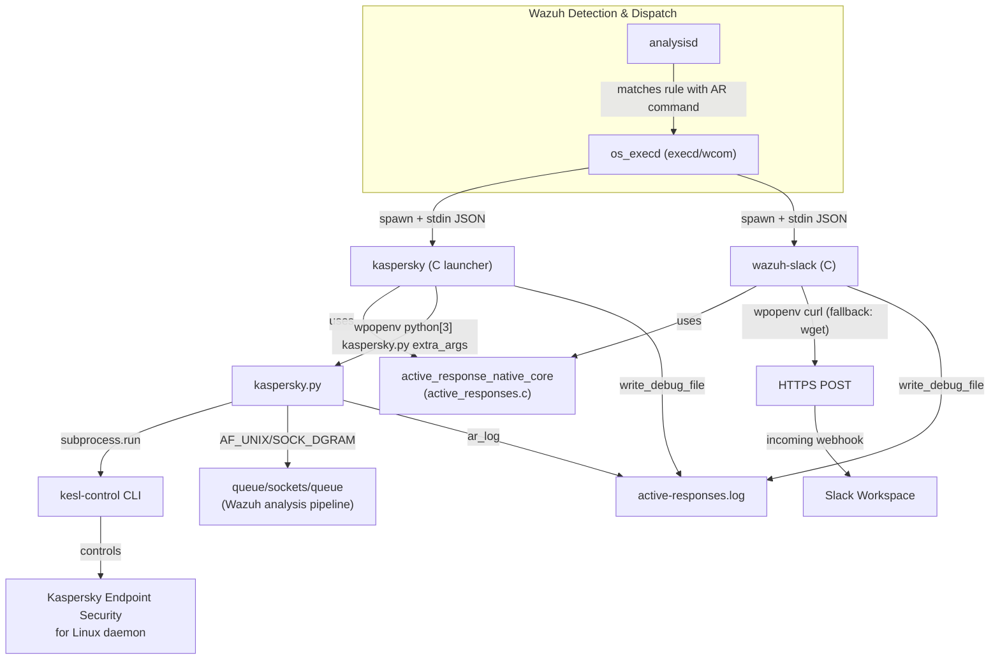
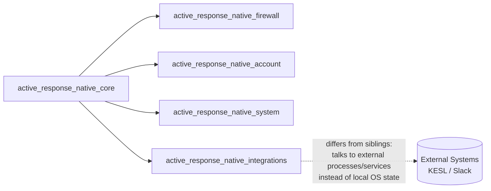
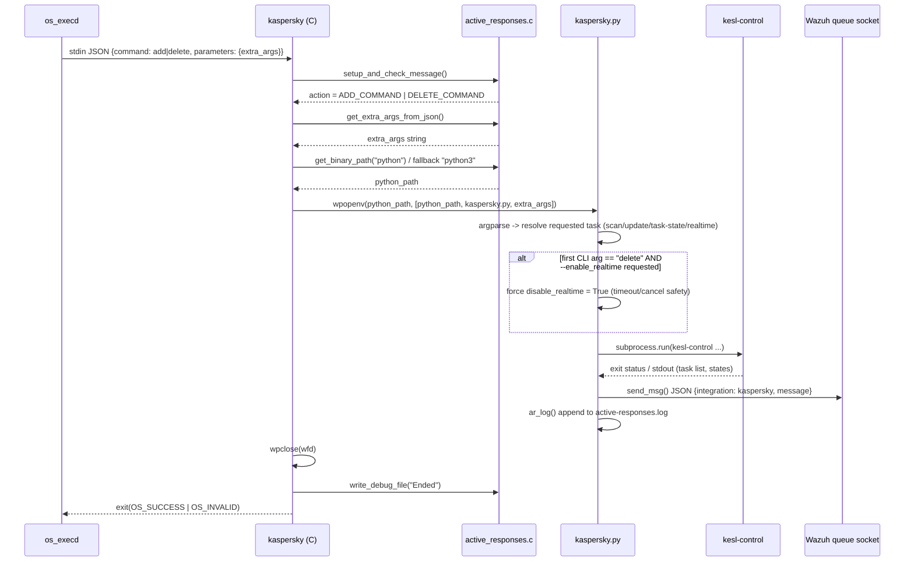
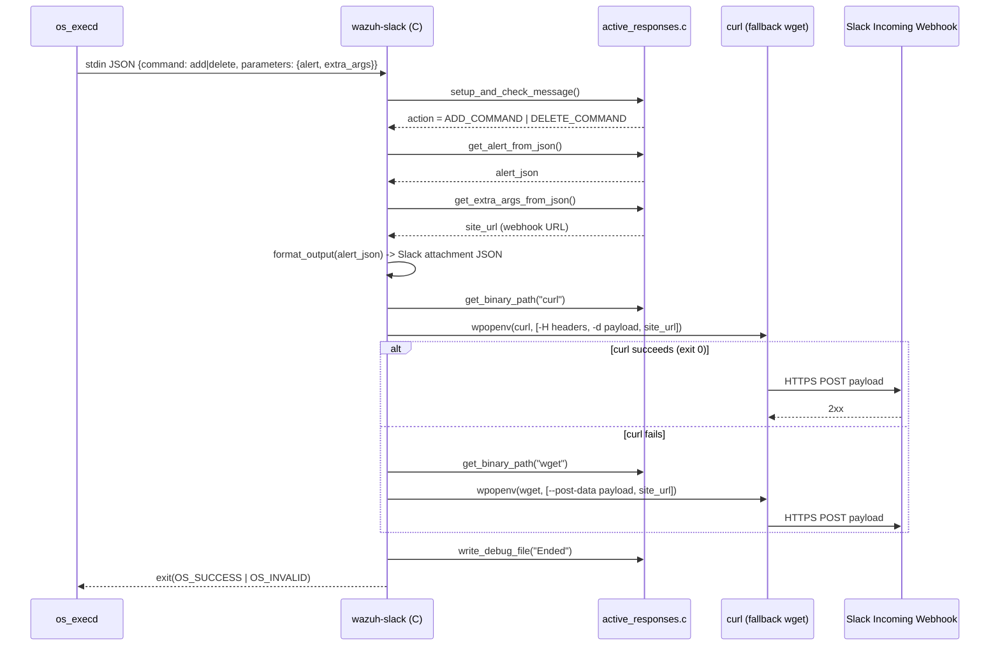
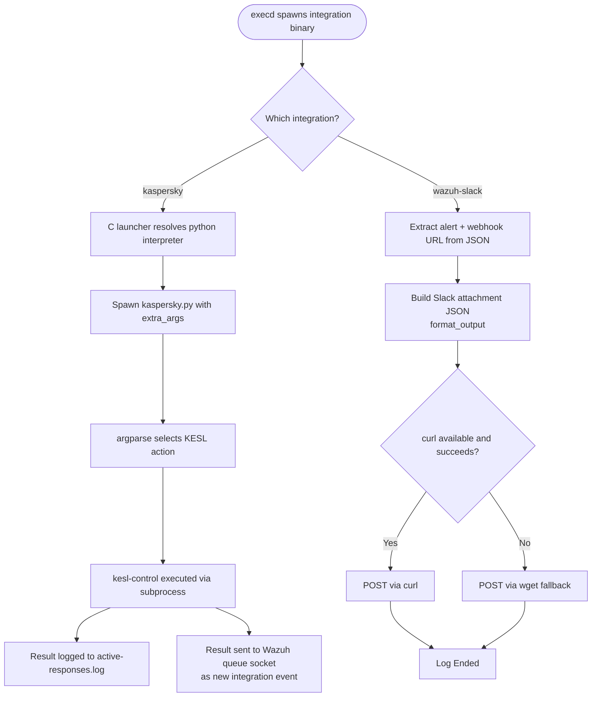

# Active Response Native Integrations

## Introduction

**Active Response Native Integrations** is the sub-module of the Wazuh Active Response family responsible for forwarding automated response actions to **third‑party systems** instead of (or in addition to) directly manipulating local OS state. It contains two independent integrations:

- **Kaspersky KESL integration** (`kaspersky.c` + `kaspersky.py`) — a C launcher that locates a Python interpreter and executes a companion Python script which drives the `kesl-control` CLI of Kaspersky Endpoint Security for Linux (KESL), allowing Wazuh to trigger scans, enable/disable real-time protection, and query task status on the endpoint.
- **Slack webhook integration** (`wazuh-slack.c`) — a pure-C implementation that transforms a Wazuh alert into a Slack-compatible JSON payload and posts it to an incoming webhook URL using `curl` (falling back to `wget`).

Both scripts are standalone, single-shot executables compiled from the same Active Response script family as the firewall, account, and system-control scripts, but instead of talking directly to the kernel or local OS commands, they call **external programs** (`python`/`python3`, `curl`/`wget`) that in turn talk to **external services** (the local KESL daemon, or the internet-facing Slack API). This makes them the "outbound integration" arm of Active Response: rather than reacting on the host itself, they notify or drive a separate security product.

This module is a sibling of, and shares the exact same invocation contract and shared runtime library as:
- [active_response_native_firewall](active_response_native_firewall.md)
- [active_response_native_account](active_response_native_account.md)
- [active_response_native_system](active_response_native_system.md)

All are documented together at the parent level in [active_response_native](active_response_native.md), and all depend on the shared JSON/protocol helpers in [active_response_native_core](active_response_native_core.md).

## Purpose & Core Functionality

### 1. Kaspersky Integration (`kaspersky.c` / `kaspersky.py`)

`kaspersky.c` is a thin C **launcher**:

1. Parses/validates the incoming JSON Active Response message via `setup_and_check_message` (shared core), determining whether the action is `add` or `delete`.
2. Extracts `extra_args` from the JSON payload — this string carries the actual KESL CLI flags to run (e.g. `--full_scan`, `--boot_scan`, `--custom_scan_file <path>`).
3. Locates a Python interpreter via `get_binary_path`, trying `python` first and falling back to `python3`.
4. Spawns `kaspersky.py` (located at `active-response/bin/kaspersky.py` relative to the Wazuh installation) via `wpopenv`, passing `extra_args` as a single argument.
5. Logs progress/errors to `active-responses.log` via `write_debug_file` and returns `OS_SUCCESS`/`OS_INVALID`.

`kaspersky.py` is the actual driver of the KESL command-line tool (`/opt/kaspersky/kesl/bin/kesl-control`):

- Uses `argparse` to expose a rich CLI surface (`--full_scan`, `--boot_scan`, `--memory_scan`, `--custom_scan_folder`, `--custom_scan_file` [+ `--action`], `--update_application`, `--get_task_list`, `--get_task_state`, `--custom_flags`, `--enable_realtime`, `--disable_realtime`, `-v/--verbose`).
- Contains special handling to force-disable real-time protection if the *first* CLI argument is literally `"delete"` — this is how the Active Response **timeout/cancel** flow (the paired "undo" command that `execd` sends automatically after a configured timeout) is honored: a lock/enable action, once expired, must revert the KESL agent's real-time protection state.
- Builds and executes the appropriate `kesl-control` invocation via `subprocess.run` (`send_kaspersky`), covering scan tasks, custom-folder scan task creation/update (`scan_folder`, which manages a persistent KESL "custom_folder_scan_1" task by reading/writing its settings file), application updates, and task-state queries.
- `parse_tasks_states` parses the plain-text output of `kesl-control --get-task-list` into a `{task_id: state}` dictionary, useful for programmatic inspection of running/finished KESL tasks.
- All activity is both logged locally (`ar_log`, appending to `active-responses.log`) and sent as a structured integration event over the Wazuh local socket (`send_msg`, using `AF_UNIX`/`SOCK_DGRAM` to `queue/sockets/queue`), so that the KESL action itself becomes a new Wazuh event that can be alerted upon.

### 2. Slack Integration (`wazuh-slack.c`)

1. Parses the JSON AR message via `setup_and_check_message` and extracts the `alert` object (`get_alert_from_json`) — the alert that triggered the response.
2. Extracts the destination Slack webhook URL from `extra_args` (`get_extra_args_from_json`).
3. Builds a Slack "attachment" JSON payload (`format_output`) containing:
   - A color-coded severity indicator (`good`/`warning`/`danger`) based on the alert's rule level.
   - Agent identification (`id` + `name`), source `location`, and `Rule ID (level N)`.
   - The alert's `full_log` text as the message body, and the alert `id` as the Slack message timestamp (`ts`).
4. Serializes the payload with `cJSON_PrintUnformatted` and POSTs it to the webhook URL, first attempting `curl` (`-H` headers + `-d` body) and, if that fails, falling back to `wget` (`--post-data`).
5. Logs every step through `write_debug_file` and returns `OS_SUCCESS` only if one of the two HTTP clients exits with status 0.

## Architecture Overview

### Position in the Broader Active Response Family

## Process Flow — Kaspersky Integration

## Process Flow — Slack Integration

## Component Reference

| Component | File | Type | Description |
|---|---|---|---|
| `main` | `src/active-response/kaspersky.c` | function | C launcher entry point: validates AR message, resolves Python interpreter, spawns `kaspersky.py` with the requested `extra_args`. |
| `main` | `src/active-response/kaspersky.py` | function | Python entry point: sets up logging, writes the AR audit line (`ar_log`), and dispatches to `run_kaspersky()`. |
| `parse_tasks_states` | `src/active-response/kaspersky.py` | function | Parses the textual output of `kesl-control --get-task-list` into an `{id: state}` mapping. |
| `run_kaspersky` (internal) | `src/active-response/kaspersky.py` | function | Maps parsed CLI flags to the corresponding `kesl-control` invocation (scan modes, real-time toggle, task queries, custom flags). |
| `scan_folder` / `get_previous_path` / `create_custom_settings_file` / `remove_custom_settings_file` (internal) | `src/active-response/kaspersky.py` | functions | Manage the lifecycle of a persistent KESL custom-folder scan task (create, update path, cleanup temp settings file). |
| `send_kaspersky` (internal) | `src/active-response/kaspersky.py` | function | Executes the constructed `kesl-control` command via `subprocess.run`. |
| `send_msg` (internal) | `src/active-response/kaspersky.py` | function | Sends a JSON-wrapped integration event to the local Wazuh queue socket (`AF_UNIX`, `SOCK_DGRAM`). |
| `main` | `src/active-response/wazuh-slack.c` | function | Entry point: validates AR message, builds the Slack payload, and POSTs it via `curl`/`wget`. |
| `format_output` (static) | `src/active-response/wazuh-slack.c` | function | Converts a Wazuh `alert` JSON object into a Slack "attachment" payload (color, title, fields, text, timestamp). |

## Shared Dependencies

Both scripts rely heavily on the shared runtime documented in [active_response_native_core](active_response_native_core.md):

| Function | Used By | Role |
|---|---|---|
| `setup_and_check_message` | kaspersky.c, wazuh-slack.c | Parses/validates the incoming JSON AR message; determines `ADD_COMMAND`/`DELETE_COMMAND`. |
| `get_alert_from_json` | wazuh-slack.c | Extracts the `parameters.alert` object used to build the Slack payload. |
| `get_extra_args_from_json` | kaspersky.c, wazuh-slack.c | Extracts the free-form `extra_args` string (KESL flags for Kaspersky; webhook URL for Slack). |
| `write_debug_file` | kaspersky.c, wazuh-slack.c | Appends timestamped trace lines to `active-responses.log`. |
| `get_binary_path` | kaspersky.c, wazuh-slack.c | Safely resolves `python`/`python3` (Kaspersky) or `curl`/`wget` (Slack) instead of trusting `$PATH`. |
| `wpopenv` / `wpclose` | kaspersky.c, wazuh-slack.c | Process-spawning wrapper (from [shared_lib](shared_lib.md)) used to execute the external interpreter/HTTP client and capture output. |

Unlike the firewall/account/system sub-modules, this module does **not** use `send_keys_and_check_message` (no key-tracking round trip) or the `lock`/`unlock` mutual-exclusion primitives — because these integrations do not mutate shared local OS state (no firewall table or `/etc/hosts.deny` file is being concurrently edited); each invocation is independent and safe to run in parallel.

## Data / Control Flow Summary

## How This Module Fits Into the Overall System

- **Trigger path**: Like all Active Response scripts, these binaries are invoked by `os_execd` (see the `os_execd` sub-module of [Agent_&_Manager_Native_Daemons_(C)](Agent_%26_Manager_Native_Daemons_%28C%29.md)) in response to a rule match that maps to an `<active-response>` command block, whose declaration is modeled by [Active_Response_Config](Active_Response_Config.md) (`ar_command`/`active_response` structs).
- **Manager/API origin**: Active response commands can also be triggered manually/programmatically through the Wazuh REST API — see [active_response_module](active_response_module.md) (`framework/wazuh/active_response.py`, `framework/wazuh/core/active_response.py`, `api/api/controllers/active_response_controller.py`) for the manager-side message construction (`ARJsonMessage`/`ARStrMessage`) that ultimately results in `execd` invoking `kaspersky` or `wazuh-slack` on the target agent.
- **Shared runtime**: All JSON parsing, message-schema validation, and debug logging come from [active_response_native_core](active_response_native_core.md) — this module adds no new protocol logic, only the integration-specific payload construction and external process/service invocation.
- **Low-level utilities**: Process spawning (`wpopenv`/`wpclose`), binary discovery (`get_binary_path`), and generic C helpers originate in [shared_lib](shared_lib.md), part of [Agent_&_Manager_Native_Daemons_(C)](Agent_%26_Manager_Native_Daemons_%28C%29.md).
- **Feedback loop**: The Kaspersky integration is notable for writing its own events back into the Wazuh pipeline via the local analysis queue socket (`queue/sockets/queue`) — meaning KESL actions themselves become new log sources that can be parsed/decoded and alerted upon by the [Wazuh_Engine_Core_(C++)](Wazuh_Engine_Core_%28C%2B%2B%29.md) or the legacy analysisd rule engine.

## Key Design Characteristics

- **Outbound integrations, not local mutation**: Unlike firewall/account/system scripts, these do not need locking (`lock`/`unlock`) because they don't share mutable local state across concurrent invocations — each webhook POST or KESL command is independent.
- **Language split for Kaspersky**: The C launcher exists only to satisfy the uniform "compiled AR binary" invocation contract expected by `execd`/`wcom`; the actual business logic is delegated to Python for easier maintenance of the relatively complex KESL CLI mapping and text-output parsing (`parse_tasks_states`).
- **Timeout-aware behavior**: `kaspersky.py` explicitly detects the AR framework's automatic "delete" (cancel/expire) invocation and uses it to force-disable real-time protection, mirroring the add/delete symmetry expected by the broader Active Response timeout mechanism (see [active_response_native_core](active_response_native_core.md) for the generic protocol, and [active_response_native_account](active_response_native_account.md) for another example of add/delete symmetry).
- **Graceful HTTP client fallback**: `wazuh-slack.c` tries `curl` first and transparently falls back to `wget`, maximizing compatibility across minimal/hardened Linux images that may ship only one of the two tools.
- **No persistent daemon**: Both integrations are short-lived, single-shot processes — consistent with every other script in the [active_response_native](active_response_native.md) family.

## Related Modules

- [active_response_native](active_response_native.md) — parent module documenting the full family of native Active Response executables and the add/confirm protocol they share.
- [active_response_native_core](active_response_native_core.md) — the shared runtime library (`active_responses.c`) providing JSON parsing, message validation, and debug logging used by both integrations documented here.
- [active_response_native_firewall](active_response_native_firewall.md) — sibling module implementing local firewall/host-blocking responses.
- [active_response_native_account](active_response_native_account.md) — sibling module implementing OS account lock/unlock responses.
- [active_response_native_system](active_response_native_system.md) — sibling module implementing Wazuh service restart as a response action.
- [active_response_module](active_response_module.md) — manager-side/API layer (`framework/wazuh/active_response.py`, `api/api/controllers/active_response_controller.py`) that originates the JSON commands ultimately executed by `kaspersky`/`wazuh-slack`.
- [Active_Response_Config](Active_Response_Config.md) — configuration structures (`ar_command`, `active_response`) describing how `kaspersky`/`wazuh-slack` commands are declared in `ossec.conf`.
- [shared_lib](shared_lib.md) — low-level C utilities (`wpopenv`/`wpclose`, `get_binary_path`) that both scripts rely on to safely spawn external processes.
- [Agent_&_Manager_Native_Daemons_(C)](Agent_%26_Manager_Native_Daemons_%28C%29.md) — parent tree containing `os_execd`, the daemon that launches these binaries.

## Notes for Maintainers

- `kaspersky.py`'s hard dependency on KESL being installed at `/opt/kaspersky/kesl/bin/kesl-control` means this integration is a no-op (and will error) on hosts without Kaspersky Endpoint Security for Linux installed; any path change in future KESL releases requires updating the `bin_path`/`binary` constants.
- The special-cased `sys.argv[1] == "delete"` check for `--enable_realtime` is a subtle but important behavior — removing or altering it would break the automatic timeout/cancel semantics for the real-time-protection toggle action.
- `wazuh-slack.c`'s severity-to-color mapping (`level <= 4` → good, `5–7` → warning, `>= 8` → danger) is hardcoded; if Wazuh's rule level severity bands ever change, this mapping should be revisited.
- Both scripts log liberally via `write_debug_file`/`ar_log` to `active-responses.log`; when troubleshooting an integration that appears to silently fail, this log (plus `send_msg`'s socket-based event, for Kaspersky) is the primary diagnostic source.
- Neither script performs input sanitization on `extra_args` beyond what the shared core JSON parsing provides — command-line argument construction (especially in `kaspersky.py`'s `--custom_flags` and `--action`) should be treated as a potential injection surface if `extra_args` content is ever influenced by low-trust data.
