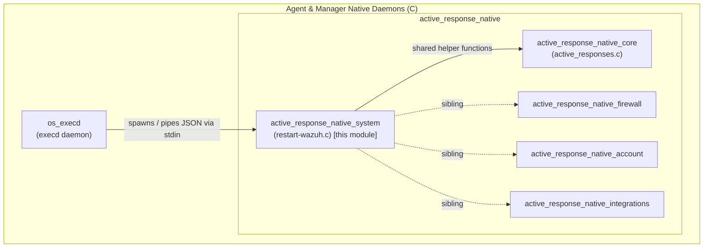
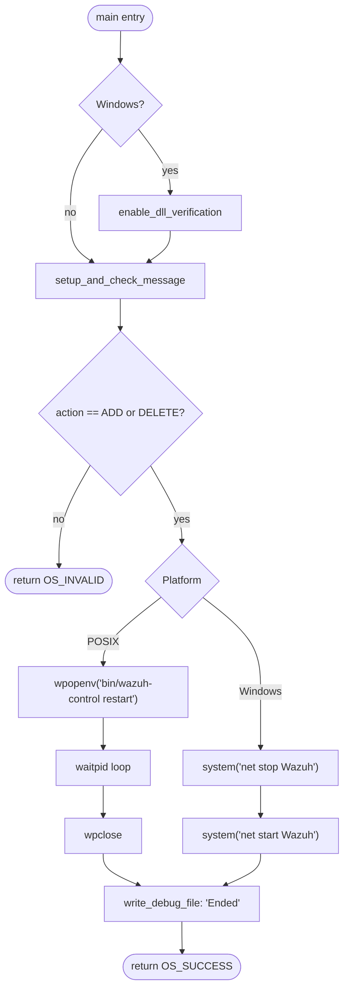
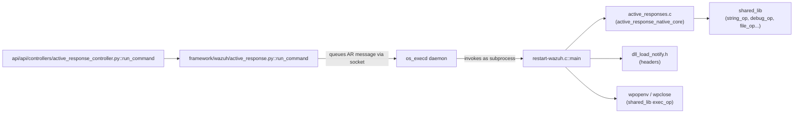
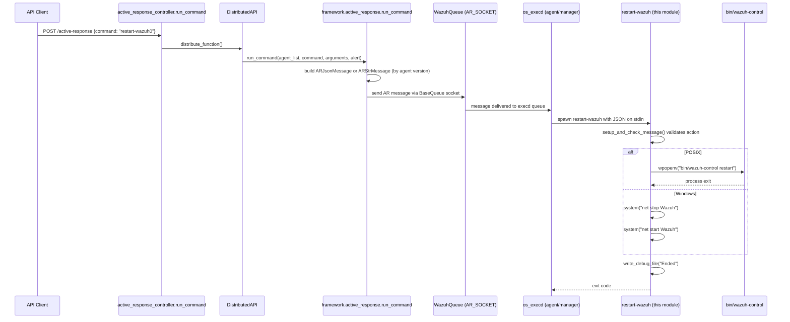

# Active Response Native System

## Introduction

The **Active Response Native System** module implements the native (C) executable that allows a Wazuh manager to **restart the Wazuh service on an agent or manager host** as an Active Response action. It is the simplest of the Active Response native binaries (see [Agent_&_Manager_Native_Daemons_(C).md](Agent_&_Manager_Native_Daemons_(C).md) for its sibling components), consisting of a single `main()` entry point that reads an Active Response request from `stdin`, validates it, and then triggers a full restart of the Wazuh service using the platform-appropriate mechanism (`bin/wazuh-control restart` on POSIX systems, or the Windows Service Control Manager via `net stop`/`net start` on Windows).

This module is a leaf component in the broader **Active Response** ecosystem. It is invoked exclusively by the `execd` daemon (part of [Agent_&_Manager_Native_Daemons_(C)](Agent_&_Manager_Native_Daemons_(C).md)) in response to a command dispatched from the Wazuh API/Framework layer (see [active_response_module.md](active_response_module.md)).

---

## Purpose and Core Functionality

`restart-wazuh.c` provides the `restart-wazuh` (or `restart-wazuh0`, `restart-wazuh.exe` on Windows) Active Response script/binary that is shipped with every Wazuh agent and manager installation. Its sole responsibility is:

1. Parse and validate the incoming Active Response JSON message (delegated to the shared `active_responses` library).
2. Determine whether the request is an **add** (execute) or **delete** (undo) command.
3. On execution, restart the local Wazuh service:
   - **POSIX/Linux/macOS**: spawn `bin/wazuh-control restart` as a child process and wait for its completion.
   - **Windows**: issue `net stop Wazuh` followed by `net start Wazuh` via `system()`.
4. Write a debug/status trace to the Active Response log for auditability.

Because restarting the Wazuh service has no meaningful "undo" action, both `ADD_COMMAND` and `DELETE_COMMAND` types are accepted, but only "add" results in an actual restart being triggered (the `DELETE_COMMAND` path simply logs and exits, following the common Active Response contract used across all native AR scripts).

---

## Architecture

### Component Placement

### Internal Flow

---

## Core Component

### `main()` — `src/active-response/restart-wazuh.c`

| Aspect | Details |
|---|---|
| **Entry point** | Standard C `main(argc, argv)`, invoked by `execd` as a subprocess |
| **Input** | Active Response JSON message read from `stdin` (parsed internally by `setup_and_check_message`) |
| **Output** | Process exit code (`OS_SUCCESS` / `OS_INVALID`) and a line in the AR debug log (`write_debug_file`) |
| **Platform branches** | `WIN32` macro toggles between POSIX process spawning (`wpopenv`/`wpclose`) and Windows `system()` calls |
| **External dependency** | `active_responses.h` — shared helper library providing `setup_and_check_message`, `write_debug_file`, and action constants (`ADD_COMMAND`, `DELETE_COMMAND`, `OS_INVALID`, `OS_SUCCESS`) |

Key implementation notes:
- `setup_and_check_message` (defined in the shared `active_responses.c`, part of `active_response_native_core`) performs JSON parsing, hostname/IP resolution (uses `struct addrinfo` internally), and action-type classification.
- The restart command on POSIX is executed via `wpopenv`, a wrapper around `popen`-like semantics defined in the Wazuh shared library (`src/shared/exec_op_wrappers.c` / `wm_exec.c` family), running with `W_BIND_STDERR` to capture error output.
- On Windows, `enable_dll_verification()` (from `dll_load_notify.h`) is called first as a security hardening measure to guard against DLL preloading attacks, a pattern shared with other native Windows executables in the codebase.
- The function does not distinguish behavior between `ADD_COMMAND` and `DELETE_COMMAND` beyond the initial validation — both trigger the same restart routine, since a "restart" action is idempotent and does not require a symmetric undo.

---

## Dependency Relationships

This module has **no direct dependency** on the Python API/Framework layer; the connection is purely at the *message protocol* level — the JSON/string message format produced by [active_response_module.md](active_response_module.md) (`ARJsonMessage` / `ARStrMessage`) is what `setup_and_check_message` parses on the native side.

---

## End-to-End Process Flow (API → Agent Restart)

---

## Related Modules

| Module | Relationship |
|---|---|
| [active_response_module.md](active_response_module.md) | Python API/Framework layer that builds and dispatches the Active Response messages (`ARJsonMessage`, `ARStrMessage`, `run_command`) consumed by this native binary. |
| [Agent_&_Manager_Native_Daemons_(C).md](Agent_&_Manager_Native_Daemons_(C).md) | Parent grouping containing `active_response_native` (siblings: firewall, account-disabling, and third-party integration AR scripts) and the `os_execd` daemon that invokes this binary. |
| `active_response_native_core` (`active_responses.c`) | Shared helper library providing message parsing/validation (`setup_and_check_message`) and logging (`write_debug_file`) utilities used by **all** native Active Response scripts, including this one. |
| `os_execd` (`src/os_execd/`) | The daemon responsible for receiving AR requests over the internal socket and spawning the appropriate native AR executable (e.g., this `restart-wazuh` binary) as a subprocess. |
| [Configuration_Data_Structures_(C_Headers).md](Configuration_Data_Structures_(C_Headers).md) (`Active_Response_Config`) | Defines the `active-response.h` structures (`_ar`, `_ar_command`) used to configure which AR commands (including `restart-wazuh`) are enabled/mapped in `ossec.conf`. |

---

## Security Considerations

- On Windows, `enable_dll_verification()` is invoked as the very first instruction to mitigate DLL search-order hijacking, consistent with hardening practices applied across other Wazuh native Windows binaries.
- The restart action is a **privileged operation** — it can stop and start the entire Wazuh service. Execution is gated by the Active Response subsystem's RBAC checks at the API layer (`rbac_permissions` in `active_response_controller.run_command`) and by the `AR_SOCKET` being a locally-restricted UNIX socket (or named pipe on Windows) only writable by the local Wazuh manager/agent processes.
- No arguments/alert content from the AR message influence which command is executed (no argument injection surface) — the executed command is a fixed string (`bin/wazuh-control restart` / `net stop|start Wazuh`), reducing risk of command injection.
