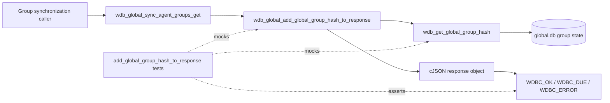
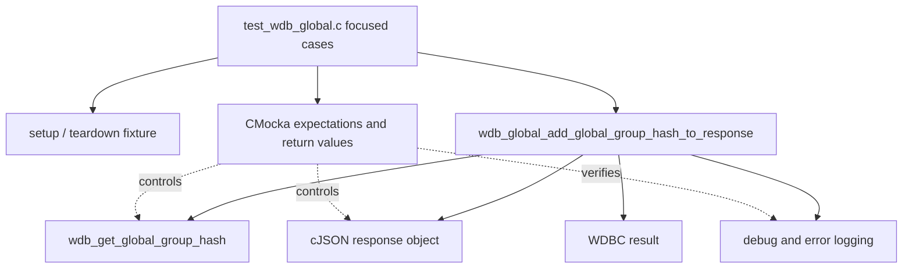
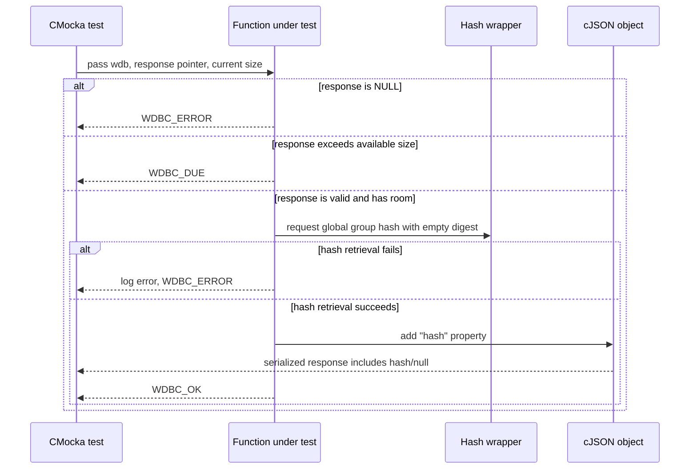

# `add_global_group_hash_to_response_tests`

## Introduction

`add_global_group_hash_to_response_tests` documents the CMocka coverage for `wdb_global_add_global_group_hash_to_response()`. The function enriches an existing JSON response with the manager-wide agent-group hash used during group synchronization. These tests verify input validation, response-size protection, successful hash retrieval, and retrieval failure handling.

The cases are implemented in [`src/unit_tests/wazuh_db/test_wdb_global.c`](../../src/unit_tests/wazuh_db/test_wdb_global.c). They are registered as part of the larger [`test_wdb_global`](test_wdb_global.md) suite, whose database, synchronization, and wrapper conventions are not duplicated here.

## Purpose and scope

The module tests a small response-decoration boundary:

1. Reject a missing JSON response pointer.
2. Return `WDBC_DUE` when adding the hash would exceed `WDB_MAX_RESPONSE_SIZE`.
3. Retrieve the global group hash and add it to the response.
4. Propagate a failure from `wdb_get_global_group_hash()`.

The success test also captures an important behavior: if hash retrieval succeeds but produces no usable hash value, the response still receives a `"hash": null` property and the operation returns `WDBC_OK`.

## Position in the Wazuh DB flow

The production function belongs to the global database implementation. It is typically used after a group-synchronization response has been assembled, allowing a caller to compare its known hash with the manager’s current hash.



The broader synchronization workflow—including conditions, pagination, agent groups, and sync status—is covered by [`test_wdb_global`](test_wdb_global.md) and [`wazuh_db_global`](wazuh_db_global.md).

## Components and dependencies

| Component | Responsibility in these tests |
|---|---|
| `test_wdb_global.c` | Defines the three focused test cases and registers them with CMocka. |
| `test_setup` / `test_teardown` | Allocates a minimal `test_struct_t`, `wdb_t`, output buffer, and database handle; initializes and frees Wazuh DB configuration. |
| `wdb_global_add_global_group_hash_to_response` | Function under test; validates the response, checks available space, obtains the hash, and mutates the JSON object. |
| `wdb_get_global_group_hash` wrapper | Supplies success or failure for hash calculation/retrieval and verifies the requested digest buffer. |
| cJSON | Creates, mutates, prints, and deletes the response object. |
| Debug/error wrappers | Verify diagnostic messages for invalid input and hash retrieval failure. |
| `wazuhdb_op.h` | Provides Wazuh DB result types such as `WDBC_OK`, `WDBC_DUE`, and `WDBC_ERROR`. |



No real SQLite connection, socket, filesystem, or cluster service is required. The hash provider and JSON deletion path are isolated with linker wrappers, keeping the tests deterministic.

## Function contract exercised by the tests

Conceptually, the tested function behaves as follows:

```text
wdb_global_add_global_group_hash_to_response(wdb, &response, response_size)

if response is NULL:
    log "Invalid JSON object."
    return WDBC_ERROR

if response_size is too close to WDB_MAX_RESPONSE_SIZE:
    return WDBC_DUE

if wdb_get_global_group_hash(wdb, digest) fails:
    log "Cannot obtain the global group hash"
    return WDBC_ERROR

add response["hash"] = digest-or-null
return WDBC_OK
```

The exact hash algorithm and global-group state calculation are implementation concerns of `wdb_get_global_group_hash()` and the global DB module; see [`wazuh_db_global`](wazuh_db_global.md) rather than this test-focused document.

## Test scenarios

### Null response

`test_wdb_global_add_global_group_hash_to_resposne_response_null` passes `NULL` instead of a response object. The function must not dereference it, must log `Invalid JSON object.`, and must return `WDBC_ERROR`.

### Response-size due condition

`test_wdb_global_add_global_group_hash_to_resposne_response_due` passes `WDB_MAX_RESPONSE_SIZE - 1`. The function returns `WDBC_DUE` without attempting hash retrieval. The existing JSON object remains owned by the test and is explicitly deleted during cleanup.

### Hash retrieval succeeds with a null value

`test_wdb_global_add_global_group_hash_to_resposne_get_hash_return_null` configures the hash wrapper to return `OS_SUCCESS` while leaving the digest effectively empty/unavailable. The expected serialized response is:

```json
{"hash":null}
```

This verifies that a successful enrichment can represent an absent hash as JSON `null`, rather than failing or omitting the field.

### Hash retrieval fails

`test_wdb_global_add_global_group_hash_to_resposne_get_hash_error` configures `wdb_get_global_group_hash()` to return `OS_INVALID`. The function logs `Cannot obtain the global group hash`, returns `WDBC_ERROR`, and leaves response ownership with the caller/test fixture.

## Main response flow



## Fixture and ownership model

```mermaid
flowchart TD
    Start[CMocka starts case] --> Setup[test_setup]
    Setup --> WDB[allocate wdb_t and id="global"]
    Setup --> Out[allocate output buffer]
    Setup --> Conf[wdb_init_conf]
    WDB --> Case[configure wrapper expectations and invoke function]
    Out --> Case
    Conf --> Case
    Case --> Assert[assert result and JSON when applicable]
    Assert --> Delete[delete cJSON response]
    Delete --> Teardown[test_teardown]
    Teardown --> Free[free buffers, wdb, id, db]
    Free --> End[wdb_free_conf; case complete]
```

The function receives a pointer to the response pointer (`cJSON **`), but the tests retain ownership of the response and delete it after assertions. Wrapper expectations for the hash call are scoped to the cases that should reach the provider; the null-input and due cases prove that the provider is bypassed.

## Result and error matrix

| Scenario | Hash provider called | JSON mutation | Expected result | Diagnostic assertion |
|---|---:|---|---|---|
| Response pointer is `NULL` | No | None | `WDBC_ERROR` | `Invalid JSON object.` |
| Size is `WDB_MAX_RESPONSE_SIZE - 1` | No | None | `WDBC_DUE` | None |
| Hash provider succeeds, no digest value | Yes | Adds `hash: null` | `WDBC_OK` | None |
| Hash provider returns `OS_INVALID` | Yes | Not asserted as mutated | `WDBC_ERROR` | `Cannot obtain the global group hash` |

## Maintenance notes

- The three function names contain the source typo `resposne`; preserve the names when locating or registering the tests, but use “response” in documentation.
- Changes to the response-size threshold should be reflected in the due test and in related pagination tests such as `test_wdb_global_sync_agent_groups_get_due_buffer_full`.
- Changes to global hash generation belong in the global DB implementation and its hash-related tests, especially [`recalculate_all_agent_groups_hash_tests`](recalculate_all_agent_groups_hash_tests.md) and [`update_agent_groups_hash_tests`](update_agent_groups_hash_tests.md).
- Changes to CMocka wrapper behavior should be coordinated with [`test_wdb_global_test_infrastructure`](test_wdb_global_test_infrastructure.md) and [`wazuh_db_wrappers_global`](wazuh_db_wrappers_global.md).

## Source references

- [`test_wdb_global.c`](../../src/unit_tests/wazuh_db/test_wdb_global.c)
- [`test_wdb_global`](test_wdb_global.md)
- [`wazuh_db_global`](wazuh_db_global.md)
- [`test_wdb_global_test_infrastructure`](test_wdb_global_test_infrastructure.md)
- [`wazuh_db_wrappers_global`](wazuh_db_wrappers_global.md)
