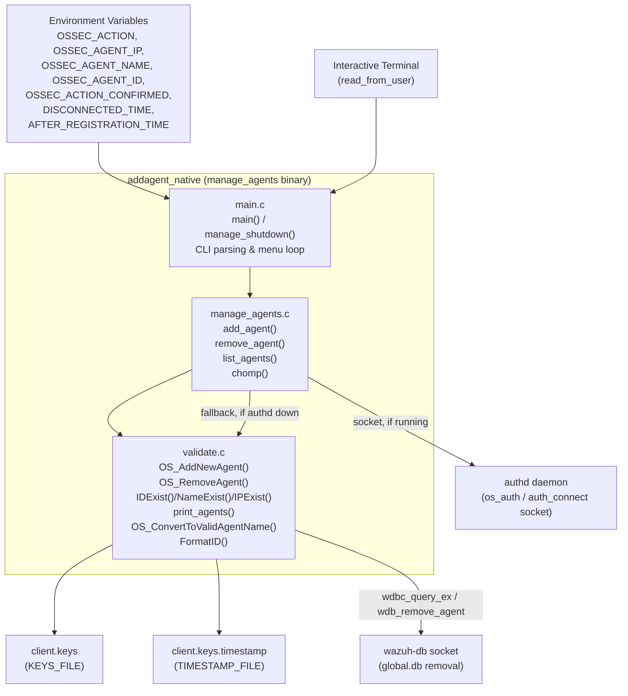
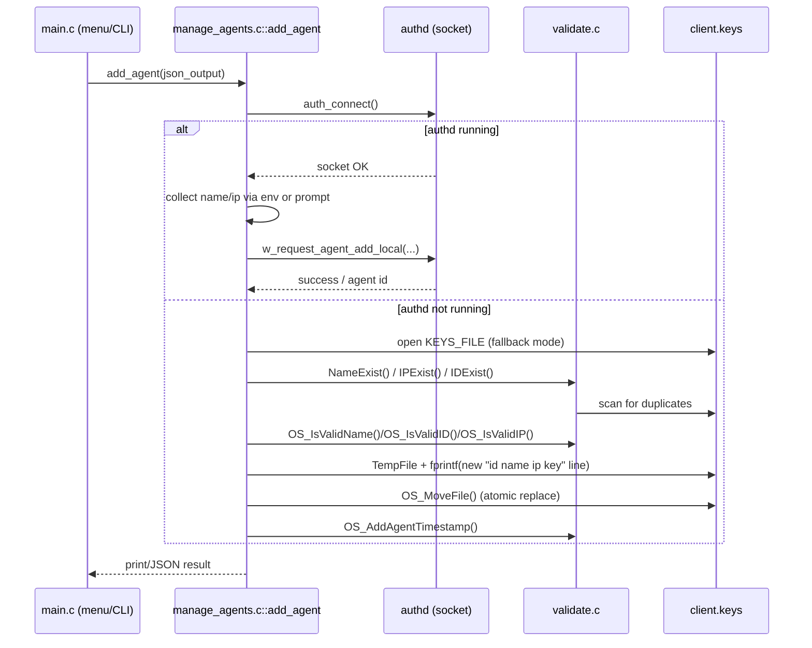
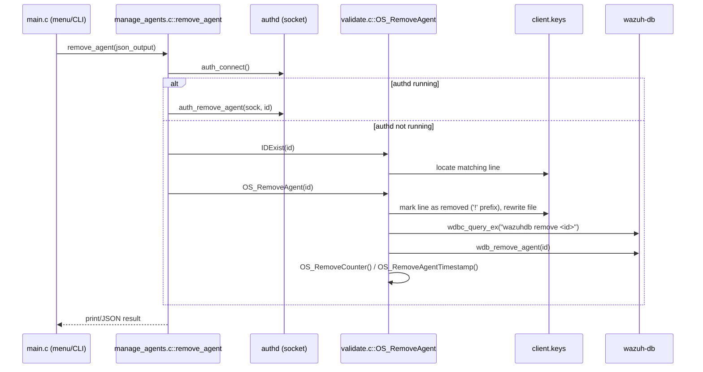

# addagent_native — Agent Key Management CLI (`manage_agents`)

## 1. Purpose and Overview

`addagent_native` is the native C implementation of the **`manage_agents`** tool (historically
invoked as `agent-auth`'s sibling utility, built from `src/addagent/*.c`). It is the low-level,
file-based mechanism by which a Wazuh **manager** registers, lists, and removes agents by
directly manipulating the `client.keys` (`KEYS_FILE`) file, and by which a Wazuh **agent**
imports a key delivered out-of-band.

It is compiled into the `manage_agents` executable (also aliased for scripted use as
`OSSEC_ACTION`-driven CLI, e.g. from `agent_control` wrappers) and is one of the oldest
components in the codebase, predating the modern `authd` (`os_auth`) enrollment service and the
RESTful Agent API. It still ships today as:

* A **manual/interactive tool** for administrators to add, list, or remove agents on the manager,
  or import a key on the agent, via a menu-driven prompt.
* A **scriptable tool**, driven entirely through environment variables
  (`OSSEC_ACTION`, `OSSEC_AGENT_IP`, `OSSEC_AGENT_NAME`, `OSSEC_AGENT_ID`,
  `OSSEC_ACTION_CONFIRMED`, `DISCONNECTED_TIME`, `AFTER_REGISTRATION_TIME`) so that other
  components (installation scripts, the Framework's `framework/wazuh/agent.py`, or `authd`) can
  invoke it non-interactively.
* A **fallback path** used when `authd` (the socket-based enrollment daemon, see
  [`os_auth`](os_auth.md)) is not running: in that case
  `manage_agents` writes directly to `client.keys` instead of delegating to the daemon.

Conceptually, this module sits at the boundary between the **CLI/administration layer** and the
**agent key store** (`headers/sec.h::keystore`, implemented in
[`shared_lib`](shared_lib.md)'s `os_crypto/shared/keys.c`), and it cooperates with the
**Wazuh DB** subsystem (`wazuh_db`) to keep the `global.db` agent registry consistent when agents
are removed.

## 2. Module Composition

The module is made up of exactly three C source files, compiled together into one binary:

| File | Responsibility |
|---|---|
| `src/addagent/main.c` | Program entry point, CLI argument parsing (`getopt`), interactive menu loop, signal handling, privilege drop / chroot setup. |
| `src/addagent/manage_agents.c` | High-level business logic for the three primary actions: `add_agent()`, `remove_agent()`, `list_agents()`. Talks to `authd` via socket when available, otherwise falls back to direct file manipulation. |
| `src/addagent/validate.c` | Low-level validation, ID/name/IP lookup, and `client.keys` file mutation primitives: `OS_AddNewAgent`, `OS_RemoveAgent`, `IDExist`, `NameExist`, `IPExist`, `print_agents`, timestamp bookkeeping, and name sanitization (`OS_ConvertToValidAgentName`). |

Because these three files implement a single indivisible workflow (parse → dispatch → validate →
mutate `client.keys`), they are documented together rather than split into separate sub-module
pages.

## 3. Architecture

### 3.1 Component / call diagram



### 3.2 Process flow — Add Agent



### 3.3 Process flow — Remove Agent



## 4. Detailed Component Responsibilities

### 4.1 `main.c` — Entry Point & CLI Shell

* **`main(int argc, char **argv)`**
  - Sets up the process name, home directory, and (on non-Windows) chroots into the Wazuh home
    directory after resolving group privileges (`Privsep_GetGroup`/`Privsep_SetGroup`), mirroring
    the privilege-separation pattern used across all native daemons (see
    [`client_agent_native`](client_agent_native.md) and
    [`shared_lib`](shared_lib.md)'s `privsep_op.c`).
  - Parses CLI flags via `getopt`: `-V` (version), `-h` (help), `-l` (list), `-a`/`-n` (add agent
    IP/name), `-e` (export key, manager only), `-r` (remove, manager only), `-i` (import key,
    agent only), `-f` (bulk load from file), `-R`/`-D` (force-replace thresholds), `-j` (JSON
    output).
  - Each flag is translated into environment variables (`OSSEC_ACTION`, `OSSEC_AGENT_IP`, etc.)
    consumed later by `manage_agents.c`, enabling both direct CLI use and pure environment-driven
    scripting.
  - Blocks running on a cluster **worker** node (manager-only actions are rejected via
    `w_is_worker()`), directing the operator to the master node instead — this ties into the
    [`cluster_high_level_api`](cluster_high_level_api.md) for node role detection.
  - Falls into an interactive prompt loop (`read_from_user()`) if no action was pre-selected via
    environment variables, offering a text menu: Add, Extract key, Import key, List, Remove, Quit.
* **`manage_shutdown(int sig)`**
  - POSIX signal handler registered via `StartSIG2`, ensuring a clean, message-printing exit on
    SIGINT/SIGTERM rather than an abrupt kill.

### 4.2 `manage_agents.c` — Action Orchestration

* **`add_agent(int json_output)`**
  - Builds an `authd_force_options_t` from `DISCONNECTED_TIME` / `AFTER_REGISTRATION_TIME`
    environment variables (mirrors options in
    [`Authd_Config`](Authd_Config.md) header `authd-config.h::authd_force_options_t`).
  - Attempts `auth_connect()`; if `authd` is reachable, delegates all validation/registration
    work to it via `w_request_agent_add_local()` (keeping this tool a thin client of the
    daemon — see [`os_auth`](os_auth.md)).
  - If `authd` is not running, performs the entire legacy workflow itself:
    1. Prompts/reads name, validates via `validate.c::OS_IsValidName` / `NameExist`.
    2. Prompts/reads IP, validates via `OS_IsValidIP` / `IPExist`; if a duplicate IP is found,
       applies the same force-replace decision logic authd uses (checking
       `connection_status`, `disconnection_time`, `date_add` from `wdb_get_agent_info`) before
       optionally calling `OS_RemoveAgent()` on the stale entry.
    3. Computes a random 128-hex-character pre-shared key using two rounds of MD5 seeded by
       timestamps, PIDs, and OS entropy (`os_random()`), mirroring the (legacy) key-derivation
       scheme also implemented in `os_crypto/shared/keys.c` (see
       [`shared_lib`](shared_lib.md)).
    4. Writes a new line (`id name ip key`) atomically to `client.keys` via `TempFile()` +
       `OS_MoveFile()`.
    5. Persists a registration timestamp with `OS_AddAgentTimestamp()`.
  - Supports plain-text and `-j` JSON output modes, with numeric error codes (71, 75–80) for
    machine-parseable failures (duplicate name, invalid name, invalid IP, duplicate IP, lost
    socket connection, etc.) — these are the same codes consumed by higher-level Python tooling
    in [`agent_module_core`](agent_module_core.md) (`framework/wazuh/agent.py`).
* **`remove_agent(int json_output)`**
  - Symmetric to `add_agent`: connects to `authd` if available and delegates via
    `auth_remove_agent()`; otherwise validates the ID with `IDExist()` and calls
    `OS_RemoveAgent()` directly.
* **`list_agents(int cmdlist)`**
  - Thin wrapper around `validate.c::print_agents()`.
* **`chomp(char *str)`**
  - Utility to strip leading/trailing whitespace and CR/LF from interactive input.

### 4.3 `validate.c` — Key-Store Primitives & Validation

This file contains the actual `client.keys` file-format logic — the same flat-file format
consumed by [`headers`](headers.md) (`sec.h::keystore`/`keyentry` structures) and by the
runtime key-loading code in `shared_lib`'s `os_crypto/shared/keys.c`.

* **`OS_AddNewAgent(keystore *keys, ...)`** — in-memory variant used when a `keystore` structure
  (rather than the raw file) is the target; auto-generates an ID (`id_counter`) and/or key when
  not supplied. Used by callers that already hold a loaded `keystore` (e.g., bulk load).
* **`OS_RemoveAgent(const char *u_id)`** *(manager only)* — Locates the agent's `client.keys` line
  by seeked file position (`fp_pos`, set by a prior `IDExist()` call), rewrites the file marking
  the entry with a leading `!` to logically delete it, deletes the agent's file-integrity diff
  cache (`delete_diff()`), and performs a **two-stage database cleanup**:
  1. `wdbc_query_ex("wazuhdb remove <id>")` — removes the agent's dedicated `agents/<id>.db`.
  2. `wdb_remove_agent(atoi(u_id), &sock)` — removes the corresponding row/metadata from
     `global.db` (see [`wazuh_db`](wazuh_db.md) and its helper `wdb_global_helpers.c`).
  Finally cleans up ID counters and timestamp bookkeeping.
* **`OS_IsValidID` / `OS_IsValidName` / `OS_ConvertToValidAgentName`** — format validators; the
  latter actively strips invalid characters in-place (used by callers that want to *sanitize*
  rather than *reject* a name).
* **`IDExist` / `NameExist` / `IPExist`** — linear scans of `client.keys` for duplicate detection;
  `IPExist` returns the conflicting agent's ID string (caller-owned, must be freed) enabling the
  force-replace workflow in `add_agent()`.
* **`getNameById` / `FormatID`** — small lookup/formatting helpers (e.g., zero-padding numeric
  IDs to 3 digits).
* **`print_agents(...)`** — Iterates `client.keys`, optionally cross-referencing live
  `connection_status` per agent (`get_agent_status()`, manager-only) to render plain text, CSV, or
  a `cJSON` array — this is the backing implementation for the `-l` list action and for the
  companion [`util_cli_tools`](util_cli_tools.md) (`src/util/list_agents.c`,
  `src/util/agent_control.c`).
* **`OS_AddAgentTimestamp` / `OS_RemoveAgentTimestamp`** — maintain
  `client.keys.timestamp`, a side file recording exact registration times, used by tools that
  need registration age (e.g., the `-R`/`AFTER_REGISTRATION_TIME` force-replace check).

## 5. Data Model

The module operates directly on the flat-file, whitespace-delimited `client.keys` format:

```
<id> <name> <ip|any> <key>
```

* A leading `#` or `!` on the *name* field marks a logically removed/disabled entry (never
  physically deleted, to preserve ID history and prevent ID reuse collisions).
* This format is the canonical on-disk representation consumed by the manager's `remoted`
  daemon (see [`remoted`](remoted.md)) and by agents at connection time (see
  [`client_agent_native`](client_agent_native.md)).

## 6. Key Interactions with Other Modules

| Related Module | Interaction |
|---|---|
| [`os_auth`](os_auth.md) | Preferred code path: `manage_agents` acts as a thin CLI client of the `authd` socket protocol (`auth_connect`, `w_request_agent_add_local`, `auth_remove_agent`) whenever the daemon is running. |
| [`shared_lib`](shared_lib.md) | Provides `os_crypto/shared/keys.c` (`OS_AddKey`, `OS_WriteKeys`) and `privsep_op.c` used indirectly through shared headers/logic; also provides `TempFile`, `OS_MoveFile`, MD5 primitives. |
| [`headers`](headers.md) | Defines `keystore`/`keyentry` (`sec.h`) — the in-memory counterpart of the `client.keys` file this module edits directly. |
| [`wazuh_db`](wazuh_db.md) | `OS_RemoveAgent()` calls into `wdbc_query_ex` and `wdb_remove_agent` to purge per-agent and `global.db` state on removal. |
| [`agent_module_core`](agent_module_core.md) (`framework/wazuh/agent.py`) | The Python Framework/API layer shells out to (or historically wrapped) this same `manage_agents` binary and its environment-variable contract for legacy agent add/remove flows. |
| [`util_cli_tools`](util_cli_tools.md) | `src/util/agent_control.c` and `list_agents.c` share the same `print_agents()`-style listing conventions and `client.keys` access patterns. |
| [`cluster_high_level_api`](cluster_high_level_api.md) | `main.c` calls `w_is_worker()` to prevent manager-only actions from running on cluster worker nodes. |
| [`Authd_Config`](Authd_Config.md) | Shares the `authd_force_options_t` semantics (`disconnected_time`, `after_registration_time`) used to decide whether a duplicate-IP agent may be replaced. |

## 7. Operational Notes

* This is a **legacy fallback mechanism**: on any properly configured manager with `authd`
  running, all real validation/business logic executes inside the daemon, and this binary is
  reduced to a socket client. The direct-file-editing code paths in `validate.c` only activate
  when `authd` is down — an important resiliency property, but also a source of potential
  drift if the two implementations (`authd` vs. this module) diverge in validation rules.
* All destructive actions (`remove_agent`) require explicit confirmation
  (`OSSEC_ACTION_CONFIRMED=y`) either interactively or via environment variable, preventing
  accidental agent deletion during scripted/automated invocations.
* JSON output mode (`-j`) with numeric error codes is designed for consumption by other Wazuh
  components (the Python Framework, install scripts) rather than direct human use.
