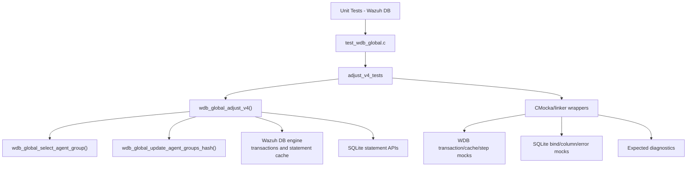
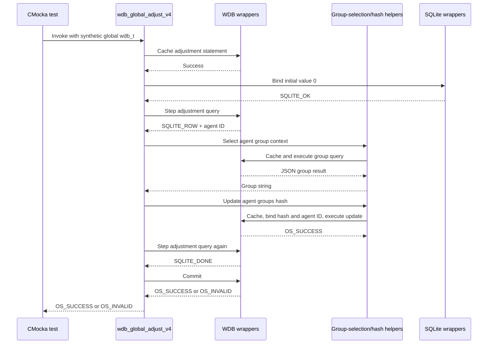
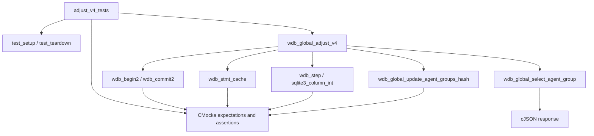
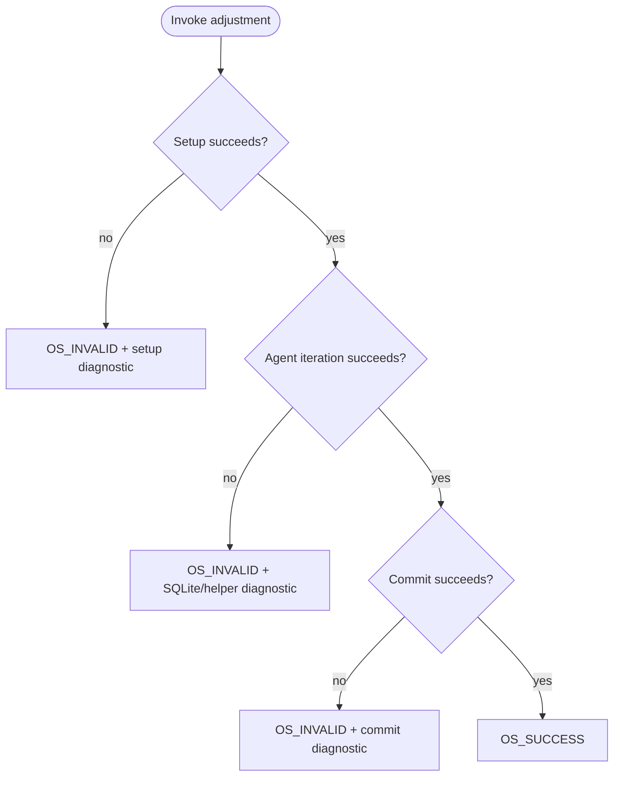

# `adjust_v4_tests`

## Introduction

`adjust_v4_tests` is the focused CMocka test group for `wdb_global_adjust_v4()` in `src/unit_tests/wazuh_db/test_wdb_global.c`. The function performs a version-adjustment operation over agents in the global Wazuh database: it identifies eligible agents, derives each agent's current group representation, updates the stored group hash, and commits the transaction.

The module verifies the operation's transaction, statement-cache, SQLite binding, row-iteration, per-agent hash-update, and commit behavior. It does not open a real database. All database interactions are controlled through linker-wrapped Wazuh DB, SQLite, cJSON, and logging functions. For shared fixture and wrapper details, see [`test_wdb_global_test_infrastructure.md`](test_wdb_global_test_infrastructure.md) and [`wazuh_db_wrappers_global.md`](wazuh_db_wrappers_global.md).

## Position in the system

`adjust_v4_tests` belongs to the Wazuh DB unit-test hierarchy and exercises one migration/integrity path in the global database implementation. The production context and surrounding operations are described in [`wazuh_db_global.md`](wazuh_db_global.md); the complete global-operation test module is documented in [`test_wdb_global.md`](test_wdb_global.md).



## Responsibilities and scope

The test group covers two externally visible outcomes:

| Scenario | Expected result |
|---|---|
| The adjustment completes for the returned agent rows and the final commit succeeds | `OS_SUCCESS` |
| Any setup, SQL iteration, or final commit step fails | `OS_INVALID` |

The tests also establish the expected orchestration:

1. The `wdb_t` context is already in a transaction when the adjustment starts. The tests set `data->wdb->transaction = 1`, so the function is evaluated in its normal caller-managed transaction context.
2. The function obtains and caches the adjustment statement.
3. It binds an initial cursor/value of `0`.
4. It iterates returned agent IDs using `wdb_step()` and `sqlite3_column_int()`.
5. For each agent, it reads the agent's group data and updates its group hash.
6. It continues until `SQLITE_DONE`, then commits with `wdb_commit2()`.

```mermaid
flowchart LR
    Start([wdb_global_adjust_v4]) --> Cache["Cache adjustment statement"]
    Cache --> Bind["Bind initial cursor: 0"]
    Bind --> Step{ "wdb_step()" }
    Step -->|SQLITE_ROW| Agent["Read agent ID"]
    Agent --> Groups["Select agent groups"]
    Groups --> Hash["Calculate/update groups hash"]
    Hash --> Step
    Step -->|SQLITE_DONE| Commit["Commit transaction"]
    Commit --> Success([OS_SUCCESS])
    Cache -.failure.-> Error([OS_INVALID])
    Bind -.failure.-> Error
    Step -.SQL error.-> Error
    Groups -.failure.-> Error
    Hash -.failure.-> Error
    Commit -.failure.-> Error
```

The exact SQL text and statement identifiers are intentionally not duplicated here; they are implementation details owned by [`wazuh_db_global.md`](wazuh_db_global.md) and the Wazuh DB engine documentation.

## Test cases

The module registers six tests for `wdb_global_adjust_v4()`:

| Test | Branch exercised | Assertion |
|---|---|---|
| `test_wdb_global_adjust_v4_begin_failed` | Transaction initialization fails when no transaction is active | `OS_INVALID`; logs `Cannot begin transaction` |
| `test_wdb_global_adjust_v4_cache_failed` | Statement caching fails | `OS_INVALID`; logs `Cannot cache statement` |
| `test_wdb_global_adjust_v4_bind_failed` | Initial integer binding fails | `OS_INVALID`; logs the SQLite error returned by `sqlite3_errmsg()` |
| `test_wdb_global_adjust_v4_step_failed` | Agent-selection statement returns a SQLite step error | `OS_INVALID`; logs `SQLite: ERROR MESSAGE` |
| `test_wdb_global_adjust_v4_commit_fail` | Agent processing succeeds but the final commit fails | `OS_INVALID`; logs `DB(global) The commit statement could not be executed.` |
| `test_wdb_global_adjust_v4_success` | Agent processing reaches `SQLITE_DONE` and commit succeeds | `OS_SUCCESS` |

The begin-failure case deliberately sets `transaction = 0`, while the other cases set `transaction = 1` and begin at statement caching. This isolates the transaction-start branch from the rest of the workflow.

## Successful interaction model

The success and commit-failure tests script the same multi-component interaction. A single agent ID is returned by the adjustment query. The function then calls the existing group-selection path, which returns a JSON object containing a group string, and calls the group-hash update path with the derived hash and agent ID.



## Dependency boundaries

The tests use the shared `test_setup`/`test_teardown` fixture. It creates a minimal `wdb_t` with ID `global`, allocates a synthetic SQLite handle slot, initializes Wazuh DB configuration, and releases all state after each test. See [`test_wdb_global_test_infrastructure.md`](test_wdb_global_test_infrastructure.md).

The direct dependency surface is:

| Dependency | Role in these tests |
|---|---|
| Wazuh DB wrappers | Control transaction state, statement caching, stepping, group queries, hash updates, and commit results |
| SQLite wrappers | Validate the initial integer bind and returned agent-column access; provide deterministic error text |
| cJSON wrappers/real cJSON | Supply the synthetic group query response and verify cleanup |
| Debug/error logging wrappers | Verify operational diagnostics for every failure branch |
| `wdb.h` and `wazuhdb_op.h` | Provide production declarations, result constants, and Wazuh DB types |



## Error propagation contract

The test matrix demonstrates a fail-fast contract. Setup and SQL failures return `OS_INVALID` immediately. A failure in the nested group/hash path also prevents successful completion. A commit failure is reported even after all agent processing has succeeded, so callers cannot treat an uncommitted adjustment as valid.

Diagnostics are part of the tested behavior:

- Transaction and statement-cache failures use debug-level messages.
- SQLite binding failures include the database error text.
- Step failures use the `SQLite: ...` diagnostic form.
- Commit failure identifies the global database and the failed commit operation.



## Test registration and maintenance

All six cases are registered in `main()` with `cmocka_unit_test_setup_teardown`, so each receives an isolated fixture. When extending this module:

- Keep one test focused on one failure boundary.
- Preserve the scripted call order for nested group-selection and hash-update operations.
- Assert both return code and diagnostic text when the branch has an operational error.
- Use real cJSON objects only where nested production code needs structured data, and release them after the call.
- Add broader behavior tests to [`test_wdb_global.md`](test_wdb_global.md) and keep this module focused on the v4 adjustment path.

## Related documentation

- [`test_wdb_global.md`](test_wdb_global.md) — complete global database test coverage.
- [`test_wdb_global_test_infrastructure.md`](test_wdb_global_test_infrastructure.md) — fixture lifecycle and composite wrapper helpers.
- [`wazuh_db_global.md`](wazuh_db_global.md) — production global database architecture and group-hash responsibilities.
- [`wazuh_db_engine.md`](wazuh_db_engine.md) — transaction, statement-cache, and SQLite engine behavior.
- [`wazuh_db_wrappers_global.md`](wazuh_db_wrappers_global.md) — global Wazuh DB wrapper boundaries.
- [`Unit_Tests_-_Wazuh_DB.md`](Unit_Tests_-_Wazuh_DB.md) — parent unit-test suite.

## Source references

- `src/unit_tests/wazuh_db/test_wdb_global.c`
- `src/wazuh_db/wdb_global.c`
- `src/wazuh_db/wdb.h`
- `src/unit_tests/wrappers/wazuh/wazuh_db/wdb_wrappers.h`
- `src/unit_tests/wrappers/externals/sqlite/sqlite3_wrappers.h`
