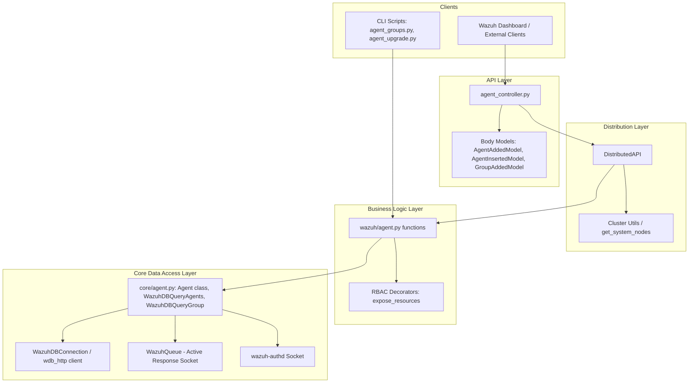
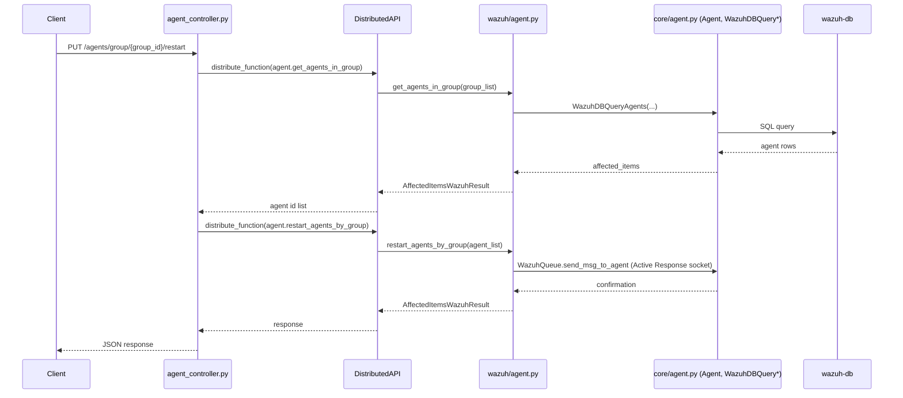
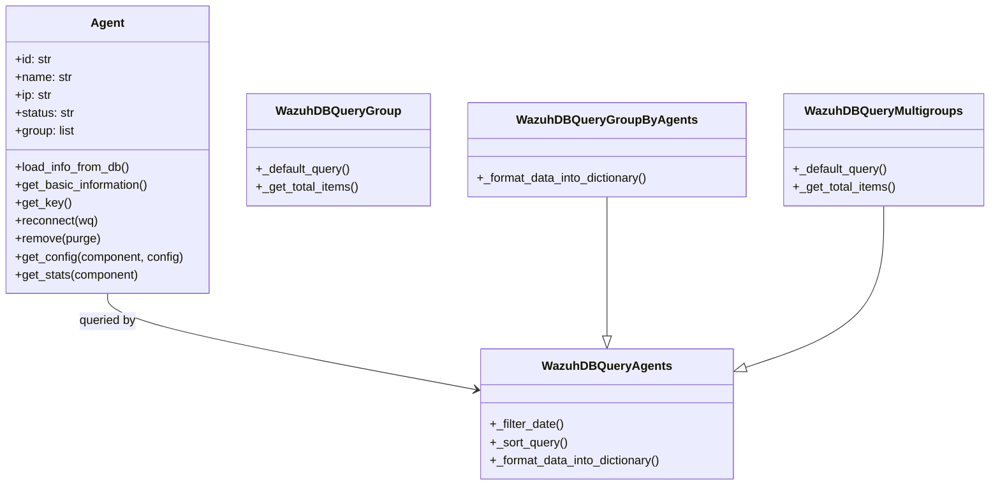

# Agent Module

## 1. Introduction and Purpose

The **Agent Module** is the core subsystem of the Wazuh API/Framework responsible for the full lifecycle management of Wazuh agents: registration, grouping, configuration distribution, upgrading, monitoring, and removal. It exposes this functionality through:

- A REST **API layer** (Connexion/aiohttp controllers and request/response models) that external clients (Wazuh Dashboard, integrations, CLI tools) use to manage agents.
- A **framework/business-logic layer** that implements the actual operations (validating input, enforcing RBAC, orchestrating distributed calls across cluster nodes, and talking to `wazuh-db`).
- A **core data-access layer** that defines the `Agent` domain object and the SQL/`wazuh-db` query builders used to read and write agent and group data.
- A set of **command-line scripts** (`agent_groups.py`, `agent_upgrade.py`) that wrap the same business logic for administrators operating directly on the manager.

This module is a direct dependency of many other functional modules (SCA, syscheck, rootcheck, syscollector, MITRE, decoders, rules, etc.) because virtually every per-agent operation in Wazuh (config retrieval, stats, group membership) ultimately calls into `wazuh.agent` / `wazuh.core.agent`.

## 2. Architecture Overview

The Agent Module follows the same layered pattern used throughout the Wazuh Framework/API:

### Layer Responsibilities

| Layer | Files | Responsibility |
|---|---|---|
| API Controllers | `agent_controller.py` | Parses HTTP requests, builds `DistributedAPI` calls, formats JSON responses |
| API Models | `agent_added_model.py`, `agent_inserted_model.py`, `agent_group_added_model.py` | Validate and structure request bodies for agent/group creation |
| Business Logic | `wazuh/agent.py` | Implements agent/group operations, applies RBAC via `@expose_resources`, coordinates upgrade tasks |
| Core Data Access | `wazuh/core/agent.py` | Defines the `Agent` class and `WazuhDBQuery*` subclasses that build SQL queries executed against `wazuh-db` |
| CLI Tools | `scripts/agent_groups.py`, `scripts/agent_upgrade.py` | Command-line front-ends that call the same business-logic functions used by the API, useful for local administration without going through the REST API |

## 3. Sub-modules

The Agent Module is split into the following documented sub-modules:

1. **[agent_module_api](agent_module_api.md)** — REST API controllers and request body models used to expose agent and agent-group endpoints (`/agents`, `/groups`, upgrade endpoints, etc.).
2. **[agent_module_core](agent_module_core.md)** — Business-logic (`wazuh/agent.py`) and core data-access (`wazuh/core/agent.py`) layers: the `Agent` domain object, `WazuhDBQuery*` classes, group management, and agent-upgrade orchestration.
3. **[agent_module_cli](agent_module_cli.md)** — Standalone administrative CLI scripts (`agent_groups.py`, `agent_upgrade.py`) for group and upgrade management from the manager's command line.

## 4. High-Level Data Flow

### Example: Restart Agents by Group (End-to-End)

## 5. Key Concepts

- **RBAC enforcement**: Nearly every function in `wazuh/agent.py` is decorated with `@expose_resources` (see [security_rbac_module](security_rbac_module.md)), which filters the requested resources (agent IDs / group names) against the caller's permitted resources before execution.
- **Distributed execution**: API controllers never call `wazuh/agent.py` functions directly; they always go through `DistributedAPI` (see [cluster_dapi](cluster_dapi.md) in the [cluster_module](cluster_module.md)) so requests can be transparently forwarded to the master node or broadcast to worker nodes in a clustered deployment.
- **wazuh-db backed queries**: All agent/group listing and filtering use `WazuhDBQuery` subclasses (`WazuhDBQueryAgents`, `WazuhDBQueryGroup`, `WazuhDBQueryGroupByAgents`, `WazuhDBQueryMultigroups`) built on top of the shared query infrastructure in [framework_core_utils](framework_core_utils.md) and [framework_core_communication](framework_core_communication.md).
- **Active Response socket**: Restart and reconnect commands are sent to agents via `WazuhQueue`, which communicates with the `ossec-execd`/active-response socket infrastructure (see [active_response_module](active_response_module.md)).
- **Agent enrollment via authd**: New agent registration (`Agent._add_authd`) and removal (`Agent._remove_authd`) communicate with the `wazuh-authd` daemon socket, part of the native C daemon suite.
- **Agent upgrade tasks**: Upgrade operations (`upgrade_agents`, `get_upgrade_result`) create tasks that are tracked through the [task_module](task_module.md) and the `wazuh-modules` `agent_upgrade` daemon component.
- **Statistics**: Per-agent component statistics (`get_component_stats`, `get_daemon_stats`) delegate to the [stats_module](stats_module.md).

## 6. Related Modules

| Related Module | Relationship |
|---|---|
| [security_rbac_module](security_rbac_module.md) | Supplies the `@expose_resources` / RBAC decorators used to authorize every agent operation |
| [cluster_module](cluster_module.md) | Provides `DistributedAPI` used by all controllers to dispatch requests across the cluster |
| [framework_core_utils](framework_core_utils.md) | Provides `WazuhDBQuery`, `WazuhDBBackend`, and shared result types (`AffectedItemsWazuhResult`, `WazuhResult`) |
| [framework_core_communication](framework_core_communication.md) | Provides `WazuhDBConnection`, `wdb_http` client, and `WazuhQueue`/socket primitives used for DB and active-response communication |
| [task_module](task_module.md) | Tracks long-running agent upgrade tasks created by this module |
| [stats_module](stats_module.md) | Supplies per-agent/component statistics functions used by agent controllers |
| [active_response_module](active_response_module.md) | Shares the active-response socket infrastructure used to restart/reconnect agents |
| [api_core_infrastructure](api_core_infrastructure.md) | Provides the underlying API framework (authentication, middlewares, base models) that agent controllers build upon |

## 7. Diagram: Agent Domain Model

For details on each part of this module, refer to the sub-module documentation linked in Section 3.
