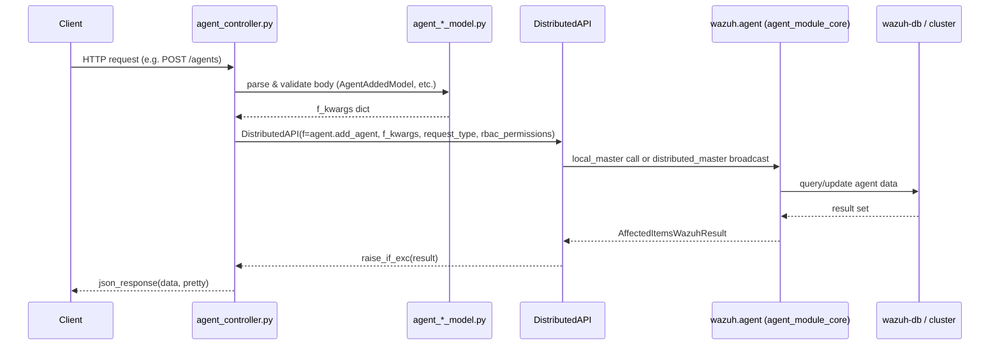
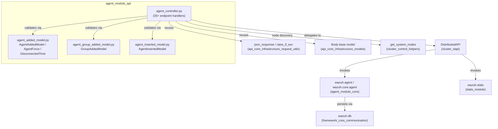

# Agent Module API

## 1. Introduction & Purpose

The **Agent Module API** is the HTTP-facing layer of Wazuh's agent management subsystem. It exposes a rich set of
RESTful endpoints that allow API consumers (the Wazuh dashboard, CLI tools, or third-party integrations) to:

- Register, insert, and delete agents.
- Manage agent groups (create, delete, assign/unassign agents, upload/download shared configuration files).
- Query agent status, configuration, statistics, and OS/version summaries.
- Trigger agent restarts, reconnections, and WPK-based upgrades (repository-based or custom package).
- Retrieve agent keys and per-component runtime configuration.

This module is purely a **presentation/transport layer**: it parses and validates incoming HTTP requests, builds a
canonical set of keyword arguments, and delegates all business logic to the Wazuh Distributed API (DAPI), which in
turn invokes the core agent framework functions. It contains no direct database or socket access itself.

This module is one of three siblings that together make up the broader `agent_module`:

| Sibling module | Responsibility | Documentation |
|---|---|---|
| **agent_module_api** (this module) | HTTP controllers & request/response models | *You are here* |
| **agent_module_core** | Business logic, `Agent` class, DB queries against `wazuh-db` | [agent_module_core.md](agent_module_core.md) |
| **agent_module_cli** | Standalone CLI scripts (`agent_groups`, `agent_upgrade`) | [agent_module_cli.md](agent_module_cli.md) |

## 2. Architecture Overview

The module consists of two cooperating parts:

1. **Controllers** (`api/api/controllers/agent_controller.py`) — a collection of `async` functions, one per API
   operation, wired up by the OpenAPI/Connexion routing layer. Each controller function:
   - Reads path/query parameters and (optionally) the request body.
   - Builds an `f_kwargs` dictionary describing the target core function and its arguments.
   - Instantiates a `DistributedAPI` object (see [cluster_dapi.md](cluster_dapi.md)) and awaits `distribute_function()`,
     which transparently resolves whether the request should run locally (`local_master`) or be broadcast/forwarded
     across the cluster (`distributed_master`).
   - Wraps the resulting `AffectedItemsWazuhResult` / `WazuhResult` (see
     [framework_core_utils.md](framework_core_utils.md)) into a JSON HTTP response.

2. **Request Body Models** (`api/api/models/agent_added_model.py`, `agent_group_added_model.py`,
   `agent_inserted_model.py`) — lightweight data classes (subclasses of `Body`/`Model`, defined in
   [api_core_infrastructure_models.md](api_core_infrastructure_models.md)) that describe, validate, and deserialize
   the JSON payload of `POST`/`PUT` requests such as *Add Agent* or *Insert Agent*.

### 2.1 High-Level Request Flow

### 2.2 Component Map

### 2.3 Middleware & Security Context

Every controller call reads `request.context['token_info']['rbac_policies']` and forwards it to `DistributedAPI` as
`rbac_permissions`, so that RBAC filtering (see [security_rbac_module.md](security_rbac_module.md)) is enforced
uniformly. Requests reach the controllers only after passing through the shared API middleware stack (authentication,
rate limiting, header validation) documented in
[api_core_infrastructure_middleware.md](api_core_infrastructure_middleware.md) and
[api_core_infrastructure_auth_config.md](api_core_infrastructure_auth_config.md).

## 3. Sub-modules

| Sub-module | Description | Documentation |
|---|---|---|
| **Controllers** | All agent/group HTTP endpoint handlers: CRUD for agents and groups, restart/reconnect, upgrade (repository & custom WPK), configuration retrieval, statistics, and summaries. | [agent_module_api_controllers.md](agent_module_api_controllers.md) |
| **Request Body Models** | `Body`-derived models used to validate and deserialize JSON payloads for agent/group creation and insertion endpoints (`AgentAddedModel`, `AgentForce`, `DisconnectedTime`, `GroupAddedModel`, `AgentInsertedModel`). | [agent_module_api_models.md](agent_module_api_models.md) |

## 4. Key Endpoint Categories

| Category | Representative Endpoints | Core Function Invoked |
|---|---|---|
| Agent lifecycle | `add_agent`, `insert_agent`, `post_new_agent`, `delete_agents` | `agent.add_agent`, `agent.delete_agents` |
| Agent connectivity | `restart_agent(s)`, `restart_agents_by_node`, `restart_agents_by_group`, `reconnect_agents` | `agent.restart_agents`, `agent.reconnect_agents` |
| Agent groups | `post_group`, `delete_groups`, `get_list_group`, `put_agent_single_group`, `put_multiple_agent_single_group`, `delete_single_agent_single_group`, `delete_multiple_agent_single_group`, `delete_single_agent_multiple_groups` | `agent.create_group`, `agent.assign_agents_to_group`, `agent.remove_agent(s)_from_group(s)` |
| Group shared files | `get_group_config`, `put_group_config`, `get_group_files`, `get_group_file` | `agent.get_agent_conf`, `agent.upload_group_file`, `agent.get_file_conf`, `agent.get_group_files` |
| Upgrades | `put_upgrade_agents`, `put_upgrade_custom_agents`, `get_agent_upgrade` | `agent.upgrade_agents`, `agent.get_upgrade_result` |
| Configuration & stats | `get_agent_config`, `get_component_stats`, `get_daemon_stats` | `agent.get_agent_config`, `stats.get_agents_component_stats_json`, `stats.get_daemons_stats_agents` |
| Summaries & keys | `get_agents_summary`, `get_agent_summary_status`, `get_agent_summary_os`, `get_agent_key`, `get_agent_uninstall_permission` | `agent.get_agents_summary*`, `agent.get_agents_keys`, `agent.check_uninstall_permission` |

## 5. Related Modules

- [agent_module_core.md](agent_module_core.md) — Implements the actual agent/group business logic (`Agent` class,
  `WazuhDBQueryGroup`, etc.) invoked by this API layer via `DistributedAPI`.
- [agent_module_cli.md](agent_module_cli.md) — CLI scripts (`agent_groups`, `agent_upgrade`) that perform similar
  operations outside of the HTTP API, sharing the same core functions.
- [cluster_dapi.md](cluster_dapi.md) — The `DistributedAPI`/`APIRequestQueue` implementation that routes each request
  either locally or to the appropriate cluster node.
- [cluster_control_helpers.md](cluster_control_helpers.md) — Provides `get_system_nodes`, used by
  `restart_agents_by_node`.
- [api_core_infrastructure_request_utils.md](api_core_infrastructure_request_utils.md) — Shared parameter-parsing
  helpers (`parse_api_param`) and validators used across all API controllers.
- [api_core_infrastructure_models.md](api_core_infrastructure_models.md) — Base `Body`/`Model` classes and JSON
  encoder shared by the agent request-body models.
- [stats_module.md](stats_module.md) — Backs the `get_component_stats` and `get_daemon_stats` endpoints.
- [security_rbac_module.md](security_rbac_module.md) — Enforces the RBAC policies forwarded from each controller.
- [framework_core_utils.md](framework_core_utils.md) — `AffectedItemsWazuhResult`/`WazuhResult` result wrappers
  returned by core functions and serialized by the controllers.
