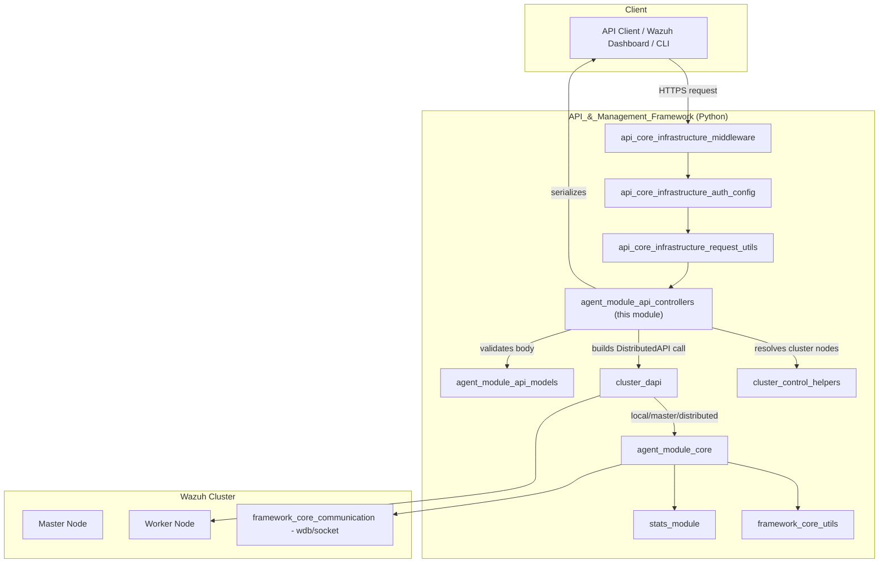
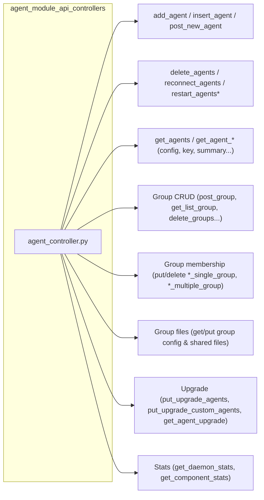
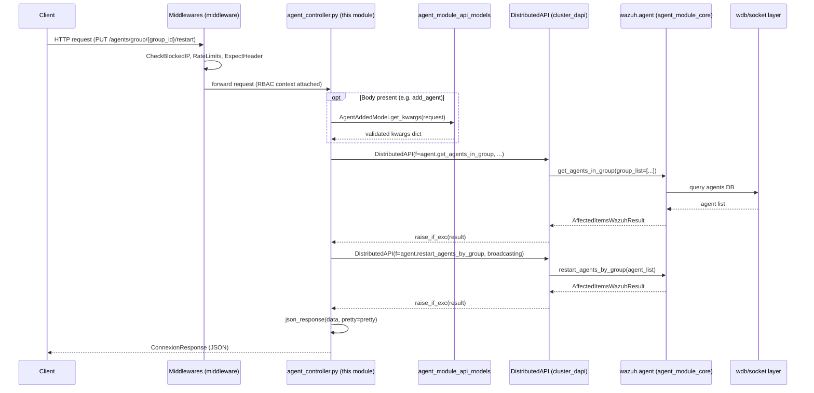
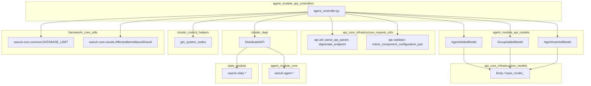
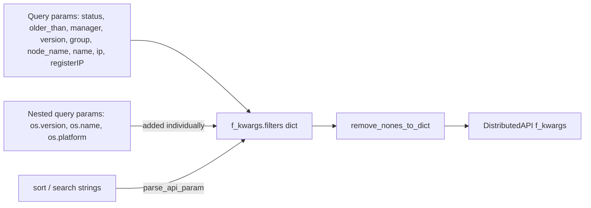

# Agent Module API Controllers

## Introduction

The **Agent Module API Controllers** module is the HTTP-facing entry point for all agent and agent-group management operations exposed by the Wazuh REST API. It lives in a single file, `api/api/controllers/agent_controller.py`, and defines the async request handlers that Connexion (the OpenAPI/Swagger routing framework used by the Wazuh API) invokes when a client calls an `/agents` or `/groups` endpoint.

This module does **not** implement business logic itself. Instead, every controller function:

1. Parses and normalizes HTTP request parameters (path, query, and body) into a keyword-argument dictionary.
2. Wraps the target framework function (from `wazuh.agent` or `wazuh.stats`) inside a `DistributedAPI` (DAPI) request descriptor.
3. Delegates execution to the DAPI, which decides — based on the cluster topology — whether to run the function locally, forward it to the master node, or broadcast/distribute it to worker nodes and agents.
4. Converts the resulting `WazuhResult`/`AffectedItemsWazuhResult` object into a `ConnexionResponse` (typically JSON, occasionally raw XML/text for file downloads).

Because of this "thin controller" design, this module is primarily about **request/response orchestration** and **RBAC-aware dispatch**, not domain logic. Understanding it requires understanding its immediate neighbors in the dependency graph: the request/response models, the core agent business logic, the Distributed API, and the shared API infrastructure (authentication, middlewares, validators).

---

## Role in the Overall System

This module sits directly below the generic API infrastructure and directly above the agent domain logic. For details on:

- Authentication, middlewares, logging, and URI parsing shared by *all* controllers → see `api_core_infrastructure` and its children (`api_core_infrastructure_auth_config`, `api_core_infrastructure_middleware`, `api_core_infrastructure_request_utils`, `api_core_infrastructure_logging`, `api_core_infrastructure_server_lifecycle`).
- Request/response body schemas used by this module → see **agent_module_api_models**.
- The actual agent business logic executed by the DAPI → see **agent_module_core**.
- CLI tools that operate on the same domain objects (agent groups, upgrades) outside of the API → see **agent_module_cli**.
- The distributed execution engine (`DistributedAPI`) that routes every request in this module → see **cluster_dapi**, **cluster_control_helpers**, **cluster_master**, **cluster_worker**.
- Common result types (`WazuhResult`, `AffectedItemsWazuhResult`) and limits (`DATABASE_LIMIT`) → see **framework_core_utils**.
- Daemon/component statistics endpoints reused here (`get_daemon_stats`, `get_component_stats`) → see **stats_module**.

---

## Module Structure

All functions share the same structural pattern (parameter parsing → `DistributedAPI` construction → `raise_if_exc(await dapi.distribute_function())` → `json_response`). Grouping them by responsibility:

| Category | Representative Functions | Backing Framework Function(s) |
|---|---|---|
| Agent lifecycle | `add_agent`, `post_new_agent`, `insert_agent`, `delete_agents` | `wazuh.agent.add_agent`, `wazuh.agent.delete_agents` |
| Agent connectivity | `reconnect_agents`, `restart_agent`, `restart_agents`, `restart_agents_by_node`, `restart_agents_by_group` | `wazuh.agent.reconnect_agents`, `wazuh.agent.restart_agents*` |
| Agent queries | `get_agents`, `get_agent_config`, `get_agent_key`, `get_agent_no_group`, `get_agent_outdated`, `get_agent_fields`, `get_agents_summary`, `get_agent_summary_status`, `get_agent_summary_os`, `get_agent_uninstall_permission` | `wazuh.agent.get_agents`, `get_agent_config`, `get_agents_keys`, etc. |
| Group management | `post_group`, `get_list_group`, `delete_groups`, `get_agents_in_group` | `wazuh.agent.create_group`, `get_agent_groups`, `delete_groups`, `get_agents_in_group` |
| Group membership | `put_agent_single_group`, `delete_single_agent_single_group`, `delete_single_agent_multiple_groups`, `put_multiple_agent_single_group`, `delete_multiple_agent_single_group` | `wazuh.agent.assign_agents_to_group`, `remove_agent_from_group(s)`, `remove_agents_from_group` |
| Group configuration/files | `get_group_config`, `put_group_config`, `get_group_files`, `get_group_file` | `wazuh.agent.get_agent_conf`, `upload_group_file`, `get_group_files`, `get_file_conf` |
| Agent upgrade | `put_upgrade_agents`, `put_upgrade_custom_agents`, `get_agent_upgrade` | `wazuh.agent.upgrade_agents`, `get_upgrade_result` |
| Sync status (deprecated) | `get_sync_agent` | `wazuh.agent.get_agents_sync_group` |
| Statistics | `get_daemon_stats`, `get_component_stats` | `wazuh.stats.get_daemons_stats_agents`, `get_agents_component_stats_json` |

---

## Request Processing Flow

Every controller in this module follows a near-identical execution pipeline. The diagram below illustrates the canonical flow using `restart_agents_by_group` as an example, since it also demonstrates a two-phase DAPI call (a synchronous lookup followed by a distributed broadcast).

### Key implementation details

- **`remove_nones_to_dict(f_kwargs)`**: Every controller strips `None` values from its kwargs before sending them to the DAPI, so that framework functions receive only explicitly-provided filters.
- **`request_type`**: Controls DAPI routing — `local_master` (run on the master only), `distributed_master` (fan out to nodes/agents), etc. See **cluster_dapi** for the full routing semantics.
- **`broadcasting=agents_list == '*'`**: Used by agent-wide operations (`reconnect_agents`, `restart_agents`, `put_upgrade_agents`) to indicate that the request should be sent to every agent rather than a specific subset.
- **`nodes=nodes`** (in `restart_agents_by_node`): Cluster node list resolved via `get_system_nodes()` from **cluster_control_helpers**, then passed to the DAPI so it can target a specific node.
- **`rbac_permissions=request.context['token_info']['rbac_policies']`**: Every call forwards the caller's resolved RBAC policies (established by **security_rbac_module**'s authentication/token decoding) so the DAPI/backend function can filter or reject unauthorized items.
- **Raw responses**: `get_group_file` bypasses `json_response` and returns a raw `ConnexionResponse` with a guessed MIME type (`application/xml` for `agent.conf`) when `raw=True`, supporting direct file downloads.

---

## Component Interaction Diagram

---

## Endpoint Reference

The table below groups the exported controller functions by the REST resource they implement. All functions are `async` and return `ConnexionResponse`.

### Agent CRUD & Lifecycle

| Function | Purpose |
|---|---|
| `add_agent` | Register a new agent from a JSON body (full model via `AgentAddedModel`). |
| `post_new_agent` | Quick-add an agent using only a name (path parameter). |
| `insert_agent` | Insert a pre-existing agent record (id/key already known), via `AgentInsertedModel`. |
| `delete_agents` | Delete one, several, or all agents, with rich filtering (status, version, group, os.*, etc.). |
| `reconnect_agents` | Force reconnection of agents (broadcast when `agents_list == '*'`). |
| `restart_agent` / `restart_agents` | Restart a single agent or a filtered/broadcast set. |
| `restart_agents_by_node` | Restart all agents connected to a specific cluster node. |
| `restart_agents_by_group` | Two-phase: resolve agent IDs in a group, then broadcast a restart. |

### Agent Queries

| Function | Purpose |
|---|---|
| `get_agent_config` | Retrieve an agent's **active** runtime configuration for a given component. |
| `get_agent_key` | Retrieve the agent's registration key. |
| `get_agent_no_group` | List agents that do not belong to any group. |
| `get_agent_outdated` | List agents running an outdated Wazuh version. |
| `get_agent_fields` | Get distinct value combinations across selected agent fields. |
| `get_agents_summary` | Summary counts for a set of agents. |
| `get_agent_summary_status` | Global agent status summary (active/disconnected/never_connected). |
| `get_agent_summary_os` | Global OS distribution summary across agents. |
| `get_agent_uninstall_permission` | Check whether the caller is allowed to uninstall agents. |
| `get_sync_agent` *(deprecated)* | Check whether an agent's group configuration is synced. |

### Group Management

| Function | Purpose |
|---|---|
| `post_group` | Create a new agent group (`GroupAddedModel`). |
| `get_list_group` | List all groups with checksums, counts, sorting/searching support. |
| `delete_groups` | Delete one, several, or all groups. |
| `get_agents_in_group` | List agents belonging to a specific group. |
| `put_agent_single_group` / `put_multiple_agent_single_group` | Assign one/many agents to a group (optionally exclusively via `force_single_group`). |
| `delete_single_agent_single_group` / `delete_single_agent_multiple_groups` / `delete_multiple_agent_single_group` | Remove group membership at various granularities. |

### Group Configuration & Shared Files

| Function | Purpose |
|---|---|
| `get_group_config` / `put_group_config` | Get/set the `agent.conf` shared configuration content (XML body). |
| `get_group_files` | List files present in a group's shared directory (checksums included). |
| `get_group_file` | Fetch a specific shared file's content, optionally as `raw` (with MIME sniffing). |

### Agent Upgrade

| Function | Purpose |
|---|---|
| `put_upgrade_agents` | Trigger a WPK upgrade fetched from a remote repository, with rich agent filtering. |
| `put_upgrade_custom_agents` | Trigger an upgrade using a locally-provided WPK file path. |
| `get_agent_upgrade` | Poll upgrade task results/status for a set of agents. |

### Statistics

| Function | Purpose |
|---|---|
| `get_daemon_stats` | Per-agent daemon statistics (delegates to **stats_module**). |
| `get_component_stats` | Per-agent, per-component statistics (delegates to **stats_module**). |

---

## Data Flow: Filtering Pattern

Most `GET`/`DELETE` list-oriented endpoints in this module share a common filter-construction idiom, illustrated below:

This pattern appears in `delete_agents`, `get_agents`, `put_upgrade_agents`, `put_upgrade_custom_agents`, and `get_agent_upgrade`, ensuring consistent filter semantics for every bulk agent operation across the API.

---

## Error Handling & RBAC

- All framework-level exceptions raised inside the distributed call are surfaced through `raise_if_exc()`, which converts `WazuhInternalError`/`WazuhError` exceptions coming back from the DAPI into the appropriate HTTP error response (handled upstream by Connexion's error handlers, configured in `api_core_infrastructure`).
- RBAC enforcement is **not** performed inside this module; controllers merely pass `request.context['token_info']['rbac_policies']` to the DAPI, which applies **security_rbac_module**'s policies (`framework/wazuh/rbac/*`) when executing the target function against the agent/group inventory.
- Content-type validation (`Body.validate_content_type`) is used for both JSON bodies (`add_agent`, `insert_agent`, `post_group`) and XML bodies (`put_group_config`), rejecting malformed requests before they reach the DAPI.

---

## Related Documentation

- [agent_module_api_models.md](agent_module_api_models.md) — Request/response schemas (`AgentAddedModel`, `GroupAddedModel`, `AgentInsertedModel`) consumed by this module.
- [agent_module_core.md](agent_module_core.md) — Business logic implementations (`wazuh.agent`, `wazuh.core.agent`) invoked via the Distributed API.
- [agent_module_cli.md](agent_module_cli.md) — Command-line tools (`agent_groups.py`, `agent_upgrade.py`) operating on the same domain outside the API.
- [cluster_dapi.md](cluster_dapi.md) — `DistributedAPI` request routing, local/master/distributed execution semantics.
- [cluster_control_helpers.md](cluster_control_helpers.md) — `get_system_nodes` and other cluster topology helpers.
- [cluster_master.md](cluster_master.md) / [cluster_worker.md](cluster_worker.md) — How distributed/broadcast requests are executed across the cluster.
- [stats_module.md](stats_module.md) — Daemon and component statistics functions reused by `get_daemon_stats`/`get_component_stats`.
- [framework_core_utils.md](framework_core_utils.md) — Shared result types (`AffectedItemsWazuhResult`) and constants (`DATABASE_LIMIT`).
- [api_core_infrastructure_request_utils.md](api_core_infrastructure_request_utils.md) — `parse_api_param`, `deprecate_endpoint`, and validators shared across all API controllers.
- [api_core_infrastructure_middleware.md](api_core_infrastructure_middleware.md) — Rate limiting, blocked-IP checks, and access logging applied before requests reach this module.
- [security_rbac_module.md](security_rbac_module.md) — RBAC policy evaluation applied to the `rbac_permissions` forwarded by every controller.
