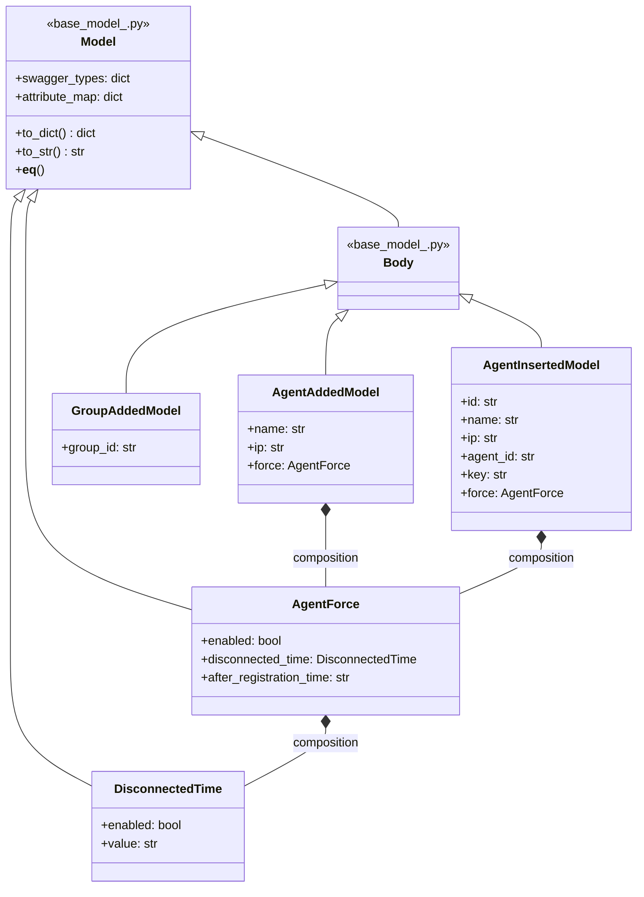
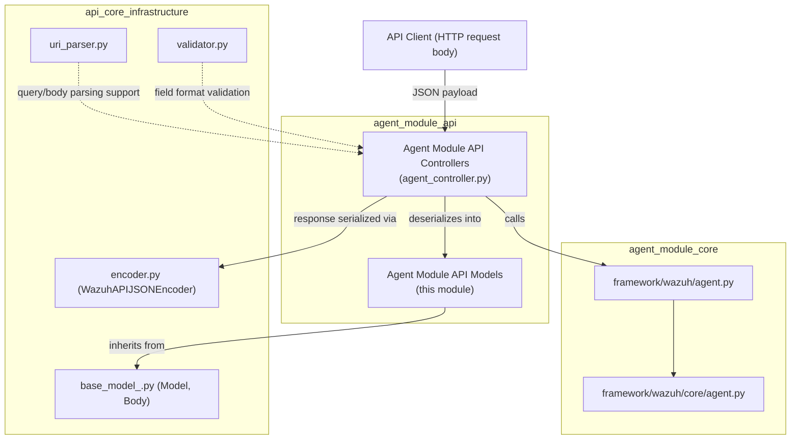
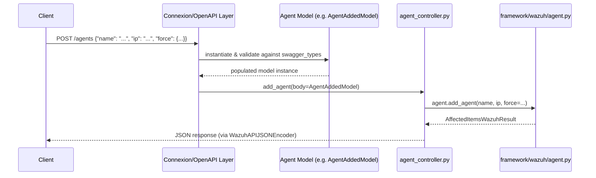
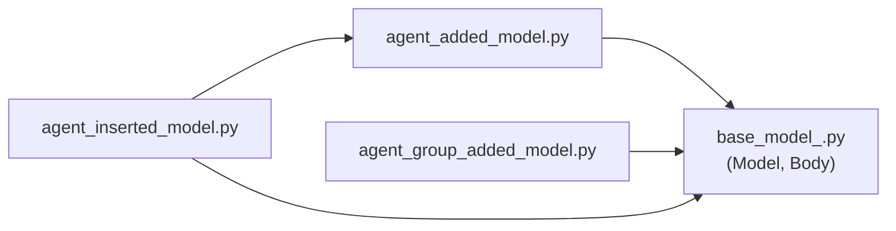

# Agent Module API Models

## Introduction

The **Agent Module API Models** package defines the request/response data models (schemas) used by the Wazuh API's agent-related endpoints. These models are responsible for validating, structuring, and serializing the data exchanged between API clients and the [Agent Module API Controllers](agent_module_api_controllers.md) when performing agent lifecycle operations such as adding a new agent, registering an agent group, or inserting a pre-existing agent with a known key.

This module is a leaf component in the broader [Agent Module](agent_module.md) — it contains no business logic itself, but provides the strongly-typed data contracts that the controller layer uses to accept incoming HTTP payloads and that the OpenAPI/Swagger layer uses to document and validate requests.

It sits within the **Agent Module API** sub-tree, alongside [Agent Module API Controllers](agent_module_api_controllers.md), which is itself part of the larger [API & Management Framework](api_core_infrastructure.md).

## Purpose and Scope

The three files in this module define the following body models:

| File | Model(s) | Purpose |
|---|---|---|
| `agent_added_model.py` | `AgentAddedModel`, `AgentForce`, `DisconnectedTime` | Defines the payload for **adding a new agent** (`POST /agents`), including the optional "force" policy for replacing conflicting existing agents. |
| `agent_group_added_model.py` | `GroupAddedModel` | Defines the payload for **creating a new agent group** (`POST /groups`). |
| `agent_inserted_model.py` | `AgentInsertedModel` | Defines the payload for **inserting an agent with a pre-existing key** (`POST /agents/insert`), used to migrate/import agents that already have a registered ID and key. |

All models inherit from the shared base model infrastructure defined in [API Core Infrastructure Models](api_core_infrastructure_models.md) (`api/api/models/base_model_.py`), which provides the common `Model`/`Body` behavior (attribute mapping, `swagger_types`, `to_dict()`, equality, and serialization helpers used by the underlying Connexion/OpenAPI framework).

## Architecture

### Component Relationships

### Module Position in the System

## Data Flow

The models are used exclusively at the **request-body deserialization** stage of the API request lifecycle. Connexion (the OpenAPI framework wrapping the Wazuh API) uses the OpenAPI spec together with these model classes to convert the raw JSON body of an incoming request into typed Python objects before they reach the controller function.

## Core Components

### 1. `AgentAddedModel`, `AgentForce`, `DisconnectedTime` (`agent_added_model.py`)

Used by `POST /agents` ([`add_agent`](agent_module_api_controllers.md) controller function → [`framework/wazuh/agent.py::add_agent`](agent_module_core.md)).

- **`AgentAddedModel`** — top-level request body:
  - `name` (`str`): the agent's name.
  - `ip` (`str`): the agent's IP address, or `any` (subject to `BehindProxyServer` API setting).
  - `force` (`AgentForce`): policy controlling whether an existing agent with the same name/IP should be automatically removed. Defaults to `AgentForce(enabled=False)` (force disabled).

- **`AgentForce`** — nested object controlling forced replacement of existing agents:
  - `enabled` (`bool`): whether the force-replace policy is active.
  - `disconnected_time` (`DisconnectedTime`): conditions based on how long the conflicting agent has been disconnected.
  - `after_registration_time` (`str`): minimum time since registration required before an agent can be force-replaced (e.g., `"1h"`).

- **`DisconnectedTime`** — nested object with:
  - `enabled` (`bool`)
  - `value` (`str`, e.g., `"1h"`) — time threshold expression.

These three classes form a small composition hierarchy (`AgentAddedModel` → `AgentForce` → `DisconnectedTime`), mirroring the nested JSON structure allowed in the request body.

### 2. `GroupAddedModel` (`agent_group_added_model.py`)

Used by `POST /groups` ([`post_group`](agent_module_api_controllers.md) controller function → [`framework/wazuh/agent.py::create_group`](agent_module_core.md)).

- `group_id` (`str`): the name of the new agent group to create. This is the sole field in the payload.

### 3. `AgentInsertedModel` (`agent_inserted_model.py`)

Used by `POST /agents/insert` ([`insert_agent`](agent_module_api_controllers.md) controller function → [`framework/wazuh/agent.py::add_agent`](agent_module_core.md) with keep-alive/pre-existing key semantics).

Unlike `AgentAddedModel`, this model supports importing an agent that already has an assigned ID and cryptographic key (e.g., during migration or manual provisioning):

- `id` (`str`): internal identifier field (mapped separately from `agent_id`; retained for backward compatibility in `swagger_types`).
- `name` (`str`): agent name.
- `ip` (`str`): agent IP address or `any`.
- `agent_id` (`str`): the explicit agent ID to assign (maps to JSON field `id`).
- `key` (`str`): the pre-shared key that must match the `client.keys` entry on the agent.
- `force` (`AgentForce`, reused from `agent_added_model.py`): same force-replacement semantics as in `AgentAddedModel`. Defaults to an empty `AgentForce()` if not provided.

This model demonstrates cross-file reuse: it imports `AgentForce` from `agent_added_model.py` rather than redefining it, keeping the force-replacement contract consistent across both "add" and "insert" agent operations.

## Design Patterns

- **Composition over inheritance for nested payloads**: Complex JSON structures (like the `force` policy) are modeled as nested `Model` objects (`AgentForce`, `DisconnectedTime`) embedded within top-level `Body` objects, rather than flattening all fields into one class.
- **Swagger/OpenAPI metadata co-located with the class**: Each model declares `swagger_types` (Python type mapping) and `attribute_map` (JSON key ↔ Python attribute mapping) in its constructor, which the base `Model` class (see [API Core Infrastructure Models](api_core_infrastructure_models.md)) uses generically for serialization (`to_dict`), string representation, and equality comparison.
- **Property-based encapsulation**: All fields are exposed via `@property` getters/setters instead of public attributes, allowing future validation logic to be added transparently without breaking the public interface.
- **Shared sub-model reuse**: `AgentForce`/`DisconnectedTime` defined once in `agent_added_model.py` are reused by `AgentInsertedModel`, avoiding duplication between the "add" and "insert" agent flows.
- **Default-safe construction**: Nested models are always instantiated (e.g., `AgentForce(**force or {})`) even when the caller omits the corresponding JSON key, guaranteeing a valid object graph and avoiding `None`-attribute errors downstream.

## Dependencies

- **`api/api/models/base_model_.py`** (documented in [API Core Infrastructure Models](api_core_infrastructure_models.md)): supplies `Model` and `Body` base classes, plus helper wrapper types `AllOf`, `Data`, and `Items` used elsewhere in the API models ecosystem for composing/wrapping response and request schemas.
- **Standard library**: `datetime` and `typing` imports are present for type-hinting purposes (largely unused directly in these particular files beyond documentation/signatures).

No external framework or business-logic dependencies exist in this module — it is intentionally a thin, declarative data layer.

## Usage in the Broader System

These models are only ever consumed by:

1. **[Agent Module API Controllers](agent_module_api_controllers.md)** (`agent_controller.py`) — functions such as `add_agent`, `post_group`, and `insert_agent` receive instances of these models as their `body` parameter after Connexion performs request deserialization/validation against the OpenAPI spec.
2. **The OpenAPI/Swagger spec generation** — the `swagger_types` and `attribute_map` dictionaries allow the API framework to validate incoming payloads and generate accurate API documentation.

For the actual business logic that processes these models (creating agents in the database, generating keys, assigning groups), see:
- [Agent Module Core](agent_module_core.md) — `framework/wazuh/agent.py` and `framework/wazuh/core/agent.py`.
- [Agent Module API Controllers](agent_module_api_controllers.md) — the controller layer that binds HTTP routes to these models and core functions.

## Summary

| Aspect | Details |
|---|---|
| **Module type** | Data model / schema definitions (no business logic) |
| **Language/Framework** | Python, Connexion/OpenAPI (Swagger) model convention |
| **Parent module** | [Agent Module API](agent_module_api.md) |
| **Sibling module** | [Agent Module API Controllers](agent_module_api_controllers.md) |
| **Base dependency** | [API Core Infrastructure Models](api_core_infrastructure_models.md) (`base_model_.py`) |
| **Key models** | `AgentAddedModel`, `AgentForce`, `DisconnectedTime`, `GroupAddedModel`, `AgentInsertedModel` |
