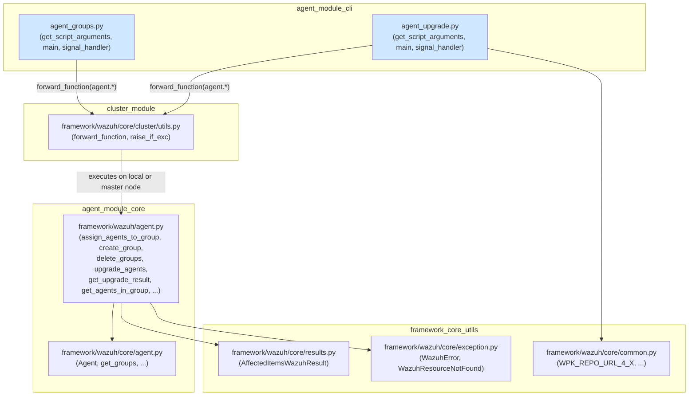
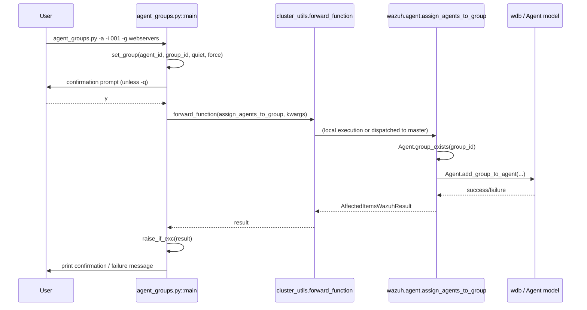
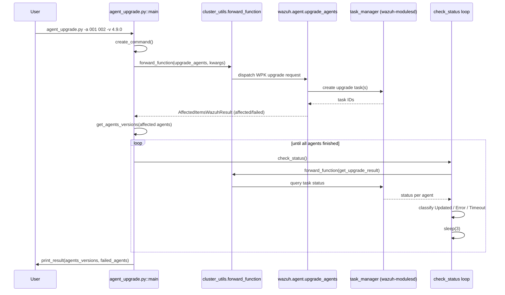
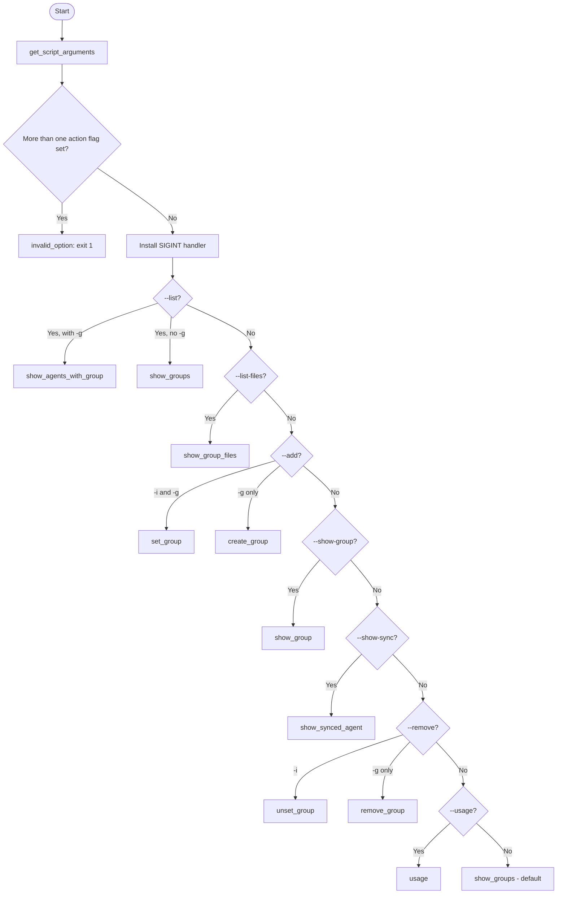
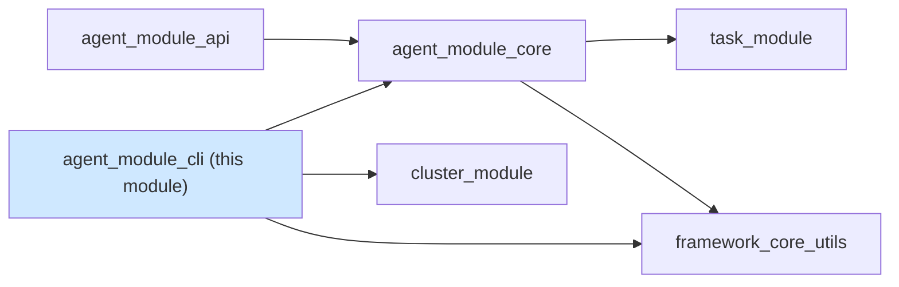

# Agent Module CLI

## Introduction

The **agent_module_cli** module provides the command-line interface (CLI) tooling used by administrators to manage Wazuh agents and agent groups directly from the manager's shell, without going through the REST API. It consists of two standalone Python scripts:

- **`agent_groups.py`** — a full-featured CLI for creating, listing, inspecting, and removing agent groups, and for assigning/unassigning agents to/from groups.
- **`agent_upgrade.py`** — a CLI for triggering WPK-based agent upgrades (standard or custom), tracking upgrade task status, and listing outdated agents.

Both scripts are thin, user-facing wrappers around the asynchronous business logic implemented in [agent_module_core](agent_module_core.md) (`framework/wazuh/agent.py`) and are designed to run on both single-node managers and cluster master nodes (forwarding requests to the correct node transparently).

This module is a child of [agent_module](agent_module.md), which in turn belongs to the broader [API & Management Framework](API_Management_Framework_Python.md). It sits at the "presentation" layer for agent/group administration—alongside [agent_module_api](agent_module_api.md), which exposes equivalent functionality over HTTP.

---

## Purpose and Core Functionality

| Script | Responsibility |
|---|---|
| `agent_groups.py` | Group lifecycle management: list groups, list agents in a group, list group configuration files, create/remove groups, assign/unassign agents to/from groups, show an agent's group(s), show group-sync status |
| `agent_upgrade.py` | Agent upgrade orchestration: dispatch WPK upgrade (standard or custom) commands to one or more agents, poll upgrade-task status until completion, list outdated agents |

Both scripts follow the same architectural pattern:

1. Parse CLI arguments with `argparse`.
2. Install a `SIGINT` handler (`signal_handler`) for graceful `Ctrl+C` exits.
3. Invoke the corresponding function(s) in `framework/wazuh/agent.py` (or `framework/wazuh/core/cluster/utils.py` helper `forward_function`) inside an `asyncio` event loop (`main()`).
4. Use `cluster_utils.raise_if_exc()` to detect and re-raise exceptions that may come back from a forwarded (cluster) call.
5. Print human-readable results/errors to stdout, optionally re-raising exceptions when `--debug` is passed.

---

## Architecture



### Why `forward_function`?

Both scripts run `wazuh.agent` functions through `cluster_utils.forward_function()` instead of calling them directly. This ensures that:

- On a **single-node** manager, the function executes locally.
- On a **cluster master**, the function is dispatched to the correct target (agents can be connected to any worker node), and the result is returned transparently.
- Any exception raised remotely is serialized back and re-raised locally via `raise_if_exc()`.

See [cluster_module](cluster_module.md) (specifically `cluster_high_level_api` / `cluster_utils`) for details on the forwarding mechanism.

---

## Component Details

### `agent_groups.py`

Provides an interactive/scriptable interface for agent-group administration.

**Key internal async helpers** (not in the core-component list but essential to understanding flow):
- `show_groups()` — lists all groups and unassigned-agent count.
- `show_group(agent_id)` — shows which group(s) an agent belongs to.
- `show_synced_agent(agent_id)` — shows whether an agent's group config is synced.
- `show_agents_with_group(group_id)` — lists agents belonging to a group.
- `show_group_files(group_id)` — lists a group's configuration files and hashes.
- `set_group(agent_id, group_id, quiet, replace)` — assigns an agent to a group (calls `agent.assign_agents_to_group`).
- `unset_group(agent_id, group_id, quiet)` — removes an agent from a group (calls `agent.remove_agent_from_groups`).
- `create_group(group_id, quiet)` / `remove_group(group_id, quiet)` — group lifecycle.

**Core components:**

| Component | Description |
|---|---|
| `get_script_arguments()` | Builds the `argparse.ArgumentParser`, defining mutually-restrictive flags (`-l/--list`, `-c/--list-files`, `-a/--add`, `-s/--show-group`, `-S/--show-sync`, `-r/--remove`, plus `-i/--agent-id`, `-g/--group-id`, `-q/--quiet`, `-f/--force`, `-d/--debug`). Validates that no more than one primary action flag is set. |
| `main()` | Async entry point. Installs the `SIGINT` handler, then dispatches to the correct helper coroutine based on parsed arguments. Defaults to `show_groups()` when no flags are supplied. |
| `signal_handler(n_signal, frame)` | Handles `Ctrl+C` (`SIGINT`) by printing a blank line and exiting with code `1`. |

### `agent_upgrade.py`

Provides the CLI for triggering and monitoring agent upgrades.

**Key internal async helpers:**
- `get_agents_versions(agents)` — fetches current version info for a list of agents before upgrading, to compute before/after diffs.
- `get_agent_version(agent_id)` — fetches a single agent's version (used after upgrade completes, when no explicit `--version` was given).
- `create_command()` — builds the `f_kwargs` dict for either `wazuh.agent.upgrade_agents` (standard WPK, using repository/version/force/http/package_type options) or a custom upgrade (using `--file`/`--execute`).
- `check_status(affected_agents, result_dict, failed_agents, silent)` — polls `get_upgrade_result` every 3 seconds until every affected agent reaches a terminal status (`Updated`, legacy-upgrade success, `Error`, `Timeout`, or `cancelled`), updating `result_dict`/`failed_agents` accordingly.
- `print_result(agents_versions, failed_agents)` — prints a human-readable summary table.
- `list_outdated()` — prints agents whose installed version differs from the manager's (calls `wazuh.agent.get_outdated_agents()` synchronously, not via `forward_function`).

**Core components:**

| Component | Description |
|---|---|
| `get_script_arguments()` | Builds the `argparse.ArgumentParser` returning the parser itself (not the parsed namespace) — arguments include `-a/--agents`, `-r/--repository`, `-v/--version`, `-F/--force`, `-s/--silent`, `-l/--list_outdated`, `-f/--file`, `-x/--execute`, `--http`, `--package_type`, `-d/--debug`. |
| `main()` | Async entry point. Handles `--list_outdated` short-circuit, validates that agents were specified, builds the upgrade command via `create_command()`, dispatches it with `forward_function(upgrade_agents, ...)`, reports immediate failures, then calls `check_status()` to poll until completion. Catches `WazuhError` and `connexion.ProblemException` in addition to generic exceptions. |
| `signal_handler(n_signal, frame)` | Same `Ctrl+C` handling pattern as in `agent_groups.py`. |

---

## Data Flow

### Agent Group Assignment Flow (`agent_groups.py -a`)



### Agent Upgrade Flow (`agent_upgrade.py`)



---

## Process Flow: Argument Dispatch (`agent_groups.py`)



---

## Dependencies

| Dependency | Used For | Documentation |
|---|---|---|
| `framework/wazuh/agent.py` (add_agent, assign_agents_to_group, create_group, delete_groups, get_agents_in_group, get_group_files, get_agents_sync_group, remove_agent_from_groups, upgrade_agents, get_upgrade_result, get_outdated_agents, ...) | Core business logic invoked by both scripts | [agent_module_core](agent_module_core.md) |
| `framework/wazuh/core/agent.py` (Agent, get_groups) | Lower-level agent/group data access used internally by `agent.py` | [agent_module_core](agent_module_core.md) |
| `framework/wazuh/core/cluster/utils.py` (`forward_function`, `raise_if_exc`) | Transparent request forwarding in clustered deployments and exception propagation | [cluster_module](cluster_module.md) |
| `framework/wazuh/core/common.py` (`WPK_REPO_URL_4_X`) | Default WPK repository URL constant used by `agent_upgrade.py` | [framework_core_utils](framework_core_utils.md) |
| `framework/wazuh/core/results.py` (`AffectedItemsWazuhResult`) | Standard result envelope (affected/failed items) returned by core agent functions | [framework_core_utils](framework_core_utils.md) |
| `framework/wazuh/core/exception.py` (`WazuhError`, `WazuhResourceNotFound`) | Domain exceptions caught and reported by the CLI | [framework_core_utils](framework_core_utils.md) |
| `connexion.ProblemException` | HTTP-style exception surfaced when a forwarded call fails at the API layer | External library |

---

## Relationship to Other Modules



- **[agent_module_core](agent_module_core.md)** — Implements all the actual agent/group manipulation logic (`Agent` class, `WazuhDBQuery*` classes, `assign_agents_to_group`, `upgrade_agents`, etc.) that both the CLI and the [agent_module_api](agent_module_api.md) REST controllers depend on. The CLI and API are two different front-ends over the same core.
- **[cluster_module](cluster_module.md)** — Supplies `forward_function`/`raise_if_exc`, enabling the CLI to work uniformly whether run on a single-node manager or a cluster master.
- **[task_module](task_module.md)** — The agent upgrade process ultimately creates and tracks tasks via the Task Manager (`wm_task_manager`), which `agent_upgrade.py`'s polling loop (`check_status`) queries indirectly through `get_upgrade_result`.
- **[framework_core_utils](framework_core_utils.md)** — Provides shared utilities (`common.py` constants, `results.py` result wrapper, exception hierarchy) used throughout.

---

## Usage Examples

### `agent_groups.py`

```bash
# List all groups
./agent_groups.py -l

# List agents belonging to group "webservers"
./agent_groups.py -l -g webservers

# Show configuration files of a group
./agent_groups.py -c -g webservers

# Assign agent 001 to group "webservers" (with confirmation)
./agent_groups.py -a -i 001 -g webservers

# Assign and replace all existing groups (force single group)
./agent_groups.py -a -i 001 -g webservers -f -q

# Show group(s) an agent belongs to
./agent_groups.py -s -i 001

# Show sync status of an agent's group configuration
./agent_groups.py -S -i 001

# Remove agent 001 from group "webservers"
./agent_groups.py -r -i 001 -g webservers

# Remove group "webservers" entirely
./agent_groups.py -r -g webservers -q
```

### `agent_upgrade.py`

```bash
# List outdated agents
./agent_upgrade.py -l

# Upgrade specific agents to the latest version
./agent_upgrade.py -a 001 002 003

# Upgrade to a specific version, forcing the operation
./agent_upgrade.py -a 001 -v 4.9.0 -F

# Perform a custom upgrade using a custom WPK file and installer script
./agent_upgrade.py -a 001 -f custom.wpk -x install.sh

# Use a custom repository over HTTP, silent mode
./agent_upgrade.py -a 001 -r http://myrepo.local/wpk --http -s
```

---

## Error Handling

Both scripts share a consistent error-handling strategy in their `if __name__ == "__main__":` blocks:

1. **`WazuhError`** — Wazuh-specific domain errors (e.g., invalid group name, resource not found) are caught and printed as `Error <code>: <message>`.
2. **`connexion.ProblemException`** (only `agent_upgrade.py`) — Raised when a forwarded call fails at the API/HTTP layer; printed with its status code/detail.
3. **Generic `Exception`** — Caught as a fallback and printed as `Internal error: <message>`.
4. In all cases, passing `-d/--debug` causes the original exception to be re-raised (full traceback) instead of being swallowed, aiding troubleshooting.
5. `SIGINT` (`Ctrl+C`) is intercepted by `signal_handler` in both scripts to exit cleanly (`exit(1)`) instead of showing a Python traceback.
