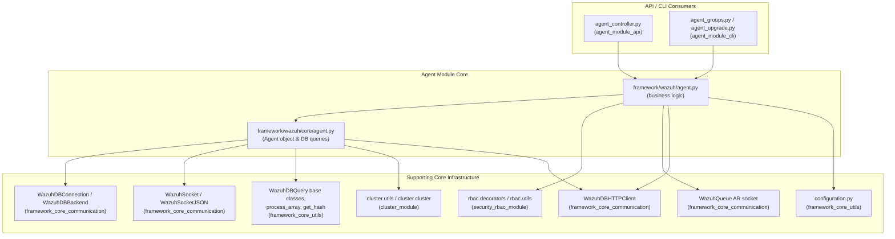
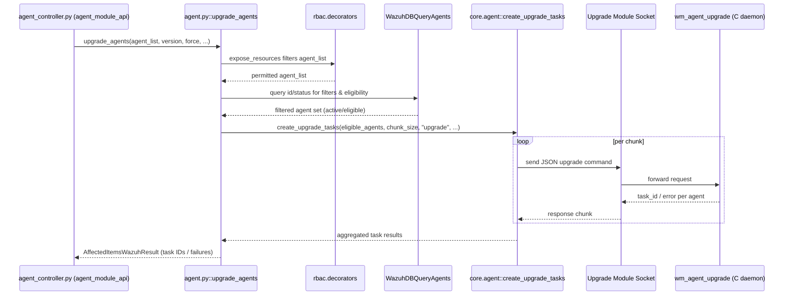

# Agent Module Core

## Introduction

The **Agent Module Core** is the business-logic and data-access layer that powers all agent-related
functionality in the Wazuh Framework. It sits between the public-facing API controllers
(documented in [agent_module_api](agent_module_api.md)) and the low-level Wazuh DB / socket
infrastructure. It exposes the Python functions that implement:

- Agent lifecycle management (registration, deletion, key retrieval, reconnection, restart).
- Agent group management (creation, deletion, assignment, group configuration files).
- Agent statistics and summaries (status, OS, node, configuration sync).
- Agent remote upgrade orchestration (WPK-based upgrades and upgrade result retrieval).
- Read access to per-agent active configuration blocks.

This module purposefully contains **no HTTP/REST concerns** — it is consumed by the API
controllers described in [agent_module_api](agent_module_api.md) (`agent_controller.py`) and by the
CLI utilities in [agent_module_cli](agent_module_cli.md) (`agent_groups.py`, `agent_upgrade.py`).
It is composed of exactly two Python files that together form a classic two-layer design:

| Layer | File | Responsibility |
|-------|------|-----------------|
| Business logic ("manager") layer | `framework/wazuh/agent.py` | RBAC-aware, input-validating functions that implement each agent/group use case and orchestrate calls to the data layer, sockets and other core subsystems. |
| Data access ("core") layer | `framework/wazuh/core/agent.py` | The `Agent` domain object plus specialized `WazuhDBQuery*` classes that build and execute SQL-like queries against Wazuh DB, along with low level helpers (RBAC filter builder, upgrade-task dispatch, group cache helpers). |

## Architecture Overview

### Design rationale

- **Separation of concerns**: `agent.py` never talks to SQLite/Wazuh DB directly; it always goes
  through the query classes and the `Agent` class defined in `core/agent.py`. This keeps
  RBAC/validation logic separate from query-building logic.
- **RBAC-first**: almost every public function in `agent.py` is decorated with
  `@expose_resources` (from [security_rbac_module](security_rbac_module.md)), which filters the
  requested resources against what the authenticated user is allowed to see/modify *before* the
  function body executes.
- **Dual persistence access patterns**: reads that need rich filtering/sorting/pagination use the
  synchronous `WazuhDBQuery*` classes (SQLite-backed through `WazuhDBBackend`), while newer,
  higher-throughput summary/restart endpoints use the asynchronous `WazuhDBHTTPClient`
  (`get_wdb_http_client()`), reflecting an ongoing migration path documented in
  [framework_core_communication](framework_core_communication.md).
- **Command dispatch, not direct execution**: destructive or agent-side operations (reconnect,
  restart, upgrade) are never executed synchronously against the endpoint; they are translated
  into messages sent through Unix sockets (`WazuhQueue`, `WazuhSocket`) to daemons such as
  `remoted`, `wazuh-authd` or the upgrade module, which perform the actual work
  (see [remoted](remoted.md) and [agent_upgrade_module](agent_upgrade_module.md)).

## Component Breakdown

### 1. Business Logic Layer — `framework/wazuh/agent.py`

This file exposes the public API consumed by controllers and CLI scripts. All functions return a
`WazuhResult` or `AffectedItemsWazuhResult` (see [framework_core_utils](framework_core_utils.md))
and are decorated with `@expose_resources` for RBAC enforcement.

Functional groups:

- **Agent inventory & summaries**
  - `get_agents_summary`, `get_agents_summary_status`, `get_agents_summary_os`,
    `get_full_overview`: aggregate counts by connection status, OS, group-config-sync status, and
    combine several queries into a single dashboard-style payload.
- **Agent lifecycle**
  - `add_agent`: registers a new agent (delegates to `Agent.__init__` / `_add_authd`).
  - `delete_agents`: bulk-deletes agents, respecting RBAC and DB-driven eligibility filters
    (`WazuhDBQueryAgents`).
  - `get_agents_keys`: retrieves the connection key for one or more agents.
  - `check_uninstall_permission`: RBAC-only check with no side effects.
- **Agent runtime control**
  - `reconnect_agents`: sends a forced-reconnect message via `WazuhQueue`.
  - `restart_agents`, `restart_agents_by_group`, `restart_agents_by_node`: sends restart active
    response commands, filtering out inactive/nonexistent agents first using
    `WazuhDBHTTPClient.get_agents_restart_info`.
- **Agent groups**
  - `create_group`, `delete_groups`: manage group directories under `common.SHARED_PATH`.
  - `assign_agents_to_group`, `remove_agent_from_group`, `remove_agent_from_groups`,
    `remove_agents_from_group`: manage the agent↔group relationship, ultimately calling
    `Agent.set_agent_group_relationship` / `Agent.unset_single_group_agent`.
  - `get_agents_in_group`, `get_group_files`, `get_file_conf`, `get_agent_conf`,
    `upload_group_file`: read/write group configuration artifacts
    (delegates to [framework_core_utils](framework_core_utils.md)).
- **Agent upgrade orchestration**
  - `upgrade_agents`, `get_upgrade_result`: validate eligibility (active status, RBAC, filters),
    then batch agents into chunks and call `create_upgrade_tasks` /
    `core_upgrade_agents` (defined in `core/agent.py`) which talk to the upgrade/task-manager
    socket. See also [agent_upgrade_module](agent_upgrade_module.md) and
    [task_manager_module](task_manager_module.md) for the daemon-side counterpart.
- **Agent configuration**
  - `get_agent_config`, `get_agents_sync_group`: read the agent's active configuration and compare
    local merged-group checksum against the agent's reported checksum.

### 2. Data Access Layer — `framework/wazuh/core/agent.py`

- **`Agent`**: the domain object representing a single agent. Wraps DB-backed attribute loading
  (`load_info_from_db`), key computation/registration through `wazuh-authd`
  (`_add`, `_add_authd`, `_remove_authd`, `get_key`), group relationship management
  (`set_agent_group_relationship`, `unset_single_group_agent`, `add_group_to_agent`), and
  higher-level helpers (`get_config`, `get_stats`, `check_if_delete_agent`, `group_exists`).
- **Query classes** (all extend `WazuhDBQuery` from [framework_core_utils](framework_core_utils.md)):
  - `WazuhDBQueryAgents`: base agent query builder with agent-specific filters (date fields,
    `group` operator handling, os.version sort casting, id zero-padding formatting).
  - `WazuhDBQueryDistinctAgents`: agent query variant returning DISTINCT values.
  - `WazuhDBQueryGroupByAgents`: agent query variant that groups results (used for summaries).
  - `WazuhDBQueryGroup`: queries the `group` table (with agent counts via `belongs` join).
  - `WazuhDBQueryMultigroups`: queries agents belonging to a (multi)group.
- **Module-level helpers**:
  - `get_agents_info()` / `get_groups()`: cached (`context_cached`) readers of `client.keys` and
    the shared groups directory — the canonical "system truth" used to validate RBAC-permitted
    resources against what actually exists.
  - `get_rbac_filters()`: converts a permitted-resource list into either an `IN` or `NOT IN` SQL
    filter depending on which list (permitted vs. denied) is smaller, to keep queries efficient.
  - `expand_group()`: resolves a group name into the full set of agent IDs belonging to it via
    Wazuh DB pagination (`global get-group-agents`).
  - `get_manager_name()`: fetches the manager's own agent name (`id = 0`) from `global.db`.
  - `create_upgrade_tasks()` / `core_upgrade_agents()`: chunked dispatch of upgrade/upgrade-result
    commands to the Upgrade module socket, with automatic chunk-size back-off on task-manager
    communication errors (error code 4).
  - `format_fields()`, `unify_wazuh_version_format()`,
    `unify_wazuh_upgrade_version_format()`: field/value normalization utilities shared by the
    query classes.

## Data Flow: Example — Agent Upgrade Request

## Key Dependencies & Related Modules

| Dependency | Purpose | Documentation |
|------------|---------|----------------|
| `wazuh.core.utils` (`WazuhDBQuery`, `WazuhDBBackend`, `process_array`, `get_hash`, etc.) | Generic query engine, array pagination/search/sort, file hashing | [framework_core_utils](framework_core_utils.md) |
| `wazuh.core.common`, `wazuh.core.results` (`AffectedItemsWazuhResult`, `WazuhResult`) | Shared constants, path definitions, standard result envelopes | [framework_core_utils](framework_core_utils.md) |
| `wazuh.core.wazuh_queue.WazuhQueue`, `wazuh.core.wazuh_socket` | Active-response / Unix socket messaging to daemons | [framework_core_communication](framework_core_communication.md) |
| `wazuh.core.wdb.WazuhDBConnection`, `wazuh.core.wdb_http.WazuhDBHTTPClient` | Synchronous and asynchronous Wazuh DB access | [framework_core_communication](framework_core_communication.md) |
| `wazuh.core.configuration` | Reading/writing group configuration files (`agent.conf`, shared files) | [framework_core_utils](framework_core_utils.md) |
| `wazuh.core.cluster.utils.read_cluster_config`, `wazuh.core.cluster.cluster.get_node` | Determine current node identity for node-scoped restarts | [cluster_high_level_api](cluster_high_level_api.md) |
| `wazuh.rbac.decorators.expose_resources`, `async_list_handler` | RBAC enforcement decorators | [security_rbac_module](security_rbac_module.md) |
| `agent_controller.py` and related Pydantic models | HTTP endpoints and request/response schemas that invoke this module | [agent_module_api](agent_module_api.md) |
| `agent_groups.py`, `agent_upgrade.py` CLI scripts | Command-line entry points that invoke this module directly (bypassing the API) | [agent_module_cli](agent_module_cli.md) |
| Upgrade module / task manager daemons | Endpoint responsible for actually performing WPK upgrades | [agent_upgrade_module](agent_upgrade_module.md), [task_manager_module](task_manager_module.md) |

## Error Handling Conventions

Functions raise `wazuh.core.exception` types (`WazuhError`, `WazuhInternalError`,
`WazuhResourceNotFound`) which are caught by `@expose_resources` post-processing and converted
into per-item `failed_items` entries inside `AffectedItemsWazuhResult`, or re-raised for the
controller layer to translate into HTTP error responses. Notable domain-specific codes used
throughout this module:

- `1701` — Agent does not exist.
- `1703` — Operation not allowed on agent `000` (the manager itself).
- `1707` — Agent is not active (required for reconnect/restart/upgrade).
- `1710` / `1711` / `1712` / `1713` — Group not found / already exists / is `default` / invalid ID.
- `1726` — `wazuh-authd` is not running (required for add/remove agent).
- `1731` — Agent does not meet upgrade/deletion filter requirements.
- `1810`+ — Upgrade-socket specific errors (mapped from the upgrade module's own error codes).

## Summary

The Agent Module Core is the authoritative implementation of "what an agent is and what can be
done with it" inside the Wazuh framework. It is intentionally decoupled from transport concerns
(HTTP or CLI) so that both the [agent_module_api](agent_module_api.md) controllers and the
[agent_module_cli](agent_module_cli.md) scripts share exactly one implementation of agent and
group management, upgrade orchestration, and reporting logic.

## Sub-modules

This module is small enough (two closely related files) that it is documented in a single page
rather than split into further sub-modules. For related agent functionality split by layer, see:

- [agent_module_api](agent_module_api.md) — REST controllers and Pydantic models exposing this
  core logic over HTTP.
- [agent_module_cli](agent_module_cli.md) — command-line scripts (`agent_groups`, `agent_upgrade`)
  that call into this core logic directly.
