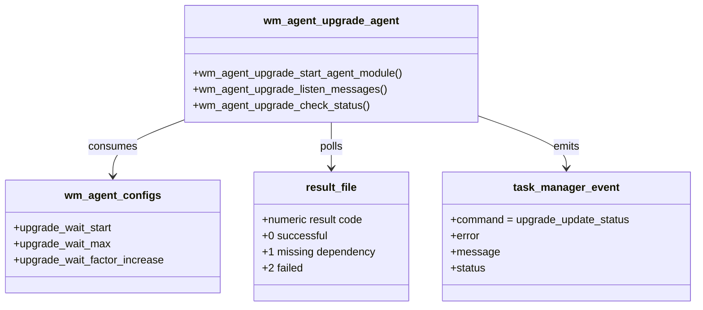
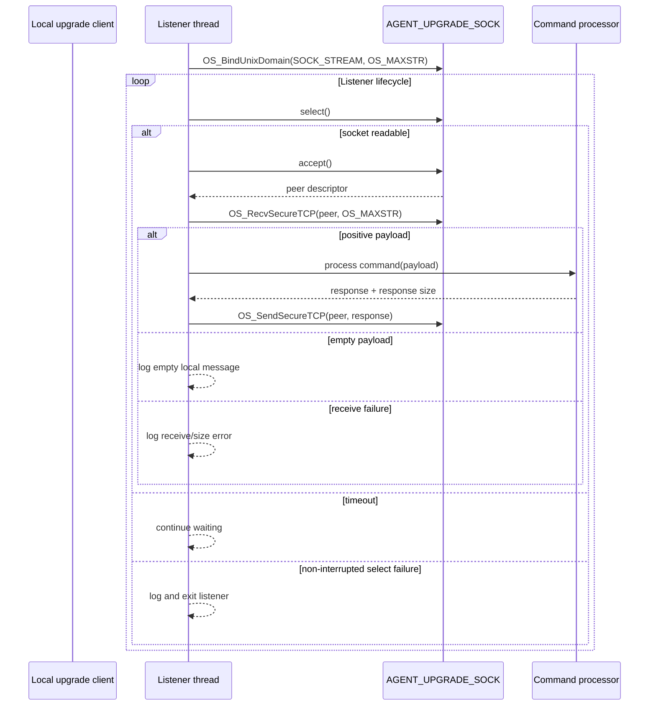
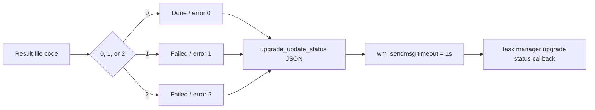
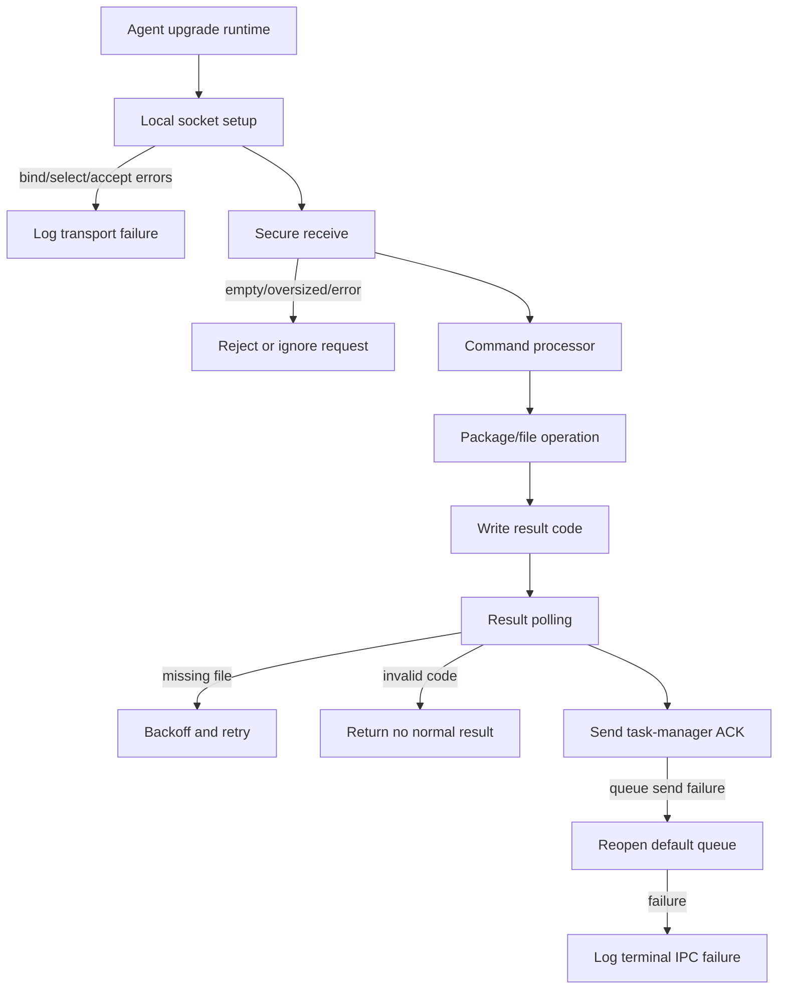
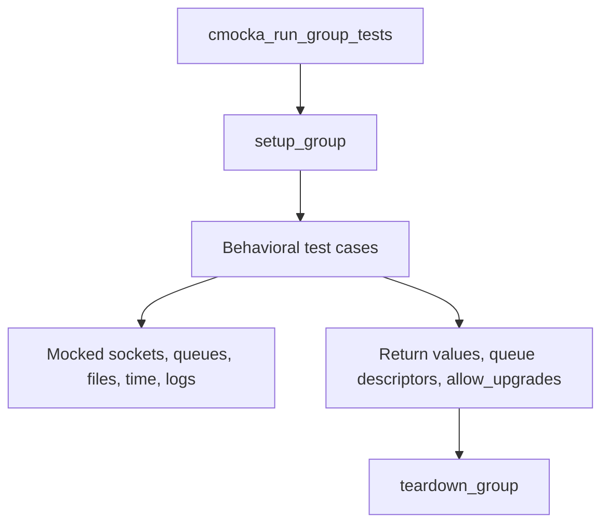

# `agent_upgrade_agent`

`agent_upgrade_agent` is the agent-side runtime boundary of Wazuh's upgrade module. It starts the agent upgrade service, accepts upgrade commands over a protected local Unix socket on POSIX systems, waits for the agent upgrade process to publish a result, and reports that result back to the task-manager module through the Wazuh message queue.

This document describes the behavior represented by `src/unit_tests/wazuh_modules/agent_upgrade/test_wm_agent_upgrade_agent.c`. Package validation, file handling, signing, decompression, and installer execution are documented in [agent_upgrade_module](agent_upgrade_module.md). The common module lifecycle is documented in [agent_upgrade_main](agent_upgrade_main.md), while durable task state and its protocol are documented in [task_manager_module](task_manager_module.md).

## Position in the system

The agent runtime is hosted by `wazuh-modulesd`. A manager-side upgrade request is delivered through the normal Wazuh control/remoted path; the agent-side upgrade implementation performs the requested operation and writes a compact result code to `WM_AGENT_UPGRADE_RESULT_FILE`. This component converts that local result into an `upgrade_update_status` event for the task manager.

```mermaid
flowchart LR
    MAN[Manager upgrade module] -->|secure upgrade commands| REM[Remoted / agent transport]
    REM --> MQ[Agent upgrade command queue]
    MQ --> PROC[Agent upgrade command processor]
    PROC --> FILE[Upgrade package and installer]
    FILE --> RESULT[(WM_AGENT_UPGRADE_RESULT_FILE)]
    RESULT --> POLL[wm_agent_upgrade_check_status]
    POLL --> ACK[wm_upgrade_agent_send_ack_message]
    ACK -->|UPGRADE_MQ| TM[Task manager module]
    TM --> DB[(wazuh-db task state)]
```



On POSIX builds, the runtime also exposes `AGENT_UPGRADE_SOCK` as a local stream socket for module-local callers. Windows builds omit this listener in the supplied test compilation and use the platform-specific agent command path instead.

## Components and responsibilities

| Component | Responsibility |
| --- | --- |
| `wm_agent_upgrade_start_agent_module` | Announces startup, optionally creates the POSIX command-listener thread, then enters result/status handling when enabled. |
| `wm_agent_upgrade_listen_messages` | POSIX-only local IPC listener: binds the upgrade socket, waits with `select`, accepts a peer, receives a bounded secure message, dispatches it, and sends the response. |
| `wm_agent_upgrade_check_status` | Opens the default Wazuh queue, waits for the agent result, polls the result file, and re-arms upgrades when the wait window ends. |
| `wm_upgrade_agent_search_upgrade_result` | Reads and validates the numeric result code and maps it to an upgrade state. |
| `wm_upgrade_agent_send_ack_message` | Serializes state into the `upgrade_update_status` task-manager command and sends it through `UPGRADE_MQ`. |
| `wm_agent_configs` | Supplies the result polling window and multiplicative wait factor. |
| `allow_upgrades` | Process-wide gate preventing a new operation until the previous upgrade result has been handled/cleared. |



## Startup and enablement

`wm_agent_upgrade_start_agent_module(config, enabled)` is called by the common module façade described in [agent_upgrade_main](agent_upgrade_main.md).

When enabled, the runtime:

1. Logs `Module Agent Upgrade started.`.
2. On POSIX, creates a thread whose entry point is `wm_agent_upgrade_listen_messages`.
3. Starts or opens the default write queue used for upgrade notifications.
4. Begins waiting for the result of the agent-side upgrade operation.

When disabled, the function leaves `allow_upgrades` false and does not start upgrade processing. The test contract explicitly verifies both enabled and disabled paths, including the fact that POSIX listener creation is expected during startup.

```mermaid
flowchart TD
    START[wm_agent_upgrade_start_agent_module(config, enabled)] --> E{enabled?}
    E -->|no| DIS[Keep allow_upgrades = false\nreturn without upgrade work]
    E -->|yes| LOG[Log module startup]
    LOG --> P{POSIX build?}
    P -->|yes| THREAD[Create listener thread]
    P -->|no| PLATFORM[Use platform-specific command path]
    THREAD --> QUEUE[Open default write queue]
    PLATFORM --> QUEUE
    QUEUE -->|success| STATUS[Check upgrade result/status]
    QUEUE -->|failure| ERR[Log queue error\nre-arm gate]
```

## Local command listener (POSIX)

`wm_agent_upgrade_listen_messages` is a request/response loop around the agent upgrade command processor. The listener binds `AGENT_UPGRADE_SOCK` as a `SOCK_STREAM` endpoint with `OS_MAXSTR` as the maximum message size. It then waits for readability using `select` and accepts a peer connection.

For each accepted peer, it calls `OS_RecvSecureTCP`. A positive, bounded payload is passed to `wm_agent_upgrade_process_command`; that function and its command handlers are covered in [agent_upgrade_module](agent_upgrade_module.md). The listener sends the returned response with `OS_SendSecureTCP`.



### Listener error semantics

The tests establish the following operational rules:

| Failure | Expected behavior |
| --- | --- |
| Bind failure | Log the bind error and stop the listener. |
| `select()` returns `0` | Treat it as a timeout and continue waiting. |
| `select()` fails with `EINTR` | Retry the wait. |
| Other `select()` failure | Log the error and exit. |
| `accept()` fails with `EINTR` | Retry the accept path. |
| Other `accept()` failure | Log the error and continue the listener loop. |
| Receive returns `0` | Log an empty message; do not dispatch it. |
| Receive returns `-1` | Log the receive error. |
| Receive returns `OS_SOCKTERR` | Report that the response exceeded the expected size. |
| Valid request | Dispatch, log the response, and send it to the peer. |

The listener is intentionally bounded by `OS_MAXSTR`; it does not accept arbitrary-size command payloads. Secure socket details belong to [os_net](os_net.md) and [shared_lib_networking](shared_lib_networking.md).

## Result polling and backoff

`wm_agent_upgrade_check_status` coordinates the asynchronous installer result. It opens `DEFAULTQUEUE` for writing and waits first for `WM_AGENT_UPGRADE_RESULT_WAIT_TIME`. It then calls `wm_upgrade_agent_search_upgrade_result`.

If no result is available, it waits again using the configured values in `wm_agent_configs`. The test `test_wm_agent_upgrade_check_status_time_limit` models multiplicative backoff: the wait starts at `upgrade_wait_start`, grows by `upgrade_wait_factor_increase`, and is capped by `upgrade_wait_max`. Once the polling window is exhausted—or a queue cannot be opened—the function restores `allow_upgrades` so a later operation can be attempted.

```mermaid
flowchart TD
    C[wm_agent_upgrade_check_status(config)] --> Q[StartMQ(DEFAULTQUEUE, WRITE)]
    Q -->|failure| QE[Log queue unavailable]
    QE --> REARM[allow_upgrades = true]
    Q -->|success| W[Wait WM_AGENT_UPGRADE_RESULT_WAIT_TIME]
    W --> R[Search result file]
    R -->|valid 0/1/2| ACK[Send ACK to task manager]
    R -->|not found| MORE{polling window remains?}
    MORE -->|yes| B[Wait current delay]
    B --> R
    MORE -->|no| REARM
    ACK --> REARM
```

The result file is read as text. A valid numeric code is converted to an agent upgrade state; an unavailable file means “not ready yet,” while an unsupported code is treated as an error and does not generate a normal ACK.

## Result-code mapping and ACK protocol

`wm_upgrade_agent_search_upgrade_result` reads `WM_AGENT_UPGRADE_RESULT_FILE` in text mode, consumes one line, closes the file, and maps the first integer to a state:

| Result code | Upgrade state | ACK error | Status | Message |
| ---: | --- | ---: | --- | --- |
| `0` | `WM_UPGRADE_SUCCESSFUL` | `0` | `Done` | `Upgrade was successful` |
| `1` | `WM_UPGRADE_FAILED_DEPENDENCY` | `1` | `Failed` | `Upgrade failed due missing dependency` |
| `2` | `WM_UPGRADE_FAILED` | `2` | `Failed` | `Upgrade failed` |

`wm_upgrade_agent_send_ack_message` emits the following logical message through the task-manager module’s upgrade queue:

```json
{
  "command": "upgrade_update_status",
  "parameters": {
    "error": 0,
    "message": "Upgrade was successful",
    "status": "Done"
  }
}
```

The actual message is sent with `wm_sendmsg` using a one-second timeout (`1000000` microseconds), the queue descriptor, `task_manager_modules_list[WM_TASK_UPGRADE_MODULE]` as the destination label, and `UPGRADE_MQ` as the location. This is the handoff into the task-manager protocol documented in [task_manager_module](task_manager_module.md).



### Queue recovery

If `wm_sendmsg` fails, the runtime logs the inaccessible queue and calls `StartMQ(DEFAULTQUEUE, WRITE)` to reopen it. If reopening succeeds, the queue variable is replaced with the new descriptor. If reopening fails, the runtime logs a terminal queue-access error and leaves the descriptor at the failed value. The ACK is still logged, which makes the attempted state transition visible even when IPC recovery fails.

## Failure boundaries



The component’s responsibilities stop at transport, polling, and status notification. It does not decide whether a WPK is compatible, manipulate package contents, or persist task rows. Those concerns remain in the broader [agent_upgrade_module](agent_upgrade_module.md), [os_crypto](os_crypto.md), [task_manager_module](task_manager_module.md), and [wazuh_db](wazuh_db.md) components.

## Test architecture

The supplied test file is a CMocka unit-test suite. `setup_group` allocates a zeroed `wm_agent_configs`, enables `test_mode`, and `teardown_group` frees it and disables test mode. `setup_test_executions` sets `wm_max_eps` to `1`, ensuring deterministic execution limits for tests that exercise the module runtime.

External effects are replaced by wrappers for:

* thread creation (`__wrap_CreateThread`);
* socket bind, select, accept, secure receive, and secure send;
* queue open and module-message send;
* file open, line read, close, and sleep;
* module logging and command processing.



The test groups cover:

| Test group | Contract exercised |
| --- | --- |
| ACK message tests | State-to-JSON mapping, queue destination, timeout, logging, and queue reopen/terminal failure. |
| Result search tests | Result-file open/read/close behavior, codes `0`–`2`, missing files, and unsupported codes. |
| Status tests | Initial wait, repeated polling, multiplicative backoff, maximum wait, queue-open failure, and re-arming. |
| Listener tests | POSIX bind, select timeout/interruption, accept interruption/failure, receive outcomes, dispatch, and response send. |
| Startup tests | Enabled startup, listener thread creation, disabled startup, and queue failure handling. |

Platform conditionals are explicit: listener tests are compiled only when `TEST_WINAGENT` is not defined; Windows tests substitute `Sleep` and `wrap_fgets` for POSIX `sleep` and `fgets`. This keeps the protocol contract shared while isolating platform-specific primitives.

## Maintenance guidance

Changes to result codes, status strings, or the `upgrade_update_status` JSON shape must be synchronized with manager parsing, task-manager callbacks, and database persistence. Changes to `AGENT_UPGRADE_SOCK`, secure receive limits, or queue recovery should update both the listener tests and the lower-level networking documentation. Changes to polling defaults should preserve the invariant that `allow_upgrades` is restored after completion, timeout, or queue-open failure.

For package command semantics and the agent command processor, see [agent_upgrade_module](agent_upgrade_module.md). For module registration and build selection, see [agent_upgrade_main](agent_upgrade_main.md). For task status consumers and persistence, see [task_manager_module](task_manager_module.md).
