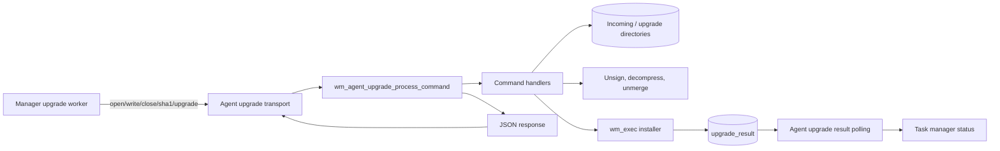
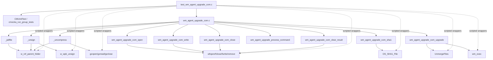
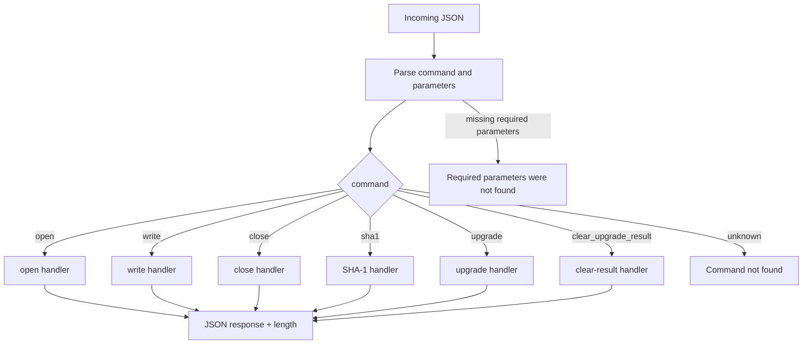
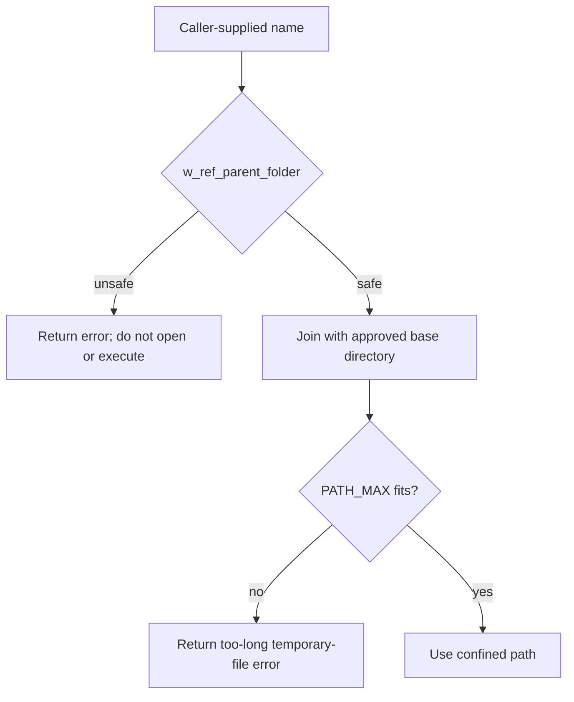
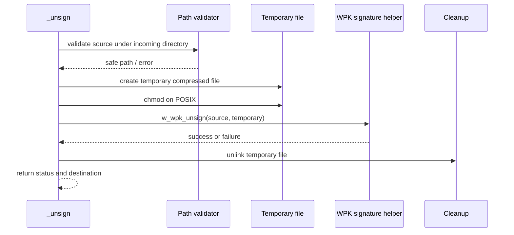
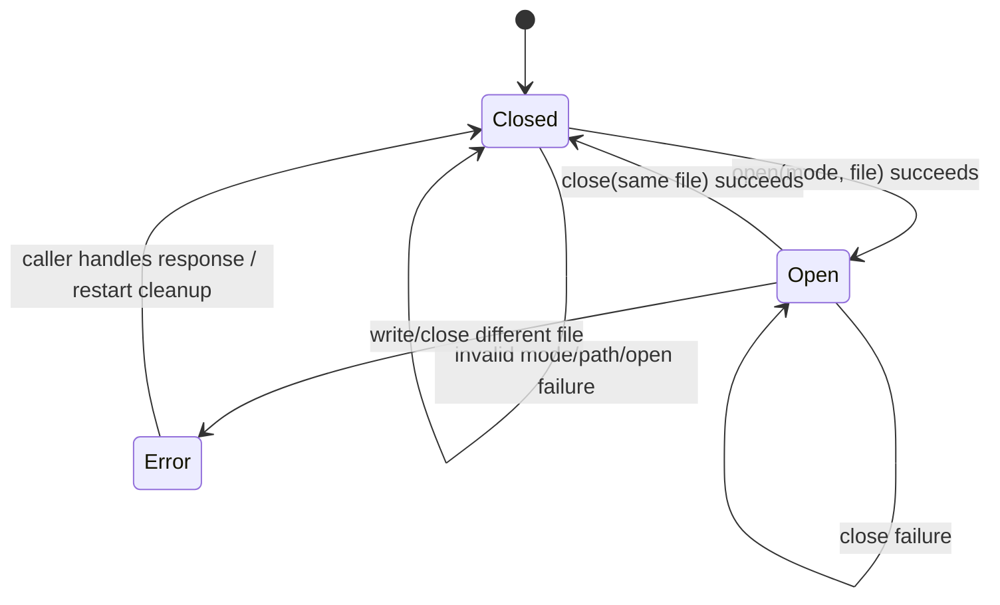
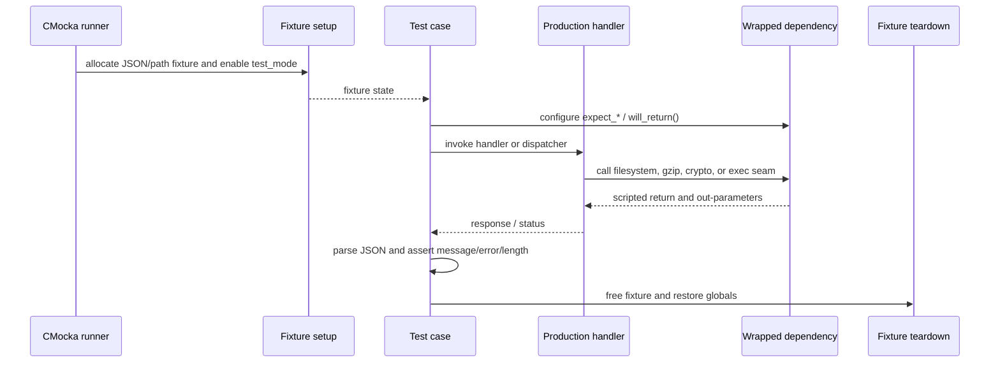

# `agent_upgrade_com` — agent upgrade command processor tests

`agent_upgrade_com` is the unit-test view of the agent-side command processor used by the Wazuh agent upgrade module. It validates path confinement, signed-package handling, compressed-package extraction, upgrade-script execution, upgrade-result cleanup, and the JSON command dispatcher.

The file under test is `src/wazuh_modules/agent_upgrade/agent/wm_agent_upgrade_com.c`; the supplied component is `src/unit_tests/wazuh_modules/agent_upgrade/test_wm_agent_upgrade_com.c`. The suite uses CMocka and linker wrappers to exercise production control flow without touching real upgrade packages, sockets, installers, or host filesystems. The manager-side lifecycle and transfer protocol are documented in [agent_upgrade_module.md](agent_upgrade_module.md); the agent runtime and result polling boundary are described in [agent_upgrade_agent.md](agent_upgrade_agent.md).

## Position in the system

The command processor is the agent-side endpoint of the manager-to-agent upgrade workflow. A manager worker sends commands to the agent; the processor performs a bounded local file operation or executes the final installer, then returns a compact JSON response. The result file is subsequently consumed by the agent runtime.



The processor is deliberately narrower than the full module. It does not create manager tasks, select repositories, validate target-agent compatibility, or persist task status. Those responsibilities belong to [agent_upgrade_module.md](agent_upgrade_module.md), [task_manager_module.md](task_manager_module.md), and [wazuh_db_task operations](test_wdb_task.md).

## Architecture and component relationships



### Responsibilities

| Component | Responsibility | Main contract exercised |
| --- | --- | --- |
| `_jailfile` | Resolve a user/package-relative name below a permitted base directory. | Reject parent-folder traversal; produce platform-specific normalized paths. |
| `_unsign` | Validate source paths, create a temporary compressed file, unsign the WPK, and clean temporary artifacts. | Reject unsafe names, temporary-file/chmod failures, signature failures, and successful cleanup. |
| `_uncompress` | Read gzip input and write the decompressed merged package to a temporary file. | Validate package path, bound temporary path length, handle gzip/file/read/write errors, and remove partial output. |
| `wm_agent_upgrade_com_open` | Open an incoming package for the requested mode. | Allow supported modes, reject unsafe names, close a previously opened file, and report `errno`. |
| `wm_agent_upgrade_com_write` | Append a bounded buffer to the currently opened package. | Require an open file, match the target name, validate the path, and report short/write failures. |
| `wm_agent_upgrade_com_close` | Close the currently opened package. | Require the same file that was opened and report close errors. |
| `wm_agent_upgrade_com_sha1` | Calculate the package SHA-1 in binary mode. | Return the digest or a structured error. |
| `wm_agent_upgrade_com_upgrade` | Verify, decompress, unmerge, prepare, and execute the installer. | Enforce the complete staged pipeline and clean intermediate files on failure. |
| `wm_agent_upgrade_com_clear_result` | Remove the previous upgrade result and re-enable upgrades. | Preserve the disabled gate on removal failure; set it on success. |
| `wm_agent_upgrade_process_command` | Parse a JSON command, validate parameters, dispatch, and return response length. | Handle supported commands, missing parameters, disabled upgrades, and unknown commands. |

The process-global `file` record stores the currently opened path and `FILE *`. The tests use it to verify that `write` and `close` cannot operate on a different file and that an auto-restart/closed-file condition is reported safely. `allow_upgrades` is the process-global gate used by the upgrade command and result-cleanup paths.

## Command protocol

The dispatcher accepts a JSON object with a `command` field and, for most commands, a `parameters` object. The tests establish the following vocabulary:

| Command | Parameters | Successful response message |
| --- | --- | --- |
| `open` | `mode`, `file` | `ok` |
| `write` | `buffer`, `file`, `length` | `ok` |
| `close` | `file` | `ok` |
| `sha1` | `file` | SHA-1 string |
| `upgrade` | `file`, `installer` | `0` when installer execution succeeds |
| `clear_upgrade_result` | none | `ok` |

Responses are JSON strings containing at least `message` and `error`. The direct handler tests inspect the task-manager error-message key; dispatcher tests inspect the generic `message` and numeric `error` fields. The dispatcher returns the length of the allocated response string, and callers own the returned buffer.



## Path confinement and temporary-file flow

All externally supplied file names are checked through `w_ref_parent_folder`. The tests treat a non-zero result as path traversal or another invalid relative path. The expected destinations are platform-dependent: POSIX uses paths such as `var/incoming/test_file`, `tmp/test_filename`, and `var/upgrade/install.sh`; Windows uses the corresponding `incoming\\`, `tmp\\`, and `upgrade\\` forms.



`_unsign` additionally creates a temporary `.gz` file, applies restrictive permissions on POSIX, calls `w_wpk_unsign`, and unlinks temporary artifacts on both success and failure. `_uncompress` opens the compressed source with `gzopen("rb")`, writes output with `wfopen("wb")`, loops over `gzread`, and closes both handles before returning.



## Upgrade execution process

The `upgrade` handler is a staged pipeline. The test suite covers every major boundary and confirms that later stages are not treated as successful when an earlier stage fails.

```mermaid
flowchart TD
    START[upgrade(file, installer)] --> GATE{allow_upgrades?}
    GATE -->|false| DISABLED[Return module disabled/not ready]
    GATE -->|true| CFG[Read execution timeout]
    CFG --> SIGN[_unsign signed WPK]
    SIGN -->|failure| ESIGN[Could not verify signature]
    SIGN -->|success| DECOMP[_uncompress gzip package]
    DECOMP -->|failure| EDECOMP[Could not uncompress package]
    DECOMP -->|success| CLEAN[Clean upgrade directory]
    CLEAN -->|failure| ECLEAN[Could not clean up upgrade directory]
    CLEAN -->|success| MERGE[UnmergeFiles package]
    MERGE -->|failure| EMERGE[Error unmerging file]
    MERGE -->|success| INSTALLER[_jailfile installer]
    INSTALLER -->|unsafe| EFILE[Invalid file name]
    INSTALLER -->|safe| PERM[chmod installer on POSIX]
    PERM -->|failure| EPERM[Could not chmod]
    PERM -->|success| EXEC[wm_exec(installer, timeout)]
    EXEC -->|failure| EEXEC[Error executing command]
    EXEC -->|success| DONE[Return message 0 / error 0]
```

The tests model both the normal path and failures at signature verification, decompression, directory cleanup, unmerge, installer path validation, installer permission setup, and command execution. Intermediate files are expected to be removed when a later stage fails.

## File command state machine

The `open`, `write`, and `close` handlers operate on one process-global file state. The name supplied to `write` or `close` must resolve to the same logical target as the opened file.



Important contracts demonstrated by the tests:

- Opening an unsupported mode closes the existing file before returning an error.
- `write` and `close` reject calls when no file is open.
- A different target name is rejected even if the supplied name itself is safe.
- `fwrite` and `fclose` failures become structured command errors rather than silent success.
- A successful `close` clears the active file state.

## SHA-1 operation

`wm_agent_upgrade_com_sha1` validates the target path, calls `OS_SHA1_File` with `OS_BINARY`, and returns the digest as the response message. The suite checks both a fixed successful digest and the error path when hash generation fails.

```mermaid
flowchart LR
    F[sha1(file)] --> V[Validate confined path]
    V -->|invalid| E[Invalid file name]
    V -->|valid| H[OS_SHA1_File(path, OS_BINARY)]
    H -->|error| HE[Cannot generate SHA1]
    H -->|success| D[Return digest string]
```

## Result cleanup and upgrade gate

`wm_agent_upgrade_com_clear_result` removes the platform-specific `upgrade_result` file. The tests verify that `allow_upgrades` remains `false` if removal fails and becomes `true` only after successful removal.

```mermaid
flowchart TD
    C[clear_upgrade_result] --> R[remove(upgrade_result)]
    R -->|failure| KEEP[Log debug message\nallow_upgrades remains false]
    R -->|success| ENABLE[allow_upgrades = true\nreturn ok]
```

This gate prevents a new upgrade from being considered ready while the previous result cannot be cleared. The broader agent-side polling and acknowledgement behavior is documented in [agent_upgrade_agent.md](agent_upgrade_agent.md).

## Test harness and isolation



The suite includes wrappers for:

- path and file operations: `w_ref_parent_folder`, `wfopen`, `fwrite`, `fclose`, `remove`, `unlink`, `chmod`, and directory cleanup;
- package and compression helpers: `w_wpk_unsign`, `gzopen`, `gzread`, `gzclose`, and `UnmergeFiles`;
- validation and execution: `OS_SHA1_File`, `getDefine_Int`, and `wm_exec`;
- diagnostics and portability: error/debug logging, `strlen`, temporary-file creation, and POSIX `unistd` functions.

`test_mode` makes the production code use deterministic test paths and behavior. `TEST_WINAGENT` selects Windows-specific path separators and temporary-file behavior; POSIX-only chmod coverage is excluded from Windows builds.

## Coverage map

| Test group | What it protects |
| --- | --- |
| Jail-file tests | Traversal rejection, valid base-directory joining, and path-length boundaries. |
| Unsign tests | Source validation, temporary-file creation, permissions, signature verification, cleanup, and success. |
| Uncompress tests | Gzip open/read, output-file open/write, close ordering, path limits, partial-output cleanup, and success. |
| Direct command-handler tests | File mode, target identity, file lifecycle, SHA-1, staged upgrade errors, execution success/failure, and result cleanup. |
| Dispatcher tests | JSON parsing, required parameters, command routing, disabled-upgrade behavior, unknown commands, response shape, and returned response length. |

The test names also document expected error messages such as `Invalid file name`, `Cannot write file`, `Cannot close file`, `Could not verify signature`, `Could not uncompress package`, and `Error executing command`. These strings are part of the observable command contract because callers surface them through task status responses.

## Maintainer guidance

When changing the command processor:

1. Preserve path validation before every externally supplied file is opened, hashed, unmerged, chmodded, or executed.
2. Update both POSIX and `TEST_WINAGENT` path expectations when a path-building rule changes.
3. Keep temporary-file cleanup on every failure branch, including gzip read/write and signature failures.
4. Maintain the `file.path` identity check so a command cannot write to or close a different target.
5. Update dispatcher tests whenever command names, required parameters, response keys, or error messages change.
6. Keep fixture teardown balanced: free CMocka JSON/path state, restore `test_mode`, reset `allow_upgrades`, and close any simulated file.

The wrappers intentionally control external results, so a passing suite proves branch behavior and cleanup contracts—not compatibility with a real WPK, gzip stream, installer, or live agent transport. For end-to-end transfer behavior, use [agent_upgrade_module.md](agent_upgrade_module.md) and [agent_upgrade_agent.md](agent_upgrade_agent.md); for shared wrapper conventions, see [test_infrastructure.md](test_infrastructure.md).

## Related documentation

- [agent_upgrade_module.md](agent_upgrade_module.md) — manager and agent upgrade architecture, package transfer, validation, and installer workflow.
- [agent_upgrade_agent.md](agent_upgrade_agent.md) — agent listener, result-file polling, and task-manager acknowledgement.
- [agent_upgrade_main.md](agent_upgrade_main.md) — common module lifecycle and registration.
- [task_manager_module.md](task_manager_module.md) — task commands and status handling.
- [test_wdb_task.md](test_wdb_task.md) — persistence tests for upgrade task state.
- [os_crypto.md](os_crypto.md) — shared hashing and package-signature primitives.
- [os_net.md](os_net.md) — secure transport primitives used by the surrounding agent-upgrade path.
- [test_infrastructure.md](test_infrastructure.md) — CMocka and wrapper patterns.
