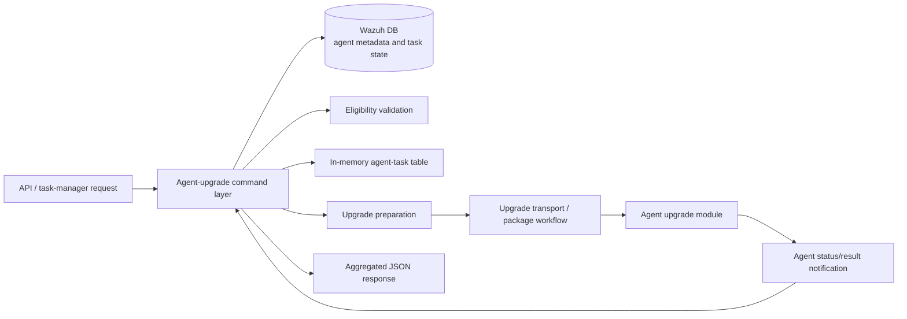
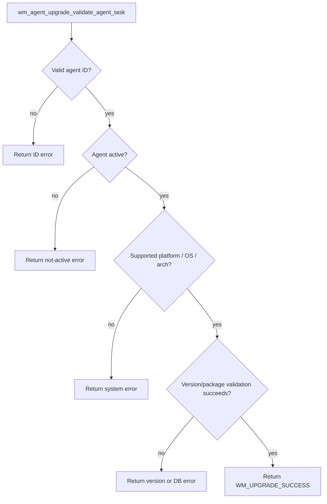
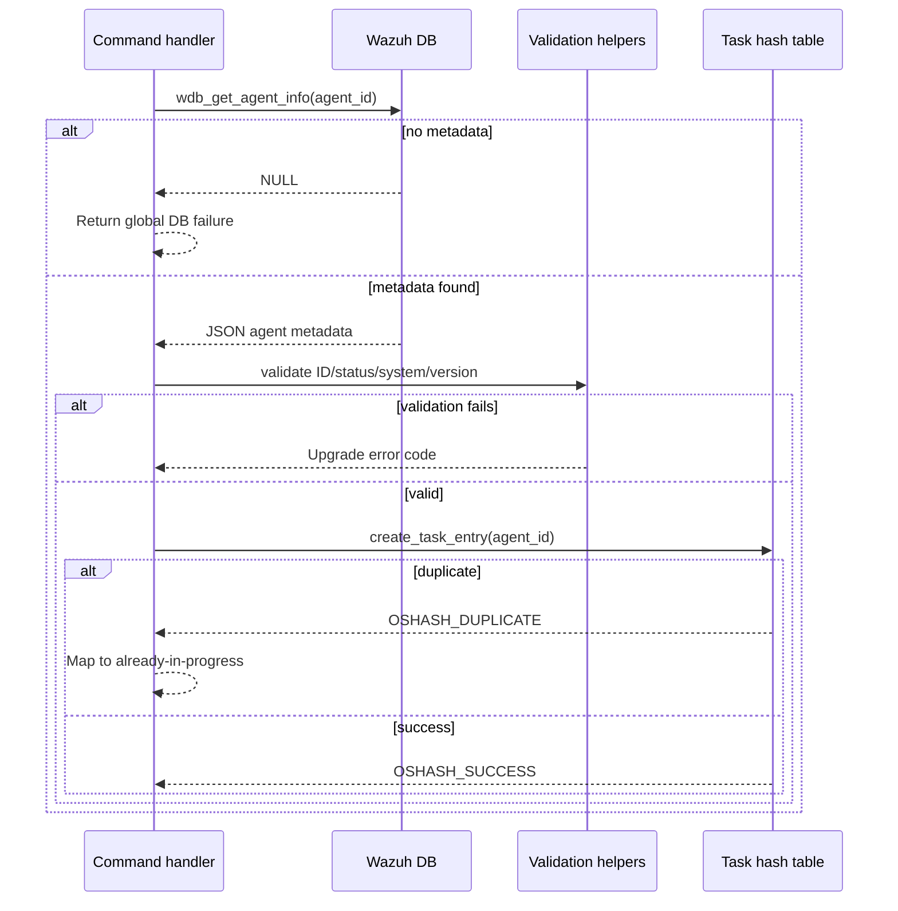
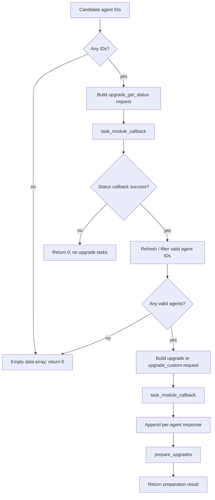
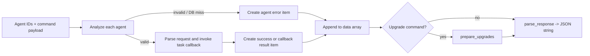
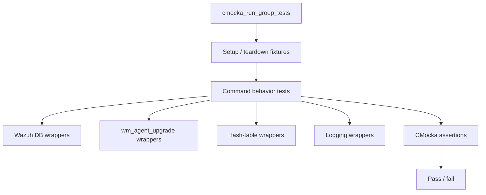

# Agent upgrade commands

## Introduction

`agent_upgrade_commands` documents the command-orchestration contract of the Wazuh agent-upgrade subsystem. The module is represented by the CMocka suite in `src/unit_tests/wazuh_modules/agent_upgrade/test_wm_agent_upgrade_commands.c`; it does not implement upgrade behavior itself. Instead, it verifies the command-layer functions that translate requests into validated agent tasks, task-manager callbacks, upgrade preparation, and JSON responses.

The production lifecycle, manager/agent socket handling, package transfer, and validation primitives are documented in [agent_upgrade_module.md](agent_upgrade_module.md), [agent_upgrade_main.md](agent_upgrade_main.md), [agent_upgrade_agent.md](agent_upgrade_agent.md), and [agent_upgrade_com.md](agent_upgrade_com.md). Task persistence and task-manager protocol details are covered by [task_manager_module.md](task_manager_module.md).

## Position in the system

The command layer sits between API/task-manager requests and the lower-level upgrade manager. It coordinates Wazuh DB lookups, eligibility validation, in-memory task tracking, and upgrade execution without owning transport or package-installation mechanics.

### Production boundaries

| Boundary | Responsibility | Related documentation |
| --- | --- | --- |
| Request reception | Accept module commands and route them to command handlers | [agent_upgrade_main.md](agent_upgrade_main.md), [task_manager_module.md](task_manager_module.md) |
| Command orchestration | Validate agents, create tasks, dispatch callbacks, aggregate results | This document |
| Agent metadata | Supply platform, OS version, architecture, Wazuh version, and connection status | [wazuh_db_global.md](wazuh_db_global.md) |
| Upgrade execution | Transfer WPK content and issue open/write/hash/upgrade commands | [agent_upgrade_module.md](agent_upgrade_module.md), [agent_upgrade_com.md](agent_upgrade_com.md) |
| Agent-side commands | Receive and execute upgrade commands, verify/sign/unpack payloads | [agent_upgrade_agent.md](agent_upgrade_agent.md), [agent_upgrade_com.md](agent_upgrade_com.md) |

## Core command responsibilities

### Agent-task validation

`wm_agent_upgrade_validate_agent_task()` validates a task in short-circuit order:

1. `wm_agent_upgrade_validate_id()` rejects manager-only or otherwise invalid agent IDs.
2. `wm_agent_upgrade_validate_status()` requires an eligible connection state; disconnected and never-connected agents are rejected.
3. `wm_agent_upgrade_validate_system()` maps platform, OS major/minor versions, and architecture to a package family such as `deb`.
4. `wm_agent_upgrade_validate_version()` checks the installed version and resolves the target version for normal upgrades. Custom upgrades still pass command/platform validation but use the custom task payload.

The first non-success result is returned. The tests explicitly cover success for `WM_UPGRADE_UPGRADE` and `WM_UPGRADE_UPGRADE_CUSTOM`, plus ID, status, system, and version failures.

### Agent analysis and task registration

`wm_agent_upgrade_analyze_agent()` obtains one agent record using `wdb_get_agent_info()`, copies the returned metadata into `wm_agent_task.agent_info`, validates the task, and registers the agent through `wm_agent_upgrade_create_task_entry()`.

Important outcomes:

- Missing DB data returns `WM_UPGRADE_GLOBAL_DB_FAILURE`.
- Validation errors are propagated unchanged.
- `OSHASH_DUPLICATE` becomes `WM_UPGRADE_UPGRADE_ALREADY_IN_PROGRESS`.
- An unexpected task-table result becomes `WM_UPGRADE_UNKNOWN_ERROR`.
- Successful registration leaves the agent metadata populated and associates the task with the agent ID.

### Creating upgrade tasks

`wm_agent_upgrade_create_upgrade_tasks()` is the batch coordinator. It obtains candidate agent IDs, requests current upgrade status first, then builds and dispatches the requested `upgrade` or `upgrade_custom` task. Each per-agent response is retained in the supplied `cJSON` array. The function then invokes `wm_agent_upgrade_prepare_upgrades()` and returns its result or zero when no work can be prepared.

The tests establish these behaviors:

- No candidate IDs produces an empty response array and return value `0`.
- A status callback failure stops the workflow before upgrade dispatch.
- No agents returned after the status phase produces no upgrade tasks.
- Successful preparation returns the preparation result and preserves task responses.
- Upgrade callback failure returns `0` while preserving already-produced response entries.

### Command processing and response aggregation

The command processors share the same orchestration pattern:

- `wm_agent_upgrade_process_upgrade_command()` handles standard package upgrades.
- `wm_agent_upgrade_process_upgrade_custom_command()` handles a caller-provided WPK and installer.
- `wm_agent_upgrade_process_upgrade_result_command()` queries and returns completed task details.
- `wm_agent_upgrade_process_agent_result_command()` consumes an agent status notification, logs it, updates task state through `upgrade_update_status`, and returns a compact per-agent result.
- `wm_agent_upgrade_cancel_pending_upgrades()` sends `upgrade_cancel_tasks` through the task-module callback.

Responses use a top-level `error` and `message`, with a `data` array for agent-scoped results. A mixed batch is non-transactional: an invalid agent can contribute an error object while another agent contributes a task ID and success response.

## Data model and ownership

The command suite exercises these task structures from `wm_agent_upgrade_manager.h` and `wm_agent_upgrade_tasks.h`:

| Structure | Role |
| --- | --- |
| `wm_agent_task` | Joins `agent_info` with `task_info` for one upgrade operation. |
| `wm_agent_info` | Holds DB-derived identity, platform, OS, architecture, version, and connection status. |
| `wm_task_info` | Holds the command and command-specific task payload. |
| `wm_upgrade_task` | Normal upgrade task payload. |
| `wm_upgrade_custom_task` | Custom WPK path and installer payload. |
| `wm_upgrade_agent_status_task` | Agent-reported status, error code, and message. |

Setup and teardown functions are part of the tested ownership contract. They initialize nested task objects and hash tables, while teardown frees cJSON values, strings, task payloads, and hash-table entries. This is especially important because command processors return heap-allocated JSON strings and retain per-agent task state.

## Test architecture

The suite uses CMocka fixtures and wrapper-based isolation. Production dependencies are replaced with wrappers for Wazuh DB operations, upgrade validators, task callbacks, logging, and hash-table behavior.

Coverage is organized by behavior rather than implementation file:

- cancellation: one request/callback success path;
- validation: six tests covering normal/custom success and each validation stage;
- analysis: success, duplicate, unknown hash result, validation failure, and DB failure;
- task creation: success, callback failure, no agents, and status-stage failure;
- result processing: successful task result and agent status notifications for done and failed states;
- normal/custom command processing: mixed valid/invalid agents and no-valid-agent handling.

The suite’s `main()` registers 24 CMocka tests and invokes `cmocka_run_group_tests()`. Several tests intentionally mock lower-level behavior, so they verify command-layer control flow and response contracts rather than actual network transfer or WPK installation.

## Error and edge-case contract

| Condition | Expected behavior |
| --- | --- |
| Agent absent from global DB | Add an agent-specific DB error response; continue processing other IDs where applicable. |
| Agent ID invalid for manager action | Stop analysis for that task and return the validator error. |
| Agent disconnected / never connected | Reject upgrade eligibility. |
| Unsupported platform, OS, or architecture | Return system validation error. |
| Installed version cannot be evaluated | Return version/global DB error. |
| Existing task for agent | Return `WM_UPGRADE_UPGRADE_ALREADY_IN_PROGRESS`. |
| No valid agents | Log a warning and return a successful envelope with per-agent errors, or an empty array for task creation. |
| Task callback failure | Preserve accumulated response entries and return failure from the coordinator. |
| Agent reports failure | Log the agent error and update status as `Failed`; response remains structurally valid. |

## Maintenance guidance

When changing command behavior, update this suite alongside the implementation and preserve the following invariants:

1. Validate before registering an agent task.
2. Keep duplicate registration distinguishable from generic hash-table failures.
3. Preserve per-agent errors in mixed batches.
4. Keep response ownership explicit: callers of command processors free returned strings; fixtures free nested cJSON and task objects.
5. Keep normal and custom upgrade flows aligned, differing only in payload and version/WPK validation requirements.
6. Add wrapper expectations for every new external dependency so tests remain deterministic.

## References

- [Agent upgrade module](agent_upgrade_module.md)
- [Agent upgrade entry point](agent_upgrade_main.md)
- [Agent upgrade agent-side module](agent_upgrade_agent.md)
- [Agent upgrade command communication](agent_upgrade_com.md)
- [Task manager module](task_manager_module.md)
- [Wazuh DB](wazuh_db.md)
- [Wazuh DB global agent operations](wazuh_db_global.md)
