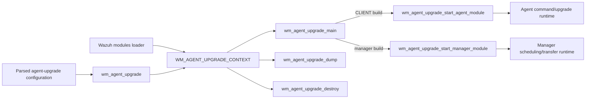
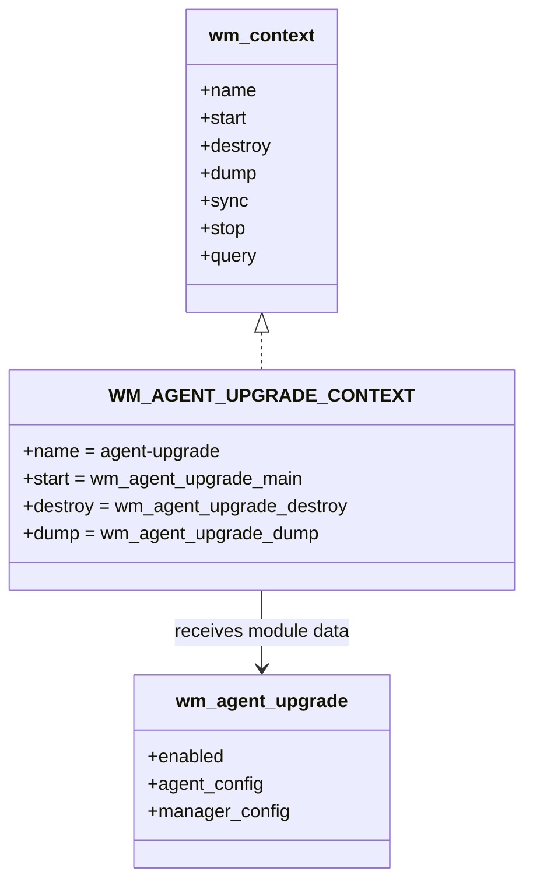
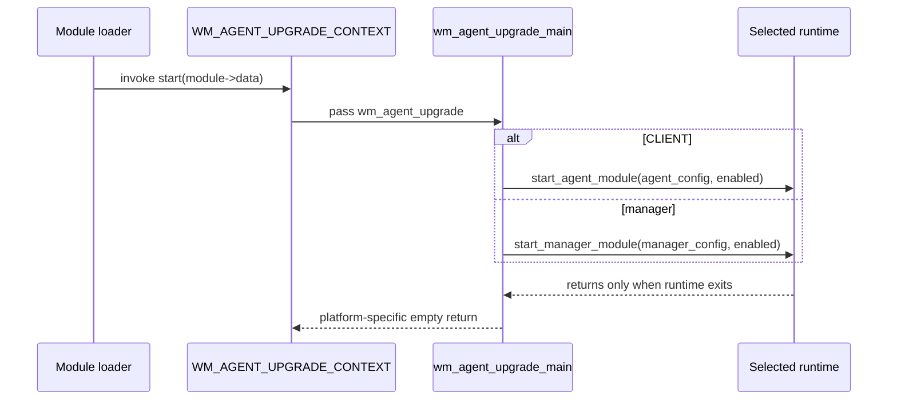
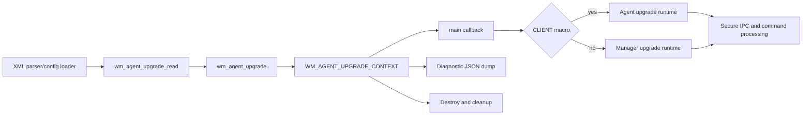
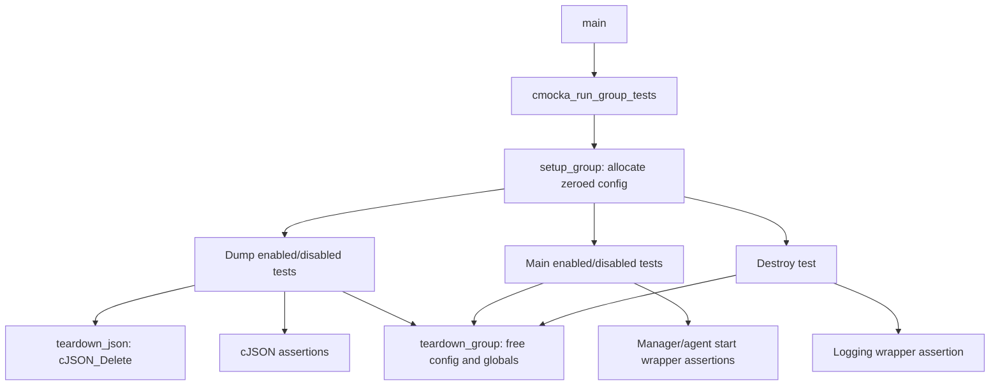

# `agent_upgrade_main`

`agent_upgrade_main` is the lifecycle entry point for Wazuh's agent-upgrade module. It adapts the common modules-daemon contract (`wm_context`) to the platform-specific upgrade implementation: manager builds start the manager upgrade service, while agent builds start the agent command receiver. The module also exposes a diagnostic configuration dump and releases module-owned resources during shutdown.

The detailed upgrade protocol, package validation, task scheduling, and agent-side file handling are documented in [agent_upgrade_module](agent_upgrade_module.md). XML parsing and defaults are documented in [Wmodules_Config_agent_upgrade](Wmodules_Config_agent_upgrade.md).

## Position in the system

The source is `src/wazuh_modules/agent_upgrade/wm_agent_upgrade.c`. It is compiled into the Wazuh modules daemon and supplies the runtime context consumed by the generic module loader. The surrounding daemon lifecycle is described in [Wazuh_Modules_Daemon_(C)](Wazuh_Modules_Daemon_(C).md).



## Components

### `wm_agent_upgrade`

The shared configuration object is defined in `wm_agent_upgrade.h`:

| Field | Meaning |
| --- | --- |
| `enabled` | Bit flag controlling whether upgrades are allowed. |
| `agent_config` | Agent-side wait/backoff and CA-verification settings. |
| `manager_config` | Manager-side worker count, transfer chunk size, and WPK repository. |

The object is allocated by the configuration layer and passed through `wmodule.data`. Configuration parsing is handled by [Wmodules_Config_agent_upgrade](Wmodules_Config_agent_upgrade.md); this file consumes the resulting object rather than parsing XML itself.

### `WM_AGENT_UPGRADE_CONTEXT`

`WM_AGENT_UPGRADE_CONTEXT` registers the module with four active callbacks:

| Callback | Implementation | Responsibility |
| --- | --- | --- |
| `start` | `wm_agent_upgrade_main` | Start the manager or agent implementation. |
| `destroy` | `wm_agent_upgrade_destroy` | Log completion, release manager-owned data, and free the context object. |
| `dump` | `wm_agent_upgrade_dump` | Return a JSON representation of effective settings. |
| `sync`, `stop`, `query` | `NULL` | No separate callbacks are provided by this façade. |



## Startup behavior

`wm_agent_upgrade_main` is intentionally thin. The preprocessor determines which implementation is linked:

* In a `CLIENT` build it calls `wm_agent_upgrade_start_agent_module(&agent_config, enabled)`.
* In a manager build it calls `wm_agent_upgrade_start_manager_module(&manager_config, enabled)`.

On Windows the callback uses the thread entry signature `DWORD WINAPI` and returns `0`. On POSIX it uses the module routine signature `void *` and returns `NULL`. The callback itself does not implement the upgrade loop; the selected manager or agent component owns that behavior. See [agent_upgrade_module](agent_upgrade_module.md) for the manager/agent implementation details.



The `enabled` value is passed even when false. This lets the selected runtime initialize its listener or worker state consistently while enforcing the disabled policy in its own command-processing layer.

## Configuration dump

`wm_agent_upgrade_dump` always returns a root JSON object with an `agent-upgrade` child. The `enabled` bit is rendered as the string `"yes"` or `"no"`.

Manager builds additionally expose `max_threads`, `chunk_size`, and `wpk_repository` when non-null. Agent builds expose `ca_verification` as `"yes"`/`"no"`, and include `ca_store` only when the shared CA-store list exists. The dump is intended for module introspection and diagnostics, not as a configuration input format.

```mermaid
flowchart TD
    S[wm_agent_upgrade_dump(config)] --> R[Create root object]
    R --> A[Create agent-upgrade object]
    A --> E[Add enabled: yes/no]
    E --> B{Build target}
    B -->|manager| M[Add max_threads, chunk_size,
    optional wpk_repository]
    B -->|CLIENT| C[Add ca_verification,
    optional ca_store array]
    M --> OUT[Attach child and return JSON]
    C --> OUT
```

Representative output shapes are:

```json
{
  "agent-upgrade": {
    "enabled": "yes",
    "max_threads": 8,
    "chunk_size": 32768,
    "wpk_repository": "packages.wazuh.com/vX.x/wpk/"
  }
}
```

```json
{
  "agent-upgrade": {
    "enabled": "yes",
    "ca_verification": "yes",
    "ca_store": ["/etc/ssl/certs/ca-certificates.crt"]
  }
}
```

## Destruction and ownership

`wm_agent_upgrade_destroy` logs the completion message using `WM_AGENT_UPGRADE_LOGTAG`, frees `manager_config.wpk_repository` in manager builds, and finally frees the `wm_agent_upgrade` object. Agent CA-store ownership is handled by the agent configuration/runtime layer; the façade does not free `wcom_ca_store`.

```mermaid
flowchart TD
    D[wm_agent_upgrade_destroy(config)] --> LOG[Log module finished]
    LOG --> T{Manager build?}
    T -->|yes| W[Free manager_config.wpk_repository]
    T -->|no| SKIP[No manager repository]
    W --> F[Free wm_agent_upgrade]
    SKIP --> F
    F --> END[Context destroyed]
```

The manager repository must therefore be heap-allocated and owned by the module configuration object. The destroy path requires a valid configuration pointer; callers must not invoke it with `NULL`.

## Process and dependency flow



The façade depends on the common module types and cJSON, plus the build-specific start function. Runtime dependencies such as secure sockets, WPK signatures, task persistence, and agent metadata belong to the downstream implementations and are intentionally referenced rather than duplicated here:

* [framework_core_communication](framework_core_communication.md) — common queues, sockets, database connections, and logging.
* [wazuh_db](wazuh_db.md) — task and agent database services used by manager-side upgrade processing.
* [os_crypto](os_crypto.md) — package hashing and signature helpers.
* [agent_upgrade_module](agent_upgrade_module.md) — end-to-end manager/agent upgrade protocol.

## Test coverage

The focused test file is `src/unit_tests/wazuh_modules/agent_upgrade/test_wm_agent_upgrade.c`. It uses CMocka and wrapper functions to isolate this façade from the manager/agent runtimes.



The tests verify:

* enabled and disabled dump output;
* manager-only fields versus agent-only CA fields, selected by `TEST_SERVER`;
* delegation with both `enabled = 1` and `enabled = 0`;
* the shutdown log and manager repository cleanup path;
* JSON and configuration cleanup through group teardown functions.

The tests do not validate package transfer or installation semantics. Those behaviors belong to the subordinate manager, agent, parsing, validation, upgrade, and task test groups listed under the broader [agent_upgrade_module](agent_upgrade_module.md) documentation.

## Maintenance notes

When changing `wm_agent_upgrade` fields or build-specific configuration:

1. Update the parser documentation and the dump assertions together.
2. Preserve the manager/`CLIENT` split: fields from one target must not leak into the other target's dump.
3. Update both POSIX and Windows callback signatures if the module start contract changes.
4. Keep resource ownership explicit, especially `wpk_repository` and the shared agent CA store.
5. Extend the focused CMocka tests before modifying downstream transfer or task behavior.
