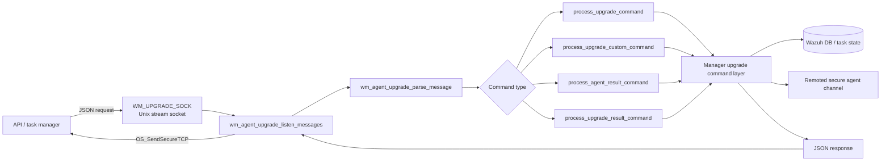
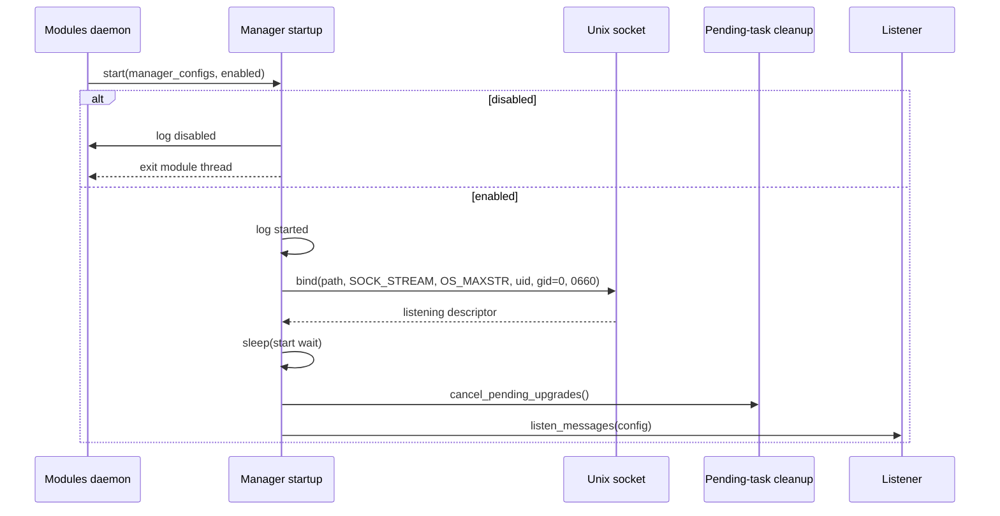
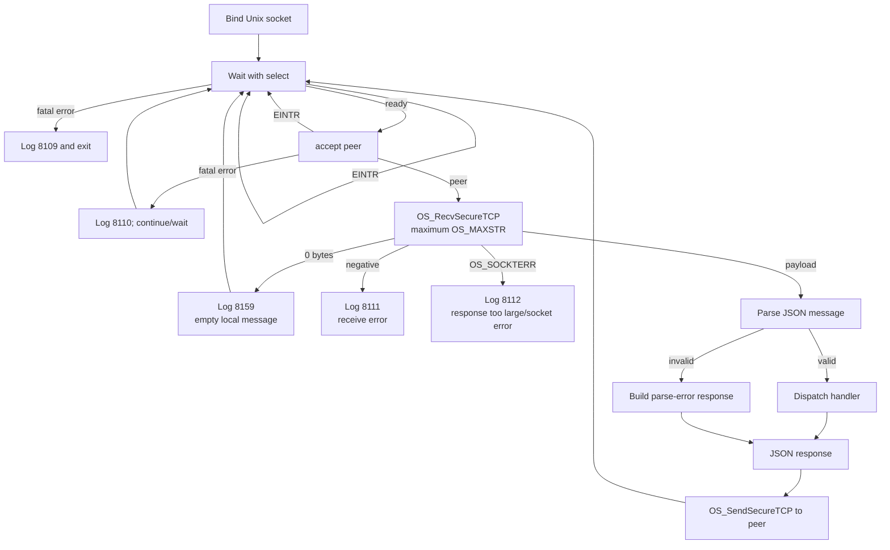
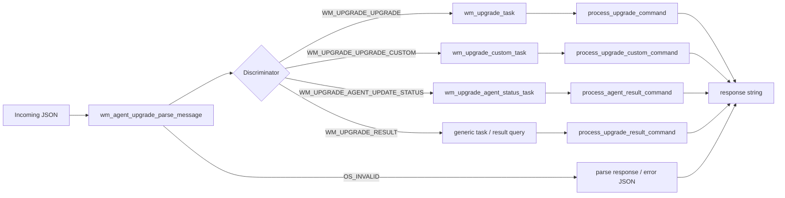
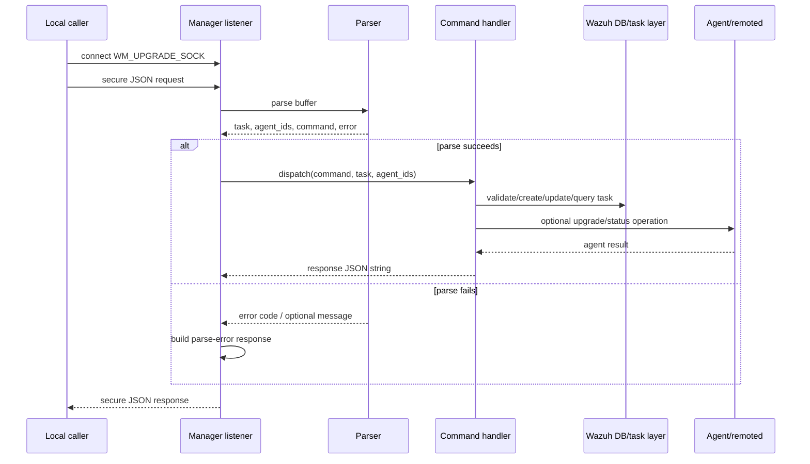
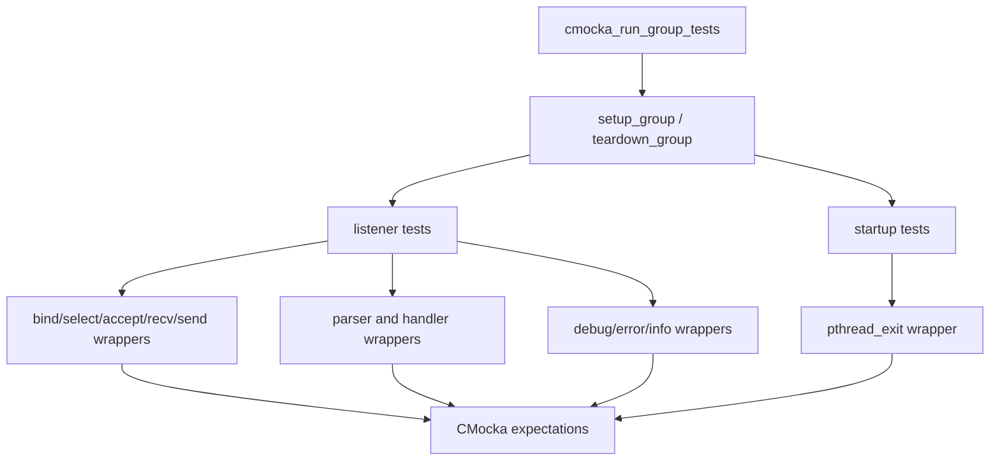

# Agent upgrade manager

The `agent_upgrade_manager` module is the manager-side IPC boundary for Wazuh agent upgrades. It exposes a local Unix stream socket, receives JSON requests from the API/task-management path, routes each request to the corresponding upgrade command handler, and returns a JSON response to the caller. The supplied implementation evidence is the CMocka suite at `src/unit_tests/wazuh_modules/agent_upgrade/test_wm_agent_upgrade_manager.c`; the production listener is represented by `wm_agent_upgrade_listen_messages()` and the startup wrapper by `wm_agent_upgrade_start_manager_module()`.

The actual upgrade orchestration, agent eligibility checks, task persistence, package transfer, and WPK validation are shared with the broader module documentation in [agent_upgrade_module](agent_upgrade_module.md) and [agent_upgrade_commands](agent_upgrade_commands.md). This document focuses on the manager listener’s boundaries and observable behavior.

## Position in the system

The listener is a local control-plane service inside the Wazuh modules daemon. API/task-manager code submits commands through the upgrade socket; the listener delegates business logic to the manager command layer, which can consult the Wazuh DB and contact agents through remoted.



## Responsibilities and boundaries

| Component | Responsibility | Related documentation |
| --- | --- | --- |
| `wm_agent_upgrade_start_manager_module` | Announces startup, handles the enabled flag, and enters the manager listener | [agent_upgrade_main](agent_upgrade_main.md) |
| `wm_agent_upgrade_listen_messages` | Binds the socket, waits for clients, receives one bounded request, dispatches it, and sends one response | This document |
| `wm_agent_upgrade_parse_message` | Converts JSON into a command discriminator, agent ID list, task payload, and optional parse error response | [agent_upgrade_commands](agent_upgrade_commands.md) |
| `wm_agent_upgrade_process_*_command` | Performs validation, task creation/status operations, upgrade preparation, or result lookup | [agent_upgrade_commands](agent_upgrade_commands.md) |
| `wm_agent_upgrade_upgrades.c` | Transfers WPK content and coordinates worker execution | [agent_upgrade_module](agent_upgrade_module.md) |
| `wazuh_db` / task manager | Stores agent and upgrade-task state | [wazuh_db](wazuh_db.md), [task_manager_module](task_manager_module.md) |

The listener owns transport control flow, not upgrade policy. It does not itself validate WPK versions, select installers, or persist task records.

## Startup and socket lifecycle

`wm_agent_upgrade_start_manager_module(manager_configs, enabled)` is the manager entry point. The tests establish these externally visible steps:

1. Log `Module Agent Upgrade started.`
2. Bind `WM_UPGRADE_SOCK` using `OS_BindUnixDomainWithPerms`.
3. Use `SOCK_STREAM`, `OS_MAXSTR`, the current user ID, group ID `0`, and permission `0660`.
4. Wait `WM_AGENT_UPGRADE_START_WAIT_TIME` before entering normal request handling.
5. Cancel pending upgrades before processing new requests.
6. Invoke `wm_agent_upgrade_listen_messages()`.

When `enabled == 0`, the module first logs `Module Agent Upgrade disabled. Exiting...` and exits the current module thread. The test then verifies that the manager startup path still reaches the common socket-bind path when invoked directly; callers should therefore treat the enabled gate and listener initialization as separate responsibilities of the production startup wrapper.



A bind failure logs error `8108` with the socket path and exits the startup path. The socket path is the module constant `WM_UPGRADE_SOCK`, shown by the tests as `queue/tasks/upgrade`.

## Listener control flow

The listener uses a select/accept loop over the bound descriptor. Once a peer is accepted, it reads a bounded secure TCP message with `OS_RecvSecureTCP`, parses it, dispatches the command, sends the generated response with `OS_SendSecureTCP`, and continues waiting for work.



The exact continuation behavior on transport errors is intentionally covered by the tests rather than inferred as a public API guarantee. In particular, `EINTR` from `select()` and `accept()` is retried, while a fatal `select()` error logs error `8109` and terminates the listener. Receive failures are logged as `8111` or `8112` and do not produce a normal command response.

## Command dispatch contract

The listener receives a JSON object with a `command` field and a `parameters` object. Parsing returns four conceptual values: a command-specific task pointer, a sentinel-terminated agent ID array, an optional response/error object, and a command discriminator.



### Standard upgrade

`upgrade` carries an agent list and a WPK repository, as illustrated by the test payload:

```json
{
  "command": "upgrade",
  "parameters": {"agents": [1], "wpk_repo": "packages.wazuh.com/wpk"}
}
```

The listener passes the parsed `wm_upgrade_task` and agent array to `wm_agent_upgrade_process_upgrade_command()`. That layer validates agents and creates upgrade work; see [agent_upgrade_commands](agent_upgrade_commands.md).

### Custom upgrade

`upgrade_custom` carries an agent list and caller-provided WPK path:

```json
{
  "command": "upgrade_custom",
  "parameters": {"agents": [2], "file_path": "/test/wazuh.wpk"}
}
```

The listener delegates to `wm_agent_upgrade_process_upgrade_custom_command()`. Package safety, path validation, and installer selection belong to the manager/agent upgrade implementation documented in [agent_upgrade_module](agent_upgrade_module.md).

### Status update and result query

`upgrade_update_status` carries an agent result (`error`, `message`, and `status`) and is routed to `wm_agent_upgrade_process_agent_result_command()`. `upgrade_result` requests durable task result information and is routed to `wm_agent_upgrade_process_upgrade_result_command()`.

Representative successful response shapes asserted by the suite are:

```json
{"error":0,"data":[{"error":0,"message":"Success","agent":1,"task_id":1}],"message":"Success"}
```

Result queries return task metadata such as `task_id`, `node`, `module`, `command`, creation/update timestamps, status, and `error_msg`.

## Data flow for a request



The listener does not require a response for an empty receive or a receive failure. For a parse failure it does send a structured error response. The tests cover both a generic unknown-error response (`error: 26`) and a parser-provided response (`error: 1`, `Could not parse message JSON`).

## Error handling and observability

The listener uses the `wazuh-modulesd:agent-upgrade` log tag. The suite verifies the following operational messages:

| Condition | Observable behavior |
| --- | --- |
| Bind failure | Error `8108`; listener cannot start. |
| Fatal `select()` failure | Error `8109`; listener exits. |
| Non-interrupted `accept()` failure | Error `8110`; retry/wait behavior is exercised. |
| Receive failure | Error `8111`; logs `errno`. |
| Oversized/socket receive result | Error `8112`. |
| Zero-byte receive | Debug `8159`; no response is sent. |
| Valid request | Debug `8155` logs the incoming payload; `8156` logs the response. |
| Startup disabled | Info `8152`; module exits. |
| Startup begins | Info `8153`. |

Payload logging is part of the tested behavior. Maintainers should consider this when changing request contents or adding sensitive fields.

## Test architecture

The CMocka suite constructs a zero-initialized `wm_manager_configs` fixture and releases it in `teardown_group`. Network, timing, logging, parser, and command-layer dependencies are replaced with wrappers, so the tests verify listener control flow without binding a real socket or upgrading a real agent.



Coverage groups include:

* standard `upgrade` dispatch;
* `upgrade_custom` dispatch;
* agent status update dispatch;
* upgrade result dispatch;
* parser failures with and without a parser-generated message;
* empty, failed, and oversized receives;
* `select()` timeout, `EINTR`, and fatal-error paths;
* `accept()` success, `EINTR`, and fatal-error paths;
* bind failure;
* enabled and disabled manager startup.

The tests use sentinel-terminated agent arrays (`agents[1] = -1`) and assert that the same parsed task and array are passed to the selected handler. This is an important ownership/interface contract between the listener and command layer.

## Maintenance guidance

When changing this module:

1. Preserve the socket parameters and bounded receive size unless the IPC contract is intentionally versioned.
2. Update parser, handler, and listener tests together when adding a command or changing its payload.
3. Keep parse errors structurally compatible with API/task-manager consumers.
4. Preserve `EINTR` retry behavior for interruptible waits and accepts.
5. Review payload logging whenever request or response fields change.
6. Keep business logic in the command/upgrade layers and link to their documentation rather than duplicating it here.

For end-to-end changes, also consult [agent_upgrade_module](agent_upgrade_module.md), [agent_upgrade_commands](agent_upgrade_commands.md), [task_manager_module](task_manager_module.md), and [Wazuh_Modules_Daemon_(C)](Wazuh_Modules_Daemon_(C).md).
