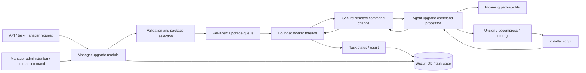
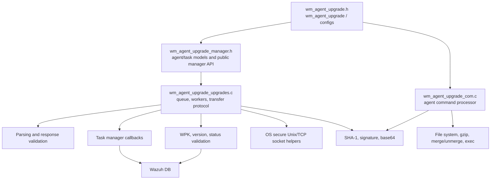
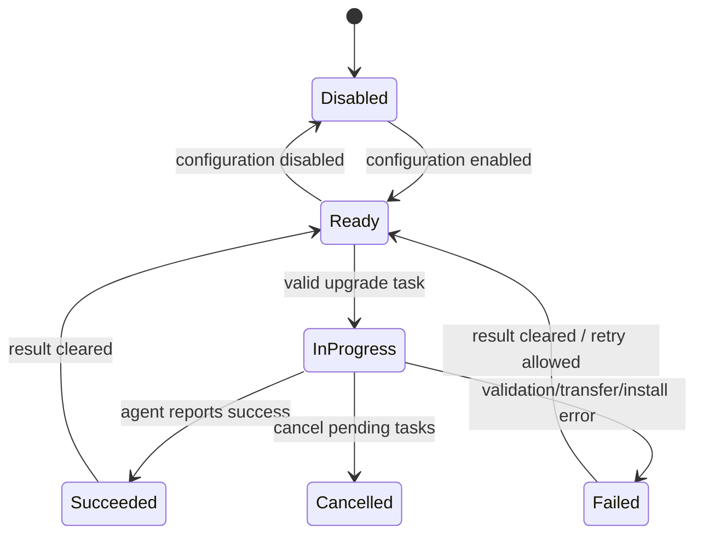
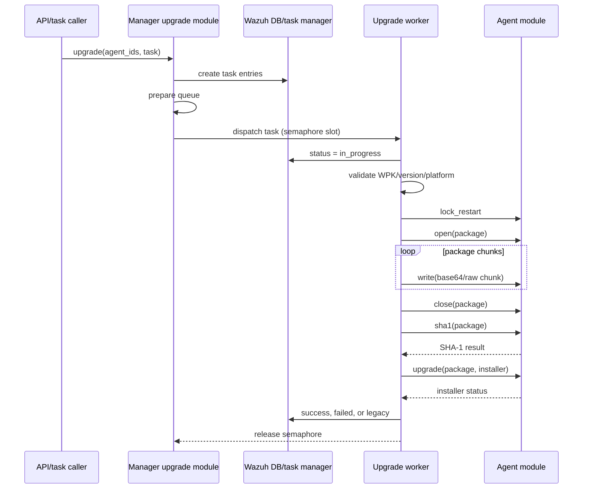
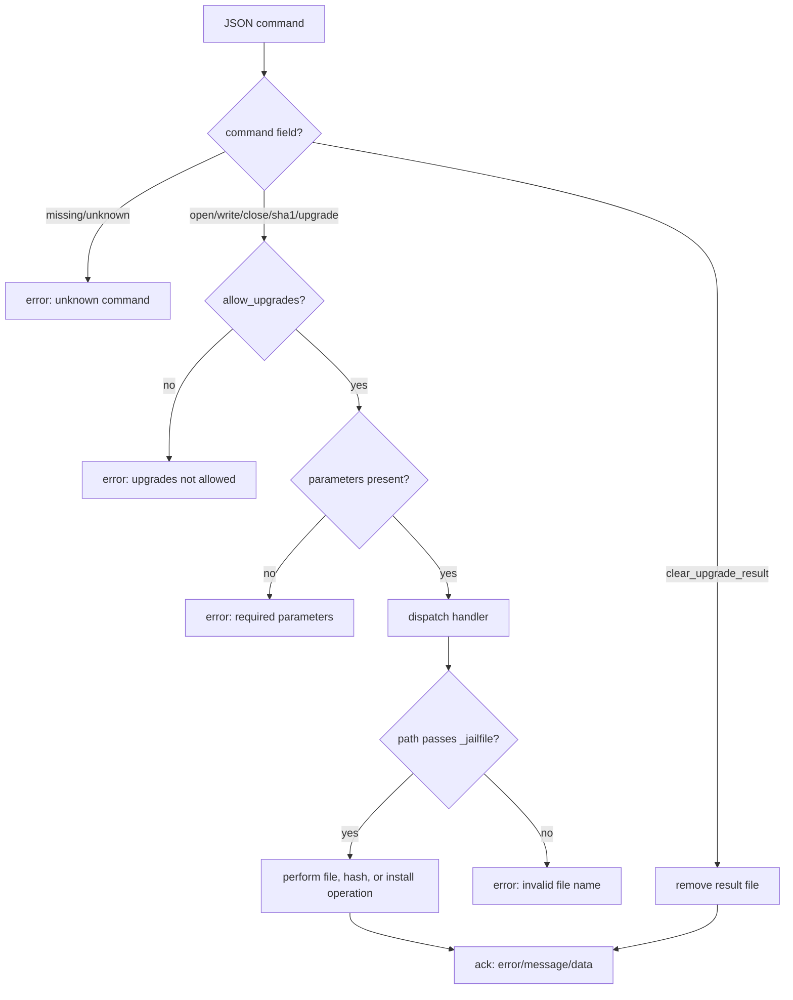
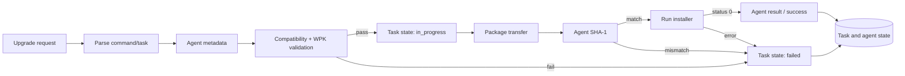

# Agent upgrade module

The agent upgrade module coordinates controlled Wazuh agent upgrades from a manager and executes the receiving side of an upgrade on an agent. It validates platform/version compatibility and WPK integrity, creates per-agent tasks, transfers packages through the remoted command channel, verifies the transferred file, and invokes the platform installer. The module is implemented in the native Wazuh modules daemon and is also exposed through the API and task-manager paths described in [agent_module_core](agent_module_core.md) and the related task-manager documentation when available.

## Scope and role in Wazuh

The module has two operational roles:

* **Manager side:** accepts upgrade or custom-upgrade requests, resolves agent metadata, validates the target package, schedules work with bounded concurrency, and sends upgrade commands to agents.
* **Agent side:** receives file-operation commands, writes the package below the incoming directory, computes SHA-1, unpacks and verifies the signed package, and executes the selected installer.

The module is hosted by the common Wazuh modules daemon. It relies on the shared secure socket/network primitives described in [os_net](os_net.md), cryptographic and WPK-signature helpers in [os_crypto](os_crypto.md), the Wazuh database for agent/task state in [wazuh_db](wazuh_db.md), and common module lifecycle/IPC facilities in [framework_core_communication](framework_core_communication.md). Agent inventory and status fields are supplied by the agent-management layer; see [agent_module_core](agent_module_core.md).

## Architecture

The manager and agent implementations share a command vocabulary but not the same state. The manager tracks an `wm_agent_task` for each target; the agent tracks one currently opened file in a process-global file record. This intentionally serializes file writes per agent process while allowing multiple manager-side agent upgrades.

## Component relationships

### Configuration and lifecycle

`wm_agent_upgrade` combines an enabled flag with agent and manager configuration. `wm_agent_configs` contains agent-side retry/wait and CA-verification settings. `wm_manager_configs` contains the worker limit, transfer chunk size, and WPK repository. The constants establish the supported minimum versions, repository transitions, default package directory, transfer limits, and retry bounds.

The common modules daemon calls `wm_agent_upgrade_read` while parsing XML and uses `WM_AGENT_UPGRADE_CONTEXT` to register the module. Manager and agent startup are separated by `wm_agent_upgrade_start_manager_module` and the agent-side startup path. Disabled modules reject upgrade commands and do not start the corresponding worker behavior.

## Manager-side data model

The manager header defines the data passed across parsing, validation, scheduling, and callbacks:

| Type | Purpose |
| --- | --- |
| `wm_upgrade_task` | Standard repository upgrade: repository/version, force flag, package file/SHA-1, custom version, and Linux package type. |
| `wm_upgrade_custom_task` | Upgrade from a caller-supplied WPK and optional installer. The file and installer must be available on worker nodes. |
| `wm_upgrade_agent_status_task` | Agent-reported status, error code, and message. |
| `wm_task_info` | Discriminated task wrapper; `command` selects the concrete structure stored in `task`. |
| `wm_agent_info` | Target identity and compatibility metadata: platform, OS version, architecture, Wazuh version, connection state, and package type. |
| `wm_agent_task` | Pairing of one target agent with one requested task. |
| `wm_upgrade_args` | Worker-thread argument containing manager configuration and one `wm_agent_task`. |

Commands are represented by `wm_upgrade_command`: standard upgrade, custom upgrade, status query/update, result, and cancellation. Error codes distinguish parsing, unsupported systems/versions, missing or invalid WPKs, transfer stages, and final installation failures. The string table `upgrade_error_codes` is used when task status is updated with a human-readable failure.

## Manager-side processing

1. An upgrade request is parsed into a command and task structure. Agent IDs are associated with `wm_agent_info` records and queued as individual `wm_agent_task` entries.
2. `wm_agent_upgrade_prepare_upgrades` drains the pending agent map into a linked queue. The map entry is removed after enqueueing, preventing duplicate dispatch from the same pending entry.
3. `wm_agent_upgrade_dispatch_upgrades` initializes `upgrade_semaphore` with `max_threads`, waits for a slot, pops one task, and starts a worker thread. Each worker returns the semaphore slot when finished.
4. The worker first updates task state to `in_progress`. It validates the status callback response before transferring data.
5. Standard upgrades validate the selected repository/version and WPK; custom upgrades validate the supplied file and installer. Platform, architecture, current Wazuh version, minimum supported version, force behavior, package type, existence, and SHA-1 are checked by the validation layer.
6. The worker sends the package using the ordered protocol `lock_restart`, `open`, repeated `write`, `close`, `sha1`, and `upgrade`. Newer agents receive JSON commands; older agents receive the legacy `com` command format.
7. The worker marks failures with the corresponding `upgrade_error_codes`. For legacy targets that do not report an upgrade result, it records `legacy`; otherwise the agent/task callback later records success or failure.

### Package transfer and compatibility

`wm_agent_upgrade_send_wpk_to_agent` selects either the repository WPK or a custom file, computes/uses its SHA-1, chooses the default installer (`upgrade.bat` on Windows and `upgrade.sh` elsewhere), and derives the package basename. Before transfer it sends `lock_restart`, preventing an agent restart from interrupting the file operation.

The agent version is compared with `WM_UPGRADE_NEW_UPGRADE_MECHANISM`. New-format agents receive JSON such as `{ "command": "write", "parameters": { ... } }` embedded in an `upgrade` request. Older agents receive commands such as `com open`, `com write`, `com close`, `com sha1`, and `com upgrade`. Opening is retried up to `WM_UPGRADE_WPK_OPEN_ATTEMPTS`; writes use the configured chunk size.

Manager-to-agent communication connects to `REMOTE_LOCAL_SOCK`, sends through `OS_SendSecureTCP`, receives a bounded response with `OS_RecvSecureTCP`, and closes the socket. This is a local manager IPC hop; the remoted subsystem then delivers the command to the selected agent. See [shared_lib_networking](shared_lib_networking.md) for the lower-level networking model.

## Agent-side command processor

`wm_agent_upgrade_process_command` parses a JSON command, dispatches by `command`, and returns a compact response with `error`, `message`, and `data` fields. `clear_upgrade_result` is always recognized; all other commands require `allow_upgrades` and a `parameters` object.

The command handlers are:

| Command | Behavior |
| --- | --- |
| `open` | Validates mode (`w` or `wb`) and jails the file below `INCOMING_DIR`; closes any previous handle and opens the new file. |
| `write` | Requires an open file and an exactly matching jailed path; decodes base64 and writes the requested byte count. |
| `close` | Requires the matching open path, closes the handle, and clears tracked state. |
| `sha1` | Jails the path, computes a binary-file SHA-1, and returns it in the response message. |
| `upgrade` | Unsigns the package, gzip-decompresses it, clears and unmerges the package into `UPGRADE_DIR`, validates the installer path, applies executable permissions on Unix, and invokes `wm_exec` with the configured request timeout. |
| `clear_upgrade_result` | Removes `WM_AGENT_UPGRADE_RESULT_FILE`; on success sets `allow_upgrades = true`. |

### Path confinement and package safety

`_jailfile` rejects parent-folder references using `w_ref_parent_folder`, then joins the requested filename to a fixed base directory using the platform separator and rejects paths exceeding `PATH_MAX`. It is applied to incoming files, temporary files, upgrade files, and installer paths. This prevents command payloads from selecting arbitrary filesystem locations.

`_unsign` creates a temporary destination, verifies the WPK signature through `w_wpk_unsign` and the configured CA store, deletes the signed source, and cleans up on failure. `_uncompress` reads gzip data in 4 KiB blocks and writes a temporary merged package. The upgrade handler then unmerges into the upgrade directory before executing only the jailed installer path. The package is not executed directly; it is first transformed and passed to `wm_exec` with a request timeout.

The single static `file` record stores the active path and `FILE *`. A new `open` closes an existing handle, `write` and `close` require exact path equality, and automatic restart/closure is surfaced as a distinct error. `allow_upgrades` gates operations until the previous result file has been cleared, providing a simple post-upgrade re-arm mechanism.

## Data and status flow

Task-manager callbacks are the state boundary: the upgrade worker submits `in_progress`, `failed`, `legacy`, and result updates rather than directly owning the durable task record. The task-manager module persists and serves status; the database backend and agent metadata services are documented separately in [wazuh_db](wazuh_db.md) and [agent_module_core](agent_module_core.md).

## Operational limits and failure behavior

Important built-in limits include a default transfer chunk size of 32 KiB, a permitted chunk range of 64–60,000 bytes, a default manager concurrency limit of eight workers, a WPK download timeout of 60 seconds, five download attempts, ten open attempts, and a maximum response size of 1 MiB. The agent-side installer request timeout is configurable within the `execd` limits and defaults to 20 seconds when read by the upgrade code.

Failures are stage-specific: unsupported platform/version, inactive agent, already-running task, missing repository/WPK, SHA-1 mismatch, lock/open/write/close/upgrade transport errors, signature or decompression failures, invalid paths, permission changes, and installer execution failures all map to separate codes. Temporary files and intermediate package artifacts are removed on most failure paths; logs use the module tag `ARGV0:agent-upgrade`.

## Testing and maintenance guide

The module has focused unit-test groups under `src/unit_tests/wazuh_modules/agent_upgrade/` covering:

* module lifecycle and enable/disable behavior;
* agent and manager socket listeners;
* JSON/XML parsing and response decoding;
* task creation, callbacks, cancellation, and status transitions;
* WPK/version/platform validation;
* queueing, worker dispatch, retries, package transfer, SHA-1 comparison, and installer execution;
* agent file commands, path jailing, decompression, signing, and result cleanup.

When changing the command schema, update both the manager serializers in `wm_agent_upgrade_upgrades.c` and the agent dispatch/handlers in `wm_agent_upgrade_com.c`, then update parsing and wrapper-based tests. Changes to task states or error codes must remain compatible with task-manager persistence and API consumers. Changes to package paths or signature handling should be reviewed with [os_crypto](os_crypto.md) and the shared file/network documentation.

## Related modules

* [agent_module_core](agent_module_core.md) — agent metadata, grouping, restart, and upgrade-facing agent operations.
* [wazuh_db](wazuh_db.md) — durable agent, task, and upgrade-result state.
* [os_net](os_net.md) — secure socket primitives used by command delivery.
* [shared_lib_networking](shared_lib_networking.md) — native networking and IPC helpers.
* [os_crypto](os_crypto.md) — SHA-1, package signing, and cryptographic support.
* [framework_core_communication](framework_core_communication.md) — common queues, sockets, logging, and database communication.

