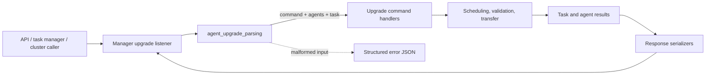
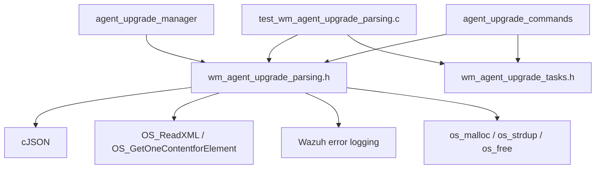
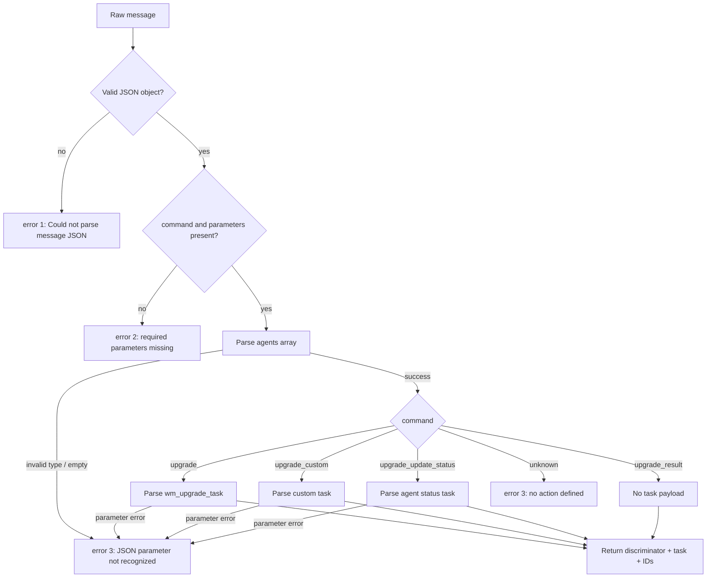
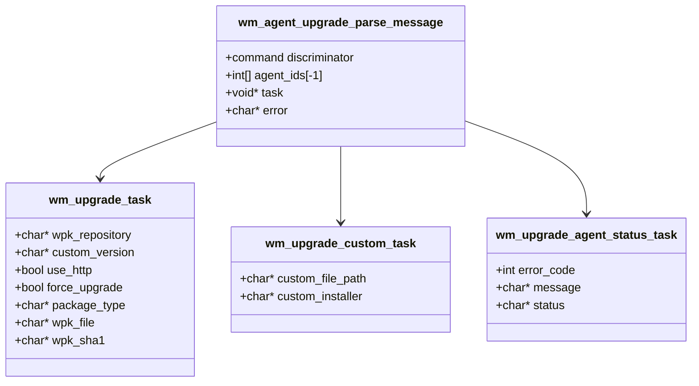
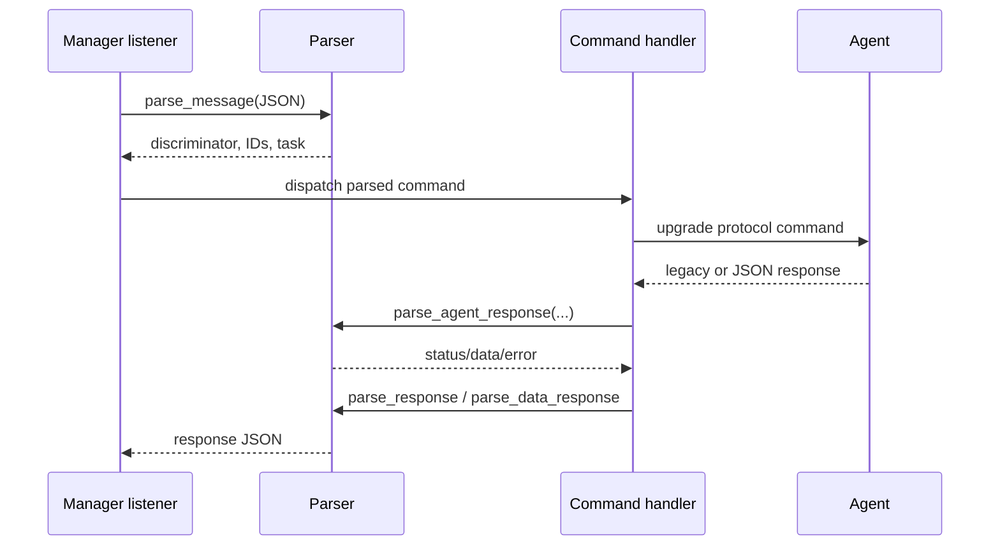
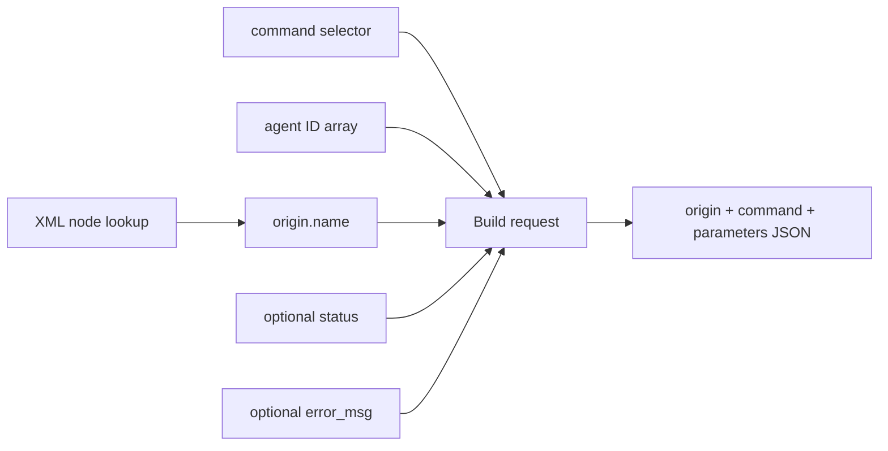
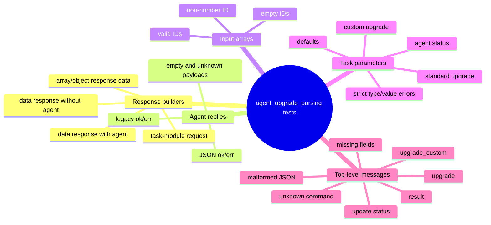

# Agent upgrade parsing

The `agent_upgrade_parsing` module defines and tests the translation boundary for Wazuh agent-upgrade messages. It converts JSON requests into command discriminators, sentinel-terminated agent-ID arrays, and command-specific task structures; it converts internal results and agent replies back into JSON or status values; and it reports malformed input through structured error responses.

The implementation is exercised by `src/unit_tests/wazuh_modules/agent_upgrade/test_wm_agent_upgrade_parsing.c`. The production parser declarations are provided by `wm_agent_upgrade_parsing.h`, while task structures and destructors come from `wm_agent_upgrade_tasks.h`. Scheduling, validation, transfer, and lifecycle behavior are intentionally outside this module; see [agent_upgrade_module](agent_upgrade_module.md), [agent_upgrade_manager](agent_upgrade_manager.md), [agent_upgrade_commands](agent_upgrade_commands.md), and [agent_upgrade_main](agent_upgrade_main.md).

## Role in the upgrade system

Parsing is the protocol adapter between the manager listener/task-manager callers and the upgrade command implementation. It has no socket loop, database access, package-transfer logic, or installer execution of its own.



## Architecture and dependencies



The test suite replaces external XML and logging calls with CMocka wrappers. `__wrap_OS_ReadXML` returns a scripted result, `__wrap_OS_GetOneContentforElement` supplies the node name, and `__wrap_OS_ClearXML` is a no-op. This isolates construction of task-module messages from the host configuration and filesystem.

## Public parsing responsibilities

| Function | Input | Output / contract |
| --- | --- | --- |
| `wm_agent_upgrade_parse_message` | JSON command message | Returns a `WM_UPGRADE_*` discriminator or `OS_INVALID`; fills a task pointer, agent IDs, and optional structured error string. |
| `wm_agent_upgrade_parse_agents` | JSON array | Allocates integer IDs terminated by `-1`; rejects non-number entries and reports `Agent id not recognized`. |
| `wm_agent_upgrade_parse_upgrade_command` | `parameters` object | Builds `wm_upgrade_task` with repository, version, HTTP, force, package type, and optional package metadata. |
| `wm_agent_upgrade_parse_upgrade_custom_command` | `parameters` object | Builds `wm_upgrade_custom_task` with WPK file path and installer. |
| `wm_agent_upgrade_parse_upgrade_agent_status` | `parameters` object | Builds `wm_upgrade_agent_status_task` with numeric error, message, and status. |
| `wm_agent_upgrade_parse_agent_response` | Legacy text response | Maps `ok <data>` to `0`, `err <message>` to `-1`, and unknown/NULL input to `-1`. |
| `wm_agent_upgrade_parse_agent_upgrade_command_response` | JSON agent response | Reads `error` and `message`; returns `0` for success, the agent error code for known failures, and `-1` for unknown/malformed responses. |
| `wm_agent_upgrade_parse_data_response` | Error code, message, optional agent ID | Builds an object containing `error` and `message`, adding `agent` only when supplied. |
| `wm_agent_upgrade_parse_response` | Error code and cJSON data | Builds a standard response with `error`, `message`, and `data`; success uses message `Success`. |
| `wm_agent_upgrade_parse_task_module_request` | Command, agent array, optional status/error | Builds a task-module JSON request with origin, command, and parameters. The origin name is read from XML configuration. |

## Command message flow

The top-level parser first decodes JSON, verifies the required `command` and `parameters` fields, parses `agents`, and then dispatches command-specific parameter parsing. Agent IDs are parsed before the task payload, which explains why a task-parameter failure may still return a valid allocated agent array.



### Supported command discriminators

| JSON `command` | Return value | Parsed payload |
| --- | --- | --- |
| `upgrade` | `WM_UPGRADE_UPGRADE` | `wm_upgrade_task` |
| `upgrade_custom` | `WM_UPGRADE_UPGRADE_CUSTOM` | `wm_upgrade_custom_task` |
| `upgrade_update_status` | `WM_UPGRADE_AGENT_UPDATE_STATUS` | `wm_upgrade_agent_status_task` |
| `upgrade_result` | `WM_UPGRADE_RESULT` | No task payload; agent IDs are retained. |

An unknown command returns `OS_INVALID`. The parser logs error `8102`, but exposes the caller-facing error as a top-level error `3` with a `data` array containing a parameter-recognition message.

## Parameter semantics and defaults

All command-specific fields are optional at this parsing layer unless the enclosing command requires them. Missing fields receive safe defaults rather than causing an error:

* Standard upgrade: repository, version, package type, WPK file, and SHA-1 are `NULL`; `use_http` and `force_upgrade` are `false`.
* Custom upgrade: file path and installer are `NULL`.
* Agent status: `error` defaults to `0`; message and status are `NULL`.
* Agent lists: an empty array produces an allocated array whose first value is `-1`, but an empty list is rejected by the complete message parser as missing required target agents.

When a field is present, its type is strict. Repository/version/package/file/installer/message/status must be strings; `error` must be numeric; `use_http` and `force_upgrade` must be JSON booleans; and `package_type` must be `rpm` or `deb`.



## Response and serialization flow



Standard success responses use the shape `{"error":0,"message":"Success","data":...}`. Data is normalized into an array by `wm_agent_upgrade_parse_response`; the tests cover both array and object input. Agent-scoped error objects contain `error`, `message`, and optionally `agent`. The absence of an agent ID is represented by omission of the `agent` property, not a null value.

Legacy agent replies are text-based: `ok ` with no payload is still successful and yields an empty string; `err ` yields `-1` and logs error `8116`. The JSON agent-command response uses its numeric `error` field, while a response without recognized fields logs `8117` and returns `-1`.

## Task-module request construction

`wm_agent_upgrade_parse_task_module_request` creates an internal request sent to the upgrade task module. It reads the current node name through XML configuration and emits a stable origin descriptor.



The request includes `origin.module = "upgrade_module"`, `command = "upgrade_custom"` for the tested command value, and an `agents` array. `status` and `error_msg` are omitted when NULL. If XML cannot be read, the origin name becomes an empty string while the rest of the request remains constructible.

## Error model

Parsing errors have two layers:

1. Internal diagnostic logs identify the exact validation failure, for example `8101` for invalid JSON, `8102` for an unknown command, `8103` for invalid parameter data, and `8107` for missing required fields.
2. Caller-facing JSON uses a compact error code and a `data` array. Typical values are error `1` for invalid JSON, error `2` for missing required fields, and error `3` for unrecognized command parameters.

```json
{
  "error": 3,
  "data": [{"error": 3, "message": "Parameter \"use_http\" should be true or false"}],
  "message": "JSON parameter not recognized"
}
```

The parser returns `OS_INVALID` for failures and leaves task outputs NULL when task construction fails. If agent IDs were parsed successfully before the task failure, the ID array remains available to the caller and must be freed by the caller.

## Ownership and cleanup

The parser allocates response JSON, error strings, agent-ID arrays, and task structures. The test fixtures make the ownership rules explicit:

* `teardown_json` deletes cJSON roots.
* `teardown_string` frees allocated strings with `os_free`.
* `teardown_parse_agents` frees the error and ID array.
* `teardown_parse_upgrade`, `teardown_parse_upgrade_custom`, and `teardown_parse_upgrade_agent_status` free both errors and their corresponding task through the task destructor.

Callers should use the matching task destructor from [agent_upgrade_commands](agent_upgrade_commands.md) or [agent_upgrade_module](agent_upgrade_module.md), and should not free nested task strings independently.

## Test coverage



The CMocka `main` registers each case with the appropriate teardown fixture. Wrapper expectations verify not only return values but also diagnostic log tags and messages. This makes the suite a protocol-contract test: changes to JSON field names, defaults, error codes, response shape, or allocation behavior are likely to surface here before affecting manager scheduling or agent transfer.

## Related modules

* [agent_upgrade_manager](agent_upgrade_manager.md) — local socket listener and dispatch boundary.
* [agent_upgrade_commands](agent_upgrade_commands.md) — manager command handlers, task callbacks, and result aggregation.
* [agent_upgrade_module](agent_upgrade_module.md) — end-to-end manager/agent workflow, package transfer, and validation.
* [agent_upgrade_com](agent_upgrade_com.md) — agent-side command execution after parsing.
* [agent_upgrade_main](agent_upgrade_main.md) — module lifecycle and configuration dump.
* [task_manager_module](task_manager_module.md) — durable upgrade task status handling.
