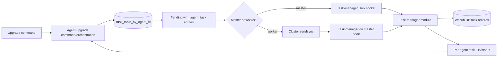
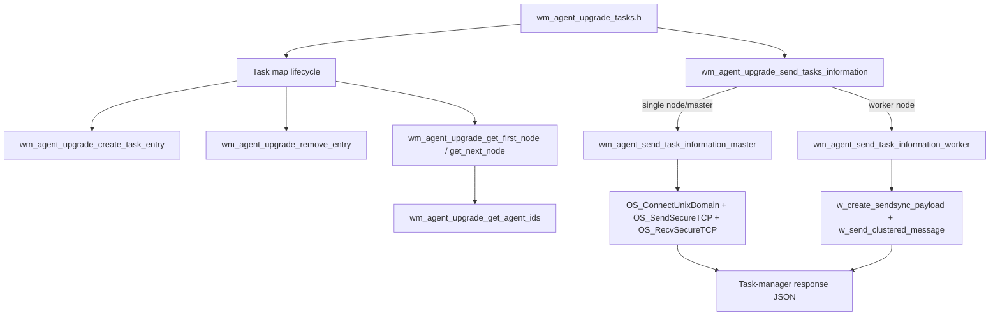
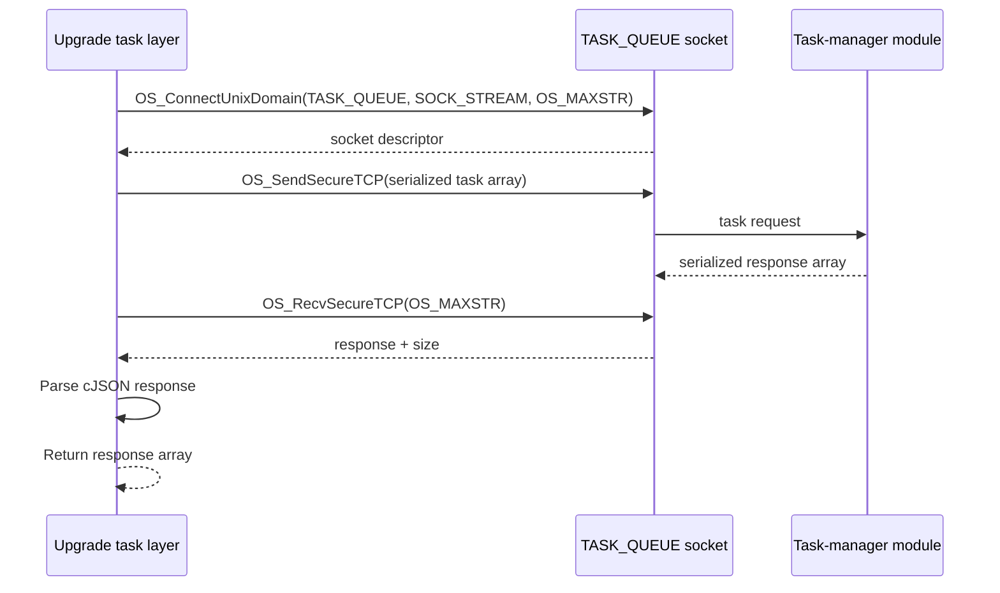
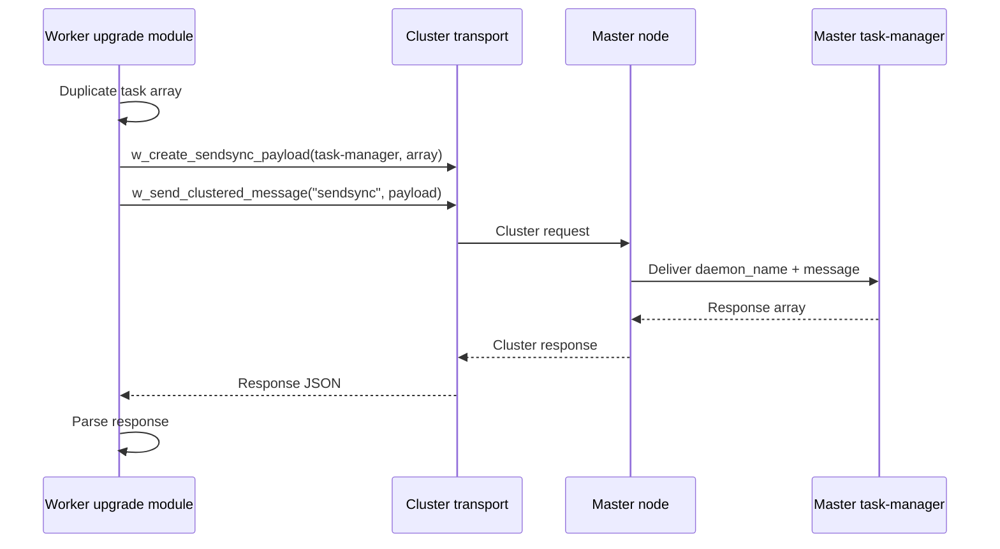
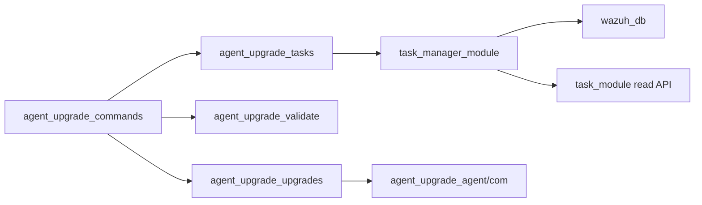

# Agent upgrade tasks

## Introduction

The `agent_upgrade_tasks` module is the manager-side task bookkeeping and dispatch boundary for Wazuh agent upgrades. It maintains the in-memory map of upgrade tasks keyed by agent ID, enumerates pending agents, and submits task requests to the task-manager module.

This module does not perform package validation, WPK transfer, installation, or durable task querying. Those responsibilities belong to the surrounding [agent upgrade module](agent_upgrade_module.md), [agent upgrade command layer](agent_upgrade_commands.md), and [task module](task_module.md).

The supplied core component is the CMocka suite `src/unit_tests/wazuh_modules/agent_upgrade/test_wm_agent_upgrade_tasks.c`. The suite documents the observable contracts of the production functions in `wm_agent_upgrade_tasks.h`, especially hash-table ownership, agent-ID enumeration, local task-manager IPC, and cluster master/worker routing.

## Role in the system

The task layer sits between upgrade orchestration and task-manager persistence:



The important distinction is that `task_table_by_agent_id` is transient coordination state, while the task-manager and Wazuh DB provide the durable task record. A map entry identifies work waiting to be dispatched; it is not itself the public task-status API.

## Architecture and component relationships



### Core responsibilities

| Responsibility | Production behavior represented by the tests |
| --- | --- |
| Task registration | Add one `wm_agent_task` to `task_table_by_agent_id` under the decimal agent ID string. |
| Duplicate detection | Preserve `OSHASH_DUPLICATE` when an agent already has a task. |
| Task removal | Delete by decimal agent ID and optionally release the returned task object according to the caller’s ownership flag. |
| Enumeration | Wrap `OSHash_Begin` and `OSHash_Next` so callers can iterate task entries. |
| Agent-ID extraction | Convert hash keys such as `025` and `035` to numeric JSON values `[25, 35]`; return `NULL` when the map is empty. |
| Task-manager submission | Send a JSON array of task commands and parse the JSON array response. |
| Cluster routing | On workers, wrap the request for the task-manager daemon and send it to the master with the `sendsync` command. |

## In-memory task registry

`task_table_by_agent_id` is an `OSHash` whose keys are decimal strings derived from agent IDs. The value is a pointer to a `wm_agent_task`, which joins an agent identity with its upgrade task metadata. The registry is initialized and destroyed at test-group scope by `wm_agent_upgrade_init_task_map()` and `wm_agent_upgrade_destroy_task_map()`.

```mermaid
flowchart TD
    Entry[agent_id = 6, wm_agent_task*] --> Key[format agent ID as "6"]
    Key --> Add[OSHash_Add_ex(task_table_by_agent_id)]
    Add -->|OSHASH_SUCCESS| Stored[Map owns/indexes task entry]
    Add -->|OSHASH_DUPLICATE| Duplicate[Existing task remains visible]
    Stored --> Begin[OSHash_Begin]
    Begin --> Next[OSHash_Next]
    Next --> More{Another node?}
    More -->|yes| Next
    More -->|no| End[Iteration complete]
    Stored --> Delete[OSHash_Delete_ex("6")]
    Delete --> Release[Optional task cleanup]
```

### Registration

`wm_agent_upgrade_create_task_entry(agent_id, agent_task)` delegates insertion to `OSHash_Add_ex`. The test suite verifies both the exact key (`"6"`) and the returned status. Callers must not collapse `OSHASH_DUPLICATE` into generic failure: duplicate registration represents an already-running or already-pending upgrade and is meaningful to the command layer.

### Removal and ownership

`wm_agent_upgrade_remove_entry(agent_id, free_task)` delegates lookup/removal to `OSHash_Delete_ex`. The successful path returns the removed task pointer to the function, while the error path receives `NULL`. The `free_task` argument controls whether the removed task is released, so callers must use it consistently with the ownership of the task object.

### Iteration and ID snapshots

`wm_agent_upgrade_get_first_node(index)` starts an `OSHash` traversal and `wm_agent_upgrade_get_next_node(index, node)` advances it. `wm_agent_upgrade_get_agent_ids()` uses these helpers to build a new cJSON array from node keys. The returned array is a snapshot: deleting it does not mutate the task map.

The tests cover two important edge cases:

* an empty map returns `NULL`, rather than an empty cJSON array;
* keys with leading zeroes are parsed as numbers, so `025` becomes JSON number `25`.

## Task-manager communication

Task requests are cJSON arrays. The test fixtures use entries shaped like:

```json
[
  {"module":"upgrade_module","command":"upgrade","agent":12},
  {"module":"upgrade_module","command":"upgrade","agent":10}
]
```

The task manager responds with an array containing per-agent outcomes and task IDs:

```json
[
  {"error":0,"data":"Success","agent":12,"task_id":100},
  {"error":0,"data":"Success","agent":10,"task_id":101}
]
```

### Master-node path

`wm_agent_send_task_information_master()` connects to `TASK_QUEUE` with a stream Unix socket and `OS_MAXSTR` as the maximum message size. It sends the serialized request using `OS_SendSecureTCP`, receives the bounded response with `OS_RecvSecureTCP`, logs both directions under the `wazuh-modulesd:agent-upgrade` tag, parses the response as JSON, and returns the parsed cJSON value.



The tested failure contract is explicit:

| Failure | Result |
| --- | --- |
| Unix socket connection fails | Log that the task-manager module cannot be reached and return `NULL`. |
| Receive returns `-1` | Log the receive error and return `NULL`. |
| Receive returns `OS_SOCKTERR` | Log that the response exceeds the expected size and return `NULL`. |
| Response is malformed JSON | Log invalid response format and return `NULL`. |
| Send succeeds and response is valid JSON | Return the parsed cJSON response. |

The test suite does not assert a separate send-error case, so changes to send-result handling should be accompanied by a focused test if that contract changes.

### Worker-node path

`wm_agent_send_task_information_worker()` does not contact the local task-manager socket. It duplicates the request, creates a cluster synchronization payload addressed to `TASK_MANAGER_WM_NAME`, and sends it with `w_send_clustered_message` using the `sendsync` command. The master task-manager processes the request and returns the response through the cluster channel.



The same high-level response contract is used for both paths. This allows `wm_agent_upgrade_send_tasks_information()` to select routing based on `w_is_worker()` without changing the caller’s request or response model.

## Routing process

```mermaid
flowchart TD
    Start[wm_agent_upgrade_send_tasks_information(message)] --> Worker{w_is_worker()?}
    Worker -->|false| Master[wm_agent_send_task_information_master]
    Worker -->|true| WorkerSend[wm_agent_send_task_information_worker]
    Master --> Socket[Local task-manager IPC]
    WorkerSend --> Cluster[Cluster sendsync IPC]
    Socket --> Parse[Parse response array]
    Cluster --> Parse
    Parse -->|valid| Return[Return cJSON response]
    Parse -->|transport/JSON error| Null[Return NULL and log error]
```

This routing keeps task creation centralized on the master in clustered deployments while preserving a direct, low-latency path for a single-node or master process.

## Interaction with adjacent modules

The module participates in a larger upgrade lifecycle but intentionally delegates most domain work:



See [agent_upgrade_commands.md](agent_upgrade_commands.md) for agent eligibility validation, task creation orchestration, response aggregation, and cancellation. See [agent_upgrade_module.md](agent_upgrade_module.md) for package transfer and agent-side execution. See [task_module.md](task_module.md) for the read-side API and task database query path. Cluster forwarding primitives are described in [cluster_module.md](cluster_module.md) when available.

## Testing strategy

The CMocka suite isolates production behavior with wrappers for:

* `OSHash` insertion, deletion, and iteration;
* Unix socket connection, secure send, and secure receive;
* cluster payload creation and clustered message delivery;
* worker/master detection;
* logging and cJSON duplication.

Fixtures initialize the global task map, allocate `wm_agent_task` and `OSHashNode` objects, construct linked hash nodes for iterator tests, and delete returned cJSON objects. This setup makes the suite a contract test for control flow and ownership rather than an integration test against a live task-manager daemon.

The test groups cover:

| Area | Scenarios |
| --- | --- |
| Registry mutation | Successful insertion, duplicate insertion, successful removal, failed removal. |
| Registry iteration | First node, next node, two-node ID extraction, empty map. |
| Master submission | Success, connection failure, receive failure, oversized response, malformed JSON. |
| Worker submission | Successful cluster forwarding. |
| Dispatcher | Master and worker routing through `wm_agent_upgrade_send_tasks_information`. |

## Maintenance considerations

When changing this module, preserve these invariants:

1. Agent IDs use the same decimal-string key format for insertion, lookup, deletion, and iteration.
2. Duplicate hash insertion remains distinguishable from transport or allocation errors.
3. The master and worker paths return the same parsed response shape to their callers.
4. Transport responses are bounded by `OS_MAXSTR` and malformed responses never reach task-result consumers.
5. Worker requests are addressed to `TASK_MANAGER_WM_NAME` and use the `sendsync` cluster command.
6. Returned cJSON values and removed task entries have clear ownership at every call site.

Changes to task persistence or status retrieval should also update [task_module.md](task_module.md); changes to validation, transfer sequencing, or agent command handling belong in the linked agent-upgrade documents.
