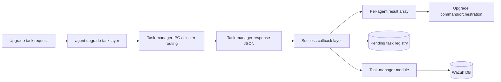
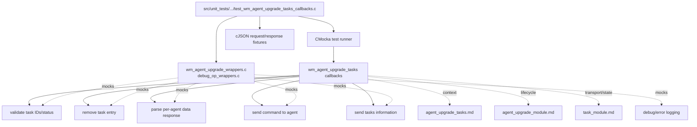
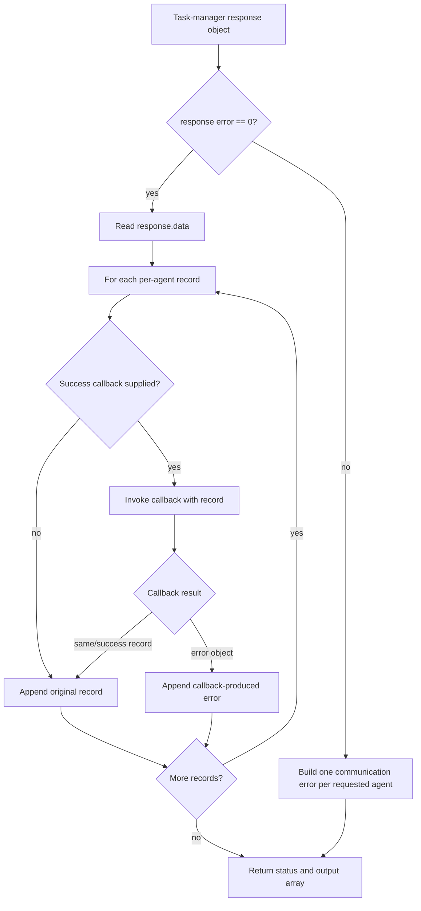
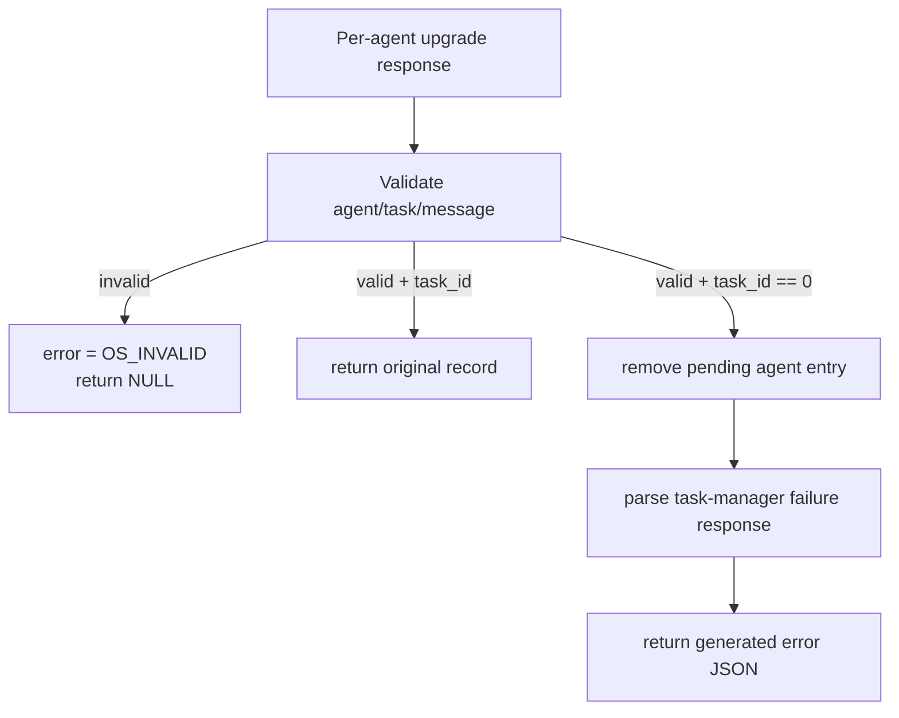
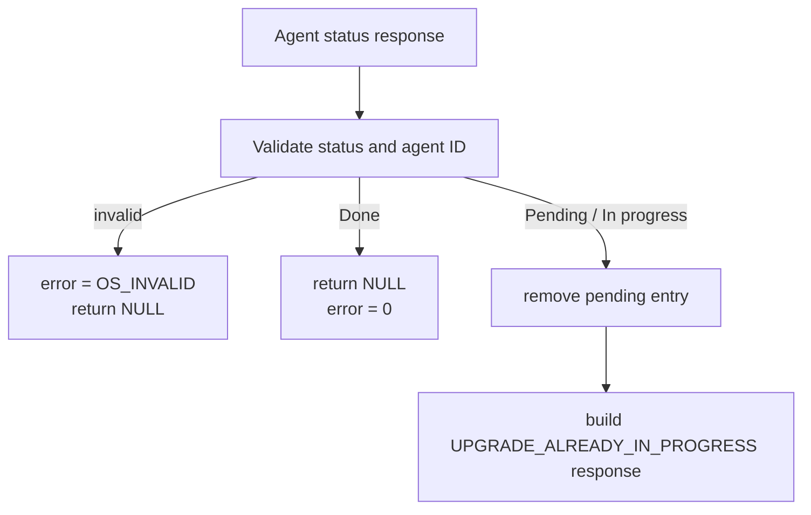
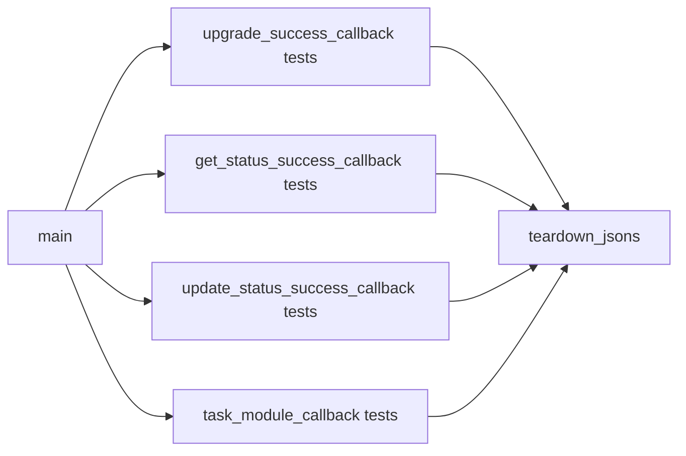

# Agent upgrade task callbacks

## Introduction

`agent_upgrade_tasks_callbacks` is the CMocka test module for the callback layer used by Wazuh’s native agent-upgrade task workflow. The tests specify how task-manager responses are validated, converted into per-agent results, cleaned up, and optionally passed through success callbacks.

The module under test is implemented in the agent-upgrade task layer, principally the callback functions declared by `wm_agent_upgrade_tasks.h`. This file documents the test contract; task storage, cluster routing, and task-manager transport are covered in [agent upgrade tasks](agent_upgrade_tasks.md), while package transfer and agent-side execution are covered in [agent upgrade module](agent_upgrade_module.md).

## Scope and role in the system

The callback layer is the response-processing seam between task-manager communication and upgrade orchestration:



The tests focus on four production callbacks:

| Callback | Responsibility | Main observable outcomes |
| --- | --- | --- |
| `wm_agent_upgrade_upgrade_success_callback` | Process one successful upgrade-task response | Preserve successful input; convert missing task IDs into a task-manager failure response; reject malformed task-ID data. |
| `wm_agent_upgrade_get_status_success_callback` | Process one status lookup response | Accept terminal status; convert `Pending` and `In progress` into “already in progress”; reject malformed status data. |
| `wm_agent_upgrade_update_status_success_callback` | Clear the agent’s stored upgrade result after status processing | Send `clear_upgrade_result`; preserve the input on agent-command success or cleanup failure; reject invalid agent IDs. |
| `wm_agent_upgrade_task_module_callback` | Process the task-manager response for all requested agents | Append one result per agent, invoke an optional per-item callback, remove failed entries when requested, and report task-manager communication failures. |

## Architecture and dependencies



The wrapper headers replace selected dependencies with CMocka expectations. Consequently, these tests validate callback control flow and output ownership without requiring a live task-manager socket, cluster node, agent, or Wazuh database.

## Input and output model

The task-module callback receives a request describing the upgrade operation and a task-manager response containing per-agent records:

```json
{
  "origin": {"module": "upgrade_module"},
  "command": "upgrade",
  "parameters": {"agents": [12, 10]}
}
```

```json
{
  "error": 0,
  "message": "Success",
  "data": [
    {"error": 0, "message": "Success", "agent": 12, "task_id": 115},
    {"error": 1, "message": "Error", "agent": 10}
  ]
}
```

The callback writes a flat output array. It preserves each per-agent object and does not add a placeholder beyond the number of response records. A successful task normally retains `task_id`; an unsuccessful task can omit it.



## Callback contracts

### `wm_agent_upgrade_upgrade_success_callback`

This callback validates the task-identification payload for one agent. The test fixture supplies an agent ID, task ID, message, and validator result through `wm_agent_upgrade_validate_task_ids_message`.

* Valid task ID: returns the original JSON object and leaves `error` equal to `0`.
* Missing task ID (`task == 0`): removes the agent’s pending entry with `free == 1`, then creates a `WM_UPGRADE_TASK_MANAGER_FAILURE` response using the validator’s message and agent ID.
* Validator failure: returns `NULL` and sets `error` to `OS_INVALID`.



The no-task-ID branch treats a nominally successful transport response as a task-manager failure. This prevents an upgrade from remaining indefinitely in the in-memory task registry when the task manager did not assign a durable task ID.

### `wm_agent_upgrade_get_status_success_callback`

This callback validates a status response and interprets the status string.

* `Done` is accepted and returns `NULL` with `error == 0`; the caller has no replacement error object to append.
* `Pending` and `In progress` remove the pending task entry and produce a `WM_UPGRADE_UPGRADE_ALREADY_IN_PROGRESS` response.
* Validator failure returns `NULL` and sets `error` to `OS_INVALID`.



The callback deliberately distinguishes “completed” from “still active”: a completed status is not an error, while a status indicating active work is converted into a caller-visible conflict response.

### `wm_agent_upgrade_update_status_success_callback`

This callback validates the agent ID, sends the command

```text
015 upgrade {"command":"clear_upgrade_result","parameters":{}}
```

and parses the agent response. For a valid agent ID, the callback returns the original input object and keeps `error == 0` whether parsing the cleanup response succeeds or fails. The successful parse path emits a debug log stating that the upgrade result file was erased. An invalid agent ID returns `NULL` and sets `error` to `OS_INVALID`.

```mermaid
sequenceDiagram
    participant C as update_status callback
    participant V as Task-status validator
    participant A as Agent command channel
    participant P as Agent-response parser
    participant L as Debug logger

    C->>V: Validate input status and agent ID
    V-->>C: agent ID / validation result
    alt invalid ID
        C-->>C: error = OS_INVALID; return NULL
    else valid ID
        C->>A: clear_upgrade_result command
        A-->>C: agent response JSON
        C->>P: Parse response
        alt parse succeeds
            P-->>C: success
            C->>L: log result file erased
        else parse fails
            P-->>C: OS_INVALID
            C->>C: preserve input and error = 0
        end
        C-->>C: return original input
    end
```

### `wm_agent_upgrade_task_module_callback`

This is the batch adapter. It calls `wm_agent_upgrade_send_tasks_information` with the request, then handles the returned task-manager object.

#### Successful task-manager response

For each item in `data`, the callback may invoke an item callback. With `wm_agent_upgrade_upgrade_success_callback`, a valid task ID is retained, while an item lacking a task ID is replaced by the generated failure object. The batch function still appends one output object per input record and returns `0` when the task-manager communication itself succeeded.

#### Task-manager communication failure

When the task-manager response has a non-zero top-level error, the callback builds a `WM_UPGRADE_TASK_MANAGER_COMMUNICATION` object for every requested agent. It logs error `8123` and returns `OS_INVALID`.

The same communication-failure behavior is exercised both without callbacks and with `wm_agent_upgrade_remove_entry` supplied as the cleanup callback. In the latter case, each agent entry is removed with `free == 1` before its error object is appended.

```mermaid
flowchart TD
    Start[task_module_callback(output, request, success_cb, error_cb)] --> Send[send_tasks_information(request)]
    Send --> Top{response exists and top-level error == 0?}
    Top -->|no| FailEach[For every requested agent]
    FailEach --> Cleanup1{error callback supplied?}
    Cleanup1 -->|yes| Remove1[remove entry, free = 1]
    Cleanup1 -->|no| Error1[build communication error]
    Remove1 --> Error1
    Error1 --> Invalid[append error; return OS_INVALID]
    Top -->|yes| Loop[Read response.data records]
    Loop --> SuccessCB{success callback supplied?}
    SuccessCB -->|no| Append[append record]
    SuccessCB -->|yes| Apply[invoke success callback]
    Apply --> Append
    Append --> Next{more records?}
    Next -->|yes| Loop
    Next -->|no| Done[return 0]
```

## Test organization

The file uses CMocka’s `cmocka_unit_test_teardown` for every registered case. `main` groups the tests by callback and runs them with `cmocka_run_group_tests`.



`teardown_jsons` receives two cJSON pointers through the CMocka state array. It deletes the response separately when it differs from the input, then deletes the input. This reflects the callback ownership convention: most success paths return the original object, while generated error paths return a distinct object.

The supplied source includes success, validation-error, missing-task-ID, pending/in-progress, cleanup-command, batch communication-error, and callback-error scenarios. The module tree lists the principal cases; the source additionally registers the corresponding cleanup-error and callback-error variants.

## Dependencies and boundaries

| Dependency | Role in this module | Detailed reference |
| --- | --- | --- |
| `wm_agent_upgrade_tasks.h` | Declares callback and task-layer interfaces under test. | [agent upgrade tasks](agent_upgrade_tasks.md) |
| `wm_agent_upgrade_wrappers.h` | Mocks task validation, task-manager responses, task removal, parsing, and command sending. | Test wrapper source in the repository |
| `debug_op_wrappers.h` | Captures expected debug/error logging. | Shared test-wrapper infrastructure |
| `cJSON` | Builds request, response, and per-agent result objects. | [agent upgrade module](agent_upgrade_module.md) |
| `task_manager_module` | External producer of task IDs and task status responses. | [task module](task_module.md) |
| `wazuh_db` | Durable storage behind the task manager; not accessed directly by these unit tests. | [wazuh DB](wazuh_db.md) |

The test module intentionally stops at callback behavior. It does not verify socket framing, cluster forwarding, WPK validation, package transfer, installer execution, or database persistence; those concerns belong to the referenced modules.

## Error and ownership rules

| Situation | Callback result | Cleanup behavior |
| --- | --- | --- |
| Validator rejects input | `NULL`, `error = OS_INVALID` | No generated result; caller retains teardown responsibility. |
| Valid success record | Original cJSON object or unchanged batch item | No replacement allocation. |
| Missing task ID | Generated failure object | Remove agent entry with `free == 1`. |
| Pending/in-progress status | Generated already-in-progress object | Remove agent entry with `free == 1`. |
| Agent result cleanup parse error | Original input, `error = 0` | Cleanup command was attempted; callback remains non-fatal. |
| Task-manager top-level failure | One communication-error object per requested agent; `OS_INVALID` | Invoke supplied error callback for each agent, with `free == 1`. |

These rules are the key maintenance contract. Changes to whether callbacks return the original cJSON node, allocate a replacement, remove task entries, or set the integer error output should update both this test suite and its neighboring task-layer tests.

## Verification guidance

Run the unit-test target that builds `test_wm_agent_upgrade_tasks_callbacks.c` in the project’s normal CMocka test configuration. When changing callback behavior, preserve coverage for:

1. valid task ID and valid terminal status;
2. missing task ID and active (`Pending` / `In progress`) status;
3. validator failures and invalid agent IDs;
4. successful and failed `clear_upgrade_result` handling;
5. batch responses with and without an optional callback; and
6. top-level task-manager communication failures, including per-agent cleanup.

