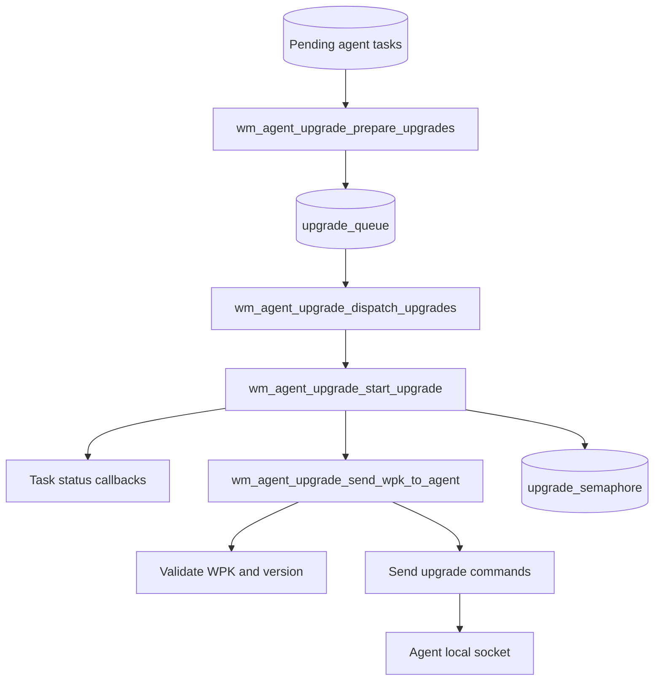
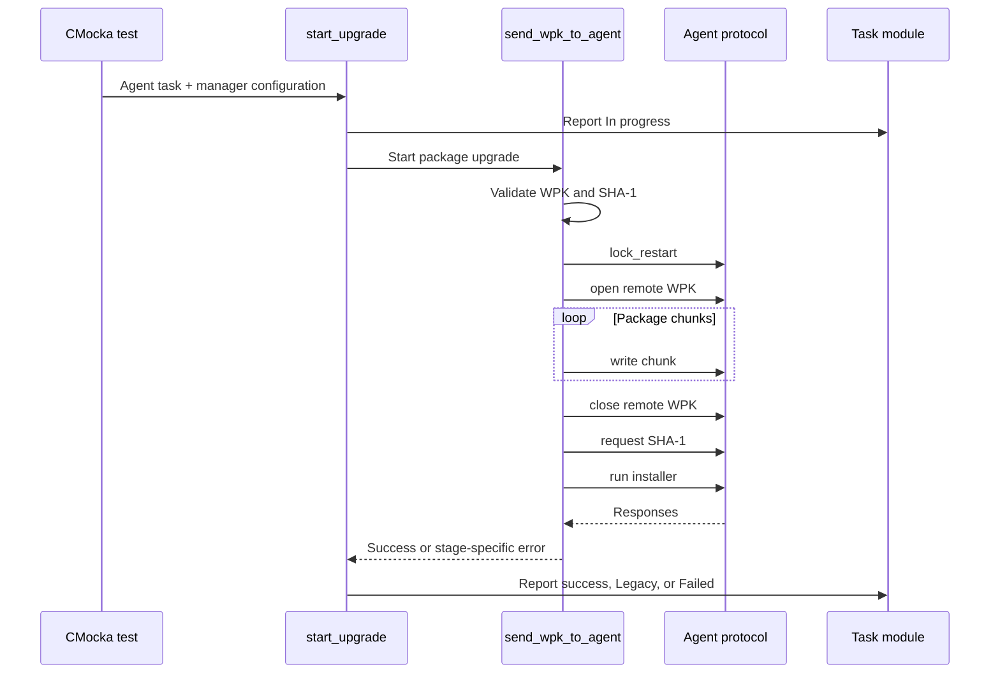

# `agent_upgrade_upgrades`

## Purpose

`agent_upgrade_upgrades` is the CMocka test module for the manager-side Wazuh agent-upgrade workflow. It verifies package transfer, agent communication, upgrade orchestration, queue dispatch, status reporting, retry behavior, integrity checks, and failure-to-error-code mapping.

The tests exercise production functions from `src/wazuh_modules/agent_upgrade/manager/wm_agent_upgrade_upgrades.c` while mocking sockets, file I/O, SHA-1 calculation, parsers, task callbacks, version comparison, and thread creation.

## Architecture

The dispatcher limits concurrent upgrades with `upgrade_semaphore`. Prepared tasks are moved from the pending agent hash into `upgrade_queue`, then handed to worker threads. Each worker reports progress, transfers the package, reports success or failure, and releases its semaphore slot.

## Transfer stages covered

The module tests both legacy `com` commands and the newer structured upgrade protocol:

1. Connect to the agent and send a command.
2. Lock agent restart.
3. Open the remote WPK file.
4. Read and send the local package in chunks.
5. Close the remote file.
6. Compare the agent-side SHA-1 with the local digest.
7. Execute the platform-specific or custom installer.

Opening the remote file includes retry handling. Failures are mapped to stage-specific errors such as `WM_UPGRADE_SEND_OPEN_ERROR`, `WM_UPGRADE_SEND_WRITE_ERROR`, `WM_UPGRADE_SEND_SHA1_ERROR`, and `WM_UPGRADE_SEND_UPGRADE_ERROR`.

## Test organization

The suite is implemented in [`test_wm_agent_upgrade_upgrades.c`](../../../../src/unit_tests/wazuh_modules/agent_upgrade/test_wm_agent_upgrade_upgrades.c) and includes tests for:

- Generic command transport.
- Lock-restart, open, write, close, SHA-1, and upgrade commands.
- Standard Linux and Windows WPK upgrades.
- Custom WPK packages and installers.
- Worker status transitions, including `In progress`, `Legacy`, and `Failed`.
- Queue preparation and dispatcher thread handoff.
- Semaphore accounting and ownership cleanup.

Shared fixtures initialize manager configuration, agent tasks, queues, semaphores, and mocked external boundaries. See [`agent_upgrade_upgrades_test_infrastructure`](agent_upgrade_upgrades_test_infrastructure.md) for fixture and mocking details.

## Core component references

- [`agent_upgrade_module`](agent_upgrade_module.md) — overall agent-upgrade module structure.
- [`agent_upgrade_manager`](agent_upgrade_manager.md) — manager lifecycle and upgrade-thread integration.
- [`agent_upgrade_commands`](agent_upgrade_commands.md) — upgrade command construction and request handling.
- [`agent_upgrade_tasks`](agent_upgrade_tasks.md) — task creation, tracking, and task-manager interaction.
- [`agent_upgrade_tasks_callbacks`](agent_upgrade_tasks_callbacks.md) — response callbacks and status conversion.
- [`agent_upgrade_validate`](agent_upgrade_validate.md) — WPK, version, and task validation.
- [`agent_upgrade_parsing`](agent_upgrade_parsing.md) — agent response and task request parsing.
- [`Wmodules_Config_agent_upgrade`](Wmodules_Config_agent_upgrade.md) — agent-upgrade configuration, package, and concurrency settings.
- [`task_manager_module`](task_manager_module.md) — task status management used by upgrade workers.