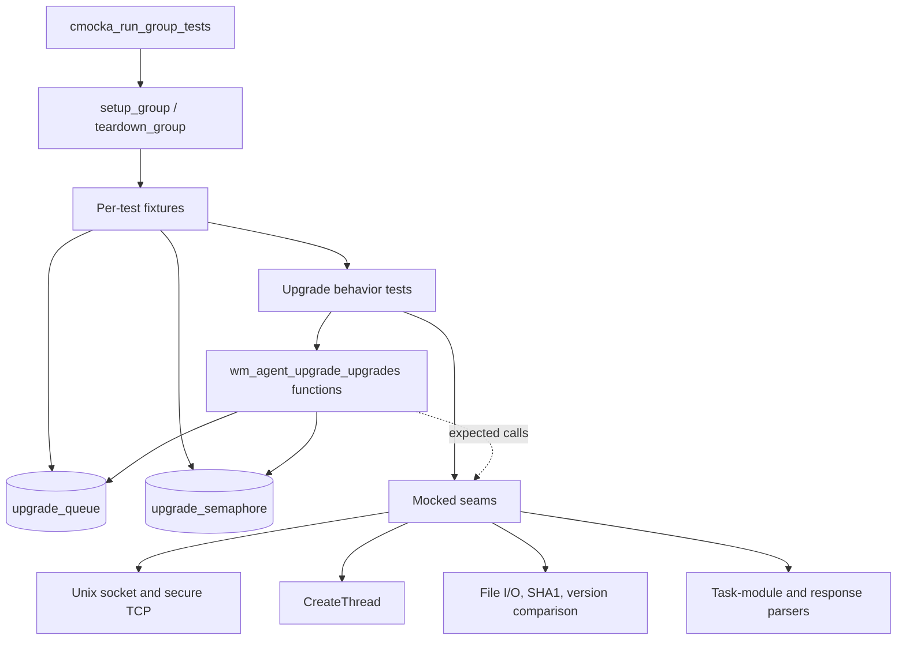
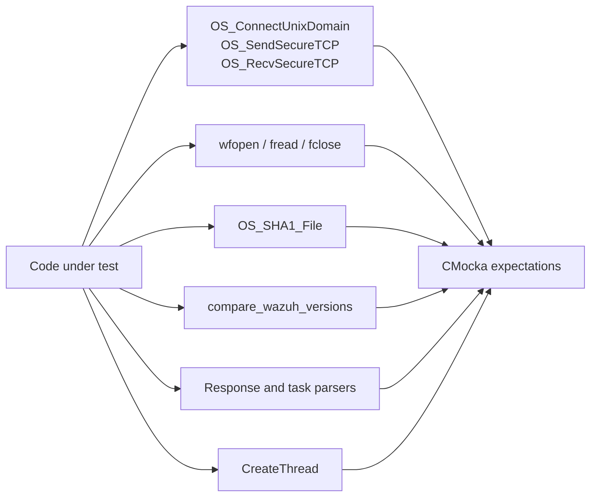
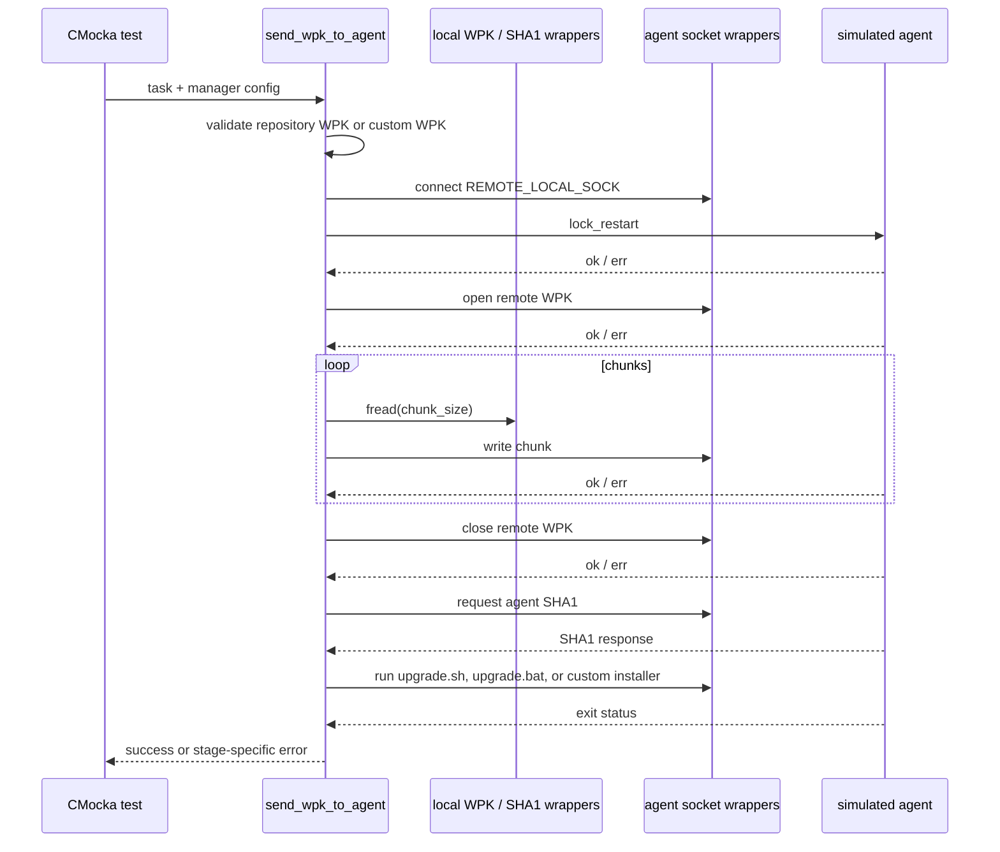
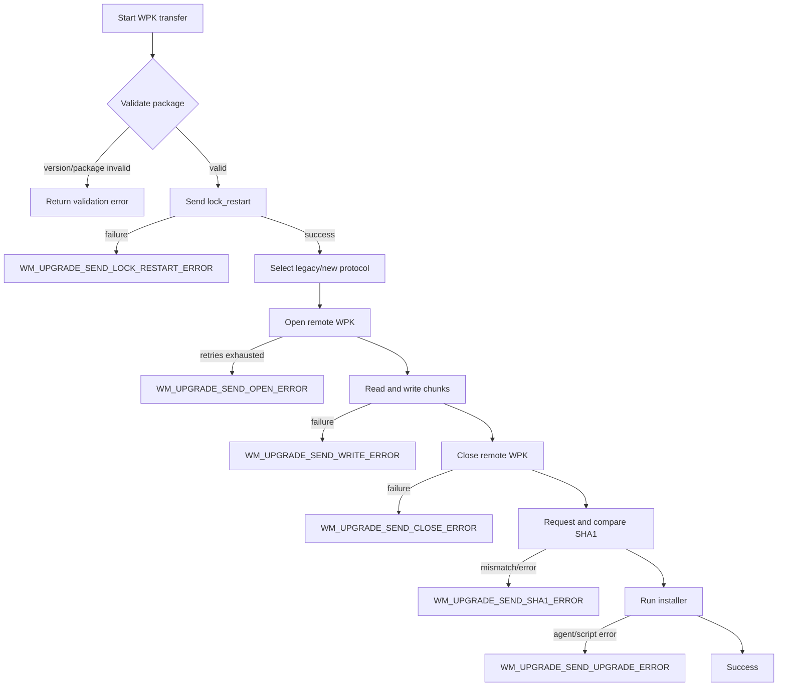
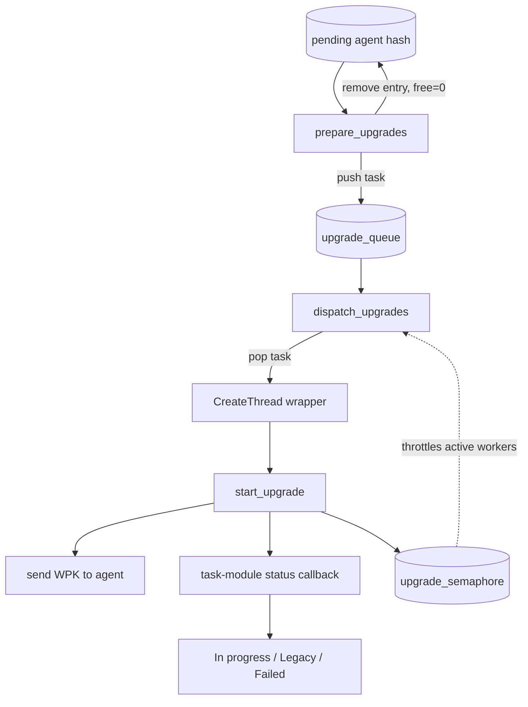

# Agent Upgrade Upgrades Test Infrastructure

## Introduction

`agent_upgrade_upgrades_test_infrastructure` is the shared CMocka fixture and test-runner infrastructure for the agent-upgrade “upgrades” test suite. It does not implement upgrade behavior itself. Instead, it builds deterministic manager/task state, controls queue and semaphore state, replaces thread and socket boundaries with mocks, and registers the unit tests that exercise the production functions in `wm_agent_upgrade_upgrades`.

The infrastructure is defined in `src/unit_tests/wazuh_modules/agent_upgrade/test_wm_agent_upgrade_upgrades.c`. The production behavior under test belongs to the [agent upgrade module](agent_upgrade_module.md); this page documents how that behavior is isolated and verified.

## Position in the test architecture

The test file sits below the `agent_upgrade_upgrades` suite. Tests for individual command helpers and orchestration call into production functions, while this infrastructure supplies their common process-wide state and mocked external seams.

The important boundary is that the test suite exercises real upgrade control flow but does not require a live agent, a manager daemon, a real WPK repository, a real Unix socket, or concurrent worker threads.

## Responsibilities

The infrastructure provides four capabilities:

1. **Suite lifecycle** — enables test mode before every test and disables it afterward.
2. **State construction** — allocates manager configuration, agent/task records, hash nodes, the upgrade queue, and the semaphore expected by the production code.
3. **External-boundary substitution** — verifies exact calls to sockets, file operations, hashing, logging, parsers, and thread creation.
4. **Test registration** — groups happy paths, protocol variants, retries, validation failures, transport failures, orchestration, and queue preparation under one CMocka runner.

## Fixture lifecycle and state ownership

### Group fixture

`setup_group` sets the global `test_mode` flag to `1`. `teardown_group` resets it to `0`. This makes all tests run under the same explicit unit-test mode and prevents the setting from leaking after the suite completes.

### Configuration fixture

`setup_config` allocates a zeroed `wm_manager_configs` object and initializes `upgrade_queue` with `linked_queue_init()`. `teardown_config` releases the configuration and queue. This fixture is used by the dispatcher test, where the queue is populated separately.

### Upgrade-argument fixture

`setup_upgrade_args` creates the object passed to `wm_agent_upgrade_start_upgrade`:

- a `test_upgrade_args` wrapper;
- a `wm_manager_configs` configuration;
- a `wm_agent_task`;
- nested `agent_info` and `task_info` records;
- an initialized `upgrade_queue`;
- `upgrade_semaphore`, initialized to a count of `5`.

The fixture stores the wrapper in the CMocka state and also retains the configuration in a second state slot. `teardown_upgrade_args` destroys the semaphore and releases the remaining shared objects. The mocked `CreateThread` function models the ownership handoff by freeing the task argument after checking it.

### Configuration-and-agent fixture

`setup_config_agent_task` creates a manager configuration and a standalone agent task. It is used by direct `wm_agent_upgrade_send_wpk_to_agent` tests, where thread orchestration is not relevant. The teardown releases both objects.

### Hash-node fixture

`setup_nodes` creates two linked `OSHashNode` values, each containing an initialized agent task. The nodes are exposed through CMocka state and are used to test `wm_agent_upgrade_prepare_upgrades`. The teardown destroys the hash table, frees node payloads and keys, drains queued tasks, and releases the queue.

### String teardown

Tests of the generic command sender use `teardown_string`, which frees the response returned through the CMocka state. This captures the ownership contract of the command-sending helper: successful responses are heap-owned by the caller.

### Fixture summary

| Fixture | Main state | Used for | Cleanup focus |
|---|---|---|---|
| `setup_group` | `test_mode` | all tests | reset global mode |
| `setup_config` | config, queue | dispatch | config and queue |
| `setup_upgrade_args` | config, task, queue, semaphore | start-upgrade tests | semaphore, config, queue, wrapper ownership |
| `setup_config_agent_task` | config, agent task | WPK transfer tests | config and task |
| `setup_nodes` | two hash nodes, queue | prepare-upgrades tests | nodes, task payloads, queued entries |
| `teardown_string` | returned response | generic command tests | response buffer |

## Mocked boundaries

The source uses wrapper functions and CMocka expectations to keep each test deterministic.

### Thread creation

`__wrap_CreateThread` replaces worker creation. It verifies that the dispatcher supplies:

- `wm_agent_upgrade_start_upgrade` as the entry point;
- the expected agent-task argument;
- the expected manager configuration.

It then frees the task argument and returns success. No OS thread is created, so the dispatcher test can assert queue consumption and semaphore behavior without scheduling races.

### Agent communication

The command tests mock `OS_ConnectUnixDomain`, `OS_SendSecureTCP`, and `OS_RecvSecureTCP`. Expectations assert the socket path (`REMOTE_LOCAL_SOCK`), stream type, maximum message size, transmitted command, response buffer size, and return values. The tests also verify diagnostic messages for sends and receives.

### Local package and integrity operations

WPK transfer tests mock `wfopen`, `fread`, `fclose`, and `OS_SHA1_File`. This separates transfer sequencing from the filesystem and lets tests use a small fixed payload (`test\n`) and a known digest. Version selection is isolated through `compare_wazuh_versions`.

### Parsing and task status

The suite wraps legacy and new-protocol response parsers, task-module request parsing, task callbacks, and task-status validation. The wrappers return controlled success or error codes so the tests can reach each stage of the orchestration path.

## Upgrade transfer data flow

`wm_agent_upgrade_send_wpk_to_agent` is tested as a staged transaction. Standard upgrades validate repository/version metadata first; custom upgrades validate the supplied local package. Both paths then use the same agent-side transfer sequence.

Legacy and newer agent protocols are both represented. Version comparison selects the command format; the tests verify both the command text and the parser used for the response. Legacy examples use commands such as `025 com open wb test.wpk`, while the newer path uses the corresponding structured upgrade command.

## Process and error flow

The direct helper tests assert the low-level response (`OS_INVALID` where appropriate), while the end-to-end WPK tests assert the higher-level `WM_UPGRADE_*` error mapping returned by the transfer orchestration.

## Queue, dispatch, and status interaction

The infrastructure also covers the path from pending hash entries to worker dispatch.

`prepare_upgrades` is verified with one and two hash nodes. Each task is queued and removed from the pending hash. `dispatch_upgrades` verifies the worker entry point and argument ownership through `__wrap_CreateThread`. `start_upgrade` verifies status updates for successful, legacy, custom, and failed operations. The semaphore is initialized to a known value and checked after orchestration to detect incorrect worker accounting.

## Test coverage map

The `main` function registers the following behavioral groups:

| Group | Coverage |
|---|---|
| Generic command sender | connect, send, receive, socket, and response errors |
| Lock restart | successful and rejected restart lock |
| Open | legacy/new formats and retry exhaustion |
| Write | legacy/new formats, write failures, and open failures |
| Close | legacy/new formats and close failures |
| SHA1 | successful comparison, invalid response, and mismatch |
| Upgrade command | legacy/new formats, agent failure, and script failure |
| WPK transfer | Linux, Windows, custom installer/default installer, validation, and every transfer stage failure |
| Start upgrade | normal, legacy follow-up status, custom package, and failure status |
| Dispatch | queue pop, thread handoff, and semaphore accounting |
| Prepare upgrades | one or multiple pending hash entries |

The registration order mirrors the implementation’s layering: low-level command helpers first, then the complete transfer, then task orchestration and queue management.

## Failure and retry semantics captured by the tests

- Socket connection, send, receive, and oversized-response failures are distinguished rather than collapsed into one generic result.
- Opening the remote package is retried; the retry test supplies repeated error responses and verifies termination after the configured retry count.
- A failed write, close, SHA1 check, or installer command stops the transfer at that stage.
- A package validation failure prevents any socket connection.
- SHA1 is checked both locally and against the digest reported by the agent.
- Platform determines the default installer name: `upgrade.sh` for Linux-like agents and `upgrade.bat` for Windows.
- Custom upgrades can supply an installer name or use the default installer.
- Orchestration reports “In progress” before transfer and “Failed” with the relevant error after failure; successful legacy upgrades can emit a later “Legacy” status.

## Maintainer guidance

When adding a new upgrade stage, extend the test at the narrowest level first: add direct helper tests for command formatting and response parsing, then add a WPK transfer test for stage integration, and finally add a `start_upgrade` test if status behavior changes. Keep external operations wrapped and assert the complete command, parser, and error mapping.

When changing fixture state, update both setup and teardown paths. In particular, preserve queue draining, semaphore destruction, nested task cleanup, and the `CreateThread` ownership contract. Avoid real threads or sockets in this suite; the existing wrappers are what make exact sequencing and failure injection reliable.

## Related documentation

- [Agent upgrade module](agent_upgrade_module.md) — production module boundary and responsibilities.
- [Agent upgrade main](agent_upgrade_main.md) — module lifecycle and entry point.
- [Agent upgrade tasks](agent_upgrade_tasks.md) — task structures and task scheduling context.
- [Agent upgrade task callbacks](agent_upgrade_tasks_callbacks.md) — status and task-module callback behavior.
- [Agent upgrade commands](agent_upgrade_commands.md) — command construction and protocol details.
- [Agent upgrade parsing](agent_upgrade_parsing.md) — response parsing behavior.
- [Agent upgrade communication](agent_upgrade_com.md) — command transport and communication helpers.
- [Task manager module](task_manager_module.md) — task queue and status integration.

These documents are referenced rather than reproduced here; this page is concerned specifically with test isolation, fixtures, mocks, and coverage.
