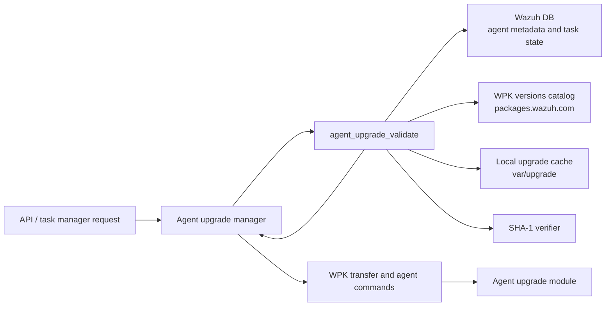
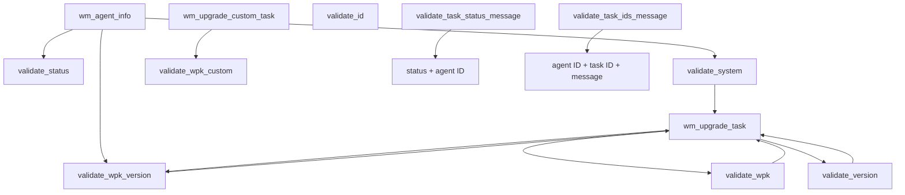
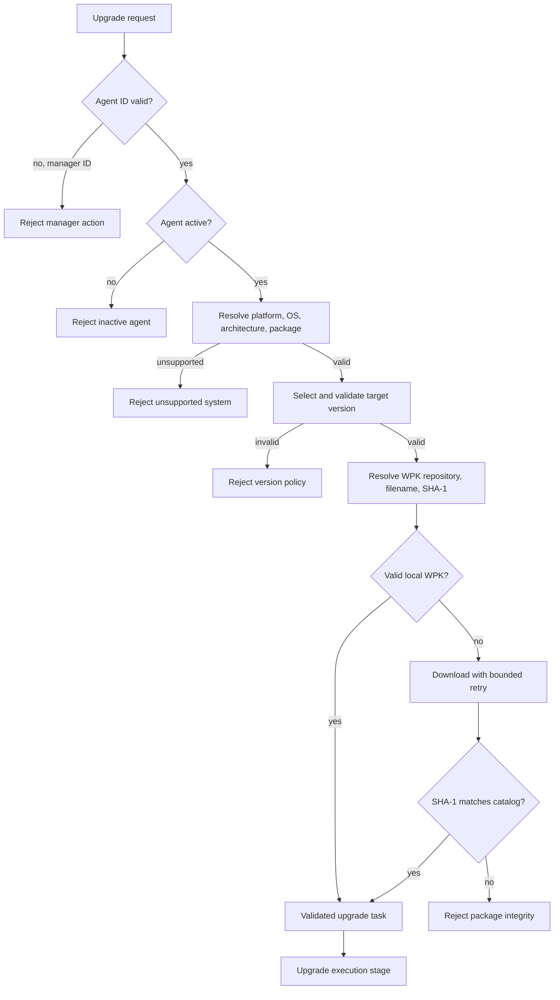
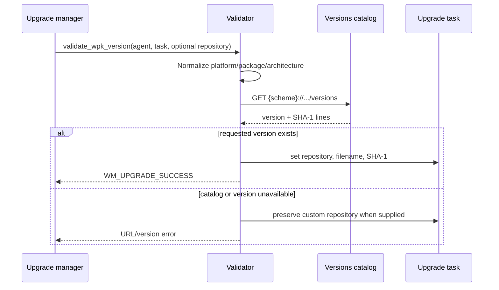
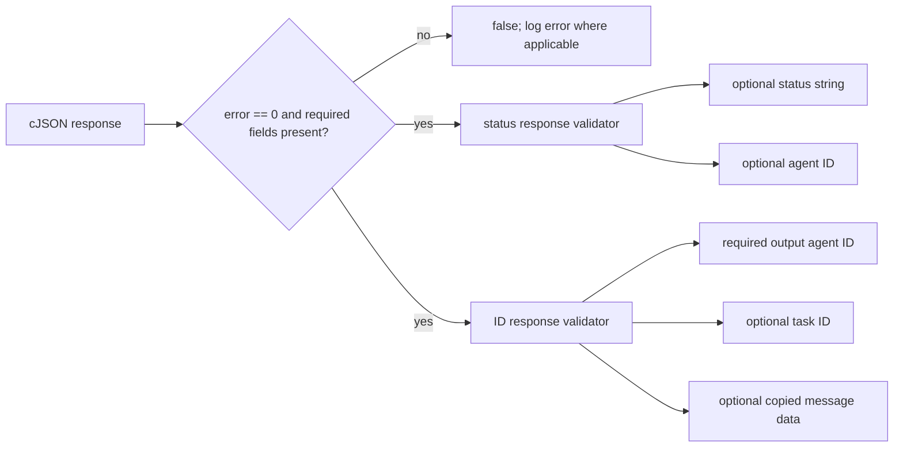
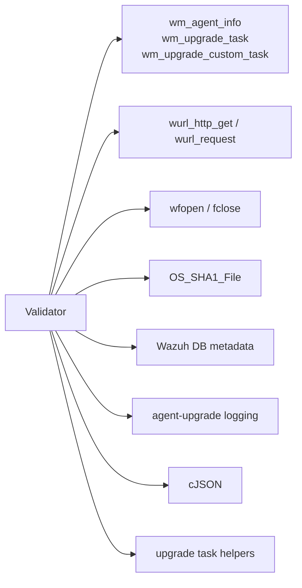

# Agent upgrade validation

The `agent_upgrade_validate` module is the guard layer for Wazuh agent upgrades. It validates whether an upgrade target is eligible, resolves the correct WPK package for the target agent, checks version policy, verifies or downloads the package, and validates responses exchanged by the upgrade and task workflows.

The documented implementation is exercised by `src/unit_tests/wazuh_modules/agent_upgrade/test_wm_agent_upgrade_validate.c`. The production implementation belongs to the agent-upgrade manager under `src/wazuh_modules/agent_upgrade/manager`; the test file is therefore both the primary behavioral specification and the best available source for the contracts below.

## Position in the system

The validator sits between upgrade orchestration and external/local resources. It does not perform the complete upgrade itself. Instead, it produces validated task fields and status codes that the manager can safely pass to the transfer and execution stages described in [agent_upgrade_upgrades_test_infrastructure](agent_upgrade_upgrades_test_infrastructure.md) and [agent_upgrade_commands](agent_upgrade_commands.md).

### Related modules

- [agent_upgrade_commands](agent_upgrade_commands.md) describes command dispatch and the higher-level validation sequence.
- [agent_upgrade_upgrades_test_infrastructure](agent_upgrade_upgrades_test_infrastructure.md) covers package transfer and upgrade execution.
- [agent_upgrade_tasks_callbacks](agent_upgrade_tasks_callbacks.md) covers task creation, callbacks, and status propagation.
- [task_module](task_module.md) documents the task-status service used by upgrade operations.
- [wazuh_db_engine](wazuh_db_engine.md) documents the database layer behind agent and task metadata.

## Responsibilities

The validator exposes six behavioral areas:

| Area | Contract | Main result |
| --- | --- | --- |
| Agent ID | Reject manager ID `0`; accept a normal agent ID | `WM_UPGRADE_INVALID_ACTION_FOR_MANAGER` or success |
| Connection status | Require an active agent; reject null/disconnected status | `WM_UPGRADE_AGENT_IS_NOT_ACTIVE` |
| System compatibility | Map platform and architecture to package family and reject unsupported combinations | `deb`, `rpm`, `msi`, `pkg`, or an error |
| Version policy | Enforce minimum supported version and select a target version | `task->wpk_version` and status code |
| WPK resolution and integrity | Resolve repository/file/SHA-1, reuse a valid local file, or download and verify it | success, missing-file, URL, or SHA-1 error |
| Message parsing | Validate task response JSON and optionally extract IDs, status, and message data | boolean success/failure |

## Component relationships

The setup and teardown helpers in the test suite initialize and release these task objects through the shared constructors/free functions. This keeps each test independent and reflects the ownership model: validation populates task fields, while the caller owns the task lifetime.

## Validation pipeline

For a normal upgrade, the effective order is:

The exact caller may combine or reorder these checks for a particular command; the individual functions are intentionally independent and return explicit `WM_UPGRADE_*` codes.

## Agent eligibility

`wm_agent_upgrade_validate_id()` distinguishes manager-wide operations from agent operations. The tests define agent ID `0` as the manager and return `WM_UPGRADE_INVALID_ACTION_FOR_MANAGER`; a positive ID such as `5` is accepted.

`wm_agent_upgrade_validate_status()` accepts `AGENT_CS_ACTIVE`. A null status or the literal `disconnected` is rejected with `WM_UPGRADE_AGENT_IS_NOT_ACTIVE`. This prevents package work from starting for an agent that cannot receive the upgrade protocol.

## System and package resolution

`wm_agent_upgrade_validate_system()` derives a package type from the reported platform and architecture. Tested mappings include:

| Agent system | Package type | Notes |
| --- | --- | --- |
| Windows 10 x64 | `msi` | Windows package family |
| Ubuntu 18.04 x64 | `deb` | Debian-family package |
| RHEL 7 x64 | `rpm` | RPM-family package |
| Rocky 9.3 / AlmaLinux 9.5 | `rpm` | RHEL-compatible families |
| Darwin x64 or arm64 | `pkg` | macOS package |
| openSUSE Tumbleweed | `rpm` | Rolling platform |
| Arch | no package type | Platform is accepted, but no default package is inferred |

Unsupported examples include Solaris/SUSE aliases in the tested contract and obsolete RHEL/CentOS major versions. A missing architecture produces `WM_UPGRADE_GLOBAL_DB_FAILURE` in the tested path.

When a task explicitly requests a package type that differs from the platform default, the validator warns and ignores the mismatch unless `force_upgrade` is set. With force enabled, the requested package is used and the architecture is normalized for repository lookup (`x86_64` → `amd64` for Debian, for example).

## WPK version catalog lookup

`wm_agent_upgrade_validate_wpk_version()` builds a repository URL, retrieves its `versions` resource, finds the requested version, and populates:

- `task->wpk_repository`
- `task->wpk_file`
- `task->wpk_sha1`

The scheme is selected by `task->use_http`:

Representative paths from the tests:

- Current Windows 4.x: `.../4.x/wpk/windows/`, file `wazuh_agent_v4.0.0_windows.wpk`.
- Current Linux: `.../4.x/wpk/linux/{arch}/` for the default package, or `.../linux/{package}/{arch}/` when package-specific catalogs are required.
- Current macOS: `.../4.x/wpk/macos/{arch}/{package}/`.
- Legacy Ubuntu/RHEL versions use platform/version-specific paths such as `wpk/ubuntu/16.04/x64/` and `wpk/rhel/6/x86/`.

An absent version returns `WM_UPGRADE_WPK_VERSION_DOES_NOT_EXIST`; an unreachable custom repository returns `WM_UPGRADE_URL_NOT_FOUND`. A missing requested version must not leave a fabricated filename or SHA-1 in the task.

## Version policy

`wm_agent_upgrade_validate_version()` compares the agent's current version with the requested upgrade mode and task fields. The tests establish these rules:

- Versions below the supported minimum (for example `v2.1.1`) return `WM_UPGRADE_NOT_MINIMAL_VERSION_SUPPORTED`.
- A selected version less than or equal to the current version returns `WM_UPGRADE_NEW_VERSION_LEES_OR_EQUAL_THAT_CURRENT`.
- A requested version greater than the manager version returns `WM_UPGRADE_NEW_VERSION_GREATER_MASTER` unless forced.
- `force_upgrade` permits the otherwise greater target.
- `WM_UPGRADE_UPGRADE_CUSTOM` still requires the minimum supported agent version, but uses custom task data.
- A null current version is a database/metadata failure (`WM_UPGRADE_GLOBAL_DB_FAILURE`).

On successful normal upgrade selection, the target is written to `task->wpk_version`; the following WPK lookup then resolves its artifact.

## Local WPK validation and download

`wm_agent_upgrade_validate_wpk()` checks the expected file under `var/upgrade/{task->wpk_file}`. If it exists, the validator computes SHA-1 in binary mode and accepts it only when it matches `task->wpk_sha1`. If the file is absent or invalid, it downloads from `{task->wpk_repository}{task->wpk_file}` using the URL helper and verifies the downloaded file again.

The tests show bounded retry delays of 1, 2, 3, and 4 seconds. Exhausting retries returns `WM_UPGRADE_WPK_FILE_DOES_NOT_EXIST`; a downloaded artifact with a different digest returns `WM_UPGRADE_WPK_SHA1_DOES_NOT_MATCH`. This integrity check is the trust boundary between the remote catalog and the upgrade executor.

`wm_agent_upgrade_validate_wpk_custom()` is intentionally simpler: it checks that the caller-provided `custom_file_path` can be opened as a binary file. It returns success for an accessible file and `WM_UPGRADE_WPK_FILE_DOES_NOT_EXIST` for a missing path or invalid task.

## Task response parsing

The two message validators consume cJSON objects returned by task/agent operations.

`wm_agent_upgrade_validate_task_status_message()` validates the response envelope and can optionally extract `status` and `agent`. Null JSON and missing required parameters fail. A nonzero `error` logs the returned code/message and fails.

`wm_agent_upgrade_validate_task_ids_message()` validates the same success envelope and extracts `agent`, optional `task_id`, and a heap-allocated copy of `message`. The output pointer arguments are part of the contract: omitting a required output pointer causes failure, while omitting the task-ID output is allowed by the tests. Callers must release copied message data with the project allocator.

## Dependencies and seams

The unit test replaces these seams with wrappers for deterministic behavior. That design isolates policy from network availability, filesystem state, cryptographic results, database failures, and logging. Changes to URL construction, package naming, retry behavior, digest comparison, or output-pointer semantics should therefore update both the implementation and the corresponding wrapper-based tests.

## Test organization

The test executable uses CMocka group setup/teardown and registers tests by function family:

- Stateless checks: ID, status, and system compatibility.
- `setup_validate_wpk_version`: allocates an agent and upgrade task.
- `setup_validate_wpk`: allocates an upgrade task for cache/download checks.
- `setup_validate_wpk_custom`: allocates a custom task.
- `teardown_validate_message`: frees cJSON responses and copied message data.

The group enables `test_mode`, allowing wrapped network, database, file, hash, logging, and sleep calls to be asserted. Coverage includes success paths, null/invalid inputs, legacy and current repositories, HTTP/HTTPS, Linux package families, macOS architectures, forced mismatches, retry exhaustion, digest mismatch, and malformed task responses.

## Maintenance guidance

When extending supported systems, update the platform/package mapping and add tests for default package, architecture normalization, repository path, filename, and SHA-1 lookup. When changing upgrade policy, preserve distinct error codes so callers can distinguish metadata failure, unsupported systems, version rejection, missing artifacts, and integrity failure. When changing response formats, test both extraction and omitted output pointers because these validators are shared by the manager/task callback paths.

