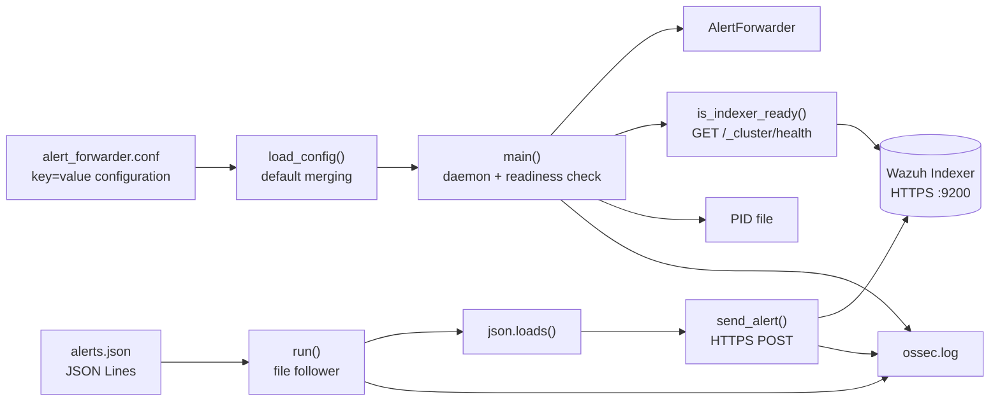
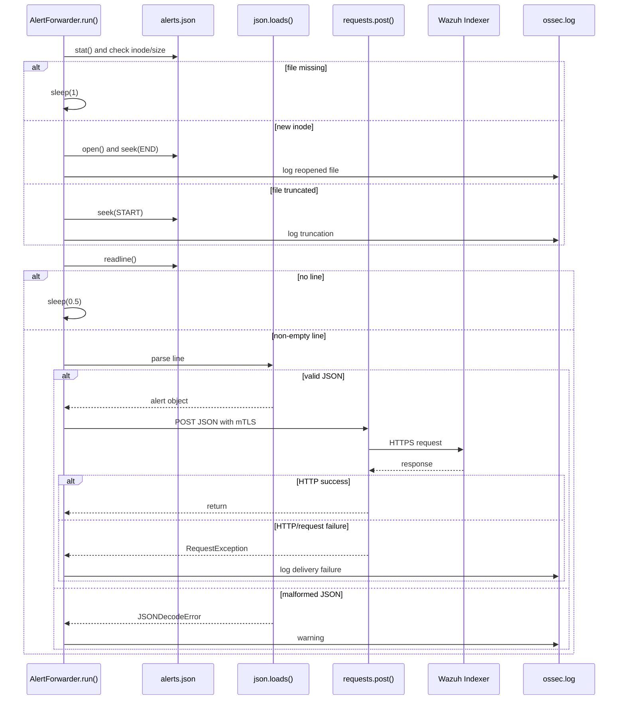
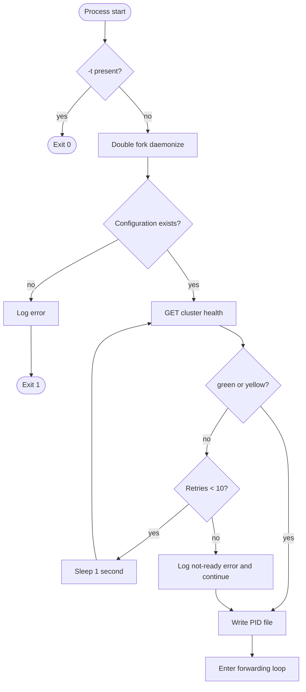
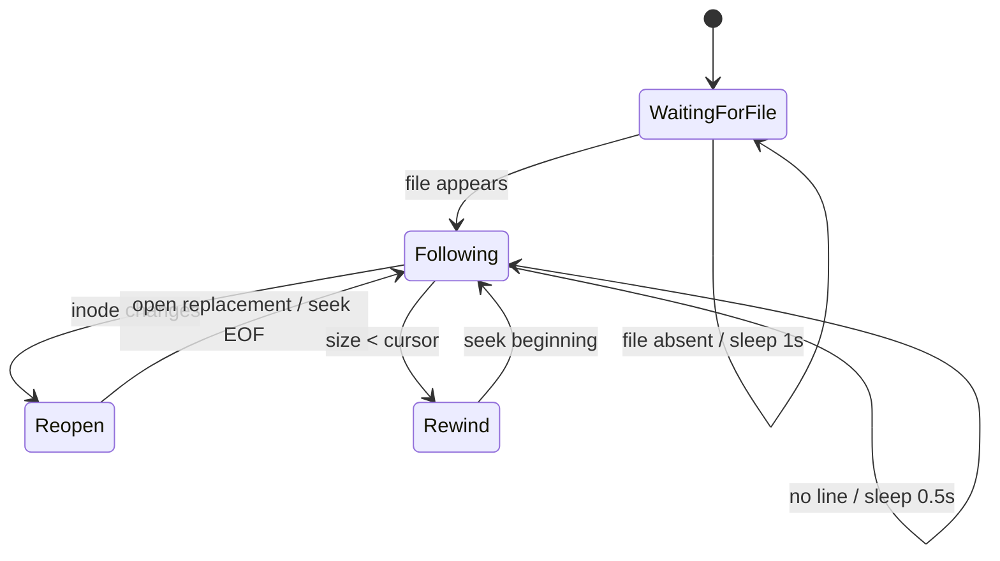
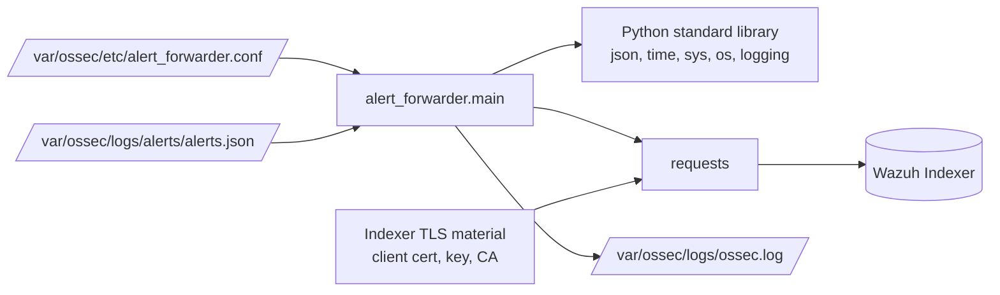

# Alert Forwarder Module

## 1. Introduction

The **Alert Forwarder** is a small, long-running Python process that bridges the local Wazuh alert spool and the Wazuh Indexer. It watches a JSON-lines alert file, parses newly appended records, and indexes each valid JSON object into an Indexer data stream or index using an HTTPS `_doc` request authenticated with a client certificate and private key.

The module is implemented entirely in [`src/alert_forwarder/main.py`](src/alert_forwarder/main.py). It is operationally separate from the Wazuh API event-ingestion path documented in [Event Module](event_module.md): the event module sends external events into analysis, whereas the alert forwarder sends already-produced alert records to the Indexer.

Its main responsibilities are:

- Load key/value configuration from `/var/ossec/etc/alert_forwarder.conf`.
- Apply defaults for the alert file, Indexer endpoint, index name, and TLS files.
- Wait for the Indexer cluster health endpoint to report `green` or `yellow`.
- Follow an append-only alert file, including inode replacement and truncation.
- Parse one JSON object per line and submit it to the configured Indexer index.
- Run as a daemon and record its process ID under `/var/ossec/var/run/`.

## 2. Architecture Overview

The implementation has two functional layers: process/bootstrap functions and the `AlertForwarder` runtime class. The module uses the Python standard library for process, file, timing, and logging operations, and the `requests` package for TLS-enabled HTTP communication.



### Runtime boundaries

| Boundary | Input | Output | Implementation |
|---|---|---|---|
| Configuration | Text file containing `KEY=VALUE` lines | Dictionary with defaults | `load_config()` |
| Startup | Command-line arguments and configuration | Daemon process, readiness result, PID file | `main()`, `daemonize()`, `is_indexer_ready()` |
| File ingestion | Appended JSON-lines records | Parsed Python objects | `AlertForwarder.run()` |
| Indexer delivery | Python alert object | HTTP success or logged failure | `AlertForwarder.send_alert()` |
| Observability | Runtime messages | `/var/ossec/logs/ossec.log` | module-level `logging` configuration and `log()` |

## 3. Configuration

The configuration file is parsed manually. Blank lines and lines beginning with `#` are ignored; the first `=` separates the key from its value. Unknown keys are retained in the dictionary, although the current implementation only consumes the keys below.

| Key | Default | Use |
|---|---|---|
| `ALERTS_FILE` | `/var/ossec/logs/alerts/alerts.json` | JSON-lines file to follow |
| `INDEXER_IP` | `127.0.0.1` | Indexer host or address |
| `INDEX_NAME` | `wazuh-alerts` | Target Indexer index |
| `CERT_FILE` | `/etc/wazuh-indexer/certs/admin.pem` | Client certificate for mutual TLS |
| `KEY_FILE` | `/etc/wazuh-indexer/certs/admin-key.pem` | Client private key for mutual TLS |
| `CA_CERT` | `/etc/wazuh-indexer/certs/root-ca.pem` | CA bundle used to verify the Indexer |

The file itself is mandatory. If `/var/ossec/etc/alert_forwarder.conf` does not exist, `load_config()` raises `FileNotFoundError` and `main()` logs the error before exiting with status `1`.

## 4. Core Components

### 4.1 `main()`

`main()` is the process entry point. Its startup sequence is:

1. Exit immediately when `-t` is present in `sys.argv`. This is a lightweight test/no-op mode and does not validate configuration.
2. Double-fork through `daemonize()`.
3. Load configuration.
4. Poll the Indexer health endpoint, retrying once per second up to ten times.
5. Log startup, create a PID file named `wazuh-forwarder-<pid>.pid`, and enter `AlertForwarder.run()`.

The readiness check is advisory in the current implementation. After the retry limit is reached, the code logs that the Indexer is not ready and then continues into the forwarding loop rather than terminating. This allows the process to remain alive and attempt future alert deliveries, but it also means the startup log message saying “Exiting” does not describe the actual control flow.

### 4.2 `daemonize()`

The daemonization routine performs the conventional double-fork pattern:

- First fork detaches the parent.
- `chdir("/")`, `setsid()`, and `umask(0)` establish a session-independent process.
- Second fork prevents the process from reacquiring a controlling terminal.
- Standard output and error are redirected to `LOG_PATH`.
- Standard input is redirected to `/dev/null`.

Fork failures are logged and terminate the process with status `1`.

### 4.3 `load_config()`

`load_config()` copies the hard-coded defaults, overlays values from the configuration file, and logs the effective default-key values at debug level. It does not validate that referenced files exist, that addresses are valid, or that TLS material is readable; those failures surface later during readiness or alert delivery.

### 4.4 `is_indexer_ready(config)`

This function sends:

```text
GET https://<INDEXER_IP>:9200/_cluster/health
```

The request uses `(CERT_FILE, KEY_FILE)` for client authentication, `CA_CERT` for server verification, and a three-second timeout. A successful response is ready when its JSON `status` is `green` or `yellow`; any exception, non-success HTTP status, malformed response, or other failure returns `False` and is logged.

### 4.5 `AlertForwarder.send_alert(alert)`

`send_alert()` sends one alert object to:

```text
POST https://<INDEXER_IP>:9200/<INDEX_NAME>/_doc
```

The alert is passed as the `requests` JSON body. TLS settings and the three-second timeout match the readiness check. `response.raise_for_status()` converts HTTP errors into `requests.RequestException`, which is logged together with a JSON error body when one can be decoded.

The method has no retry queue, backoff, durable acknowledgement, or dead-letter storage. A delivery failure is therefore observable in the log but does not stop the main follower loop.

### 4.6 `AlertForwarder.run()`

`run()` implements a polling tailer with rotation and truncation handling:

- If the configured alert file is absent, sleep for one second and retry.
- Compare the current inode with the inode of the open file.
- On first use or inode change, close the old handle, open the replacement, seek to end-of-file, and continue following new records.
- If the file size becomes smaller than the current cursor, assume truncation and seek back to the beginning.
- Read one line at a time. Empty lines are ignored.
- Parse non-empty lines with `json.loads()` and forward valid objects.
- Log malformed JSON at warning level and continue.
- Sleep for 0.5 seconds when no complete line is currently available.

Seeking to end-of-file on open means existing historical alerts are not replayed after startup or rotation; only records appended after the handle is established are processed.

## 5. Data Flow



## 6. Process and Lifecycle Flows

### Startup flow



### File-following state model



## 7. Dependencies and Integration Points



The module does not import Wazuh framework classes, API controllers, RBAC components, cluster DAPI, or the C/C++ analysis engine. Its relationship to the wider system is through shared operational artifacts and the Indexer:

- The Wazuh alert-producing pipeline writes JSON-lines records to the configured alert file.
- The forwarder consumes those records after alert generation; it does not create, decode, or rule-match alerts.
- The Indexer receives the final documents through its REST API.
- Logging uses the same manager log path, but the module configures its own logger format and namespace (`wazuh-forwarder`).
- The [Event Module](event_module.md) is conceptually related because it handles event movement in Wazuh, but it is not called by this code.

## 8. Error Handling and Operational Considerations

- **Missing configuration:** fatal during startup; the process exits with status `1`.
- **Missing alert file:** non-fatal; the follower polls until the file appears.
- **Indexer unavailable at startup:** retried ten times, then the process continues running.
- **Indexer unavailable during delivery:** logged per alert; there is no built-in retry or persistence mechanism.
- **Malformed alert line:** logged as a warning; the line is discarded and processing continues.
- **File rotation:** detected using inode changes and reopened from the end of the replacement file.
- **File truncation:** detected by comparing cursor position with file size; the cursor is rewound.
- **Unexpected runtime error:** logged and followed by a one-second delay before retrying the outer loop.
- **PID lifecycle:** the PID file is created after readiness handling, but this file is not removed on normal interruption or other shutdown paths.
- **File handles:** the active alert file remains open for the lifetime of the loop and is replaced on inode changes.
- **TLS:** certificate verification is enabled through `CA_CERT`; disabling verification is not part of the implemented configuration.

One implementation detail deserves attention when maintaining the module: in `send_alert()`, if `requests.post()` raises before assigning `response`, the exception handler attempts `response.json()`. That can produce an unbound-local-variable error, which is then caught by the outer `run()` handler as an unexpected error. A future hardening change should initialize `response` or only inspect it when assignment succeeded.

## 9. Maintenance Notes

Changes to this module should preserve the following invariants:

1. Alert input remains one JSON object per line unless the producer and parser are changed together.
2. The follower must continue handling inode replacement and truncation, since log rotation is expected in production.
3. Indexer requests must retain certificate authentication, CA verification, and bounded timeouts.
4. Delivery failures should remain isolated to individual records unless an explicit fail-fast policy is introduced.
5. Any retry or replay feature should define duplicate-document behavior, because the current `_doc` request does not provide an explicit document ID.

For broader Wazuh ingestion and core communication concepts, see [Framework Core Communication](framework_core_communication.md), [Framework Core Utilities](framework_core_utils.md), and [Agent & Manager Native Daemons](Agent_&_Manager_Native_Daemons_(C).md) where available.

