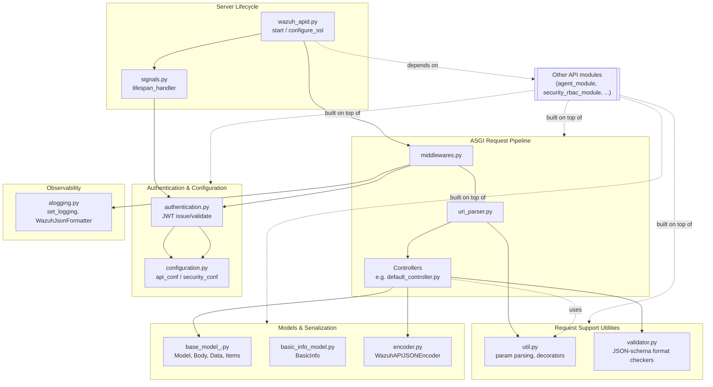
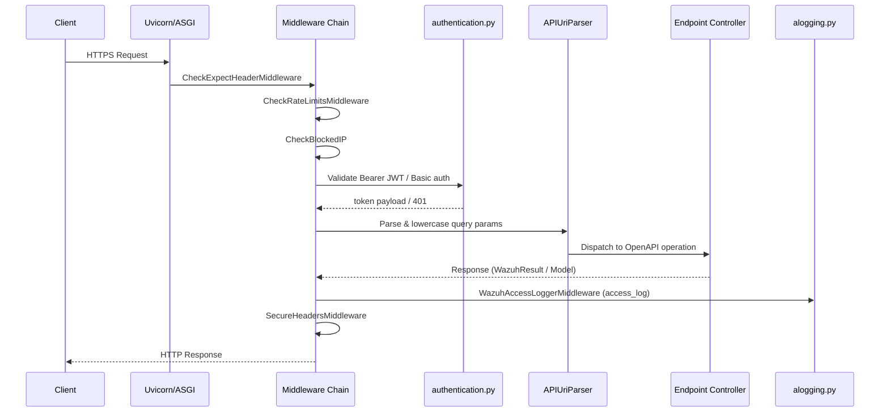

# API Core Infrastructure

## Introduction

The **API Core Infrastructure** module is the foundation of the Wazuh RESTful API (Python/Connexion-based). It does not implement any specific business-domain endpoint (agents, rules, syscheck, etc. are implemented in their own modules); instead, it provides all the cross-cutting infrastructure that every API request relies on:

- Application bootstrap, TLS/SSL setup, and process lifecycle management (daemonization, PID files, signal handling).
- Authentication and JWT token issuance/validation, integrated with the RBAC subsystem.
- Centralized YAML-based configuration loading/validation for the API and its security settings.
- The ASGI middleware pipeline (rate limiting, IP blocking, secure headers, access logging, `Expect` header handling).
- Structured logging (plain-text and JSON) with log rotation support.
- Common request-processing utilities: URI parameter parsing, query/search/sort DSL parsing, and JSON-schema-based field validators used across all endpoint specs.
- Base Connexion/OpenAPI model classes, the custom JSON encoder, and the minimal `/` (default) informational endpoint.

Because this module underpins every other API endpoint module (see the `agent_module`, `security_rbac_module`, `manager_module`, etc. siblings in the module tree), it has no dependency on them — the dependency direction is the opposite: all other API controller modules depend on the primitives defined here (authentication decorators, response helpers, middleware, base models).

## Architecture Overview

### Request Lifecycle

## Sub-modules

The module is organized into the following functional areas. Each has its own documentation file with detailed component descriptions:

| Sub-module | Description | Documentation |
|---|---|---|
| **Server Lifecycle** | Process bootstrap, CLI argument parsing, SSL context configuration, daemonization, PID handling, and the async lifespan handler (installation UID, update-check background task) | [api_core_infrastructure_server_lifecycle.md](api_core_infrastructure_server_lifecycle.md) |
| **Authentication & Configuration** | JWT keypair generation, token issuance/validation via RBAC, and YAML configuration loading/merging/validation for `api.yaml` and `security.yaml` | [api_core_infrastructure_auth_config.md](api_core_infrastructure_auth_config.md) |
| **Middleware Pipeline** | Starlette/Connexion `BaseHTTPMiddleware` implementations for rate limiting, IP blocking, secure headers, `Expect` header handling, and access logging | [api_core_infrastructure_middleware.md](api_core_infrastructure_middleware.md) |
| **Logging Infrastructure** | Log configuration dictionary builder, JSON log formatter, and log-size validation helper used by the wazuh-api logger | [api_core_infrastructure_logging.md](api_core_infrastructure_logging.md) |
| **Request Processing Utilities** | URI parameter parsing/lowercasing, query/search/sort DSL parsers, path-safety checks, and the JSON-schema format-checker library used by every endpoint's OpenAPI spec | [api_core_infrastructure_request_utils.md](api_core_infrastructure_request_utils.md) |
| **Models & Serialization** | Base Connexion `Model`/`Body` classes, generic `Data`/`Items`/`AllOf` wrappers, the `BasicInfo` model, the custom JSON encoder, and the `/` default info controller | [api_core_infrastructure_models.md](api_core_infrastructure_models.md) |

## How This Module Fits Into the System

- **Downstream consumers**: Every domain-specific API module (agent, security/RBAC, manager, mitre, syscheck, cluster, etc.) imports authentication decorators, `Model`/`Body` base classes, the JSON encoder, and the shared validators defined here. See the sibling modules such as `agent_module`, `security_rbac_module`, and `manager_module`.
- **RBAC integration**: `authentication.py` delegates permission/role resolution to the RBAC engine (`framework/wazuh/rbac/*`), documented separately in `security_rbac_module`.
- **Cluster/DAPI integration**: Token validation and configuration reads are dispatched through `DistributedAPI` (`framework/wazuh/core/cluster/dapi/dapi.py`) so that the check always runs on the master node — see `cluster_dapi` documentation.
- **Framework core utilities**: Path safety checks, common constants (`wazuh_uid`/`wazuh_gid`, `WAZUH_PATH`), and process daemonization helpers are provided by `framework_core_utils` (`framework/wazuh/core/common.py`, `framework/wazuh/core/pyDaemonModule.py`).

## Key Design Notes

- **Single source of truth for configuration**: `api/api/configuration.py` reads `api.yaml`/`security.yaml`, validates them against JSON schemas (`api/api/validator.py`), fills in defaults, and exposes the resulting `api_conf`/`security_conf` dictionaries used throughout the API process.
- **Stateless JWT tokens with server-side revocation**: Tokens are self-contained (ES512-signed JWT) but every request re-validates role membership and revocation status against the RBAC database via `check_token`, ensuring role changes and logouts take effect immediately even though tokens are stateless.
- **Defense in depth in the middleware chain**: Several independent middlewares (`CheckRateLimitsMiddleware`, `CheckBlockedIP`, `CheckExpectHeaderMiddleware`, `SecureHeadersMiddleware`) each enforce one security/operational concern, keeping controllers free of cross-cutting logic.
