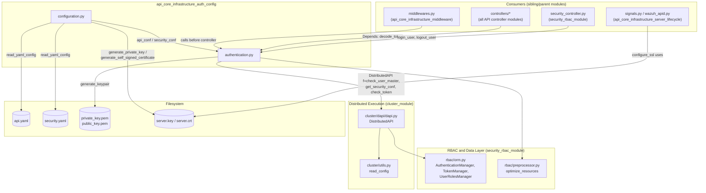
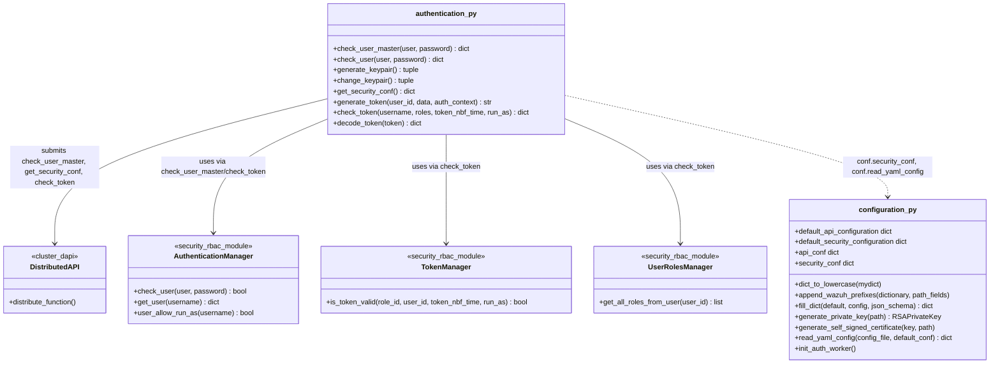
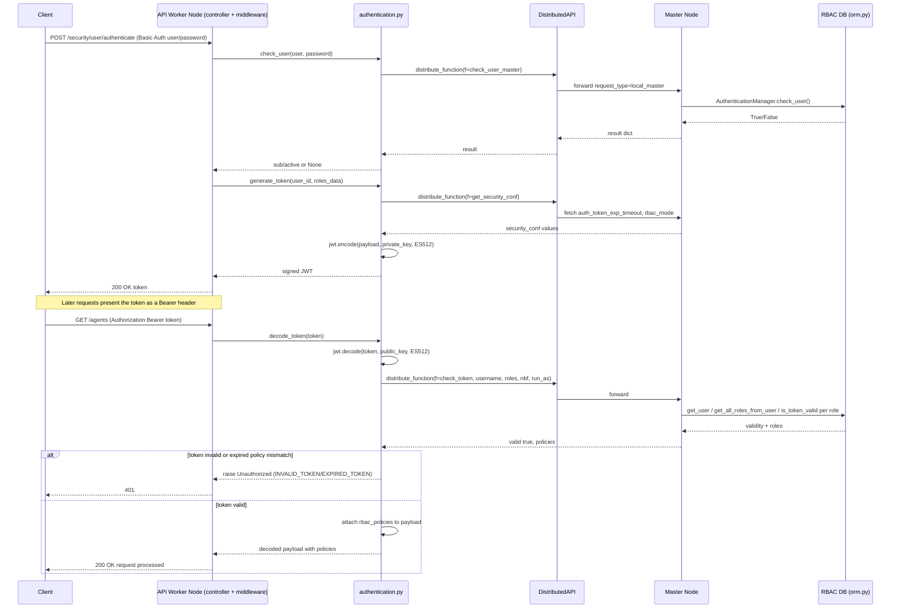
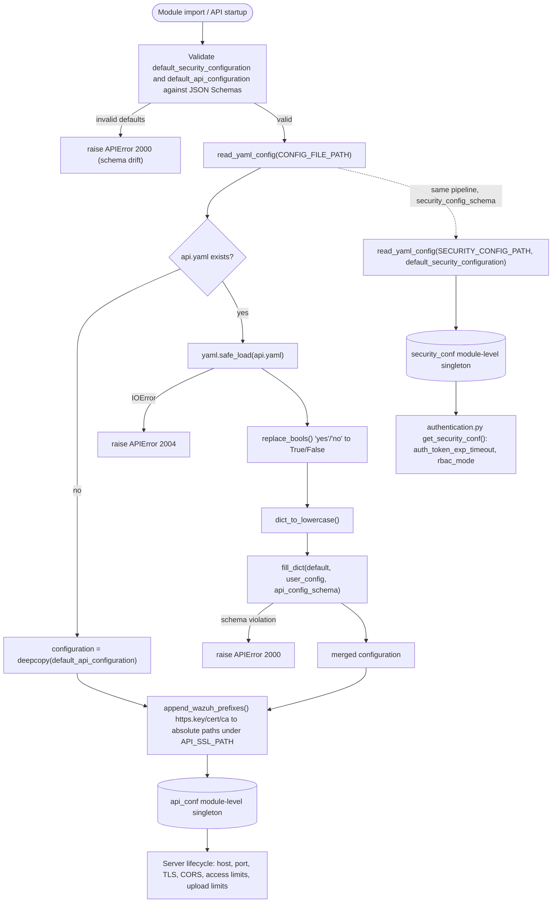
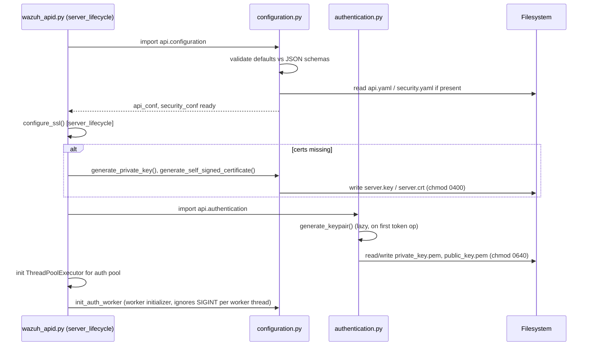

# API Core Infrastructure – Authentication & Configuration

## Introduction

This module contains the two foundational building blocks that secure and configure the Wazuh REST API server:

- **`api/api/authentication.py`** — implements JWT-based authentication and authorization for every API request: credential validation, token generation/decoding, token revocation checks, and the RBAC policy attachment that downstream endpoints rely on.
- **`api/api/configuration.py`** — loads, validates, and defaults the API's own YAML configuration (`api.yaml`) and the RBAC security configuration (`security.yaml`), and provides TLS certificate/key bootstrap utilities used when the API starts in HTTPS mode.

Together these two files answer two questions that must be resolved before any API request can be processed: **"Is the caller who they claim to be, and what are they allowed to do?"** and **"How is this API instance configured to run?"**

This module is a child of [api_core_infrastructure](api_core_infrastructure.md), which aggregates all core API plumbing (logging, middleware, request utilities, server lifecycle, and Pydantic-style models). Sibling modules under that parent include:

- [api_core_infrastructure_server_lifecycle](api_core_infrastructure_server_lifecycle.md) — process bootstrap, SSL context creation, signal handling (`configure_ssl` consumes the certs generated here).
- [api_core_infrastructure_middleware](api_core_infrastructure_middleware.md) — request-level middlewares (rate limiting, blocked IP checks, secure headers) that run around the authentication flow.
- [api_core_infrastructure_logging](api_core_infrastructure_logging.md) — API logger setup consumed by the `DistributedAPI` calls made in this module.
- [api_core_infrastructure_request_utils](api_core_infrastructure_request_utils.md) and [api_core_infrastructure_models](api_core_infrastructure_models.md) — request parsing/validation and response models used across all controllers, including the security controller.

For the actual RBAC data model, permission resolution, and user/role/policy management, see [security_rbac_module](security_rbac_module.md) — that module owns `AuthenticationManager`, `TokenManager`, `UserRolesManager`, and the `optimize_resources` permission preprocessor that this module calls into. For distributed request execution (`DistributedAPI`) and cluster-aware configuration reads (`read_config`), see [cluster_dapi](cluster_dapi.md) and [cluster_utils](cluster_utils.md).

---

## 1. Purpose and Core Functionality

### 1.1 `authentication.py` — Identity & Access Control

| Responsibility | Function(s) |
|---|---|
| Validate username/password against the RBAC database | `check_user_master`, `check_user` |
| Manage the API's asymmetric signing keys (EC P-521 / ES512) | `generate_keypair`, `change_keypair` |
| Read cached security configuration (token TTL, RBAC mode) | `get_security_conf` |
| Mint a signed JWT for an authenticated session | `generate_token` |
| Validate a token's freshness/role consistency against the master node | `check_token` (memoized via `@rbac_utils.token_cache()`) |
| Fully decode, verify, and enrich an incoming request's bearer token | `decode_token` |

### 1.2 `configuration.py` — API & Security Configuration

| Responsibility | Function(s) |
|---|---|
| Provide baseline defaults for `api.yaml` / `security.yaml` | `default_api_configuration`, `default_security_configuration` |
| Merge user overrides on top of defaults, validating against JSON Schema | `fill_dict`, `read_yaml_config` |
| Normalize configuration quirks (lowercase strings, yes/no → bool) | `dict_to_lowercase`, `read_yaml_config._replace_bools` |
| Rewrite relative TLS paths to absolute paths under the SSL directory | `append_wazuh_prefixes` |
| Generate a private key and self-signed certificate for first-run HTTPS | `generate_private_key`, `generate_self_signed_certificate` |
| Make the authentication worker pool ignore `SIGINT` | `init_auth_worker` |
| Expose ready-to-use, validated, module-level configuration objects | `api_conf`, `security_conf` |

`configuration.py` executes its defaults-validation and `api_conf`/`security_conf` construction **at import time**, so simply importing this module performs I/O (reading `api.yaml`/`security.yaml` from disk) and can raise `APIError(2000)`/`APIError(2004)` if the files are malformed.

---

## 2. Architecture Overview

---

## 3. Component Relationships

---

## 4. Login / Token Lifecycle (Data Flow)

The following sequence shows how a client obtains and later reuses a JWT, and how validity is checked against RBAC state that may only live on the master node in a clustered deployment.

Key points:
- `check_token` is wrapped with `@rbac_utils.token_cache()` so repeated validation for the same token/role state is served from cache instead of hitting the RBAC database every request.
- `decode_token` performs a **second** live check against `get_security_conf` to detect that the RBAC mode or token expiration policy hasn't changed since the token was issued — if it has, the token is forcibly invalidated (`EXPIRED_TOKEN`), even if cryptographically valid.
- All cross-node calls go through `DistributedAPI` with `request_type='local_master'`, ensuring RBAC checks always execute against the authoritative master-node database, regardless of which node received the client's request. See [cluster_dapi](cluster_dapi.md).

---

## 5. Configuration Loading Flow

### Certificate Bootstrap

When HTTPS is enabled and no certificate/key pair exists yet, `generate_private_key` and `generate_self_signed_certificate` create a 2048-bit RSA key and a one-year self-signed X.509 certificate under the configured SSL path. This is invoked from the [server lifecycle module](api_core_infrastructure_server_lifecycle.md) (`configure_ssl` in `wazuh_apid.py`) before the ASGI server binds its socket.

---

## 6. Sequence: API Process Startup Touching This Module

---

## 7. Key Design Notes

- **Asymmetric JWT signing (ES512):** Unlike HMAC-based JWTs, ES512 lets the API validate tokens using only the public key, while private-key signing is isolated to `generate_token`. Keys are persisted to disk (`SECURITY_PATH`) so tokens remain valid across API restarts and worker processes.
- **Master-authoritative RBAC:** All identity/authorization decisions (`check_user_master`, `check_token`, `get_security_conf`) are executed via `DistributedAPI` with `request_type='local_master'`, so worker nodes never trust locally cached RBAC state for authorization decisions — only for JWT cryptographic validation, which is stateless.
- **Config/Schema coupling:** `configuration.py` self-validates its own defaults against `api.validator.api_config_schema` / `security_config_schema` at import time. Any schema change must be reflected in the defaults or the API will fail to start with `APIError(2000)`. See [api_core_infrastructure_request_utils](api_core_infrastructure_request_utils.md) for the validator module.
- **Path safety:** `append_wazuh_prefixes` ensures user-supplied relative paths for `https.key`/`https.cert`/`https.ca` are always resolved under `API_SSL_PATH`, preventing path traversal via configuration.
- **Deprecation handling:** `read_yaml_config` detects the legacy `cache.enabled` option and logs a deprecation warning (`CACHE_DEPRECATED_MESSAGE`) via the API logger (see [api_core_infrastructure_logging](api_core_infrastructure_logging.md)).
- **Signal isolation for auth pool:** `init_auth_worker` is used as a `ThreadPoolExecutor` initializer so that `SIGINT` delivered to the main process doesn't propagate unhandled exceptions inside auth worker threads during graceful shutdown (coordinated with [api_core_infrastructure_server_lifecycle](api_core_infrastructure_server_lifecycle.md)'s signal handlers).

---

## 8. Related Documentation

- [api_core_infrastructure](api_core_infrastructure.md) — parent module overview.
- [api_core_infrastructure_server_lifecycle](api_core_infrastructure_server_lifecycle.md) — SSL bootstrap and process signal handling.
- [api_core_infrastructure_middleware](api_core_infrastructure_middleware.md) — request middleware chain that runs around authentication.
- [api_core_infrastructure_logging](api_core_infrastructure_logging.md) — API logging configuration.
- [api_core_infrastructure_request_utils](api_core_infrastructure_request_utils.md) — request validators including the JSON Schemas referenced by `configuration.py`.
- [security_rbac_module](security_rbac_module.md) — RBAC ORM, preprocessor, and `security_controller` endpoints (`login_user`, `logout_user`, `revoke_all_tokens`, etc.) that are the primary consumers of this module.
- [cluster_dapi](cluster_dapi.md) — `DistributedAPI` used to route authentication/authorization calls to the master node.
- [cluster_utils](cluster_utils.md) — `read_config` used to determine node type during token decoding.
