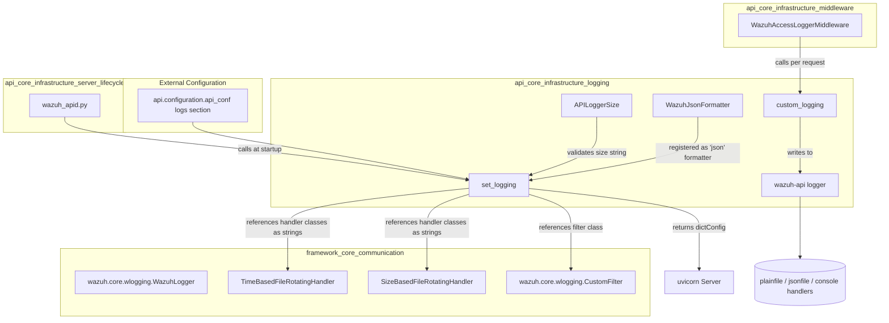
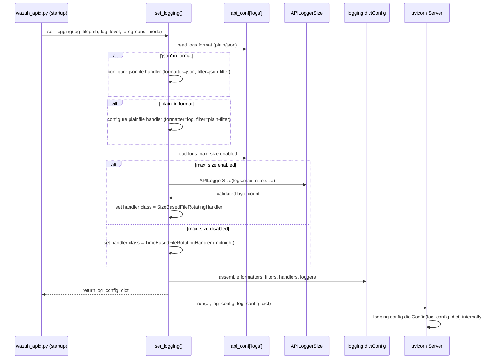
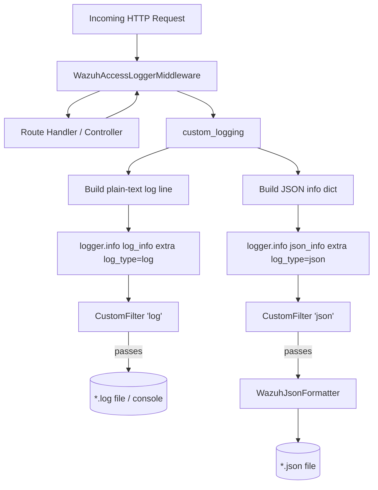
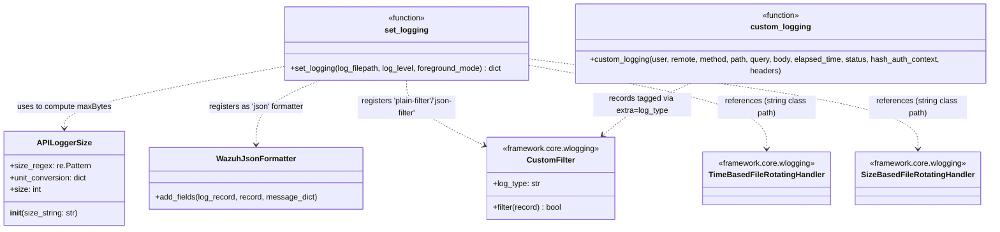

# API Core Infrastructure – Logging

## Introduction

The **api_core_infrastructure_logging** module is responsible for configuring and formatting all logging output produced by the Wazuh RESTful API (`wazuh-apid`). It provides:

- A validated, human-friendly size specification for log rotation (`APILoggerSize`).
- A JSON log formatter tailored to the API's structured logging needs (`WazuhJsonFormatter`).
- A factory function (`set_logging`) that builds the full logging configuration dictionary consumed by [uvicorn](https://www.uvicorn.org/) (the ASGI server that runs the API), wiring together file handlers (plain text and/or JSON), console output, log rotation strategy, and custom filtering.

This module is a leaf component of the broader [api_core_infrastructure](api_core_infrastructure.md) subsystem, and it depends on lower-level logging primitives defined in the [framework_core_communication](framework_core_communication.md) module (specifically `wazuh.core.wlogging`). It is used indirectly by [api_core_infrastructure_middleware](api_core_infrastructure_middleware.md) (`WazuhAccessLoggerMiddleware`, which emits per-request access logs) and by the [api_core_infrastructure_server_lifecycle](api_core_infrastructure_server_lifecycle.md) module (`wazuh_apid.py`), which invokes `set_logging` during API daemon startup.

## Purpose and Core Functionality

The Wazuh API needs to produce logs in two possible formats — plain text and structured JSON — and needs to support two possible log rotation strategies — time-based (rotate at midnight) or size-based (rotate once a maximum size is reached). This module encapsulates that complexity into three cooperating pieces:

| Component | Responsibility |
|---|---|
| `APILoggerSize` | Parses and validates a human-readable size string (e.g. `"50M"`, `"512K"`) from the API configuration file, converting it into a byte count usable by the rotating file handler. Enforces a minimum size of 1 MB. |
| `WazuhJsonFormatter` | Extends `pythonjsonlogger.jsonlogger.JsonFormatter` to shape every log record into a consistent JSON envelope containing `timestamp`, `levelname`, and a `data` object that classifies the payload as a `request`, `error`, or `informative` message. |
| `set_logging` | Reads the API configuration (`api_conf['logs']`) to determine which formats are enabled (`plain`, `json`) and whether size-based rotation is configured. Builds and returns a `dict` compatible with Python's `logging.config.dictConfig`, which is later passed to uvicorn as its `log_config`. |

An additional helper, `custom_logging`, formats a single access-log entry (method, path, parameters, body, elapsed time, status code, and optional RBAC hash context) and emits it through both the plain-text and JSON loggers. This function is the primary integration point used by `WazuhAccessLoggerMiddleware` in the [api_core_infrastructure_middleware](api_core_infrastructure_middleware.md) module.

## Architecture

### Key relationships

- **`set_logging`** does not instantiate handler classes directly; it emits a *declarative* configuration dictionary that references handler and filter classes by dotted path string (e.g. `'wazuh.core.wlogging.SizeBasedFileRotatingHandler'`, `'wazuh.core.wlogging.CustomFilter'`). These classes are implemented in `framework/wazuh/core/wlogging.py`, documented in [framework_core_communication](framework_core_communication.md). This decoupling allows the API logging module to remain configuration-only while delegating actual file I/O and rotation behavior to the shared framework logging primitives.
- **`WazuhJsonFormatter`** is referenced in the dict configuration under the `"json"` formatter key, using the class path `api.alogging.WazuhJsonFormatter`. It is only used when `'json'` appears in `api_conf['logs']['format']`.
- **`CustomFilter`** (from `wazuh.core.wlogging`) is attached to each handler to segregate log records intended for the plain file vs. the JSON file, so that a single log call does not duplicate entries incorrectly across both outputs.
- **`APILoggerSize`** is only invoked when `api_conf['logs']['max_size']['enabled']` is `True`; otherwise the module defaults to time-based (midnight) log rotation.

## Data Flow: Building the Logging Configuration

## Process Flow: Runtime Log Emission

Once the API is running, two kinds of log entries are typically produced:

1. **General application/informative/error logs** — emitted via the standard `logger = logging.getLogger('wazuh-api')` throughout the API codebase (controllers, authentication, middleware, etc.).
2. **Access logs** — emitted specifically via `custom_logging()` from `WazuhAccessLoggerMiddleware` (see [api_core_infrastructure_middleware](api_core_infrastructure_middleware.md)) after each HTTP request completes.

### JSON record shaping (`WazuhJsonFormatter.add_fields`)

The formatter classifies every JSON log record into one of three payload types:

- **`request`** — when `record.message` is `None`, indicating the log call passed only a `message_dict` (e.g. structured request data).
- **`error`** — when `message_dict` contains `exc_info` (a traceback), the message and traceback are merged into a single payload string.
- **`informative`** — the default case for plain string messages.

Each record ultimately contains `timestamp`, `levelname`, and `data` (the `{type, payload}` object), giving JSON log consumers (e.g. log shippers, SIEM ingestion) a predictable schema.

## Component Interaction

## Configuration Inputs

`set_logging` is entirely driven by the `logs` section of the API configuration (`api.configuration.api_conf`), which is managed by the broader API configuration subsystem (see [api_core_infrastructure_auth_config](api_core_infrastructure_auth_config.md) for related configuration handling). Relevant keys:

| Key | Effect |
|---|---|
| `logs.format` | List that may contain `'plain'`, `'json'`, or both. Determines which file handlers are created. At least one must be present, or `APIError(2011)` is raised. |
| `logs.max_size.enabled` | If `true`, uses `SizeBasedFileRotatingHandler` with `maxBytes` computed via `APILoggerSize`; otherwise uses `TimeBasedFileRotatingHandler` rotating at midnight. |
| `logs.max_size.size` | String such as `"50M"` or `"512K"`, validated and converted to bytes by `APILoggerSize`. |

## Error Handling

- `APILoggerSize.__init__` raises `api.api_exception.APIError(2011, ...)` when:
  - The size string does not match the `<number><K|M>` pattern.
  - The resulting size is smaller than 1 MB (the enforced minimum).
- `set_logging` raises `APIError(2011)` if neither `'plain'` nor `'json'` is present in `logs.format`, since at least one output handler is mandatory.

## Integration Points / Related Modules

- **[api_core_infrastructure](api_core_infrastructure.md)** — parent module; `alogging.py` is one of its foundational files alongside authentication, middleware, and request utilities.
- **[api_core_infrastructure_server_lifecycle](api_core_infrastructure_server_lifecycle.md)** — `wazuh_apid.py` calls `set_logging` during daemon startup/reconfiguration to obtain the `log_config` passed into uvicorn's `run()`/`Config()`.
- **[api_core_infrastructure_middleware](api_core_infrastructure_middleware.md)** — `WazuhAccessLoggerMiddleware` calls `custom_logging` after processing each request to emit access-log entries in both plain and JSON formats.
- **[framework_core_communication](framework_core_communication.md)** — provides the underlying `WazuhLogger`, `CustomFilter`, `TimeBasedFileRotatingHandler`, and `SizeBasedFileRotatingHandler` classes referenced (by string path) from the dict configuration built here. `WazuhLogger` is the analogous logging setup class used by other Wazuh daemons (non-API), showing the shared design pattern across the codebase.
- **[api_core_infrastructure_auth_config](api_core_infrastructure_auth_config.md)** — supplies the `api_conf` configuration object consumed by `set_logging`.

## Summary

This module is intentionally narrow in scope: it does not perform logging I/O itself, but rather **declares** how the Wazuh API's logging subsystem should be wired — which formatters, filters, handlers, and rotation policy to use — based on runtime configuration. This keeps logging behavior fully configurable without requiring changes to application code, and ensures consistent, machine-parsable (JSON) and human-readable (plain text) log output across the API's lifecycle, from server startup through per-request access logging.
