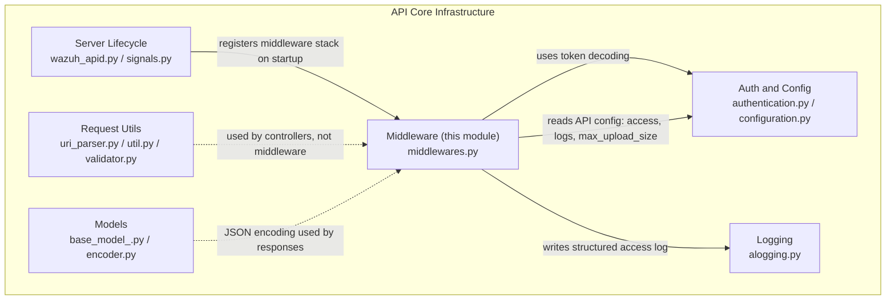
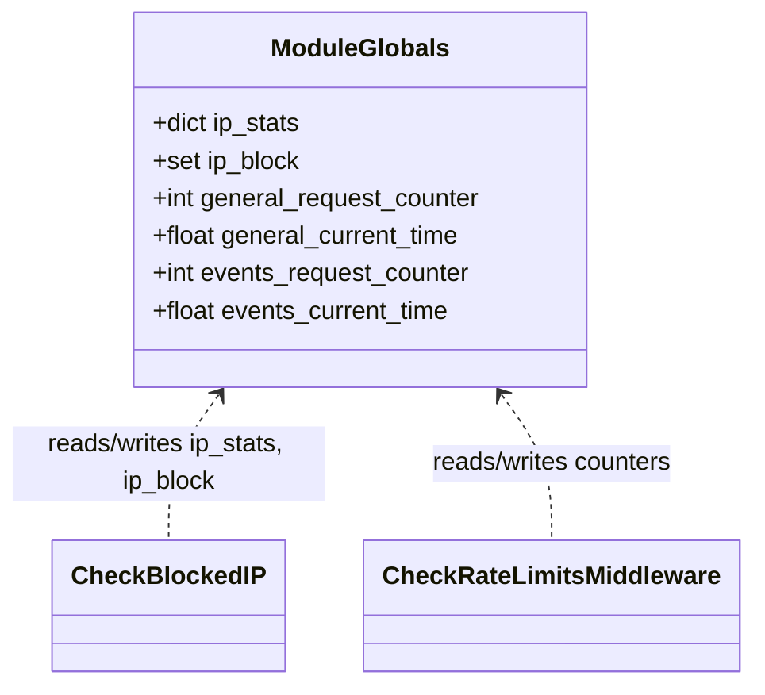
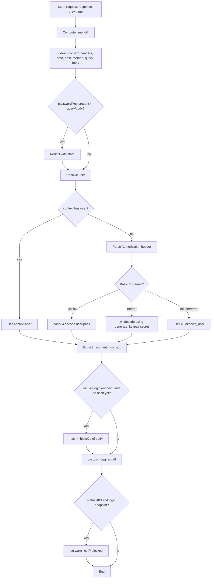
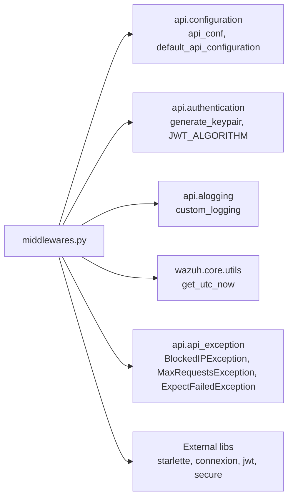

# API Core Infrastructure — Middleware

## Introduction

The **Middleware** module is a focused sub-component of the [API Core Infrastructure](api_core_infrastructure.md) that implements the chain of Starlette/Connexion `BaseHTTPMiddleware` classes executed on **every HTTP request/response cycle** handled by the Wazuh REST API (`api/api/middlewares.py`).

These middlewares are responsible for cross-cutting concerns that must run outside (or around) the individual endpoint controllers:

- **Brute-force / login protection** — blocking IP addresses that abuse the authentication endpoints.
- **Rate limiting** — enforcing a maximum number of requests per minute, with a stricter limit for the `/events` endpoint.
- **Protocol hardening** — validating the `Expect` HTTP header and rejecting oversized payloads early.
- **Secure HTTP headers** — injecting hardening headers (`Server`, `Content-Security-Policy`, `X-Frame-Options`) into every response.
- **Access logging** — producing the structured "access log" entry for each request, including user resolution from JWT/basic auth and sensitive-field redaction.

This document describes the internal architecture of the middleware module, how it fits into the ASGI request pipeline, and how it collaborates with sibling modules such as [Authentication & Configuration](api_core_infrastructure_auth_config.md) and [Logging](api_core_infrastructure_logging.md).

## Module Position in the System

The middleware module lives inside `api_core_infrastructure`, one of several siblings that together implement the Wazuh API's non-business-logic plumbing:



See also:
- [Server Lifecycle](api_core_infrastructure_server_lifecycle.md) — where the middleware stack is registered on the Connexion/Starlette app.
- [Auth & Config](api_core_infrastructure_auth_config.md) — JWT decoding (`generate_keypair`, `JWT_ALGORITHM`) and `api_conf`/`default_api_configuration`.
- [Logging](api_core_infrastructure_logging.md) — `custom_logging` and the logger instances used by the middlewares.

## Core Components

| Component | Type | Responsibility |
|---|---|---|
| `CheckBlockedIP` | `BaseHTTPMiddleware` | Blocks requests from IPs that exceeded failed login attempts on `/security/user/authenticate*`. |
| `CheckRateLimitsMiddleware` | `BaseHTTPMiddleware` | Enforces global and `/events`-specific requests-per-minute limits. |
| `CheckExpectHeaderMiddleware` | `BaseHTTPMiddleware` | Validates the `Expect: 100-continue` header and enforces `max_upload_size`. |
| `WazuhAccessLoggerMiddleware` | `BaseHTTPMiddleware` | Times the request, buffers the JSON body, and emits the structured access log entry after the response is generated. |
| `SecureHeadersMiddleware` | `BaseHTTPMiddleware` | Adds hardening HTTP response headers using the `secure` library. |
| `access_log()` | async function | Helper used by `WazuhAccessLoggerMiddleware` to build and emit the log line, resolving the user from context/JWT/basic auth. |
| `check_blocked_ip()` | function | Helper used by `CheckBlockedIP` to evaluate/expire IP blocks based on `access.block_time`. |
| `check_rate_limit()` | function | Generic sliding-window counter used by `CheckRateLimitsMiddleware` for both general and `/events` limits. |

### Module-level State

The rate-limiting and IP-blocking middlewares are **stateful across requests** within a single API worker process, using module-level globals:



> **Note:** Because these are plain module-level variables (not shared across worker processes), IP-block and rate-limit state is scoped **per API worker**. This is consistent with how the Wazuh API is deployed (uvicorn/gunicorn workers), and is a key operational detail to keep in mind when reasoning about effective request limits under a multi-worker deployment.

## Middleware Stack & Request/Response Flow

The middlewares are chained via `BaseHTTPMiddleware.dispatch()`, so the *order of registration* (done in the server lifecycle module, see [Server Lifecycle](api_core_infrastructure_server_lifecycle.md)) determines the *order of execution* on the way in, and the **reverse** order on the way out.

```mermaid
sequenceDiagram
    autonumber
    participant Client
    participant CBIP as CheckBlockedIP
    participant CRL as CheckRateLimitsMiddleware
    participant CEH as CheckExpectHeaderMiddleware
    participant WAL as WazuhAccessLoggerMiddleware
    participant SEC as SecureHeadersMiddleware
    participant App as Connexion App / Controller

    Client->>CBIP: HTTP request
    CBIP->>CBIP: check_blocked_ip() if path is login endpoint
    alt IP blocked
        CBIP-->>Client: 403 BlockedIPException
    else not blocked
        CBIP->>CRL: call_next(request)
        CRL->>CRL: check_rate_limit() general + /events
        alt limit exceeded
            CRL-->>Client: MaxRequestsException 6001/6005
        else within limits
            CRL->>CEH: call_next(request)
            CEH->>CEH: validate Expect / Content-Length
            alt invalid Expect or oversized payload
                CEH-->>Client: 417 ExpectFailedException
            else valid
                CEH->>WAL: call_next(request)
                WAL->>WAL: prev_time = time.time(); buffer JSON body
                WAL->>SEC: call_next(request)
                SEC->>App: call_next(request)
                App-->>SEC: Response
                SEC->>SEC: secure_headers.framework.starlette(resp)
                SEC-->>WAL: Response (with secure headers)
                WAL->>WAL: access_log(request, response, prev_time)
                WAL-->>CEH: Response
            end
            CEH-->>CRL: Response
        end
        CRL-->>CBIP: Response
    end
    CBIP-->>Client: Response
```

### 1. `CheckBlockedIP`

Only intercepts `GET`/`POST` requests to `/security/user/authenticate` or `/security/user/authenticate/run_as`. Delegates to `check_blocked_ip()`, which:
1. Reads `access.block_time` from `api.configuration.api_conf`.
2. Expires stale entries in `ip_stats`/`ip_block` once `block_time` has elapsed since the last recorded attempt.
3. Raises `BlockedIPException` (HTTP 403) if the requesting IP is currently in `ip_block`.

The actual **population** of `ip_stats`/`ip_block` happens elsewhere in the authentication flow (see [Auth & Config](api_core_infrastructure_auth_config.md)) after repeated failed logins; this middleware is the **enforcement** point.

### 2. `CheckRateLimitsMiddleware`

Uses the generic `check_rate_limit()` helper twice per request:
- **General limit**: `access.max_request_per_minute` from the API configuration, error code `6001`.
- **`/events` specific limit**: hard-coded `MAX_REQUESTS_EVENTS_DEFAULT = 30` per minute, error code `6005`, applied only when `request.url.path == '/events'` (used by the [Event module](event_module.md) event-ingestion endpoint).

Each check uses a 60-second sliding window keyed by module-level globals, resetting the counter whenever more than 60 seconds have elapsed since the window start.

### 3. `CheckExpectHeaderMiddleware`

Guards against malformed or oversized upload attempts **before** the body is fully processed by downstream layers:
- If no `Expect` header is present, passes through.
- If present but not `100-continue`, raises `ExpectFailedException` (HTTP 417).
- If `Content-Length` exceeds `default_api_configuration["max_upload_size"]`, raises `ExpectFailedException` (HTTP 417) with details on the size violation.

### 4. `WazuhAccessLoggerMiddleware`

Wraps the call to the rest of the pipeline with timing instrumentation and produces the access log line **after** the response has been generated (so it can log the final status code):
1. Records `prev_time = time.time()`.
2. Pre-reads/caches the JSON body (`await request.json()`) so it is available later without consuming the stream twice; a `JSONDecodeError` is silently ignored (handled later by the controller/validation layer).
3. Calls the rest of the chain (`call_next`).
4. Calls `access_log()` with the original request (wrapped as a Connexion `ConnexionRequest`), the response, and the start time.

#### `access_log()` details



Key integration points:
- **`generate_keypair()` / `JWT_ALGORITHM`** — imported from [Auth & Config](api_core_infrastructure_auth_config.md), used to decode the bearer token without re-validating expiration (`verify_exp: False`) purely to extract the subject/user for logging purposes.
- **`custom_logging()`** — imported from [Logging](api_core_infrastructure_logging.md); this is the function that actually formats and writes the structured log record (plain and/or JSON) via the configured handlers.
- **Sensitive data redaction** — `password` fields in query params and body, and `key` fields in `/agents`-related bodies, are masked before logging.

### 5. `SecureHeadersMiddleware`

Wraps `call_next()` and applies `secure_headers.framework.starlette(resp)` — configured at module load time with:
- `Server` header set to `"Wazuh"` (hides the underlying ASGI server identity).
- `Content-Security-Policy` set to `'none'`.
- `X-Frame-Options` set to `deny`.

This middleware performs no early-exit logic; it always calls through and only mutates the outgoing response headers.

## Error Codes Raised by Middleware

| Middleware | Exception | HTTP Status | Code | Condition |
|---|---|---|---|---|
| `CheckBlockedIP` | `BlockedIPException` | 403 | — | IP present in `ip_block` |
| `CheckRateLimitsMiddleware` | `MaxRequestsException` | — | `6001` | General requests/minute exceeded |
| `CheckRateLimitsMiddleware` | `MaxRequestsException` | — | `6005` | `/events` requests/minute exceeded |
| `CheckExpectHeaderMiddleware` | `ExpectFailedException` | 417 | — | Unsupported `Expect` value |
| `CheckExpectHeaderMiddleware` | `ExpectFailedException` | 417 | — | `Content-Length` exceeds `max_upload_size` |

These exception types are defined in `api.api_exception` (part of the broader API core, referenced but not duplicated here).

## Dependencies



- `api.configuration` and `api.authentication` — see [Auth & Config](api_core_infrastructure_auth_config.md). Notably, `init_auth_worker()` in `api.configuration` configures worker processes to ignore `SIGINT`, which is orthogonal to but deployed alongside this middleware stack.
- `api.alogging` — see [Logging](api_core_infrastructure_logging.md). The `set_logging()` function there wires up the `wazuh-api` logger instance (`logger`) and `start-stop-api` logger (`start_stop_logger`) that this module imports and uses.
- `wazuh.core.utils.get_utc_now` — shared utility from [Framework Core Utils](framework_core_utils.md), used for timestamp comparisons in IP-block expiry and rate-limit windows.

## Where the Middleware Stack is Wired

The actual instantiation order (`app.add_middleware(...)`) happens during API startup, handled by the [Server Lifecycle](api_core_infrastructure_server_lifecycle.md) module (`api/scripts/wazuh_apid.py`, `api/api/signals.py`). This module only defines the middleware *classes and behavior*; it does not control the order in which they are added to the ASGI application. Refer to that module's documentation for the exact registration sequence and interaction with the `lifespan_handler`.

## Summary

The middleware layer is the first and last code that runs for every API call. It provides:
- **Security enforcement**: blocked-IP checks, rate limiting, and payload-size/Expect-header validation — all fail fast, before controller logic runs.
- **Observability**: a single, consistent access-log entry per request, with user resolution across multiple auth methods and sensitive-data redaction.
- **Hardening**: consistent secure headers on every response, regardless of which controller handled the request.

Because these concerns are isolated from the controllers (see modules like [Agent](agent_module.md), [Security/RBAC](security_rbac_module.md), [Manager](manager_module.md), etc.), business-logic code never needs to be aware of rate limiting, IP blocking, or access logging — it is uniformly applied by this middleware chain.
